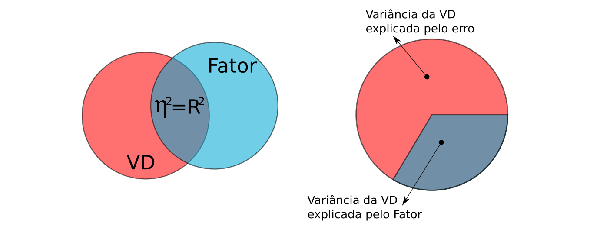
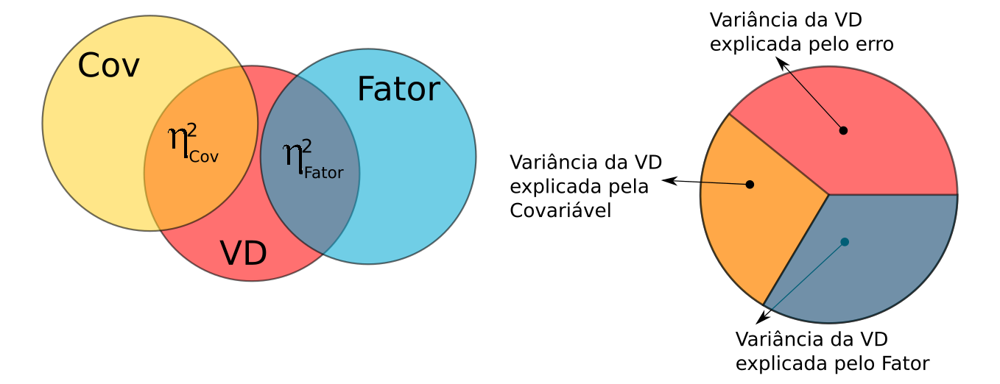
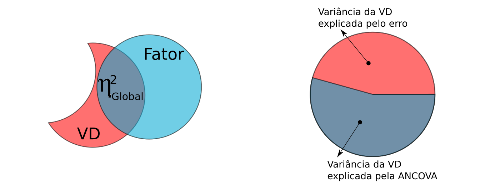
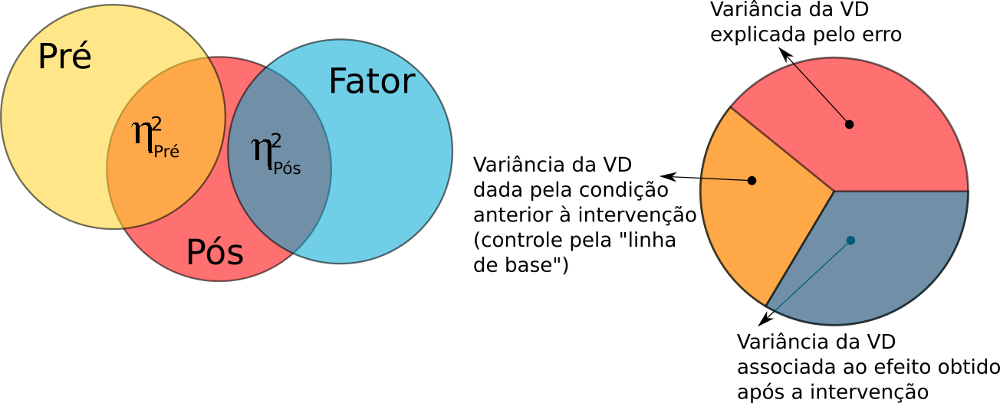
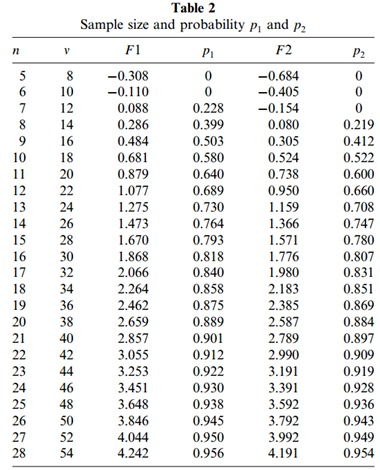

```{r set-options, echo=FALSE, cache=FALSE}
options(width = 80)
```

```{css, echo=FALSE}
.code {
  font-size: 18px;
  background-color: white;
  border: 2px solid darkgray;
  font-weight: bold;
  max-width: none !important;
}
.output {
  font-size: 18px;
  background-color: white;
  border: 2px solid black;
  font-weight: bold;
  max-width: none !important;
}
.main-container {
  max-width: none !important;
}
.pre {
  max-height: 500px !important;
  overflow-y: auto !important;
  overflow-x: scroll !important;
}
.bgobs {
  background-color: #a0d8d8;
}
.bgcodigo {
  background-color: #eeeeee;
}
.bgsaida {
  background-color: #ecf7db;
}
```

```{r setup, include=FALSE}
knitr::opts_chunk$set(eval=TRUE,
                      echo=TRUE, 
                      fig.width=7, 
                      fig.height=6,
                      fig.align="center",
                      comment=NA,
                      class.source="code",
                      class.output="output")
```

```{r eval=TRUE, echo=FALSE}
# Linux
systoper <- Sys.info()[[1]]
if (systoper == "Linux")
{
  # Troque para o executavel de onde esta instalado o scilab em seu computador
  executable <- file.path("","home","silveira","Scilab","bin","scilab")
  parameter <- "-nw"
}
# Windows
if (systoper == "Windows")
{
  # Troque para o executavel de onde esta instalado o scilab em seu computador
  executable <- file.path("D:","Usuarios","Jose","scilab","bin","Scilex")
  parameter <- ""
}
```

```{r,eval=TRUE,echo=FALSE}
systoper <- Sys.info()[[1]]
if (systoper == "Linux")
{
  # Troque para o executavel de onde esta instalado o scilab em seu computador
  executable <- file.path("","home","silveira","Scilab","bin","scilab")
  parameter <- "-nw"
}
# Windows
if (systoper == "Windows")
{
  # Troque para o executavel de onde esta instalado o scilab em seu computador
  executable <- file.path("D:","Usuarios","Jose","scilab","bin","Scilex")
  parameter <- ""
}
```

```{r,eval=TRUE,echo=FALSE}
eng_scilab <- function(options) {
code <- stringr::str_c(options$code, collapse = '\n')
if (options$eval) 
{
  cmd <- sprintf("%s %s -e %s",
                 executable,
                 parameter,
                 shQuote(code,type="cmd"))
  out <- system(cmd, intern = TRUE)
}else{out <- "output when eval=FALSE and engine='scilab'"}

knitr::engine_output(options, options$code, out)
}

knitr::knit_engines$set(scilab=eng_scilab)
```

```{r}
invisible(Sys.setlocale("LC_CTYPE", "pt_BR.UTF-8"))
invisible(Sys.setlocale("LC_ALL", "pt_BR.UTF-8"))
```

```{r eval=TRUE,  echo=TRUE, warning=FALSE, error=FALSE}
options(warn=-1)
suppressMessages(library(knitr, warn.conflicts=FALSE))
suppressMessages(library(readxl, warn.conflicts=FALSE))
suppressMessages(library(psych, warn.conflicts=FALSE))
suppressMessages(library(emmeans, warn.conflicts=FALSE))
suppressMessages(library(multcomp, warn.conflicts=FALSE))
suppressMessages(library(ggplot2, warn.conflicts=FALSE))
suppressMessages(library(GGally, warn.conflicts=FALSE))
suppressMessages(library(effects, warn.conflicts=FALSE))
suppressMessages(library(effectsize, warn.conflicts=FALSE))
suppressMessages(library(tidyr, warn.conflicts=FALSE))
suppressMessages(library(MASS, warn.conflicts=FALSE))
suppressMessages(library(car, warn.conflicts=FALSE))
source("eiras.bartitle.R")
```

# Material

* HTML de R Markdown em [`RPubs`](http://rpubs.com/josiqueira/){target="_blank"}
* Arquivos em [`GitHub`](https://github.com/josiqueira/EstatMedR){target="_blank"}

# Objetivos

* Conceituar ANCOVA, distinguindo-a da ANOVA e da Regressão Linear Simples.
* Discorrer sobre as suposições e condições nas quais ANCOVA pode ser utilizada.
* Descrever e indicar dois delineamentos diferentes da ANCOVA:
  * com um fator (nominal) entre participantes e uma covariável (intervalar),
  * em delineamento pré-pós intervenção.
* Proceder com a análise descritiva numérica e gráfica dos dados.
* Formular e implementar os modelos de ANCOVA adequados a cada situação.
* Determinar as significâncias estatística e prática das suposições e do efeito do fator.

# ANCOVA independente simples

ANCOVA independente simples é uma combinação de regressão linear simples com ANOVA unifatorial independente. Este é o primeiro passo para o modelo linear geral (GLM: _General Linear Model_).

Na ANOVA, o tamanho de efeito global, $R^2$, é a porcentagem da variância da variável de desfecho (VD) intervalar, explicada pelo fator nominal. Note que, como só existe um fator, o tamanho de efeito global coincide com o tamanho de efeito do fator, $\eta^2$. A parcela da variância da VD que não é explicada pelo modelo da ANOVA (chamado de resíduo ou termo de erro) corresponde a $1-\eta^2$. 

```{r out.width = '70%', fig.cap="ANOVA unifatorial simples", echo=FALSE}

```

Existem duas razões principais para usar ANCOVA:

**1. Reduzir a variância do resíduo:**

A ANCOVA introduz uma covariável (intervalar) que também explica parcialmente a variância da VD. Supõe-se que esta covariável não esteja correlacionada com o fator. Com isso, a variância da VD é particionada em dois tamanhos de efeito parciais, uma parte atribuída ao fator, $\eta^2_{\text{Fator}}$ e outra parte associada com a covariável, $\eta^2_{\text{Cov}}$. São estes tamanhos de efeito parciais que aparecerão na análise, adiante.

```{r out.width = '70%', fig.cap="ANCOVA unifatorial simples",echo=FALSE}

```

A introdução desta covariável permite o controlar o efeito do fator: a parcela da variância da VD atribuída à covariável é subtraída pelo modelo.

```{r out.width = '70%', fig.cap="ANCOVA unifatorial simples",echo=FALSE}

```

Como os tamanhos de efeitos são porcentagens explicadas da variância da VD  pela covariável ou pelo fator, subtraindo-se a parte atribuída à covariável, altera-se o denominador. Com isto, a porcentagem remanescente explicada pelo fator é proporcionalmente maior do que aquela computada pela ANOVA. O modelo ganha em poder explicativo, e este é o tamanho de efeito global, denotado por $\eta^2_{\text{Global}}$ ou simplesmente $\eta^2$ que aparece nas análises adiante. 

Pela ilustração também é fácil de perceber que a soma dos tamanhos de efeito parciais não correspondem necessariamente ao tamanho de efeito global.

**2. Ajustar as médias da covariável, de modo que o valor médio da covariável seja o mesmo em todos os grupos e depois ajustar as médias e erros-padrão da VD nos grupos (equalização estatística de condições entre participantes):**

O uso de uma covariável é uma forma de obter controle estatístico quando o controle experimental, obtido pelo delineamento do estudo, não for possível. Testes mais simples, como teste _t_ ou ANOVA, muitas vezes podem ser usados em situações laboratoriais. Em um experimento com camundongos, havendo recursos financeiros, o pesquisador pode ter, por exemplo, animais com a mesma idade ou até mesmo com a mesma genética. 

Suponha, no entanto, que os animais disponíveis têm idades variadas. Controlar o efeito do experimento pela idade pode ser uma boa ideia. Críticos da ANCOVA dirão que esta dificuldade poderia ser resolvida com randomização dos animais entre os grupos ou condições experimentais (na linguagem do GLM: fator). Porém, randomização mitiga a discrepância entre as condições experimentais **em média** (com a intenção, neste exemplo, de equalizar as idades), mas não garante esta homogeneidade completamente em um determinado experimento, especialmente se a amostra é grande. 

Enquanto a ANCOVA pode ser preterida em relação à ANOVA em delineamentos experimentais nas quais o pesquisador assume que a randomização é suficiente, em estudos quase-experimentais ou observacionais, nos quais randomização não é realizada, ANCOVA é uma estratégia mais defensável.

O GLM é uma das formas mais simples para se operacionalizar este controle estatístico na análise para testar o efeito fixo do fator entre participantes. 

Por "ajustar as médias da covariável, de modo que o valor médio da covariável seja o mesmo em todos os grupos", o GLM computa a média da covariável em cada condição do fator, e então utiliza a média destas médias como a média representativa para a covariável.

O segundo passo é "ajustar as médias e erros-padrão da VD nos grupos (equalização estatística de condições entre participantes)", que é alterar os valores das médias da VD para cada uma das condições do fator, o que é conhecido como _médias marginais ajustadas_, que também aparecerão nas análises da ANCOVA. Da mesma forma, os erros-padrão são homogeneizados. Veremos, adiante, como estes valores de média e erro-padrão são computados após a aplicação do modelo.

## Exemplo: Dancey & Reidy, 2019, p. 424

Um experimento foi projetado para descobrir se álcool (nas condições placebo, ingestão em pequena quantidade e ingestão em grande quantidade) afeta o desempenho de dirigir, medido por erros cometidos no simulador veicular. A expectativa é que o número de erros aumente quanto maior for a intoxicação pelo álcool.

No entanto, uma suposição perfeitamente razoável é que a experiência de direção também está relacionada aos erros cometidos ao dirigir, mesmo num simulador. Quanto mais experiente for o motorista, menor será a quantidade de erros. Assim, a experiência do motorista está negativamente associada aos erros ao dirigir.

O delineamento é entre participantes. O pesquisador randomizou participantes entre os três grupos mas, ainda assim, gostaria de mitigar o efeito da experiência dos motoristas para estudar o efeito do álcool. O dados estão disponíveis em [`AlcoholExperienceDrivingErrors.rds`](AlcoholExperienceDrivingErrors.rds){target="_blank"}.

```{r}
Dados <- data.frame(readxl::read_excel("AlcoholExperienceDrivingErrors.xlsx"))
Dados$Grupo <- factor(Dados$Grupo,
                      levels=c("Placebo","PoucoAlcool","MuitoAlcool"))
saveRDS(Dados,"AlcoholExperienceDrivingErrors.rds")
```

Alguma estatística descritiva, os testes das suposições para a ANCOVA, a execução da ANCOVA e testes _post hoc_ estão implementados em  [`demo_ANCOVA.R`](demo_ANCOVA.R){target="_blank"}. 

### Estatística descritiva

Implementado em [`demo_ANCOVA_01descritiva.R`](demo_ANCOVA_01descritiva.R){target="_blank"}:

```{r echo=FALSE}
cat(readLines("demo_ANCOVA_01descritiva.R"), sep = "\n")
```
  
```{r echo=FALSE}
source("demo_ANCOVA_01descritiva.R")
```

O arquivo de dados contém as informações de cada voluntário (identificados pelo <code>ID</code>) em uma linha. O delineamento é completamente entreparticipantes (participantes diferentes foram submetidos à ingestão de **Placebo**, **PoucoAlcool** e **MuitoAlcool**). Este placebo é uma bebida idealizada (neste exemplo fictício) com características idênticas em aspecto e sabor à bebida alcóolica, mas que não contém álcool. 

Três tabelas mostram, respectivamente, em cada uma das condições do fator:

* distribuição dos erros cometidos, 
* distribuição da experiência dos participantes,
* distribuição simultânea dos erro e experiência simultaneamente observados,
* sumário dos erros de direção cometidos.

Na sequência há vários gráficos para que são adequados para o propósito da sua pesquisa.

### Regressões lineares simples

Implementado em [`demo_ANCOVA_02lm.R`](demo_ANCOVA_02lm.R){target="_blank"}:

```{r echo=FALSE}
cat(readLines("demo_ANCOVA_02lm.R"), sep = "\n")
```

```{r echo=FALSE}
source("demo_ANCOVA_02lm.R")
```

São apresentados dois tipos de gráfico. O primeiro é gerado pela função <code>car::scatterplot</code> que plota retas de regressão automaticamente, usando-se o parâmetro <code>regLine=TRUE</code>. O segundo usa recursos do pacote <code>ggplot2</code>, parametrizado para exibir as linhas de regressão com bandas de confiança 95%. Observe que as retas parecem paralelas, mas quando produzimos as três bandas de confiança de 95% com correção de Bonferroni, não conseguimos visualizar um segmento de reta comum às três retas, sugerindo que não há uma reta populacional de associação linear entre erros de direção e experiência em direção que atenda aos três grupos (i.e., possivelmente o álcool distingue as três populações).

Temos, então, três regressões lineares simples, mostrando que há associação negativa significante da experiência em direção com o número de erros cometidos no simulador em cada uma das condições do fator. Visualmente, as três regressões parecem paralelas, o que nos leva à discussão sobre as suposições necessárias para a aplicação da ANCOVA.

### Suposições

Além das suposições da regressão linear simples e da ANOVA, a ANCOVA supõe:

* dissociação entre o fator e a covariável,
* covariável sem erro de mensuração (não testável, assumida pelo modelo),
* linearidade entre a VD e a covariável em todos os níveis do fator,
* igualdade das inclinações das regressões lineares simples.

Implementado em [`demo_ANCOVA_03suposicoes.R`](demo_ANCOVA_03suposicoes.R){target="_blank"}:

```{r echo=FALSE}
cat(readLines("demo_ANCOVA_03suposicoes.R"), sep = "\n")
```

```{r echo=FALSE}
source("demo_ANCOVA_03suposicoes.R")
```

Os dois testes das suposições apresentados nesta saída são:

* Dissociação entre Grupo (factor) and Experiência (covariável)

A hipótese nula é a ausência de associação entre os níveis do fator e os níveis de experiência dos participantes. Isto é feito por uma ANOVA independente com:

```{r}
modelo <- lm(Experiencia ~ Grupo, data=Dados)
print(Anova <- car::Anova(modelo))
```

O valor $p=0.4136$ não rejeita $H_0$ e, portanto, assumimos dissociação entre o fator e a covariável.

* Linearidade entre ErrosDirecao (VD) e Experiencia (covariável) em todos os níveis do Grupo (fator)

As hipóteses nulas para o teste de Harvey-Collier são de linearidade entre as variáveis testadas. São feitas regressões segmentando os dados para cada grupo com:

```{r}
levels <- as.vector(unique(Dados$Grupo))
for (l in levels)
{
  modelo <- lm(ErrosDirecao ~ Experiencia, data=Dados[Dados$Grupo==l,])
  hc <- lmtest::harvtest(modelo) # Harvey-Collier test for linearity
  cat(bartitle(l,4))
  print(hc)
}
```

<!--
obtendo-se:
<pre>
[...]
Placebo
HC = 0.48977, df = 9, p-value = 0.636
[...]
PoucoAlcool
HC = 0.75424, df = 9, p-value = 0.47
[...]
MuitoAlcool
HC = 0.00074081, df = 9, p-value = 0.9994
</pre>
-->

Para os três níveis do fator não rejeitou-se a hipótese nula de ausência de linearidade.

* Homogeneidade da inclinação das regressões lineares simples

A hipótese nula é o paralelismo das três regressões feitas, em cada nível do fator, entre a experiência (covariável) e o número de erros cometidos no simulador (VD). Isto é feito por um GLM que considera o fator, a covariável e a interação entre fator e covariável com:

```{r}
modelo <- lm(ErrosDirecao ~ Grupo + Experiencia + Grupo:Experiencia, 
             data=Dados)
suppressMessages(
  print(Anova <- car::Anova(modelo))
)
```

A inclusão da interação <code>Grupo:Experiencia</code> é um artifício para o teste do paralelismo das retas. O valor desta interação, $p=0.756$ é o único relevante para a decisão estatística. Neste caso, não rejeitamos $H_0$ e, portanto, as três regressões lineares simples são assumidas como retas populacionais paralelas.

### Teste do efeito do fator

A ANCOVA propriamente dita tem hipótese nula de ausência de efeito do fator sobre a VD:

$$H_0: \mu^{\prime}_1 = \mu^{\prime}_2 = \cdots = \mu^{\prime}_k$$

em que $k$ é o número de níveis do fator e $\mu^{\prime}_i$ são as médias populacionais da VD ajustadas pela covariável. 

Uma vez que as três regressões são paralelas, detectamos o efeito do fator (níveis de álcool) sobre a VD (número de erros de direção), controlando-se para a covariável (experiência em dirigir) caso as regressões tenham diferentes interceptos. 

Implementado em [`demo_ANCOVA_04ANCOVA.R`](demo_ANCOVA_04ANCOVA.R){target="_blank"}:

```{r echo=FALSE}
cat(readLines("demo_ANCOVA_04ANCOVA.R"), sep = "\n")
```

```{r echo=FALSE}
source("demo_ANCOVA_04ANCOVA.R")
```

Note que a sintaxe é similar à anterior, exceto pela remoção da interação <code>Grupo:Experiencia</code>. Computa-se os erros de direção em função do fator (<code>Grupo</code>) e da covariável (<code>Experiencia</code>); é uma ANOVA da ANCOVA.

O valor $p=4.851 \times 10^{-7}$ relevante aqui é aquele associado com o fator (<code>Grupo</code>), rejeitando-se a hipótese nula da ANCOVA que foi enunciado acima, portanto considera-se que a ingestão de álcool afeta o número de erros cometidos na direção.

Na sequência exibimos, também, a regressão associada à ANCOVA.
O valor que aparece na coluna <code>Estimate</code> na linha da covariável <code>Experiencia</code> é a inclinação comum estimada para as três retas de regressão, que será utilizada adiante.

As últimas duas linhas da saída da regressão da ANCOVA mostram o efeito global ($\eta^2=R^2=0.76$) e o valor $p=4.316 \times 10^{-10}$ que rejeita a hipótese nula da ausência de modelo ANCOVA; portanto, a ANCOVA proposta é um modelo válido para esta análise. 

### Tamanhos de efeito

Como descrito anteriormente, computam-se o tamanho de efeito global e os tamanhos de efeito, implementadas em [`demo_ANCOVA_05tamefeito.R`](demo_ANCOVA_05tamefeito.R){target="_blank"}:

```{r echo=FALSE}
cat(readLines("demo_ANCOVA_05tamefeito.R"), sep = "\n")
```

```{r echo=FALSE}
source("demo_ANCOVA_05tamefeito.R")
```

### Médias marginais estimadas ajustadas

O próximo item da saída são as médias marginais e erros-padrão ajustados. Estes são os valores estimados depois que os grupos foram estatisticamente equalizados pela covariável (i.e., os valores estimados para os erros de direção associados ao álcool sem o efeito da experiência). Por isso, são diferentes dos valores observados. 

Este trecho está implementado em [`demo_ANCOVA_06emmeans.R`](demo_ANCOVA_06emmeans.R){target="_blank"}:

```{r echo=FALSE}
cat(readLines("demo_ANCOVA_06emmeans.R"), sep = "\n")
```

```{r echo=FALSE}
source("demo_ANCOVA_06emmeans.R")
```

Esta correção dos valores é a partir da regressão linear associada à ANCOVA:

```{r}
ancova.fit <- lm(ErrosDirecao~Grupo+Experiencia, 
                 data=Dados)
print(reg <- summary(ancova.fit))
```

Sendo uma regressão, a coluna <code>Estimate</code> contém o intercepto associado ao primeiro nível do fator (`r reg$coefficients[1,1]`), os interceptos dos outros níveis relativos ao primeiro nível (`r reg$coefficients[2,1]` e `r reg$coefficients[3,1]`), e a inclinação da reta comum a todos os níveis (`r reg$coefficients[4,1]`). O objetivo é obter três retas com a mesma inclinação.

Os valores absolutos dos interceptos são dados pela soma dos valores relativos sobre o intercepto do primeiro nível:

```{r}
grp <- unique(Dados$Grupo)
ngrp <- length(unique(Dados$Grupo))
# interceptos adjustados
adj_intercept <- rep(NA,ngrp)
adj_intercept[1] <- reg$coefficients[1,1]
for (g in 2:ngrp)
{
  adj_intercept[g] <- adj_intercept[1]+reg$coefficients[g,1]
}
cat("\n")
cat("Intercepts:\n")
cat("\t",as.character(grp[1])," = ",adj_intercept[1],"\n", sep="")
for (g in 2:ngrp)
{
  cat("\t",as.character(grp[g])," = ",adj_intercept[1]," + ",reg$coefficients[g,1]," = ",adj_intercept[g],"\n", sep="")
}
```

A inclinação comum às três retas é dada por 

```{r}
adj_slope <- reg$coefficients[ngrp+1,1]
cat("Common slope = ",adj_slope,"\n", sep="")
```

e a média comum da covariável é a média das médias da experiência dos participantes em cada um dos grupos:

```{r}
tmp <- aggregate(Experiencia~Grupo, data=Dados, FUN=mean)
print(tmp)
adj_cov <- mean(tmp$Experiencia)
cat("Common Covariate Mean = ",adj_cov,"\n", sep="")
```

Finalmente, as médias marginais estimadas ajustadas correspondem aos valores do número de erros de direção para a média comum da covariável estimados pelas três regressões obtidas com os interceptos ajustados e inclinação comum:

```{r}
adj_mm <- rep(NA,ngrp)
for (g in 1:ngrp)
{
  adj_mm[g] <- adj_intercept[g] + adj_slope*adj_cov
}
cat("Adjusted marginal means:\n")
for (g in 1:ngrp)
{
  cat("\t",as.character(grp[g])," = ",adj_intercept[g]," + ",adj_slope," * ",adj_cov," = ",adj_mm[g],"\n", sep="")
}
```

Uma visão gráfica destas médias marginais ajustadas é:

```{r}
xreg <- rep(NA,ngrp)
yreg <- rep(NA,ngrp)
xmin <- xmax <- ymin <- ymax <- NA 
for (g in 1:ngrp)
{
  xmin <- min(Dados$Experiencia[Dados$Grupo==as.character(grp[g])],na.rm=TRUE)
  xmax <- max(Dados$Experiencia[Dados$Grupo==as.character(grp[g])],na.rm=TRUE)
  x <- seq(xmin,xmax,length.out=100)
  if(is.na(xmin)) {xmin<-min(x)} else { if(xmin>min(x)){xmin<-min(x)} }
  if(is.na(xmax)) {xmax<-max(x)} else { if(xmax<max(x)){xmax<-max(x)} }
  y <- adj_intercept[g] + adj_slope*x
  if(is.na(ymin)) {ymin<-min(y)} else { if(ymin>min(y)){ymin<-min(y)} }
  if(is.na(ymax)) {ymax<-max(y)} else { if(ymax<max(y)){ymax<-max(y)} }
  xreg[g] <- list(x)
  yreg[g] <- list(y)
}
plot(NA, 
     xlim=c(xmin,xmax), ylim=c(ymin,ymax), 
     main="Adjusted Marginal Means",
     xlab="Experiencia",
     ylab="ErrosDirecao")
abline(v=adj_cov,lty=2)
text(adj_cov,ymin,round(adj_cov,3),pos=2,cex=0.6)
for (g in 1:ngrp)
{
  lines(unlist(xreg[g]),unlist(yreg[g]))
  x <- max(unlist(xreg[g]))
  y <- adj_intercept[g] + adj_slope*x
  text(x,y,as.character(grp[g]),pos=2,cex=0.8)
  y <- adj_intercept[g] + adj_slope*adj_cov
  lines(c(xmin,adj_cov), c(y, y), lty=2)
  text(xmin,y,round(adj_mm[g],3),pos=3,cex=0.6)
}
```

em que 14.139 é a média comum da covariável e os valores das médias marginais correspondem aos que foram obtidos com a função <code>emmeans::emmeans()</code>

```{r}
EMM <- emmeans::emmeans(ancova.fit,
                        pairwise~"Grupo",
                        adjust="holm",
                        level=1-alfa)
print(EMM$emmeans)
```

No mesmo processo de cálculo das médias marginais, foram computados também erros padrão ajustados (<code>SE</code>, _standard errors_), que costumam ter valores quase iguais para cada nível do fator. O cálculo para estes erros padrão é um pouco mais trabalhoso (Liu, 2011; Crawley, 2012). Basta dizer aqui que estes valores são os utilizados para estimar o intervalo de confiança que aparece no gráfico correspondente.

```{r fig.align="left", out.width = '8%', echo=FALSE}
knitr::include_graphics("./image/coruja.png")
```

<table style="border:1; background-color:#CAE0AB"><tr><td>
O código completo para calcular as médias marginais estimadas ajustadas está em [`demo_AdjustedMarginalMeans.R`](demo_AdjustedMarginalMeans.R){target="_blank"}.
</td></tr></table>

### Testes _post hoc_

Resta apenas localizar as diferenças dos números de erros entre os diferentes níveis do fator. Usamos os contrastes de Tukey da mesma forma que fizemos com ANOVA nos capítulos anteriores. Este trecho está implementado em [`demo_ANCOVA_07posthoc.R`](demo_ANCOVA_07posthoc.R){target="_blank"}:

```{r echo=FALSE}
cat(readLines("demo_ANCOVA_07posthoc.R"), sep = "\n")
```

```{r echo=FALSE}
source("demo_ANCOVA_07posthoc.R")
```

Concluímos, portanto que os níveis A (<code>Placebo</code>) e B (<code>PoucoAlcool</code>) são não estatisticamente diferentes, mas o nível C (<code>MuitoAlcool</code>) é o motivo da rejeição da hipótese nula e, portanto, Álcool tem efeito no número de erros cometidos no simulador de direção veicular.

# ANCOVA mista

Em outra situação, os mesmos participantes são avaliados antes e depois de uma intervenção (intraparticipantes), mas são divididos em grupos que recebem tratamentos diferentes (entre participantes). O interesse é avaliar o efeito das tratamentos.

Segundo BORM et al., 2007:

"An advantage of the use of ANCOVA is that it adjusts for baseline differences between the treatment groups. ANCOVA also has more statistical power than the t-test, so sample size requirements are lower."

## Exemplo: Cirurgia de grande porte com anestesia geral

Dez pacientes idosos foram submetidos a uma cirurgia de grande porte com anestesia geral. Divididos em dois grupos, cada um tratado com uma droga diferente: uma droga tradicional (padrão) e uma nova proposta terapêutica (nova). Um teste cognitivo foi aplicado alguns dias antes da cirurgia e no período pós-operatório. Espera-se que as drogas mitiguem delírio pós-operatório (DPO) e disfunção cognitiva pós-operatória (DCPO). Este estudo é duplo cego para a comparação de duas drogas, de forma que serão denominadas de droga A e droga B, sem que o analista saiba qual delas corresponde à droga padrão e qual corresponde à droga nova. Os dados obtidos estão em [`PrePos_2CondIndep.rds`](PrePos_2CondIndep.rds){target="_blank"}, organizados no formato _long_.

```{r}
Dados.long <- data.frame(readxl::read_excel("PrePos_2CondIndep.xlsx"))
Dados.long$Grupo <- factor(Dados.long$Grupo,
                      levels=c("droga A","droga B"))
Dados.long$Momento <- factor(Dados.long$Momento,
                        levels=c("Pre","Pos"))
print.data.frame(Dados.long)
# converte long -> wide
Dados.wide <- tidyr::spread(Dados.long,Momento,Escore)
print.data.frame(Dados.wide)
lista <- list(Dados.wide, Dados.long)
names(lista) <- c("Dados.wide", "Dados.long")
saveRDS(lista, "PrePos_2CondIndep.rds")
```

<small>
"A anestesia geral age predominantemente no sistema nervoso central, repercutindo também, em todos os aparelhos e sistemas do organismo. Seu mecanismo intrínseco de ação ainda não é completamente conhecido e por isso a possibilidade de algum prejuízo temporário ou permanente na cognição e na memória sempre foi alvo de considerações. Há uma especial preocupação quanto aos idosos, por apresentarem maior susceptibilidade às alterações da homeostasia e do meio ambiente. A cirurgia e a anestesia exercem comparativamente efeitos adversos cerebrais mais acentuados nos idosos do que nos jovens, manifestado pela maior prevalência de delírio pós-operatório e disfunção cognitiva. O delírio pós-operatório (DPO) e a disfunção cognitiva pós-operatória (DCPO) atrasam a reabilitação, e são associadas com o aumento na morbidade e na mortalidade de pacientes idosos. Embora seja difícil estabelecer metodologicamente qualquer correlação entre DPO e DCPO, um recente estudo sugere que ambas podem representar uma trajetória de insuficiência cognitiva pós-operatória, talvez como uma progressão de não reconhecida insuficiência cognitiva leve pré-operatória. [...] A incidência de DCPO é elevada (40%) em pacientes com mais de 65 anos, submetidos a cirurgias de médio e grande porte e, em cirurgias cardíacas, esta porcentagem pode ser maior que 60%. [...] Aproximadamente 10% dos pacientes cirúrgicos idosos desenvolvem DPO, aumentando para 30-65% após certos tipos de cirurgia, tais como cirurgia cardíaca, cirurgias de emergência e fratura de quadril." (Sakae et al., 2016)
</small>

Esta ANCOVA é similar à independente, mas o papel da covariável é feito pela medida anterior à intervenção (<code>Pre</code>), que funciona como controle da linha de base.

```{r out.width = '70%', echo=FALSE}

```

Quem faz o papel da variável de desfecho é a medida posterior à intervenção (<code>Pos</code>). O fator é a droga, e neste exemplo existem dois níveis (droga <code>A</code> e <code>B</code>); são dois grupos de pacientes independentes, mas cada um deles é medido duas vezes. Neste sentido o delineamento é misto: entre participantes e intraparticipantes.

Esta análise foi implementada em [demo_ANCOVA_prepos.R](demo_ANCOVA_prepos.R){target="_blank"}. O código é praticamente o mesmo que o anterior, com pequenos ajustes por causa da estatística descritiva e pelo uso dos formatos _long_ e _wide_ de acordo com a conveniência das funções utilizadas.

Obtém-se a seguinte saída:

```{r echo=FALSE}
cat(readLines("demo_ANCOVA_prepos.R"), sep = "\n")
```

```{r echo=FALSE}
source("demo_ANCOVA_prepos.R")
```

A interpretação da saída é a mesma da ANOVA independente. Neste exemplo, chamamos a atenção para algumas ocorrências:

1. Nas regressões lineares simples, a droga $A$ não tem inclinação significante para $\alpha=0.05$. No entanto, o teste da homogeneidade das inclinações não rejeita a hipótese nula de paralelismo entre as regressões. Observe o gráfico correspondente: há um segmento de reta que pode ser traçado pertencendo simultaneamente às bandas de confiança de 95% com correção de Bonferroni no domínio comum da covariável. 

2. Como acontece na ANCOVA independente, existe a saída da tabela ANOVA da ANCOVA (a ANCOVA propriamente dita) e a saída da regressão da ANCOVA.

Na saída da ANOVA da ANCOVA, avalia-se o valor _p_ associado ao fator, que neste caso é 0.0136. Portanto, rejeita-se a hipótese nula para $\alpha=0.05$ e assume-se que as drogas A e B têm efeitos diversos.

<pre>
Anova Table (Type II tests)

Response: Pos
           Sum Sq Df F value    Pr(>F)    
Grupo      232.05  1  10.716 0.0136078 *  
Pre       1058.02  1  48.858 0.0002135 ***
Residuals  151.58  7                      
</pre>

Na saída da regressão da ANCOVA, interessa observar as duas últimas linhas:

<pre>
Multiple R-squared:  0.9071,    Adjusted R-squared:  0.8806 
F-statistic: 34.18 on 2 and 7 DF,  p-value: 0.0002442
</pre>

Aqui testa-se se existe modelo ANCOVA. O valor _p_=0.0002442 rejeita a hipótese nula de ausência de modelo ANCOVA. Portanto, há ANCOVA. Também é onde encontramos o tamanho de efeito global ($\eta^2 = R^2 = 0.91$).

3. Como há somente dois níveis do fator, não haveria necessidade do teste _post hoc_ que meramente deveria concordar com o que obtém da ANCOVA (está disponível neste _Rscript_ para o caso do código ser adaptado para situações com mais níveis do fator). 

# Planejamento

Segundo BORM et al. (2007):

> "The use of ANCOVA may considerably reduce the number of patients required for a trial. [...] ANCOVA on $(1 - \rho^2) \cdot n$ observations has the same power as a t-test on $n$ observations."

Estes autores propõem uma fórmula simples para dimensionar uma amostra para a ANCOVA para um fator com dois níveis:

```{r}
delta <- .5
rho <- .6
alfa <- .05
poder <- .90
n.porcondicao <- 2*((qnorm(1-alfa/2)+qnorm(poder))*sqrt(1-rho^2)/delta)^2
n.total <- 2*n.porcondicao
cat("\nn total = ",n.total," com ",n.porcondicao," por nivel do fator\n")
```

Neste _Rscript_ encontramos o tamanho da amostra para $\alpha=0.05$ e $\text{poder}=0.90$. Temos:

* <code>delta</code> que é o $d$ de Cohen populacional (tamanho de efeito populacional)
* <code>rho</code> que a correlação populacional de Pearson entre a VD e a covariável.

Podemos variar o valor do poder para termos ideia do poder do estudo de nosso exemplo, com 10 idosos no total. Encontramos:

```{r}
delta <- .5
rho <- .6
alfa <- .05
poder <- .17
n.porcondicao <- 2*((qnorm(1-alfa/2)+qnorm(poder))*sqrt(1-rho^2)/delta)^2
n.total <- 2*n.porcondicao
cat("\nn total = ",n.total," com ",n.porcondicao," por nivel do fator\n")
```

Portanto, o poder _a priori_ de um estudo deste tamanho era bem baixo, da ordem de 17%. 

Segundo Liu (2011), embora a inclusão da covariável seja geralmente aceita como capaz de reduzir o erro padrão ajustado, consequentemente aumentando o poder da ANCOVA em comparação com a ANOVA (aumentando o valor de $\eta^2$), isto nem sempre se verifica. Com o aumento do tamanho da amostra, a probabilidade de haver benefício com a inclusão de uma covariável também aumenta. O autor apresenta a seguinte tabela:

```{r out.width = '60%', echo=FALSE}

```

Neste estudo foram supostos dois níveis para o fator. A correlação de Pearson entre a VD e a covariável é 0.3 (intermediária). Há tamanho total da amostra ($n$) e graus de liberdade correspondentes da ANCOVA ($\nu$). As colunas $p_1$ e $p_2$ são probabilidades (calculadas por dois métodos diversos) da ANCOVA ter resultado melhor que a ANOVA nas mesmas condições: $p_1$ é a probabilidade de reduzir o erro padrão ajustado; $p_2$ é probabilidade de reduzir o amplitude do intervalo de confiança ajustado. Observe que para uma probabilidade de 90% de haver benefício com a inclusão da covariável necessita-se de $n \ge 22$.

Para quem quiser modelo mais complexo, Crawley (2012) em "Chapter12 - Analysis of covariance" apresenta um delineamento com dois fatores e uma covariável. 

# Referências

* Borm et al. (2007) A simple sample size formula for analysis of covariance in randomized clinical trials. _Journal of Clinical Epidemiology_ 60: 1234-8.
* Dancey CP & Reidy J (2019) _Estatística sem Matemática para Psicologia_. 7ª ed. Porto Alegre: Penso.
* Michael J. Crawley (2012) _The R Book_. 2nd Edition. 
* Sakae TM et al. (2016) Efeitos da anestesia geral da cognição do idoso. _Arquivos Catarinenses de Medicina_ 45(3): 107-16.
* Xiaofeng Liu (2011) The Effect of a Covariate on Standard Error and Confidence Interval Width. _Communications in Statistics - Theory and Methods_ 40:3, 449-456, DOI: 10.1080/03610920903391337

