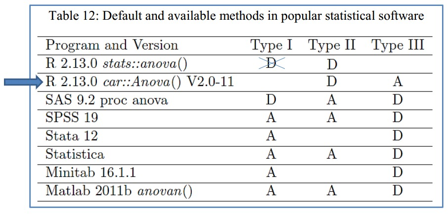
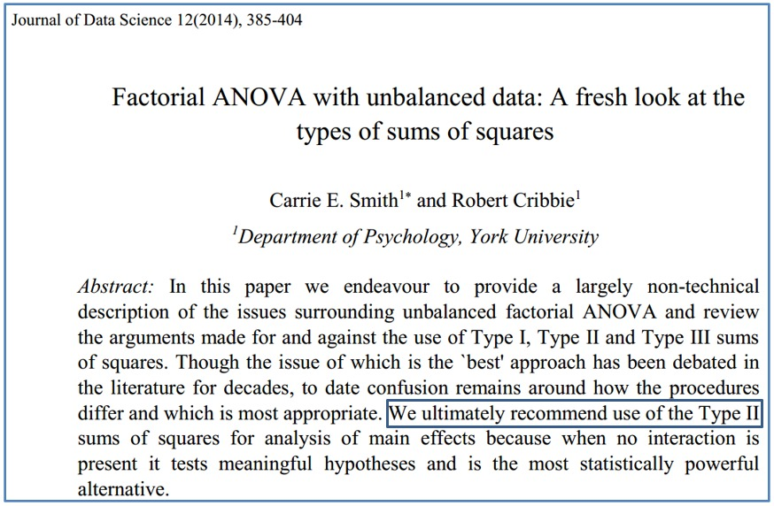
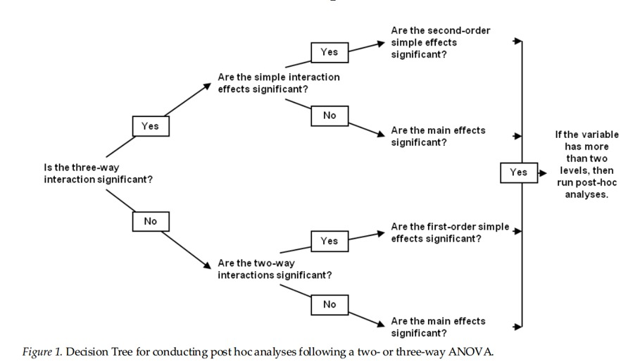

```{r set-options, echo=FALSE, cache=FALSE}
options(width = 80)
```

```{css, echo=FALSE}
.code {
  font-size: 18px;
  background-color: white;
  border: 2px solid darkgray;
  font-weight: bold;
  max-width: none !important;
}
.output {
  font-size: 18px;
  background-color: white;
  border: 2px solid black;
  font-weight: bold;
  max-width: none !important;
}
.main-container {
  max-width: none !important;
}
.pre {
  max-height: 500px !important;
  overflow-y: auto !important;
  overflow-x: scroll !important;
}
.bgobs {
  background-color: #a0d8d8;
}
.bgcodigo {
  background-color: #eeeeee;
}
.bgsaida {
  background-color: #ecf7db;
}
```

```{r setup, include=FALSE}
knitr::opts_chunk$set(eval=TRUE,
                      echo=TRUE, 
                      fig.width=7, 
                      fig.height=6,
                      fig.align="center",
                      comment=NA,
                      class.source="code",
                      class.output="output")
```

```{r eval=TRUE, echo=FALSE}
# Linux
systoper <- Sys.info()[[1]]
if (systoper == "Linux")
{
  # Troque para o executavel de onde esta instalado o scilab em seu computador
  executable <- file.path("","home","silveira","Scilab","bin","scilab")
  parameter <- "-nw"
}
# Windows
if (systoper == "Windows")
{
  # Troque para o executavel de onde esta instalado o scilab em seu computador
  executable <- file.path("D:","Usuarios","Jose","scilab","bin","Scilex")
  parameter <- ""
}
```

```{r,eval=TRUE,echo=FALSE}
systoper <- Sys.info()[[1]]
if (systoper == "Linux")
{
  # Troque para o executavel de onde esta instalado o scilab em seu computador
  executable <- file.path("","home","silveira","Scilab","bin","scilab")
  parameter <- "-nw"
}
# Windows
if (systoper == "Windows")
{
  # Troque para o executavel de onde esta instalado o scilab em seu computador
  executable <- file.path("D:","Usuarios","Jose","scilab","bin","Scilex")
  parameter <- ""
}
```

```{r,eval=TRUE,echo=FALSE}
eng_scilab <- function(options) {
code <- stringr::str_c(options$code, collapse = '\n')
if (options$eval) 
{
  cmd <- sprintf("%s %s -e %s",
                 executable,
                 parameter,
                 shQuote(code,type="cmd"))
  out <- system(cmd, intern = TRUE)
}else{out <- "output when eval=FALSE and engine='scilab'"}

knitr::engine_output(options, options$code, out)
}

knitr::knit_engines$set(scilab=eng_scilab)
```

```{r}
invisible(Sys.setlocale("LC_CTYPE", "pt_BR.UTF-8"))
invisible(Sys.setlocale("LC_ALL", "pt_BR.UTF-8"))
```

```{r}
options(warn=-1)
suppressMessages(library(car, warn.conflicts=FALSE))
suppressMessages(library(emmeans, warn.conflicts=FALSE))
suppressMessages(library(gplots, warn.conflicts=FALSE))
suppressMessages(library(lmerTest, warn.conflicts=FALSE))
suppressMessages(library(multcomp, warn.conflicts=FALSE))
suppressMessages(library(MuMIn, warn.conflicts=FALSE))
suppressMessages(library(phia, warn.conflicts=FALSE))
suppressMessages(library(psych, warn.conflicts=FALSE))
suppressMessages(library(pwr2, warn.conflicts=FALSE))
suppressMessages(library(RcmdrMisc, warn.conflicts=FALSE))
suppressMessages(library(readxl, warn.conflicts=FALSE))
suppressMessages(library(twowaytests, warn.conflicts=FALSE))
suppressMessages(library(estimatr, warn.conflicts=FALSE))
suppressMessages(library(effectsize, warn.conflicts=FALSE))
suppressMessages(library(WebPower, warn.conflicts=FALSE))
suppressMessages(library(bruceR, warn.conflicts=FALSE))
source("summarySEwithin2.R")
```

# Material

* HTML de R Markdown em [`RPubs`](http://rpubs.com/josiqueira/){target="_blank"}
* Arquivos em [`GitHub`](https://github.com/josiqueira/EstatMedR){target="_blank"}

<!-- # Incluir -->

<!-- <pre> -->
<!-- plot(emmeans::emmip(fit, ~ Severity ~ Complexity, CIs=TRUE)) -->
<!-- plot(emmeans::emmip(fit, ~ Severity ~ Complexity ~ Experience, CIs=TRUE)) -->
<!-- plot(emmeans::emmip(fit, ~ Severity : Complexity, CIs=TRUE)) -->
<!-- plot(emmeans::emmip(fit, ~ Severity : Complexity : Experience, CIs=TRUE)) -->

<!-- cat("\nSimple main effect test") -->
<!-- plot(emmeans::emmip(fit, ~ Severity | Complexity, CIs=TRUE)) -->
<!-- print(phia::testInteractions(fit,  -->
<!--                              fixed="Complexity",  -->
<!--                              across="Severity")) -->
<!-- plot(emmeans::emmip(fit, ~ Complexity | Severity, CIs=TRUE)) -->
<!-- print(phia::testInteractions(fit,  -->
<!--                              fixed="Severity",  -->
<!--                              across="Complexity")) -->

<!-- out <- bruceR::MANOVA(data = Data,  -->
<!--                       dv=c("Assessment"),  -->
<!--                       between=c("Severity", "Complexity", "Experience")) -->
<!-- bruceR::EMMEANS(out, "Experience") -->
<!-- </pre> -->

# Objetivos

* Discorrer sobre uma extensão da ANOVA que inclui dois ou mais fatores.
* Descrever e indicar três delineamentos diferentes da ANOVA com dois fatores:
    * independente: entre participantes,
    * relacionada: intraparticipantes,
    * mista: um fator entre e outro fator intraparticipantes.
* Proceder com a análise descritiva numérica e gráfica dos dados.
* Formular e implementar os modelos de ANOVA adequados a cada situação.
* Determinar as significâncias estatística e prática dos efeitos de interação e principais da ANOVA.
* Executar uma análise de efeito simples.
* Executar e interpretar os testes _post hoc_, quando adequados.

# Introdução

* [Two-way analysis of variance: Wikipedia](https://en.wikipedia.org/wiki/Two-way_analysis_of_variance){target="_blank"}
* [Analysis of variance: Wikipedia](https://en.wikipedia.org/wiki/Analysis_of_variance){target="_blank"}

ANOVA bifatorial permite testar efeitos principais e de interação numa única análise.

As variáveis envolvidas no teste estatístico são:

* duas ou mais VI (variável independente)  com duas ou mais categorias (fatores nominais dicotômicos ou politômicos): multifatorial 
* VD (variável dependente) intervalar com distribuição normal por condição: univariada
    
ANOVA multifatorial pode ser:

* independente (fator entre participantes)
* relacionada (fator intraparticipantes)
* mista (fatores entre e intraparticipantes)

ANOVA multifatorial é uma extensão do ANOVA unifatorial.

As suposições de normalidade homocedasticidade são condições suficientes e a suposição de independência é necessária para ANOVA multifatorial.

# ANOVA multifatorial em R

0. Planejamento de ANOVA 

a. Bifatorial Independente de Fisher
* `pwr2::pwr.2way`
    
b. Multifatorial Independente de Fisher    
* `WebPower::wp.kanova`
    
c. Multifatorial para medidas repetidas
* `WebPower::wp.rmanova`

1. ANOVA multifatorial independente 

a. Fisher (homocedástico):
* teste _omnibus_: `lm`, `car::Anova`  
  * testes _post hoc_: `emmeans::emmeans`, `multcomp::cld`

b. Fisher-White (heterocedástico): 
* teste _omnibus_: `lm`, `car::Anova(white.adjust="hc2", ...))`, `estimatr::lm_robust(se_type="HC2", ...)`
  * testes _post hoc_: ?
  
c. _Parametric Bootstrap based Generalized Test_ (robusta a não normalidade):   
* teste _omnibus_: `twowaytests::gpTwoWay`
  * testes _post hoc_: `twowaytests::paircompTwoWay`
    
2. ANOVA multifatorial relacionada ou para medidas repetidas
  
* teste _omnibus_: `lmerTest::lmer` e `car::Anova(test.statistic="F", ...)`
  * testes _post hoc_: `emmeans::emmeans` e `multcomp::cld`
    
3. ANOVA multifatorial mista
  
* teste _omnibus_: `lmerTest::lmer` e `car::Anova(test.statistic="F", ...)`
  * testes _post hoc_: `emmeans::emmeans` e `multcomp::cld`
      
# ANOVA independente multifatorial

Suponha que conduzimos um estudo com delineamento totalmente entre participantes, balanceado e não-randomizado com 48 participantes para investigar o efeito da cafeína na habilidade de dirigir sob o efeito do álcool.

```{r fig.align="left", out.width = '8%', echo=FALSE}

```

<table style="border:1; background-color:#CAE0AB"><tr><td>
Encontramos um artigo com este tema em Howland et al. (2010), disponível em https://pubmed.ncbi.nlm.nih.gov/21134017/; lamentavelmente, não conseguimos acesso aos dados publicados para que pudéssemos replicar a análise. Usaremos, aqui, dados hipotéticos que trarão conclusão similar.
<div align=right><small>
Howland J, Rohsenow DJ, Arnedt JT, et al. The acute effects of caffeinated versus non-caffeinated alcoholic beverage on driving performance and attention/reaction time. Addiction. 2011;106(2):335-341. doi:10.1111/j.1360-0443.2010.03219.x
</small></div>
</td></tr></table>

“Vale a pena observar que a MANOVA é ainda um teste válido, mesmo com modestas violações na suposição de normalidade, particularmente quando os tamanhos dos grupos são iguais e existe um número razoável de participantes em cada grupo; por “razoável” entendemos que, em um delineamento completamente entre participantes, deve haver pelo menos 12 participantes por grupo[…]”

> Dancey & Reidy, 2019, p. 472

O estudo analisa os efeitos de presença e ausência de álcool e de cafeína na quantidade de infrações (erros) cometidos ao dirigir um simulador de direção veicular durante 20 minutos. 

Dada a antiga crença de que o café auxilia a mantermo-nos alertas, podemos fazer algumas previsões para esse experimento:

* Altos níveis de álcool diminuem a capacidade de dirigir.
* Altos níveis de cafeína podem melhorar a habilidade de dirigir devido ao efeito estimulante.
* Um aumento de cafeína reduz a influência do álcool na habilidade de dirigir.

Se beber, tomar café para dirigir?

Os dados estão na planilha [`CafeinaAlcool_entre.rds`](CafeinaAlcool_entre.rds){target="_blank"}. Foram obtidos e adaptados de Dancey CP & Reidy J (2006) _Estatística sem Matemática para Psicologia_. 3a ed. Porto Alegre, Bookman. 

```{r eval=FALSE, echo=TRUE}
Dados <- data.frame(readxl::read_excel("CafeinaAlcool_entre.xlsx"))
Dados$UE <- factor(Dados$UE)
Dados$Cafeina <- factor(Dados$Cafeina, 
                        levels=c("SemC","ComC"))
Dados$Alcool <- factor(Dados$Alcool, 
                       levels=c("SemA","ComA"))
saveRDS(Dados, "CafeinaAlcool_entre.rds")
```

```{r}
Dados <- readRDS("CafeinaAlcool_entre.rds")
str(Dados)
print(head(Dados))
print(tail(Dados))
print(summary(Dados))
print(ftable(Dados[,-4]))
```

Este é um formato de arquivo _wide_, no qual cada linha contêm todos os dados de cada unidade experimental (UE). A identificação de cada unidade experimental, que no caso é um participante, é o elemento-chave que distingue os delineamentos. Neste caso, há 48 participantes e 48 linhas no arquivo.

## Modelagem da ANOVA

Para abordar este tipo de situação, precisamos testar todos os efeitos principais e de interação numa única análise. Utilizaremos ANOVA bifatorial (_two-way ANOVA_), uma extensão da ANOVA unifatorial na qual:

* a variável dependente (VD) é intervalar.
* as variáveis independentes (VI) são fatores nominais com pelo menos dois níveis.

Dependendo do delineamento do estudo, três formas de executar a ANOVA são necessárias (independente, relacionada e mista).

Neste exemplo aplica-se a ANOVA bifatorial independente, na qual cada unidade observacional/experimental é alocada em apenas um tratamento. Cada tratamento é uma combinação dos níveis dos fatores. No exemplo acima, há quatro tratamentos:

* com cafeína e com álcool,
* com cafeína e sem álcool,
* sem cafeína e com álcool,
* sem cafeína e sem álcool.

Quando existem dois fatores há efeitos de interação e efeitos principais (de cada um dos fatores em separado). Portanto, o propósito da ANOVA é testar todos os efeitos dos fatores, que são fontes de variação para identificar quanto da variação total nos escores da VD pode ser atribuída a cada um destes efeitos. 

Neste exemplo de fatores entre participantes, há quatro efeitos fixos:

* interação entre Álcool e Cafeína,
* principal de Álcool,
* principal de Cafeína,
* outros fatores não considerados no modelo, chamado de termo de erro.

Note que a forma mais correta é dizer que testamos **efeitos** dos fatores e não, como coloquialmente costuma-se dizer, que testam-se os fatores. 

O caso deste exemplo é um modelo completo (_full model_) porque os quatro efeitos são considerados. 

```{r fig.align="left", out.width = '8%', echo=FALSE}

```
<table style="border:1; background-color:#CAE0AB"><tr><td>
Em capítulos subsequentes, abordaremos os modelos parciais (_custom models_) nos quais podemos testar apenas o efeito de interação, os efeitos principais, parte dos efeitos de interação (quando há três ou mais fatores) ou parte dos efeitos principais de interesse do pesquisador. No modelo parcial, o efeito do erro sempre aparece, contendo tudo o que não é incorporado ao modelo. 
</td></tr></table>

## Planejamento de ANOVA bifatorial independente de Fisher

Nas condições deste exemplo (serve apenas para ANOVA independente bifatorial), podemos saber o poder _a priori_ usando a função <code>pwr2::pwr.2way</code>:

```{r}
print(pwr2::pwr.2way(a=2, b=2, alpha=0.05,
                     size.A=24, size.B=24,
                     f.A=0.25, f.B=0.25))
```

## ANOVA multifatorial independente de Fisher

* teste _omnibus_: `lm`, `car::Anova`  
  * testes _post hoc_: `emmeans::emmeans`, `multcomp::cld`

O código completo está implementado em [`demo_ANOVA2f_Indep_Fisher_AlcCaf.R`](demo_ANOVA2f_Indep_Fisher_AlcCaf.R){target="_blank"}. 

```{r fig.width=8}
alfa <- 0.05

Dados <- readRDS("CafeinaAlcool_entre.rds")

print(ftable(Dados[,-4]))
cat("\nDescriptive Statistics")
cat("\nEstratification by Alcool")
print(psych::describeBy(NumErros~Alcool,
                        digits=2,
                        data=Dados))
cat("\nEstratification by Cafeina")
print(psych::describeBy(NumErros~Cafeina,
                        digits=2,
                        data=Dados))
cat("\nEstratification by Alcool and Cafeina")
print(psych::describeBy(NumErros~Alcool+Cafeina,
                        digits=2,
                        data=Dados))

boxplot(NumErros~Cafeina+Alcool, 
        data=Dados,
        ylab="NumErros")
alfaBonf <- alfa/(length(unique(Dados$Cafeina))*
                  length(unique(Dados$Alcool)))
gplots::plotmeans(NumErros~interaction(Alcool,Cafeina),
                  data=Dados,
                  p=1-alfaBonf,
                  main=paste("CI",round((1-alfaBonf)*100,4),"%",sep=""),
                  barcol="black",
                  connect=FALSE,)

cat("\nAssumptions")
cat("\nNormality")
norm.test <- by(data=Dados$NumErros, 
                INDICES=list("Alcool" = Dados$Alcool, 
                     "Cafeina" = Dados$Cafeina), 
                FUN=shapiro.test)
print(norm.test)

cat("\nHomoscedasticity")
homoc.test <- car::leveneTest(NumErros~Alcool*Cafeina,
                              data=Dados)
print(homoc.test)

cat("\nFisher's Bifatorial independent ANOVA")

# ANOVA bifatorial independente de Fisher
  
cat("\nStatistical analysis: omnibus test")
# teste omnibus: `lm`, `car::Anova`
modelo <- lm(NumErros ~ Alcool*Cafeina,  
             data=Dados)
cat("\nANOVA")
print(anv <- car::Anova(modelo))
print(reg <- summary(modelo))
cat("R^2 = eta^2 omnibus", reg$r.squared)
print(effectsize::interpret_eta_squared(reg$r.squared))
eta2 <- effectsize::eta_squared(anv,
                                partial=FALSE,
                                generalized=FALSE,
                                ci=1-alfa/3,
                                alternative="two.sided",
                                verbose=TRUE)
eta2$interpret <- effectsize::interpret_eta_squared(eta2$Eta2)
print(eta2, digits=6)

# grafico do teste F
fobs <- reg$fstatistic[1]
dfn <- reg$fstatistic[2]
dfd <- reg$fstatistic[3]
fc <- qf(1-alfa, dfn, dfd)
p <- 1-pf(fobs, dfn, dfd)
if (p < 1e-4)
{
  p <- sprintf("%.2e",p)
} else
{
  p <- sprintf("%.4f",p)
}
f <- seq(0,1.4*max(fc,fobs),length.out=300)
densf <- df(f, dfn, dfd)
plot(f, densf, 
     main="Fisher Two-way ANOVA: Omnibus test",
     xlab="F", ylab="Density", 
     lwd=2, type="l")
abline(v=fc, lty=3)
abline(v=fobs, lty=4)
legend("topright",
       c("H0: there is not model",
         paste("F(",dfn,",",dfd,",",1-alfa,") = ",round(fc,3),sep=""),
         paste("F(",dfn,",",dfd,") = ",round(fobs,3),"\n",
               "p = ",p,sep="")
       ),
       lwd=c(2,1,1), lty=c(1,3,4),
       cex=0.8, 
       bty="n")

# Grafico de perfil de médias
o.par <- par()
fit.means <- phia::interactionMeans(modelo)
plot(fit.means, 
     errorbar=paste0("ci",
                     round((1-alfaBonf)*100,4)),
     abbrev.levels=TRUE)
par(o.par)

plot(effects::effect(c("Cafeina"), modelo, confidence.level=1-alfa/
                       length(unique(Dados$Cafeina))), 
     ci.style = "bars")
plot(effects::effect(c("Alcool"), modelo, confidence.level=1-alfa/
                       length(unique(Dados$Alcool))), 
     ci.style = "bars")
plot(effects::effect(c("Cafeina", "Alcool"), modelo, 
                     confidence.level=1-alfaBonf), 
     multiline = TRUE, ci.style = "bars")
plot(effects::allEffects(modelo, 
                         confidence.level=1-alfaBonf), 
     multiline = TRUE, ci.style = "bars")

cat("\nSimple main effects: global")
cat("\n\t- Alcool at Cafeina levels\n")
print(phia::testInteractions(modelo, fixed="Cafeina", across="Alcool"))
cat("\n\t- Cafeina at Alcool levels\n")
print(phia::testInteractions(modelo, fixed="Alcool", across="Cafeina"))

cat("\nPost hoc tests")
cat("\n\tAlcool:Cafeina")
EMM.AC <- emmeans::emmeans(modelo, 
                           specs=pairwise~"Alcool:Cafeina",
                           adjust="holm",
                           level=1-alfa)
print(summary(EMM.AC$emmeans))
print(summary(EMM.AC$contrasts, infer=TRUE))
print(plot(EMM.AC$emmeans, 
           colors="black"))
print(plot(EMM.AC$contrasts, 
           colors="black"))
print(multcomp::cld(object=EMM.AC$emmeans,
                    level=1-alfa,
                    adjust="holm",
                    Letters=letters,
                    alpha=alfa))

cat("\n\tAlcool")
EMM.A <- emmeans::emmeans(modelo, 
                          specs=pairwise~"Alcool", 
                          adjust="holm",
                          level=1-alfa)
print(summary(EMM.A$emmeans))
print(summary(EMM.A$contrasts, infer=TRUE))
print(plot(EMM.A$emmeans, 
           colors="black"))
print(plot(EMM.A$contrasts, 
           colors="black"))
print(multcomp::cld(object=EMM.A$emmeans,
                    level=1-alfa,
                    adjust="holm",
                    Letters=letters,
                    alpha=alfa))

cat("\n\tCafeina")
EMM.C <- emmeans::emmeans(modelo, 
                          specs=pairwise~"Cafeina", 
                          adjust="holm",
                          level=1-alfa)
print(summary(EMM.C$emmeans))
print(summary(EMM.C$contrasts, infer=TRUE))
print(plot(EMM.C$emmeans, 
           colors="black"))
print(plot(EMM.C$contrasts, 
           colors="black"))
print(multcomp::cld(object=EMM.C$emmeans,
                    level=1-alfa,
                    adjust="holm",
                    Letters=letters,
                    alpha=alfa))
```

```{r fig.align="left", out.width = '8%', echo=FALSE}

```
<table style="border:1; background-color:#CAE0AB"><tr><td>
Adiante veremos ANOVA relacionada (com dois fatores intraparticipantes) e mista (com um fator intra e outro entre participantes):

* estas suposições não são testáveis para a ANOVA relacionada.
* servem apenas para o fator entre participantes para a ANOVA mista.

</td></tr></table>

A função <code>lm()</code> implementa o modelo. Neste caso é um _general linear model_ (GLM) porque testa efeitos fixos de fatores, tratando <code>NumErros</code> em função (<code>~</code>) de <code>Alcool</code> interagindo (<code>*</code>) com <code>Cafeina</code>. <code>NumErros</code> é a VD, intervalar. <code>Alcool</code> e <code>Cafeina</code> são os fatores nominais. 

Esta forma de escrever a interação é equivalente à sintaxe na qual os efeitos são explicitamente exibidos (exceto o termo de erro, que é inerente ao modelo):

```{r  eval=FALSE}
modelo <- lm(NumErros ~ Alcool+Cafeina+Alcool:Cafeina, data=Dados)
modelo <- lm(NumErros ~ Alcool*Cafeina, data=Dados)
modelo <- lm(NumErros ~ (Alcool+Cafeina)^2, data=Dados)
```

Portanto, <code>NumErros</code> é tratado em função dos efeitos principais do <code>Alcool</code> e da <code>Cafeina</code>, e também em função do efeito de interação <code>Alcool:Cafeina</code>.

Este é o teste _omnibus_, e utilizamos apenas o valor _p_ associado à estatística $F$ da saída da função `lm` (neste caso, rejeita-se a hipótese nula de ausência de modelo). 

O valor de $R^2$ que aparece nesta saída corresponde à estimativa pontual do tamanho de efeito _omnibus_ _a posteriori_. 

Observe que obtivemos esta saída estabelecendo o modelo com `lm` e exibindo no formato de regressão com <code>summary()</code>. Vamos denominar este procedimento de "Regressão da ANOVA".

A regressão funciona como um teste _omnibus_, cuja hipótese nula é a não existência de um modelo. 

Para o nível de significância adotado ($\alpha=0.05$), o valor _p_ rejeita a hipótese nula (a hipótese alternativa é a violação de qualquer igualdade), portanto existe modelo, significando que a estrutura proposta detecta a existência de associação entre os efeitos fixos dos fatores e a VD. 

$R^2$ (<code>Multiple R-squared</code>) é a porcentagem da variância da VD explicada pelos efeitos do modelo e, portanto, é um tamanho de efeito que equivale ao $\eta^2$ global.

### Tabela ANOVA da ANOVA Bifatorial

Como existe modelo, podemos verificar os efeitos na saída ANOVA, para explicitamente podermos definir a rejeição ou não rejeição de cada uma das hipóteses. Utilizamos o resultado de <code>lm</code> no formato de ANOVA exibido com a função <code>car::Anova</code>, que denominaremos, aqui, de "ANOVA da ANOVA". 

Há parâmetros para a função `car::Anova`. O parâmetro <code>type=2</code> é o _default_. Estes tipos são maneiras diferentes de particionar a variância total da VD entre os efeitos elencados no modelo. 

```{r out.width = '90%', echo=FALSE}


```

Existe também o parâmetro <code>white.adjust=TRUE</code> serve para executar método mais robusto, com correção para heterocedasticidade (a mesma que utilizamos anteriormente com ANOVA unifatorial). Não o utilizamos aqui por coerência, pois os testes _post hoc_ que são realizados na ANOVA bifatorial independente de Fisher não usam o mesmo tipo de correção. 

Caso prefira, existe a função <code>anova</code> que está disponível no RStudio sem que se chame seu pacote <code>stats</code>, mais limitada que a <code>car::Anova</code> (por não oferecer correção para heterocedasticidade) e que também utiliza tipo 2 por _default_ (portanto, neste exemplo, mostraria resultados idênticos). Cuidado com a função `anova`, pois os valores _p_ podem variar em função da ordem dos fatores na fórmula do modelo. A função `car::Anova` faz os valores _p_ serem invariantes com relação à ordem dos fatores na fórmula do modelo.

#### Efeito de interação

O teste do modelo como um todo implica em testar implicitamente todas as hipóteses nulas envolvidas na ANOVA:

$$H_{0,\text{Alcool}}: \mu_{\text{SemA}} = \mu_{\text{ComA}}$$
$$H_{0,\text{Cafeina}}: \mu_{\text{SemC}} = \mu_{\text{ComC}}$$
$$H_{0,\text{Alcool:Cafeina}}: \text{ausência de efeito de interação}$$

A primeira hipótese a ser verificada é o efeito de interação dos fatores em <code>Alcool:Cafeina</code>. O valor _p_ é `r round(anv[3,4],5)`.

Se o nível de significância adotado é 0.01, a hipótese nula do efeito de interação não é rejeitada. Nesta situação, os valores p dos efeitos principais dos fatore `Alcool` e `Cafeína` pode ser comparados com o nível de significância adotado. Se o fator tem três ou mais níveis, podem ser realizados os testes _post hoc_. 

Se o nível de significância adotado é 0.05, rejeita-se a hipótese nula de ausência de efeito. Na presença de efeito de interação entre Cafeína e Álcool, não podemos considerar a significância estatística dos efeitos isolados que aparecem nas linhas <code>Alcool</code> e <code>Cafeina</code> nesta saída. 

Podemos, apenas, considerar seus tamanhos de efeito, os $\eta^2$ parciais, que são as porcentagens da variância da VD que são explicadas pelos respectivos efeitos. Cada $\eta$ parcial é uma correlação de Pearson parcial absoluta implícita entre o respectivo efeito e a VD. Como há interação de efeitos, existem redundâncias que fazem com que a soma dos $\eta^2$ parciais não seja necessariamente igual ao $\eta^2$ global. 

#### Efeito principal simples

Como houve efeito de interação entre Cafeína e Álcool, precisamos estudar os efeitos principais simples, que é a verificação de cada um efeitos de um fator em todos os níveis do outro fator.

Neste exemplo, em que ocorreu interação usando o nível de significância de 0.05, a verificação dos efeitos principais simples de Álcool e Cafeína é feito com funções R que fornecem os valores _p_ já ajustados, portanto podemos compará-los diretamente com $\alpha=0.05$. Neste exemplo, verificamos que o efeito do Álcool é significante nos dois níveis de cafeína, portanto podemos dizer que o efeito principal do Álcool é genuíno. Ao contrário, o efeito da Cafeína não foi significante nas condições com ou sem Álcool, portanto não se trata de um efeito principal genuíno. Isto equivale a dizer Cafeína não modifica a VD de acordo com o nível de Álcool.

O gráfico foi produzido pela função nativa <code>plot</code> que interpreta o objeto gerado por <code>phia::interactionMeans</code>. Os intervalos de confiança 95% neste gráfico são pós-modelo (observe que estão equalizados). Na diagonal principal vemos os efeitos simples de álcool e cafeína. Na diagonal secundária observamos as interações; já definimos que, para $\alpha=0.05$, supomos interação de álcool e cafeína, o que é visto graficamente pelos segmentos de reta não paralelos.

Os testes de efeito principal simples com a função `phia::testInteractions` e `emmeans::emmeans`. 

Portanto, a pergunta que foi feita inicialmente: Se beber, tomar café para dirigir? é respondida, de acordo com esta análise:

Segundo este estudo, não há evidência amostral de que a ingestão de Cafeína contrabalança o efeito do Álcool para que alguém possa dirigir alcoolizado.  

```{r fig.align="left", out.width = '8%', echo=FALSE}

```
<table style="border:1; background-color:#CAE0AB"><tr><td>
Em geral, os trabalhos publicados não têm mais do que três fatores. Imagine um estudo com Álcool, Cafeína e Glicose, cada um com dois níveis. O total de efeitos é $2×2×2=8$:

* efeitos principais:
    * Álcool (com ou sem)
    * Cafeína (com ou sem)
    * Glicose (com ou sem)
* efeitos de interação de ordem 2:
    * Álcool:Cafeína
    * Álcool:Glicose
    * Cafeína:Glicose
* efeito de interação de ordem 3:
    * Álcool:Cafeína:Glicose
* efeito do termo de erro.

<small>
Genericamente, uma ANOVA $a_1×a_2×\cdots×a_k$ tem $2^k$ efeitos, sendo que $a_i$ é o número de níveis do fator $i$. Assim,  $a_1×a_2×\cdots×a_k$ é número de tratamentos/condições experimentais, divididos em:

* $k$ efeitos principais, i.e., $C(k,1)$ ou <code>choose(k,1)</code>
* $k$ efeitos de interação de ordem 2, i.e., $C(k,2)$ ou <code>choose(k,2)</code>

...

* $k$ efeitos de interação de ordem $k-1$, i.e., $C(k,k-1)$ ou <code>choose(k,k-1)</code>
* $1$ efeito de interação de ordem $k$, i.e., $C(k,k)$ ou <code>choose(k,k)</code>
* $1$ efeito de erro, i.e., $C(k,0)$  ou <code>choose(k,0)</code> 
</small>

Como regra heurística em ANOVA com mais de três fatores analisam-se os efeitos de interação até ordem 3, sendo que os efeitos de interação podem ser escolhidos para análise. 

Como foi visto, os testes de efeitos de ordem inferior só podem ser considerados se não há efeitos de ordem superior estatisticamente significantes mas podem ser considerados diretamente se o efeito de interação não é  estatisticamente significante.

```{r out.width = '90%', echo=FALSE}

```
<div align=right>
<font style="font-size:80%">
Howell GT, Lacroix GL (2012) Decomposing interactions using GLM in combination with the COMPARE, LMATRIX and MMATRIX subcommands in SPSS. _Tutorials in Quantitative Methods for Psychology_ 8(1):1-22. DOI:10.20982/tqmp.08.1.p001
</font>
</div>

</td></tr></table>

## ANOVA multifatorial independente de Fisher-White

* ANOVA multifatorial independente de Fisher-White (heterocedástico): 
  * teste _omnibus_: `lm`, `car::Anova(white.adjust="hc2", ...))`, `estimatr::lm_robust(se_type="HC2", ...)`
    * testes _post hoc_: ?

O código completo está implementado em [`demo_ANOVA2f_Indep_Fisher-White_AlcCaf.R`](demo_ANOVA2f_Indep_Fisher-White_AlcCaf.R){target="_blank"}. 

```{r echo=FALSE, fig.width=8}
source("demo_ANOVA2f_Indep_Fisher-White_AlcCaf.R")
```

## ANOVA multifatorial independente por _Parametric Bootstrap based Generalized Test_

* ANOVA multifatorial independente por _Parametric Bootstrap based Generalized Test_ (heterocedástico): 
  * teste _omnibus_: `twowaytests::gpTwoWay`
    * testes _post hoc_: `twowaytests::paircompTwoWay`

O código completo está implementado em [`demo_ANOVA2f_Indep_PB_AlcCaf.R`](demo_ANOVA2f_Indep_PB_AlcCaf.R){target="_blank"}. 

```{r}
alfa <- 0.05

Dados <- readRDS("CafeinaAlcool_entre.rds")

# ANOVA multifatorial independente por _Parametric Bootstrap based Generalized Test_:   
omni_Caf <- twowaytests::gpTwoWay(NumErros ~ Cafeina*Alcool,
                                  alpha = alfa,
                                  data=Dados)
# Teste de efeito simples de Cafeina
twowaytests::paircompTwoWay(omni_Caf,
                            alpha = alfa,
                            adjust.method = "holm")
omni_Alc <- twowaytests::gpTwoWay(NumErros ~ Alcool*Cafeina, 
                                  alpha = alfa,
                                  data=Dados)
# Teste de efeito simples de Alcool
twowaytests::paircompTwoWay(omni_Alc,
                            alpha = alfa,
                            adjust.method = "holm")
```

<!-- ## ANOVA multifatorial independente por reamostragem (_bootstrapping_) -->

<!-- * ANOVA multifatorial independente por reamostragem (_bootstrapping_):      * teste _omnibus_: `lmboot::ANOVA.boot` -->
<!--     * testes _post hoc_: ? -->

<!-- O código completo está implementado em [`demo_ANOVA2f_Indep_bootstr_AlcCaf.R`](demo_ANOVA2f_Indep_bootstr_AlcCaf.R){target="_blank"}.  -->

<!-- ```{r echo=FALSE, fig.width=8} -->
<!-- source("demo_ANOVA2f_Indep_bootstr_AlcCaf.R") -->
<!-- ``` -->

# ANOVA bifatorial relacionada 

## Planejamento

* Multifatorial para medidas repetidas
  * `WebPower::wp.rmanova`

```{r}
WebPower::wp.rmanova(n=NULL,
                     ng=2,
                     nm=2,
                     f=0.5,
                     alpha=0.05,
                     power=0.9,
                     type=1,
                     nscor=0.5)
```

## ANOVA bifatorial relacionada

Usando os mesmos valores do exemplo anterior (para comparação dos resultados), imagine que tenhamos apenas 12 participantes, cada um deles sendo submetido às quatro condições experimentais. 

“Vale a pena observar que a MANOVA é ainda um teste válido, mesmo com modestas violações na suposição de normalidade, particularmente quando os tamanhos dos grupos são iguais e existe um número razoável de participantes em cada grupo; por “razoável” entendemos que [para um delineamento] completamente intraparticipantes, [deve haver] pelo menos 22 participantes ao todo.” 

> Dancey & Reidy, 2019, p. 472

Neste exemplo aplica-se a ANOVA relacionada bifatorial. Os tratamentos são os mesmos, com a diferença importante de que todos os participantes são submetidos às quatro condições:

* com cafeína e com álcool,
* com cafeína e sem álcool,
* sem cafeína e com álcool,
* sem cafeína e sem álcool.

Dizemos, portanto, que ambos os fatores são intra participantes. Nesta modelagem da ANOVA é preciso controlar pelo participante, incluindo a variável de identificação como um efeito aleatório.

Os dados estão em [`CafeinaAlcool_intra.rds`](CafeinaAlcool_intra.rds){target="_blank"}. 

```{r eval=FALSE}
Dados <- data.frame(readxl::read_excel("CafeinaAlcool_intra.xlsx"))
Dados$UE <- factor(Dados$UE)
Dados$Cafeina <- factor(Dados$Cafeina, 
                        levels=c("SemC","ComC"))
Dados$Alcool <- factor(Dados$Alcool, 
                       levels=c("SemA","ComA"))
saveRDS(Dados, "CafeinaAlcool_intra.rds")
```

```{r}
Dados <- readRDS("CafeinaAlcool_intra.rds")
str(Dados)
print.data.frame(Dados)
print(summary(Dados))
print(ftable(Dados[,-4]))
```

Da mesma forma que fizemos no exemplo anterior, o código completo está em  [`demo_ANOVA2f_dep_alccafe.R`](demo_ANOVA2f_dep_alccafe.R){target="_blank"}.

## Estatística descritiva

Os dados estão no formato _long_. Observe a coluna das unidades experimentais (UE). Cada observação aparece em uma linha, mas a identificação das unidades experimentais é repetida, de forma que há apenas 12 participantes, cada um deles submetido aos quatro tratamentos.

Os gráficos que foram utilizados para a condição com dois fatores independentes não devem ser usados neste contexto, pois os intervalos de confiança dependem dos desvios-padrão e estes, por sua vez, pressupõem observações independentes. O gráfico de intervalo de confiança apresentado é o mais adequado para medidas repetidas.

## ANOVA bifatorial relacionada e tamanho de efeito

A linha que define este modelo é

```{r  eval=FALSE}
modelo <- lmerTest::lmer(NumErros ~ Alcool*Cafeina + (1|UE), 
                         data=Dados)
```

Note o termo `(1|UE)`. Em delineamento com medidas repetidas, esta é forma de incluir a identificação do participante como um controle por meio de efeito aleatório.

A ANOVA é computada por

```{r  eval=FALSE}
print(anv <- car::Anova(modelo,test.statistic="F"))
```

O tamanho de efeito global ($\eta^2$) é dado por

```{r  eval=FALSE}
eta2 <- as.numeric(MuMIn::r.squaredGLMM(modelo)[1])
```

Estas funções são adequadas para o participante modelado como efeito aleatório. 

ANOVA bifatorial relacionada mostra que há efeito de interação entre Álcool e Cafeína.

## Análise dos efeitos principais simples

A análise, neste caso, utiliza as mesmas funções do caso independente. Porém, o objeto veio de <code>lmerTest::lmer</code>. 

Por ser um objeto diferente, a estatística de teste mudou, bem como os respectivos valores _p_. A conclusão ainda é a mesma: há efeito de álcool nos dois níveis de cafeína, mas não há efeito de cafeína nos dois níveis de álcool. O gráfico das médias marginais estimadas é praticamente o mesmo.

## Testes _post hoc_ 

Os graus de liberdade são diferentes do caso com fatores independentes. Os intervalos, neste exemplo, ficaram praticamente iguais ao anterior. 

```{r}
source("summarySEwithin2.R")
Dados <- readRDS("CafeinaAlcool_intra.rds")
alfa <- 0.05
print(ftable(Dados[,-4]))
print(psych::describe(NumErros ~ Alcool*Cafeina, 
                      data=Dados), digits=2)
alfaBonf <- alfa/(length(unique(Dados$Alcool))*
                  length(unique(Dados$Cafeina)))
ic <- summarySEwithin2(Dados,
                       measurevar="NumErros",
                       withinvars=c("Alcool","Cafeina"),
                       idvar="UE",
                       na.rm=TRUE,
                       conf.interval=1-alfaBonf)
print(ic)
grf <- ggplot2::ggplot(ic,
                       ggplot2::aes(x=Alcool,
                                    y=NumErros,
                                    colour=Cafeina)) +
  ggplot2::geom_errorbar(position=ggplot2::position_dodge(.9),
                         width=.1,
                         ggplot2::aes(ymin=NumErros-ci,
                                      ymax=NumErros+ci)) +
  ggplot2::geom_point(shape=21,
                      size=3,
                      fill="white",
                      position=ggplot2::position_dodge(.9)) +
  ggplot2::ylab("NumErros") +
  ggplot2::ggtitle("Álcool & Cafeína: Número de Erros\nWithin-subject CI95% Bonferroni") +
  ggplot2::theme_bw()
print(grf)

modelo <- lmerTest::lmer(NumErros ~ Alcool*Cafeina + (1|UE), 
                         data=Dados)
cat("\nANOVA")
print(anv <- car::Anova(modelo,test.statistic="F"))
print(summary(modelo, correl=FALSE))

cat("\nEffect size analysis")
eta2g <- as.numeric(MuMIn::r.squaredGLMM(modelo)[1])
cat("\nTamanho de efeito: eta^2 omnibus =", eta2g)
es <- effectsize::interpret_eta_squared(eta2g)
names(es) <- c("Tamanho de efeito omnibus: estimativa pontual")
print(es)
eta2 <- effectsize::eta_squared(anv,
                                partial=FALSE,
                                generalized=FALSE,
                                ci=1-alfa/3,
                                alternative="two.sided",
                                verbose=TRUE)
eta2$interpret <- effectsize::interpret_eta_squared(eta2$Eta2)
print(eta2, digits=6)

# Grafico de perfis de medias
# Grafico de perfil de médias
o.par <- par()
fit.means <- phia::interactionMeans(modelo)
plot(fit.means, 
     errorbar=paste0("ci",
                     round((1-alfaBonf)*100,4)),
     abbrev.levels=TRUE)
par(o.par)

plot(effects::effect(c("Cafeina"), modelo, confidence.level=1-alfa/
                       length(unique(Dados$Cafeina))), 
     ci.style = "bars")
plot(effects::effect(c("Alcool"), modelo, confidence.level=1-alfa/
                       length(unique(Dados$Alcool))), 
     ci.style = "bars")
plot(effects::effect(c("Cafeina", "Alcool"), modelo, 
                     confidence.level=1-alfaBonf), 
     multiline = TRUE, ci.style = "bars")
plot(effects::allEffects(modelo, 
                         confidence.level=1-alfaBonf), 
     multiline = TRUE, ci.style = "bars")

cat("\nSimple main effects: global")
cat("\n\t- Alcool at Cafeina levels\n")
print(phia::testInteractions(modelo, fixed="Cafeina", across="Alcool"))
cat("\n\t- Cafeina at Alcool levels\n")
print(phia::testInteractions(modelo, fixed="Alcool", across="Cafeina"))

cat("\nPost hoc tests")
cat("\n\tAlcool:Cafeina")
EMM.AC <- emmeans::emmeans(modelo, 
                           specs=pairwise~"Alcool:Cafeina",
                           adjust="holm",
                           level=1-alfa,
                           lmer.df="satterthwaite",
                           lmerTest.limit=nrow(Dados))
print(summary(EMM.AC$emmeans))
print(summary(EMM.AC$contrasts, infer=TRUE))
print(plot(EMM.AC$emmeans, 
           colors="black"))
print(plot(EMM.AC$contrasts, 
           colors="black"))
print(multcomp::cld(object=EMM.AC$emmeans,
                    level=1-alfa,
                    adjust="holm",
                    Letters=letters,
                    alpha=alfa))

cat("\n\tAlcool")
EMM.A <- emmeans::emmeans(modelo, 
                          specs=pairwise~"Alcool", 
                          adjust="holm",
                          level=1-alfa,
                          lmer.df="satterthwaite",
                          lmerTest.limit=nrow(Dados))
print(summary(EMM.A$emmeans))
print(summary(EMM.A$contrasts, infer=TRUE))
print(plot(EMM.A$emmeans, 
           colors="black"))
print(plot(EMM.A$contrasts, 
           colors="black"))
print(multcomp::cld(object=EMM.A$emmeans,
                    level=1-alfa,
                    adjust="holm",
                    Letters=letters,
                    alpha=alfa))

cat("\n\tCafeina")
EMM.C <- emmeans::emmeans(modelo, 
                          specs=pairwise~"Cafeina", 
                          adjust="holm",
                          level=1-alfa,
                          lmer.df="satterthwaite",
                          lmerTest.limit=nrow(Dados))
print(summary(EMM.C$emmeans))
print(summary(EMM.C$contrasts, infer=TRUE))
print(plot(EMM.C$emmeans, 
           colors="black"))
print(plot(EMM.C$contrasts, 
           colors="black"))
print(multcomp::cld(object=EMM.C$emmeans,
                    level=1-alfa,
                    adjust="holm",
                    Letters=letters,
                    alpha=alfa))
```

# ANOVA bifatorial mista 

Na ANOVA bifatorial mista, a identificação de cada um dos participantes (UE) aparece duas vezes, de tal forma que há apenas 24 participantes no total, alocados nos quatro tratamentos da seguinte maneira:

* 12 participantes sem Álcool, submetidos às duas condições:
    * com Cafeína,
    * sem Cafeína

* 12 participantes com Álcool, submetidos às duas condições:
    * com Cafeína,
    * sem Cafeína.
    
Por isso, o Álcool é o fator entre participantes, mas a Cafeína é intra participantes. 

Os dados estão em [`Cafeinaintra_Alcoolentre.rds`](Cafeinaintra_Alcoolentre.rds){target="_blank"}. 

```{r eval=FALSE}
Dados <- data.frame(readxl::read_excel("Cafeinaintra_Alcoolentre.xlsx"))
Dados$UE <- factor(Dados$UE)
Dados$Cafeina <- factor(Dados$Cafeina, 
                        levels=c("SemC","ComC"))
Dados$Alcool <- factor(Dados$Alcool, 
                       levels=c("SemA","ComA"))
saveRDS(Dados, "Cafeinaintra_Alcoolentre.rds")
```


```{r}
Dados <- readRDS("Cafeinaintra_Alcoolentre.rds")
str(Dados)
print.data.frame(Dados)
print(summary(Dados))
print(ftable(Dados[,-2]))
```

Implementado em [`demo_ANOVA_2f_indepAlcool_depCafeina.R`](demo_ANOVA_2f_indepAlcool_depCafeina.R){target="_blank"}. Este é o mesmo _Rscript_ usado para a ANOVA relacionada bifatorial. Somente a estrutura da planilha (a coluna com a variável UE é a diferença) basta para que o comportamento da análise seja adaptado por <code>lmerTest::lmer()</code>:

```{r}
source("summarySEwithin2.R")
Dados <- readRDS("Cafeinaintra_Alcoolentre.rds")
alfa <- 0.05
print(ftable(Dados[,-2]))
print(psych::describe(NumErros ~ Alcool*Cafeina, 
                      data=Dados), digits=2) 
alfaBonf <- alfa/(length(unique(Dados$Alcool))*
                  length(unique(Dados$Cafeina)))
ic <- summarySEwithin2(Dados,
                       measurevar="NumErros",
                       withinvars=c("Alcool","Cafeina"),
                       idvar="UE",
                       na.rm=TRUE,
                       conf.interval=1-alfaBonf)
print(ic)
grf <- ggplot2::ggplot(ic,
                       ggplot2::aes(x=Alcool,
                                    y=NumErros,
                                    colour=Cafeina)) +
  ggplot2::geom_errorbar(position=ggplot2::position_dodge(.9),
                         width=.1,
                         ggplot2::aes(ymin=NumErros-ci,
                                      ymax=NumErros+ci)) +
  ggplot2::geom_point(shape=21,
                      size=3,
                      fill="white",
                      position=ggplot2::position_dodge(.9)) +
  ggplot2::ylab("NumErros") +
  ggplot2::ggtitle("Álcool & Cafeína: Número de Erros\nWithin-subject CI95% Bonferroni") +
  ggplot2::theme_bw()
print(grf)

modelo <- lmerTest::lmer(NumErros ~ Alcool*Cafeina + (1|UE), 
                         data=Dados)
cat("\nANOVA")
print(anv <- car::Anova(modelo,test.statistic="F"))
print(summary(modelo, correl=FALSE))

cat("\nEffect size analysis")
eta2g <- as.numeric(MuMIn::r.squaredGLMM(modelo)[1])
cat("\nTamanho de efeito: eta^2 omnibus =", eta2g)
es <- effectsize::interpret_eta_squared(eta2g)
names(es) <- c("Tamanho de efeito omnibus: estimativa pontual")
print(es)
eta2 <- effectsize::eta_squared(anv)
print(eta2, digits = 6)
eta2 <- effectsize::eta_squared(anv,
                                partial=FALSE,
                                generalized=FALSE,
                                ci=1-alfa/3,
                                alternative="two.sided",
                                verbose=TRUE)
eta2$interpret <- effectsize::interpret_eta_squared(eta2$Eta2)
print(eta2, digits=6)

# Grafico de perfil de médias
o.par <- par()
fit.means <- phia::interactionMeans(modelo)
plot(fit.means, 
     errorbar=paste0("ci",
                     round((1-alfaBonf)*100,4)),
     abbrev.levels=TRUE)
par(o.par)

plot(effects::effect(c("Cafeina"), modelo, confidence.level=1-alfa/
                       length(unique(Dados$Cafeina))), 
     ci.style = "bars")
plot(effects::effect(c("Alcool"), modelo, confidence.level=1-alfa/
                       length(unique(Dados$Alcool))), 
     ci.style = "bars")
plot(effects::effect(c("Cafeina", "Alcool"), modelo, 
                     confidence.level=1-alfaBonf), 
     multiline = TRUE, ci.style = "bars")
plot(effects::allEffects(modelo, 
                         confidence.level=1-alfaBonf), 
     multiline = TRUE, ci.style = "bars")

cat("\nSimple main effects: global")
cat("\n\t- Alcool at Cafeina levels\n")
print(phia::testInteractions(modelo, fixed="Cafeina", across="Alcool"))
cat("\n\t- Cafeina at Alcool levels\n")
print(phia::testInteractions(modelo, fixed="Alcool", across="Cafeina"))


cat("\nPost hoc tests")
cat("\n\tAlcool:Cafeina")
EMM.AC <- emmeans::emmeans(modelo, 
                           specs=pairwise~"Alcool:Cafeina",
                           adjust="holm",
                           level=1-alfa,
                           lmer.df="satterthwaite",
                           lmerTest.limit=nrow(Dados))
print(summary(EMM.AC$emmeans))
print(summary(EMM.AC$contrasts, infer=TRUE))
print(plot(EMM.AC$emmeans, 
           colors="black"))
print(plot(EMM.AC$contrasts, 
           colors="black"))
print(multcomp::cld(object=EMM.AC$emmeans,
                    level=1-alfa,
                    adjust="holm",
                    Letters=letters,
                    alpha=alfa))

cat("\n\tAlcool")
EMM.A <- emmeans::emmeans(modelo, 
                          specs=pairwise~"Alcool", 
                          adjust="holm",
                          level=1-alfa,
                          lmer.df="satterthwaite",
                          lmerTest.limit=nrow(Dados))
print(summary(EMM.A$emmeans))
print(summary(EMM.A$contrasts, infer=TRUE))
print(plot(EMM.A$emmeans, 
           colors="black"))
print(plot(EMM.A$contrasts, 
           colors="black"))
print(multcomp::cld(object=EMM.A$emmeans,
                    level=1-alfa,
                    adjust="holm",
                    Letters=letters,
                    alpha=alfa))

cat("\n\tCafeina")
EMM.C <- emmeans::emmeans(modelo, 
                          specs=pairwise~"Cafeina", 
                          adjust="holm",
                          level=1-alfa,
                          lmer.df="satterthwaite",
                          lmerTest.limit=nrow(Dados))
print(summary(EMM.C$emmeans))
print(summary(EMM.C$contrasts, infer=TRUE))
print(plot(EMM.C$emmeans, 
           colors="black"))
print(plot(EMM.C$contrasts, 
           colors="black"))
print(multcomp::cld(object=EMM.C$emmeans,
                    level=1-alfa,
                    adjust="holm",
                    Letters=letters,
                    alpha=alfa))
```

```{r fig.align="left", out.width = '8%', echo=FALSE}

```
<table style="border:1; background-color:#CAE0AB"><tr><td>
Na ANOVA independente é requerido pelo menos duas observações em cada um dos tratamentos para testar efeito de interação. 

Para ANOVA relacionada ou mista é requerido pelo menos uma observação de cada tratamento para testar efeito de interação. 

Quando um modelo completo como

```{r  eval=FALSE}
modelo <- lm(NumErros ~ Alcool+Cafeina+Alcool:Cafeina,
             data=Dados)
```

não pode ser testado ou não se deseja testar, uma alternativa é usar um modelo de efeitos principais:

```{r  eval=FALSE}
modelo <- lm(NumErros ~ Alcool+Cafeina, data=Dados)
```

</td></tr></table>

# ANOVA bifatorial para medidas repetidas ou mista com dados faltantes

```{r fig.align="left", out.width = '8%', echo=FALSE}

```
<table style="border:1; background-color:#CAE0AB"><tr><td>
Para todos _Rscripts_ de ANOVA bifatorial fornecidos neste capítulo, dados desbalanceados podem ser utilizados.
</td></tr></table>

Por exemplo, trocando o arquivo de dados no caso de ANOVA bifatorial mista para [`Cafeinaintra_Alcoolentre_D.rds`](Cafeinaintra_Alcoolentre_D.rds){target="_blank"}, a saída gerada por [`demo_ANOVA_2f_indepAlcool_depCafeinaD.R`](demo_ANOVA_2f_indepAlcool_depCafeinaD.R){target="_blank"} resulta em:

```{r eval=FALSE}
Dados <- data.frame(readxl::read_excel("Cafeinaintra_Alcoolentre_D.xlsx"))
Dados$UE <- factor(Dados$UE)
Dados$Cafeina <- factor(Dados$Cafeina, 
                        levels=c("SemC","ComC"))
Dados$Alcool <- factor(Dados$Alcool, 
                       levels=c("SemA","ComA"))
saveRDS(Dados, "Cafeinaintra_Alcoolentre_D.rds")
```

```{r}
Dados <- readRDS("Cafeinaintra_Alcoolentre_D.rds")
print(ftable(Dados[,-2]))
str(Dados)
print.data.frame(Dados)
print(summary(Dados))
print(xtabs(~Cafeina+Alcool, data=Dados))
```

```{r}
source("summarySEwithin2.R")
Dados <- readRDS("Cafeinaintra_Alcoolentre_D.rds")
alfa <- 0.05
print(ftable(Dados[,-2]))
print(psych::describe(NumErros ~ Alcool*Cafeina, 
                      data=Dados), digits=2) 
alfaBonf <- alfa/(length(unique(Dados$Alcool))*
                  length(unique(Dados$Cafeina)))
ic <- summarySEwithin2(Dados,
                       measurevar="NumErros",
                       withinvars=c("Alcool","Cafeina"),
                       idvar="UE",
                       na.rm=TRUE,
                       conf.interval=1-alfaBonf)
print(ic)
grf <- ggplot2::ggplot(ic,
                       ggplot2::aes(x=Alcool,
                                    y=NumErros,
                                    colour=Cafeina)) +
  ggplot2::geom_errorbar(position=ggplot2::position_dodge(.9),
                         width=.1,
                         ggplot2::aes(ymin=NumErros-ci,
                                      ymax=NumErros+ci)) +
  ggplot2::geom_point(shape=21,
                      size=3,
                      fill="white",
                      position=ggplot2::position_dodge(.9)) +
  ggplot2::ylab("NumErros") +
  ggplot2::ggtitle("Álcool & Cafeína: Número de Erros\nWithin-subject CI95% Bonferroni") +
  ggplot2::theme_bw()
print(grf)

modelo <- lmerTest::lmer(NumErros ~ Alcool*Cafeina + (1|UE), 
                         data=Dados)
cat("\nANOVA")
print(anv <- car::Anova(modelo,test.statistic="F"))
print(summary(modelo, correl=FALSE))

cat("\nEffect size analysis")
eta2g <- as.numeric(MuMIn::r.squaredGLMM(modelo)[1])
cat("\nTamanho de efeito: eta^2 omnibus =", eta2g)
es <- effectsize::interpret_eta_squared(eta2g)
names(es) <- c("Tamanho de efeito omnibus: estimativa pontual")
print(es)
eta2 <- effectsize::eta_squared(anv)
print(eta2, digits = 6)
eta2 <- effectsize::eta_squared(anv,
                                partial=FALSE,
                                generalized=FALSE,
                                ci=1-alfa/3,
                                alternative="two.sided",
                                verbose=TRUE)
eta2$interpret <- effectsize::interpret_eta_squared(eta2$Eta2)
print(eta2, digits=6)

# Grafico de perfil de médias
o.par <- par()
fit.means <- phia::interactionMeans(modelo)
plot(fit.means, 
     errorbar=paste0("ci",
                     round((1-alfaBonf)*100,4)),
     abbrev.levels=TRUE)
par(o.par)

plot(effects::effect(c("Cafeina"), modelo, confidence.level=1-alfa/
                       length(unique(Dados$Cafeina))), 
     ci.style = "bars")
plot(effects::effect(c("Alcool"), modelo, confidence.level=1-alfa/
                       length(unique(Dados$Alcool))), 
     ci.style = "bars")
plot(effects::effect(c("Cafeina", "Alcool"), modelo, 
                     confidence.level=1-alfaBonf), 
     multiline = TRUE, ci.style = "bars")
plot(effects::allEffects(modelo, 
                         confidence.level=1-alfaBonf), 
     multiline = TRUE, ci.style = "bars")

cat("\nSimple main effects: global")
cat("\n\t- Alcool at Cafeina levels\n")
print(phia::testInteractions(modelo, fixed="Cafeina", across="Alcool"))
cat("\n\t- Cafeina at Alcool levels\n")
print(phia::testInteractions(modelo, fixed="Alcool", across="Cafeina"))

cat("\nPost hoc tests")
cat("\n\tAlcool:Cafeina")
EMM.AC <- emmeans::emmeans(modelo, 
                           specs=pairwise~"Alcool:Cafeina",
                           adjust="holm",
                           level=1-alfa,
                           lmer.df="satterthwaite",
                           lmerTest.limit=nrow(Dados))
print(summary(EMM.AC$emmeans))
print(summary(EMM.AC$contrasts, infer=TRUE))
print(plot(EMM.AC$emmeans, 
           colors="black"))
print(plot(EMM.AC$contrasts, 
           colors="black"))
print(multcomp::cld(object=EMM.AC$emmeans,
                    level=1-alfa,
                    adjust="holm",
                    Letters=letters,
                    alpha=alfa))

cat("\n\tAlcool")
EMM.A <- emmeans::emmeans(modelo, 
                          specs=pairwise~"Alcool", 
                          adjust="holm",
                          level=1-alfa,
                          lmer.df="satterthwaite",
                          lmerTest.limit=nrow(Dados))
print(summary(EMM.A$emmeans))
print(summary(EMM.A$contrasts, infer=TRUE))
print(plot(EMM.A$emmeans, 
           colors="black"))
print(plot(EMM.A$contrasts, 
           colors="black"))
print(multcomp::cld(object=EMM.A$emmeans,
                    level=1-alfa,
                    adjust="holm",
                    Letters=letters,
                    alpha=alfa))

cat("\n\tCafeina")
EMM.C <- emmeans::emmeans(modelo, 
                          specs=pairwise~"Cafeina", 
                          adjust="holm",
                          level=1-alfa,
                          lmer.df="satterthwaite",
                          lmerTest.limit=nrow(Dados))
print(summary(EMM.C$emmeans))
print(summary(EMM.C$contrasts, infer=TRUE))
print(plot(EMM.C$emmeans, 
           colors="black"))
print(plot(EMM.C$contrasts, 
           colors="black"))
print(multcomp::cld(object=EMM.C$emmeans,
                    level=1-alfa,
                    adjust="holm",
                    Letters=letters,
                    alpha=alfa))
```

__FIM__