```{r set-options, echo=FALSE, cache=FALSE}
options(width=80)
```

```{css, echo=FALSE}
.code {
  font-size:  18px;
  background-color: white;
  border: 2px solid darkgray;
  font-weight: bold;
  max-width: none !important;
}
.output {
  font-size: 16px;
  background-color: white;
  border: 2px solid black;
  font-weight: bold;
  max-width: none !important;
}
.main-container {
  max-width: none !important;
}
pre {
  max-height: 500px !important;
  overflow-y: auto !important;
  overflow-x: scroll !important;
}
.bgobs {
  background-color: #a0d8d8;
}
.bgcodigo {
  background-color: #eeeeee;
}
.bgsaida {
  background-color: #ecf7db;
}
```

```{r setup, include=FALSE}
knitr::opts_chunk$set(eval=TRUE,
                      fig.width=7, 
                      fig.height=6,
                      fig.align="center",
                      comment=NA,
                      class.source="code",
                      class.output="output")
```

```{r echo=FALSE}
invisible(Sys.setlocale("LC_CTYPE", "pt_BR.UTF-8"))
invisible(Sys.setlocale("LC_ALL", "pt_BR.UTF-8"))
alfa <- 0.05
```

```{r eval=TRUE, echo=TRUE, warning=FALSE, error=FALSE}
options(warn=-1)
suppressMessages(library(knitr, warn.conflicts=FALSE))
suppressMessages(library(readxl, warn.conflicts=FALSE))
suppressMessages(library(psych, warn.conflicts=FALSE))
suppressMessages(library(GGally, warn.conflicts=FALSE))
suppressMessages(library(car, warn.conflicts=FALSE))
suppressMessages(library(polycor, warn.conflicts=FALSE))
suppressMessages(library(likert, warn.conflicts=FALSE))
source("eiras.showdataframe.R")
source("eiras.bartitle.R")
```

# Objetivos

* Discutir como a Psicometria pode ser aplicada à Área da Saúde,
* Conceituar a análise fatorial utilizando
um exemplo da literatura psicológica,
* Entrar com o conjunto de dados em R e executar uma análise de
fatores comuns,
* Interpretar a saída estatística,
* Dar exemplos da literatura que ilustrem como a análise fatorial tem sido utilizada.

# Outras disciplinas

```{r out.width = '90%', echo=FALSE}
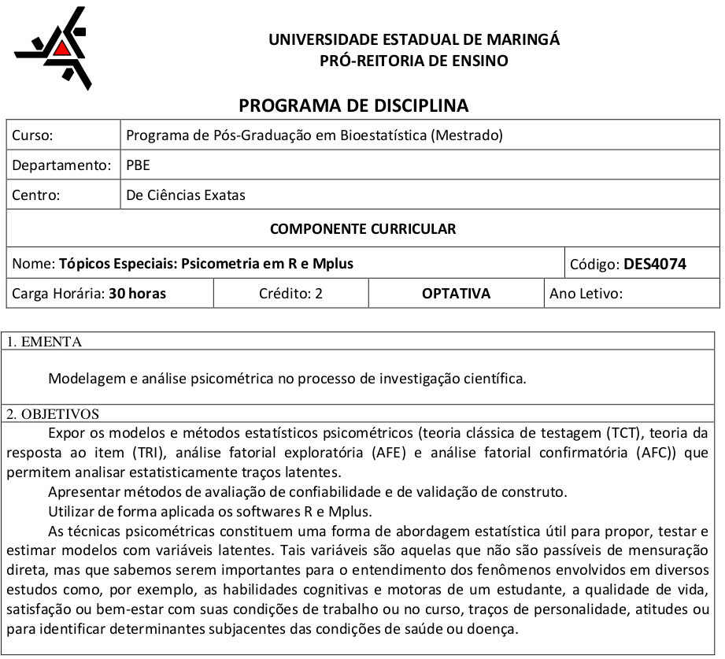
```

```{r out.width = '70%', echo=FALSE}
#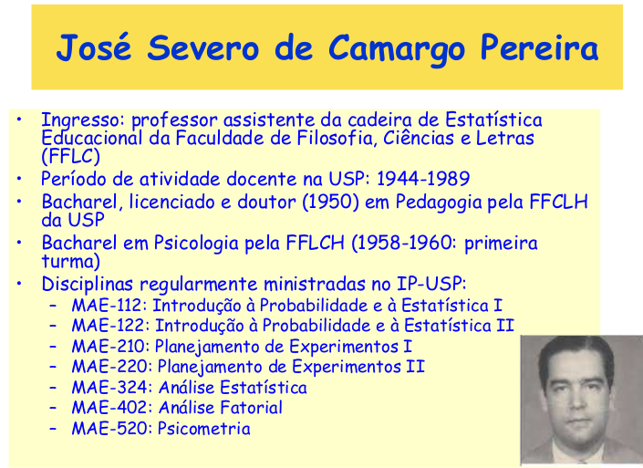
```

```{r out.width = '60%', echo=FALSE}
#
#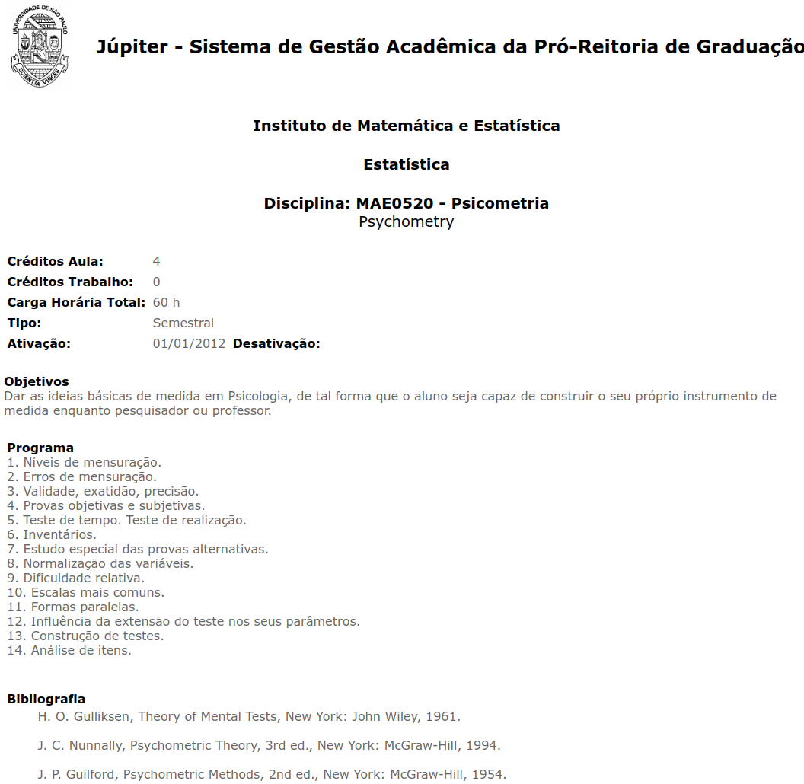
```

# Tipo de variável

```{r out.width = '50%', echo=FALSE}
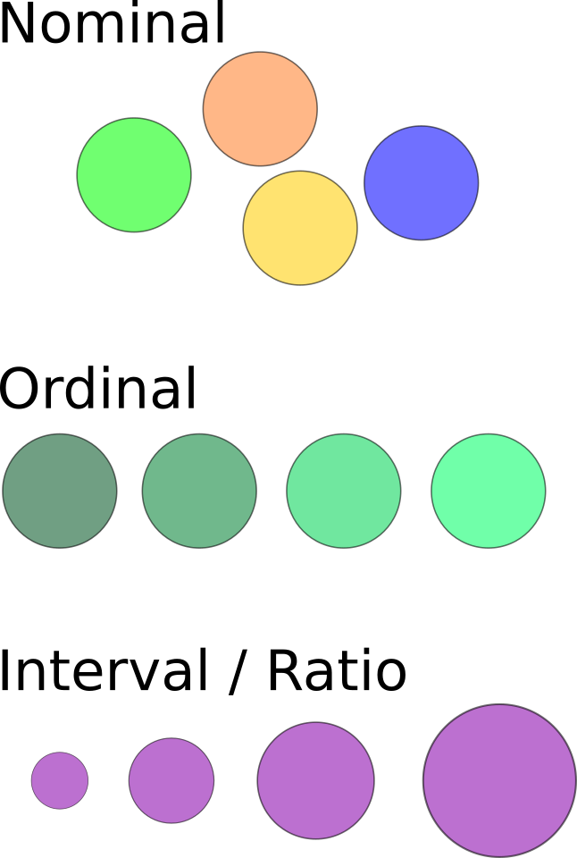
```

## - resposta dicotômica

```{r out.width = '40%', echo=FALSE}
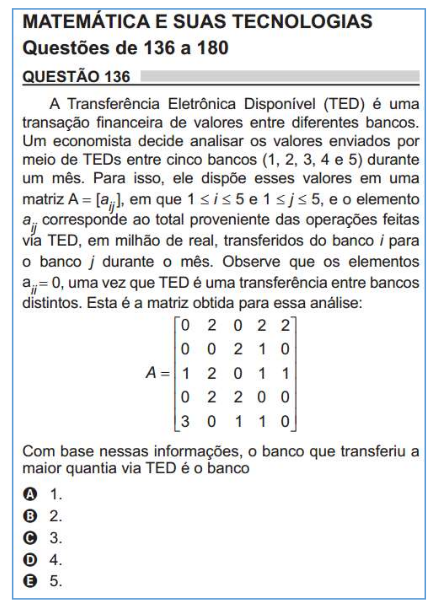
```

```{r out.width = '80%', echo=FALSE}
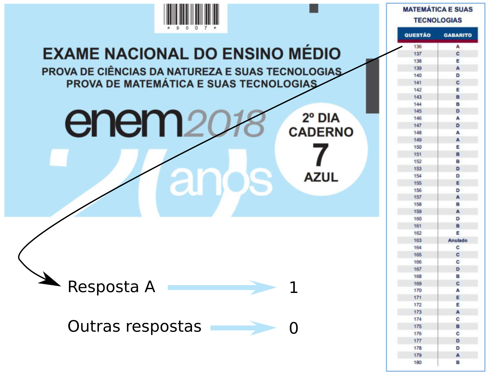
```

## - resposta politômica

```{r out.width = '40%', echo=FALSE}
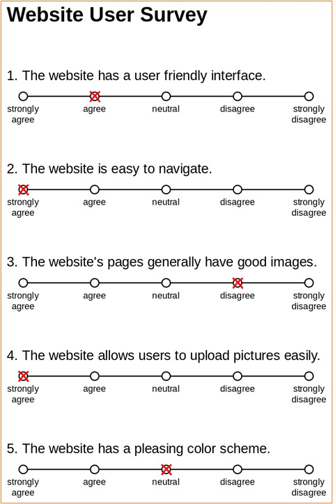
```

> [Likert scale: Wikipedia](http://en.wikipedia.org/wiki/Likert_scale){target="_blank"}

```{r out.width = '90%', echo=FALSE}

```

> [WHOQOL](https://www.who.int/tools/whoqol){target="_blank"}

"A OMS organizou um projeto colaborativo multicêntrico com o objetivo de desenvolver um instrumento internacional que avaliasse qualidade de vida como um construto subjetivo, multidimensional e composto tanto por dimensões positivas (mobilidade, autoestima) como negativas (dor, fadiga). Este projeto foi realizado simultaneamente em 15 centros de diferentes continentes e o resultado foi a elaboração do WHOQOL-100, um questionário com 100 itens e sua versão abreviada, o WHOQOL-BREF com 26 itens."

<div align=right><small>
Projeto VERAS (2011) Vida do Estudante e Residente na Área da Saúde.<br>
Enns et al. (2016)<br>
Tempski et al. (2016)<br>
Paro et al. (2016)
</small></div>

O questionário em português do Brasil está [disponível aqui](https://www.who.int/tools/whoqol/whoqol-bref/docs/default-source/publishing-policies/whoqol-bref/portuguese-brazil-whoqol-bref){target="_blank"}.

Alguns exemplos de questões do WHOQOL-BREF:

```{r out.width = '90%', echo=FALSE}
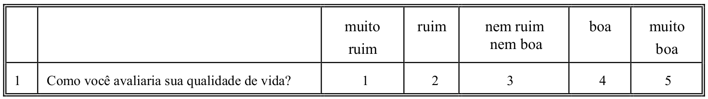
```

...

```{r out.width = '90%', echo=FALSE}
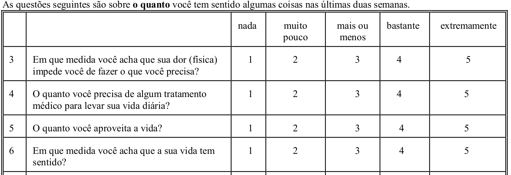
```

...

```{r out.width = '90%', echo=FALSE}
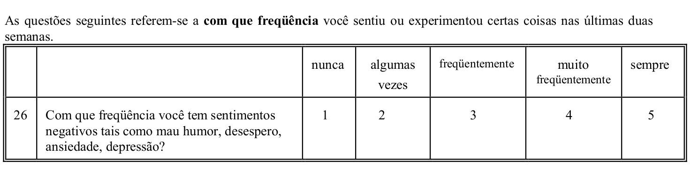
```

As questões são agrupadas em domínios:

```{r out.width = '90%', echo=FALSE}
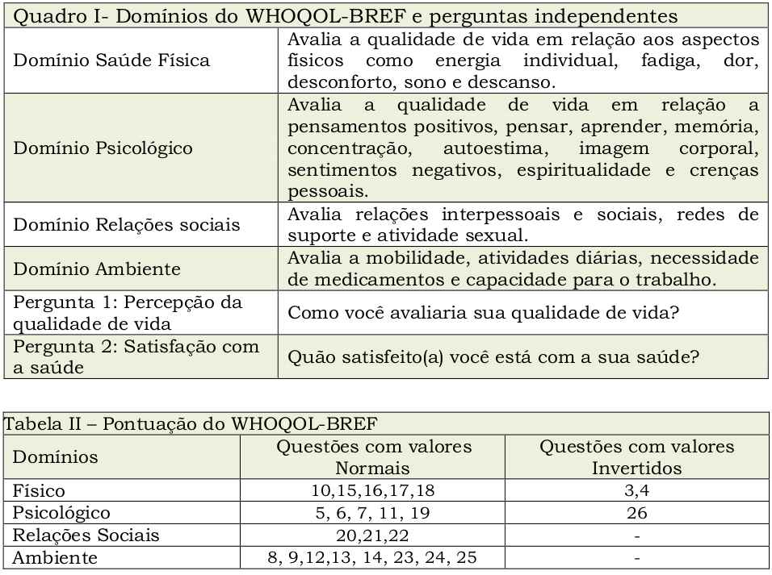
```

> Manual do Projeto VERAS (2011)

As questões 3, 4 e 26 são consideradas as únicas que perguntam com valência negativa, e a WHO as inverte (tornando as respostas de 1 a 5 em valores 5 a 1) para colocá-las no mesmo sentido das demais.

A WHO sugere a forma de computar os escores de cada respondente nos domínios, através da somatória das respostas dos itens Likert (de 1 a 5, após inverter os valores das questões 3, 4 e 26), utilizando-os como intervalares embora sejam claramente variáveis ordinais (multiplicados por 4 para serem próximos aos valores da versão plena do WHOQOL com 100 questões, além de procedimentos para transformar em porcentagem devido ao tamanho desigual dos domínios).

```{r out.width = '90%', echo=FALSE}
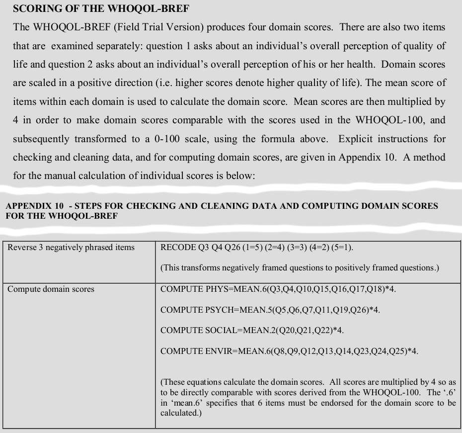
```

> [Manual do WHOQOL (Apêndice 10, p. 106)](https://apps.who.int/iris/rest/bitstreams/110129/retrieve){target="_blank"}

Note que as questões 1 e 2 não são incluídas nos domínios porque são consideradas questões sobre a percepção geral do indivíduo, respectivamente sobre sua qualidade de vida e saúde. Portanto, para podermos comparar a proposta da WHOQOL com a análise feita adiante, também as excluiremos.

Para referência, aqui estão todas as perguntas do WHOQOL-BREF:

<pre>
1. Como você avaliaria sua qualidade de vida? 
2. Quão satisfeito(a) você está com a sua saúde?

	As questões seguintes são sobre o quanto você tem sentido algumas coisas nas últimas duas semanas.
	
3. Em que medida você acha que sua dor (física) impede você de fazer o que você precisa?
4. O quanto você precisa de algum tratamento médico para levar sua vida diária?
5. O quanto você aproveita a vida?
6. Em que medida você acha que a sua vida tem sentido?
7. O quanto você consegue se concentrar?
8. Quão seguro(a) você se sente em sua vida diária?
9. Quão saudável é o seu ambiente físico (clima, barulho, poluição, atrativos)?

	As questões seguintes perguntam sobre quão completamente você tem sentido ou é capaz de fazer certas coisas nestas últimas duas semanas.
	
10. Você tem energia suficiente para seu dia-a-dia?
11. Você é capaz de aceitar sua aparência física?
12. Você tem dinheiro suficiente para satisfazer suas necessidades?
13. Quão disponíveis para você estão as informações que precisa no seu dia-a-dia?
14. Em que medida você tem oportunidades de atividade de lazer?

	As questões seguintes perguntam sobre quão bem ou satisfeito você se sentiu a respeito de vários aspectos de sua vida nas últimas duas semanas. 
	
15. Quão bem você é capaz de se locomover?
16. Quão satisfeito(a) você está com o seu sono? 
17. Quão satisfeito(a) você está com sua capacidade de desempenhar as atividades do seu dia-a-dia?
18. Quão satisfeito(a) você está com sua capacidade para o trabalho?
19. Quão satisfeito(a) você está consigo mesmo?
20. Quão satisfeito(a) você está com suas relações pessoais (amigos, parentes, conhecidos, colegas)?
21. Quão satisfeito(a) você está com sua vida sexual?
22. Quão satisfeito(a) você está com o apoio que você recebe de seus amigos?
23. Quão satisfeito(a) você está com as condições do local onde mora?
24. Quão satisfeito(a) você está com o seu acesso aos serviços de saúde?
25. Quão satisfeito(a) você está com o seu meio de transporte?

	As questões seguintes referem-se a com que freqüência você sentiu ou experimentou certas coisas nas últimas duas semanas. 
	
26. Com que freqüência você tem sentimentos negativos tais como mau humor, desespero, ansiedade, depressão?

	Sobre o preenchimento do questionário:
	
ext-1. (Alguém lhe ajudou a preencher este questionário? 
ext-2. (Quanto tempo você levou para preencher este questionário?
</pre>

## item Likert e escala Likert

```{r out.width = '80%', echo=FALSE}

```

Item Likert é muito usado em testes / escalas / questionários / inventários / baterias.  As distâncias entre as categorias do item Likert não são necessariamente iguais/ equidistantes: são variáveis ordinais.

Quando somamos itens Likert (ordinais) obtemos uma escala somatória Likert (intervalar):

"Likert scales [o autor refere-se a individual Likert items] fall within the ordinal level of measurement."

> Jamieson (2004)

"...Likert scales (collections of items [o autor refere-se a individual Likert items]) as opposed to individual Likert items are not ordinal in character, but rather are interval in nature..."

> Carifio & Perla (2008)

Itens Likert devem ser diferenciados de itens de diferencial semântico:

```{r out.width = '100%', echo=FALSE}
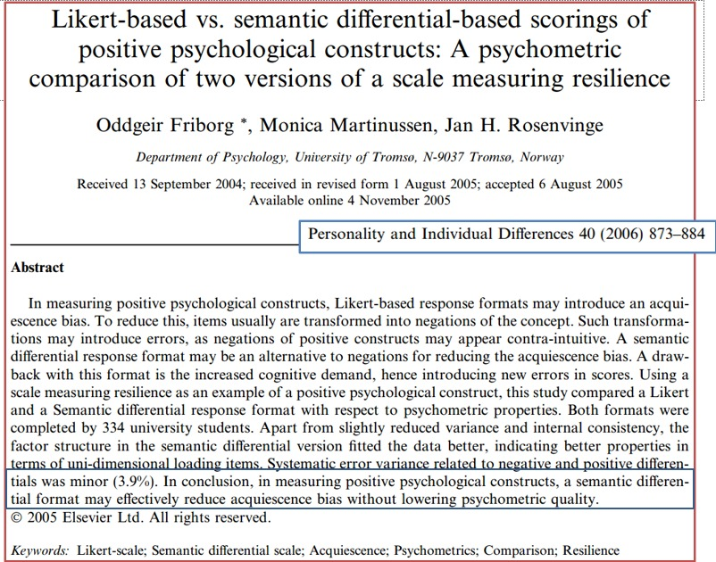
```

```{r out.width = '100%', echo=FALSE}
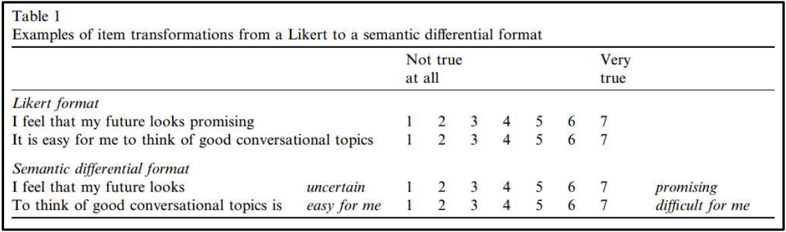
```

> Friborg et al. (2006)

# Medidas de correlação

```{r out.width = '90%', echo=FALSE}
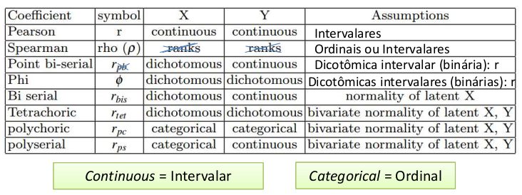
```

> [Personality Project, Revelle](http://www.personality-project.org/dev/r/book/){target="_blank"}

* Dicotômica e intervalar
    * Correlação ponto-bisserial
        * Correlação de Pearson (r) para uma variável dicotômica discreta e outra intervalar (e.g.: ter ou não animal de estimação e tempo que passa fora de casa)
    * Correlação bisserial
        * Uma dicotômica com normal subjacente e outra intervalar (e.g.: gostar ou não de animal de estimação e tempo que passa fora de casa)  
* Ambas dicotômicas
    * Correlação tetracórica: dicotômicas com binormal subjacente
(e.g.: gostar ou não de musica erudita e ser de direita ou de esquerda)
    * Correlação de Pearson ou coeficiente phi (φ): dicotômicas discretas (e.g.: passear com ou sem cão e ser ou não paulistano) (veja [Phi coefficient (Wikipedia)](https://en.wikipedia.org/wiki/Phi_coefficient){target="_blank"})

Um texto didático sobre as medidas de correlação está em Howell (2013) no capítulo 10. Muito do texto de Dancey & Reidy (2019) foi baseado neste livro. 

# Correlações de Pearson, policórica e poliserial

Em R, podemos usar <code>polycor::hetcor()</code> para obter correlações Pearson, policórica e poliserial. 

## Exemplo: Escala de Felicidade

Usaremos o arquivo de [`Felicidade.rds`](Felicidade.xlsx){target="_blank"}, considerando todas as variáveis como intervalares, implementado em [`demo_Correlacao.R`](demo_Correlacao.R){target="_blank"}:

```{r}
Dados <- data.frame(readxl::read_excel("Felicidade.xlsx"))
Dados[,] <- lapply(Dados[,],as.numeric)
saveRDS(Dados, "Felicidade.rds")
```

```{r echo=FALSE}
cat(readLines("demo_Correlacao.R"), sep = '\n')
```

```{r echo=FALSE}
options(width = 260)
source("demo_Correlacao.R")
options(width = 80)
```

Os tipos de alguns itens podem ser alterados, para demonstração. Em [`demo_Correlacao_NomOrd.R`](demo_Correlacao_NomOrd.R){target="_blank"} alteramos os itens Q1 e Q2 para serem nominais e Q3 e Q4 para serem ordinais.

```{r eval=FALSE}
Dados$Q1 <- as.factor(Dados$Q1) # nominal
Dados$Q2 <- as.factor(Dados$Q2) # nominal
Dados$Q3 <- as.ordered(Dados$Q3) # ordinal
Dados$Q4 <- as.ordered(Dados$Q4) # ordinal
```

Ao executar o código, observe que a matriz de correlações muda ([`demo_Correlacao_NomOrd.R`](demo_Correlacao_NomOrd.R){target="_blank"}):

```{r echo=FALSE}
cat(readLines("demo_Correlacao_NomOrd.R"), sep = '\n')
```

```{r echo=FALSE}
source("demo_Correlacao_NomOrd.R")
```

```{r fig.align="left", out.width = '8%', echo=FALSE}
knitr::include_graphics("./image/coruja.png")
```

<table style="border:1; background-color:#CAE0AB"><tr><td>
Usamos a função <code>print(sapply(Dados,class))</code> para conferir o tipo adotado pelas variáveis.
</td></tr></table>

<br>

Finalmente, em [`demo_Correlacao_Dicotomica.R`](demo_Correlacao_Dicotomica.R){target="_blank"}, dicotomizamos vários itens (Q3 em diante) com métodos variados, obtendo:

```{r echo=FALSE}
cat(readLines("demo_Correlacao_Dicotomica.R"), sep = '\n')
```

```{r echo=FALSE}
source("demo_Correlacao_Dicotomica.R")
```

Pode ser difícil visualizar as matrizes de correlação, especialmente quando há maior número de itens. A função <code>GGally::ggcorr</code> pode ajudar.

## Exemplo: WHOQOL

No exemplo do WHOQOL, os dados dos estudos do VERAS estão disponíveis em:

```{r}
Dados <- data.frame(readxl::read_excel("WHOQOL.xlsx"))
Dados[,] <- lapply(Dados[,],as.numeric)
saveRDS(Dados, "WHOQOL.rds")
```

A análise de correlação está implementada em [`demo_ggcorr_WHOQOL.R`](demo_ggcorr_WHOQOL.R){target="_blank"}, tratando os itens como intervalares:

```{r echo=FALSE}
cat(readLines("demo_ggcorr_WHOQOL.R"), sep = '\n')
```

```{r echo=FALSE}
source("demo_ggcorr_WHOQOL.R")
```

O mesmo, forçando os itens serem tratados como variáveis ordinais está implementado em 
[`demo_ggcorr_WHOQOL_ord.R`](demo_ggcorr_WHOQOL_ord.R){target="_blank"}:

```{r echo=FALSE}
cat(readLines("demo_ggcorr_WHOQOL_ord.R"), sep = '\n')
```

```{r echo=FALSE}
source("demo_ggcorr_WHOQOL_ord.R")
```

Recorde a proposta para o WHOQOL:

```{r out.width = '90%', echo=FALSE}
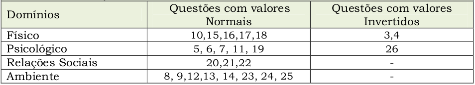
```

> Manual do Projeto VERAS (2011)

Deste mesmo pacote existem funções que procuram agrupar os itens. Por exemplo, [`demo_ggcorr_WHOQOL_qgraph.R`](demo_ggcorr_WHOQOL_qgraph.R){target="_blank"}, utilizando dois métodos diferentes (veja <code>graph="glasso"</code> e <code>graph="cor"</code> no código):

```{r echo=FALSE}
cat(readLines("demo_ggcorr_WHOQOL_qgraph.R"), sep = '\n')
```

```{r echo=FALSE}
source("demo_ggcorr_WHOQOL_qgraph.R")
```

Aqui, pela primeira vez, aparece uma tentativa de agrupamento das questões. 
Recorde a proposta para o WHOQOL:

```{r out.width = '90%', echo=FALSE}

```

> Manual do Projeto VERAS (2011)

No primeiro gráfico, com o método "glasso", notamos alguma proximidade entre questões propostas para o mesmo domínio, mas nem sempre. Quando mais grossas são as linhas e mais aproximadas as questões, maior a ligação. 

As três questões negativas, Q3 e Q4 (ambas tidas como do domínio físico do WHOQOL, F) e Q26 (psicológico, P) estão próximas, mas a ligação entre Q3 e Q4 é mais forte. 

As questões do domínio de ligações sociais (S), Q20, Q21 e Q22, aparecem nesta (e em várias análise abaixo) próximas entre si. Q20 é a mais próxima de Q5 do domínio psicológico. São elas:

* (S) 20. Quão satisfeito(a) você está com suas relações pessoais (amigos, parentes, conhecidos, colegas)?
* (P) 5. O quanto você aproveita a vida?

Q22 liga-se a Q23 e Q24 (ambiente, A) e, mais fracamente, com Q8 (A) e Q19 (P), mas têm similaridade, aparentemente relacionadas a condições de apoio e infraestrutura:

* (S) 22. Quão satisfeito(a) você está com o apoio que você recebe de seus amigos?
* (A) 23. Quão satisfeito(a) você está com as condições do local onde mora?
* (A) 24. Quão satisfeito(a) você está com o seu acesso aos serviços de saúde?
* (A) 8. Quão seguro(a) você se sente em sua vida diária?
* (P) 19. Quão satisfeito(a) você está consigo mesmo?

Q21 liga-se principalmente a Q11 (psicológico), ambas obviamente conectadas aos relacionamentos sexuais:

* (S) 21. Quão satisfeito(a) você está com sua vida sexual?
* (P) 11. Você é capaz de aceitar sua aparência física?

O conjunto Q25, Q23, Q24, Q9, Q12 e Q13 são do domínio ambiente, mas a Q15 (do domínio físico), aparece fortemene conectada a Q25. Curiosamente, são ambas ligadas a deslocamento:

* (F) 15. Quão bem você é capaz de se locomover?
* (A) 25. Quão satisfeito(a) você está com o seu meio de transporte?

Outra ligação forte aparece entre Q5 (psicológico) e Q14 (ambiente). Seus conteúdos são ligados ao lazer:

* (P) 5. O quanto você aproveita a vida?
* (A) 14. Em que medida você tem oportunidades de atividade de lazer?

Q5 (psicológico) está na ponta do outro conjunto envolvendo Q6, Q19 e Q7 (também do domínio psicológico), Q17, Q18 (físico, fortemente ligadas), Q10 e Q16 (também do físico) e Q8 (ambiente). O ambiente físico, neste agrupamento, está todo representado com a exceção da Q15 que aproximou-se da Q25 por tratar de deslocamento e das negativas Q3 e Q4. Observe seus conteúdos na ordem de proximidade:

* (P) 5. O quanto você aproveita a vida?
* (P) 6. Em que medida você acha que a sua vida tem sentido?
* (P) 19. Quão satisfeito(a) você está consigo mesmo?
* (A) 8. Quão seguro(a) você se sente em sua vida diária?
* (F) 17. Quão satisfeito(a) você está com sua capacidade de desempenhar as atividades do seu dia-a-dia?
* (F) 18. Quão satisfeito(a) você está com sua capacidade para o trabalho?
* (F) 16. Quão satisfeito(a) você está com o seu sono? 
* (F) 10. Você tem energia suficiente para seu dia-a-dia?
* (P) 7. O quanto você consegue se concentrar?

Há uma clara ordenação na sequência, iniciando com o aproveitamento da vida e seguindo para satisfação, segurança, atividades diárias, descanso e recuperação. Parece muito com a ideia de "felicidade intrínseca" do outro exemplo: são questões relacionadas com percepções que dependem da própria pessoa.

É supreendente que a análise dependa apenas da matriz de correlações, sem nenhuma análise do conteúdo das perguntas. Ainda assim, agrupa itens que de assuntos similares.

As discordâncias e similaridades entre esta análise e a proposta original da WHO ocorrerá em várias análises adiante. O leitor é convidado a observar os resultados, sob esta óptica, quaisquer que sejam as análises adotadas.

Uma outra análise descritiva interessante está implementada em 
 [`demo_likert_WHOQOL.R`](demo_likert_WHOQOL.R){target="_blank"} comportaram-se da seguinte forma:
 
```{r echo=FALSE}
cat(readLines("demo_likert_WHOQOL.R"), sep = '\n')
```
 
```{r echo=FALSE}
options(width=300)
source("demo_likert_WHOQOL.R")
options(width=80)
```

A função preparatória <code>likert::likert</code> precisa de dados ordinais e que todos os itens tenham o mesmo número de níveis observados. Note que os itens foram apresentados em outra ordem, pois esta função tenta agrupá-las de acordo com suas correlações, mas a ordem que sugere também não coincide completamente (como sempre) com aquela proposta pela Organização Mundial da Saúde para o WHOQOL.

Recorde a proposta para o WHOQOL:

```{r out.width = '90%', echo=FALSE}

```

> Manual do Projeto VERAS (2011)

Finalmente, um dendrograma (propondo ainda outra combinação de questões) pode ser feito com a função <code>pvclust::pvclust</code> implementada em [`demo_pvclust_WHOQOL.R`](demo_pvclust_WHOQOL.R){target="_blank"}:

```{r echo=FALSE}
cat(readLines("demo_pvclust_WHOQOL.R"), sep = '\n')
```

```{r echo=FALSE}
source("demo_pvclust_WHOQOL.R")
```

Recorde a proposta para o WHOQOL:

```{r out.width = '90%', echo=FALSE}

```

Manual do Projeto VERAS (2011)

# Análise Fatorial Exploratória (EFA)

## Padrão de correlações

Este capítulo é uma continuação de Análise de Correlação. Naquele capítulo analisamos as correlações de Pearson apenas de duas variáveis intervalares com e sem variáveis intervalares de controle. Aqui analisaremos matrizes de correlações ou de covariâncias entre diversos pares de variáveis simultaneamente. Uma forma para reconhecer padrões nestas matrizes é por inspeção visual. No entanto, à medida que o número de variáveis aumenta, a inspeção visual é impraticável. 

A análise fatorial foi inicialmente utilizada para estudar a estrutura da mente e inteligência (1904), e mais tarde da personalidade. Lida com padrões de correlações das variáveis manifestas (itens) da escala de avaliação, de forma que itens mais correlacionados entre si e menos correlacionados com outros itens da escala formam um fator comum.

O objetivo é desenvolver algoritmos que nos auxiliem a reconhecer padrões presentes nas matrizes. Tais padrões são variáveis latentes, que chamaremos de **fatores comuns** (não confundir com outros fatores ou com variáveis do tipo <code>factor</code>). O primeiro passo é encontrar quantos são os fatores comuns subjacentes à configuração adotada pelas matrizes. 

Esta análise fatorial tem duas partes:

* Análise exploratória de fatores comuns (EFA, _exploratory factor analysis_)
* Análise confirmatória de fatores comuns (CFA, _confirmatory factor analysis_)

Dancey & Reidy (2019) apresentam o seguinte exemplo no item 6.3: 

```{r out.width = '80%', echo=FALSE}
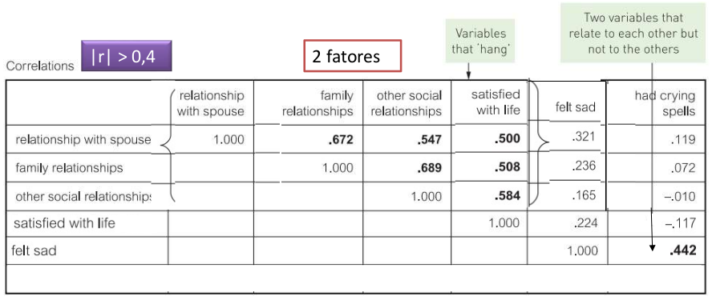
```

> Dancey & Reidy (2019)

Por inspeção visual detecta-se dois fatores comuns (correlações em negrito). Depois que os fatores são encontrados, podemos atribuir nomes significativos para eles, tais como "relações humanas" e "tristeza" neste exemplo.

## Classificação do modelo

Veremos, adiante, que é crítico para a análise fatorial construir a matriz de correlações adequada, o que é feito pela função <code>polycor::hetcor()</code> exemplificada anteriormente, que tem algorítmos robustos para escolher o tipo de correlação e sua computação. 
Fator comum é variável latente, não observável. Por exemplo:

```{r out.width = '80%', echo=FALSE}
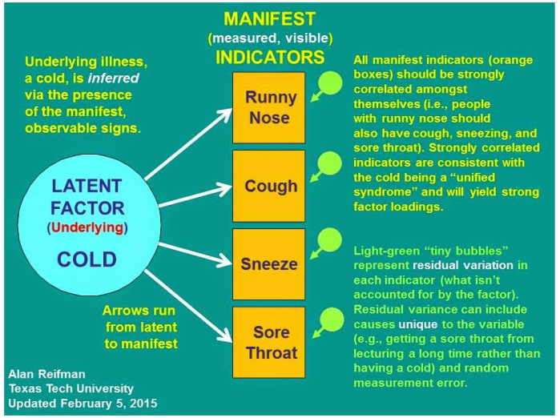
```

As variáveis observáveis ou manifestas (aquelas que estão em seus dados) são _runny nose_ (coriza), _cough_ (tosse), _sneeze_ (espirro), _sore throat_ (dor de garganta). O fator comum é _cold_ (resfriado), variável latente que é a causa destes sintomas. 

Como o resfriado (fator comum) é tido como “causa” dos sintomas (itens), este modelo é chamado de **reflexivo**.

## variáveis do modelo: sinonímias

### - variável manifesta ($\tau$)

* Variável mensurável diretamente
* Variável aleatória observável
* Variável observável
* Indicador
* Sintoma
* Sinal
* Item

### - variável latente ($\theta$)

* Variável mensurável indiretamente
* Variável aleatória não observável
* Variável não observável
* Variável hipotética
* Variável oculta
* Traço latente
* Fator comum
* Fator-fonte
* Habilidade
* Construto
* Dimensão
* Aptidão
* Domínio
* Fator

```{r out.width = '60%', echo=FALSE}
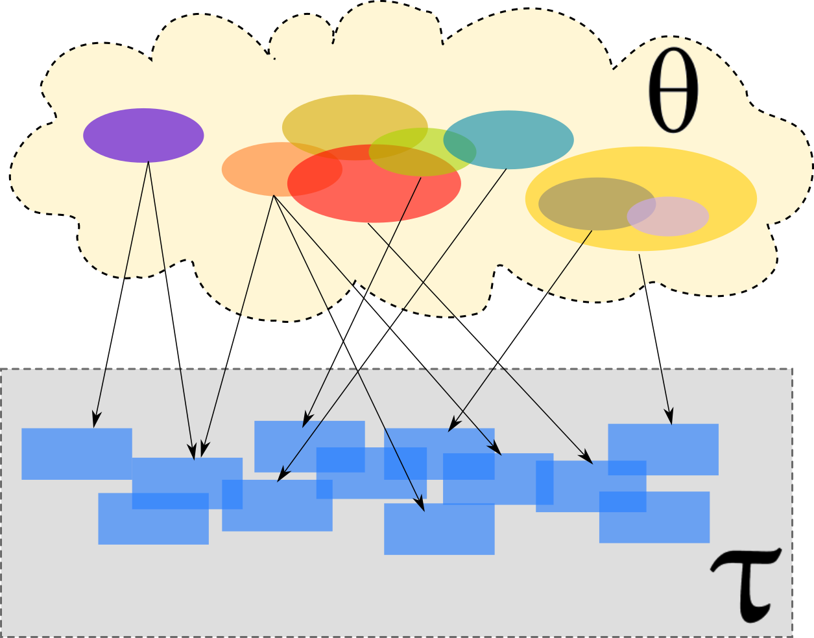
```

Exemplos de traços latentes:

<table><tr><td>
* Inteligência
* Bem-estar
* Felicidade
* Satisfação
* Autocontrole
* Depressão
* Esgotamento (_burnout_)
* Proficiência em matemática
* Tamanho total do animal</td>
<td>

```{r out.width = '90%', echo=FALSE}

```

</td></tr></table>

Qualquer fenômeno não diretamente observável ou conceito para o qual não há método operacional para mensuração direta.

**O que é tamanho do pássaro?**

```{r out.width = '40%', echo=FALSE}
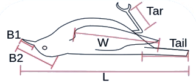
```

<br>

```{r out.width = '90%', echo=FALSE}
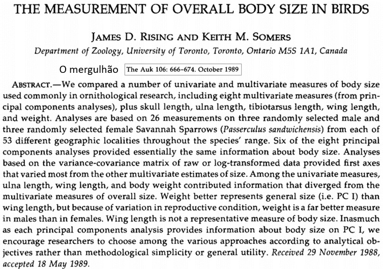
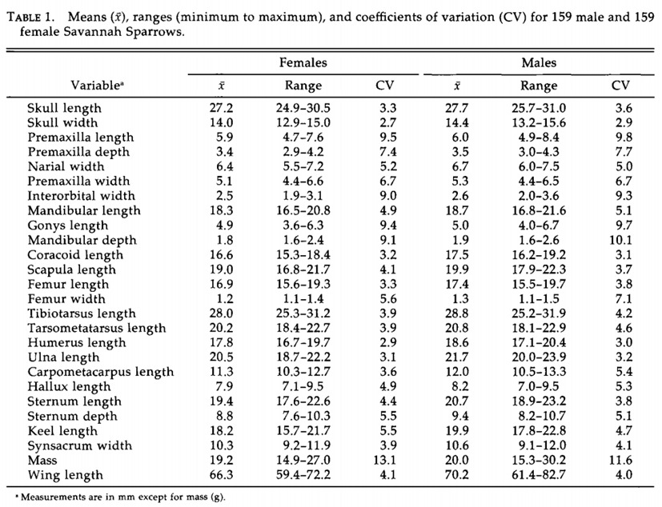
```

**O que é quilograma?**

“A constante de Planck ($6.62607004 \cdot 10^{-34} m^2kg/s$) deve substituir o cilindro metálico usado desde 1889 como referência internacional do quilograma.”

“O quilograma é a última das sete principais unidades internacionais de medida ainda aferida com base em um objeto –´ a mensuração das outras já é feita há anos por meio de constantes universais da Física.
Com a alteração, que pode valer a partir de 2018, a aferição deve ser tornar mais confiável, o que tem importância óbvia para Física – o quilograma entra na definição de outras 20 unidades de medida – e para o comércio internacional.”

“O primeiro desses métodos consiste em definir o valor da constante de Planck a partir da contagem dos átomos de uma esfera de silício puro com massa de 1 quilograma. A contagem dos átomos dessa esfera permite calcular o valor da constante de Avogadro, que indica o número de partículas em uma determinada massa, e, posteriormente, chegar ao valor da constante de Planck. Contando os átomos dessas esferas especiais – há apenas duas no mundo, cuidadosamente produzidas a um custo de US$ 3,2 milhões cada –, os pesquisadores do Projeto Internacional Avogadro já conseguiram medir o valor da constante de Avogadro, e consequentemente da de Planck, com uma imprecisão de 30 partes por bilhão.”

> [Revista FAPESP: Definição de massa](https://revistapesquisa.fapesp.br/para-manter-o-peso/){target="_blank"}

**O que é saúde?**

"Health is a state of complete physical, mental and social well-being and not merely the absence of disease or infirmity."

> [WHO: Definição de saúde](https://www.who.int/about/who-we-are/constitution){target="_blank"}

Então o que é uma doença? Não encontramos definição da OMS, mas existe uma extensa classificação, o CID-11 (https://www.who.int/standards/classifications/classification-of-diseases).

```{r out.width = '50%', echo=FALSE}
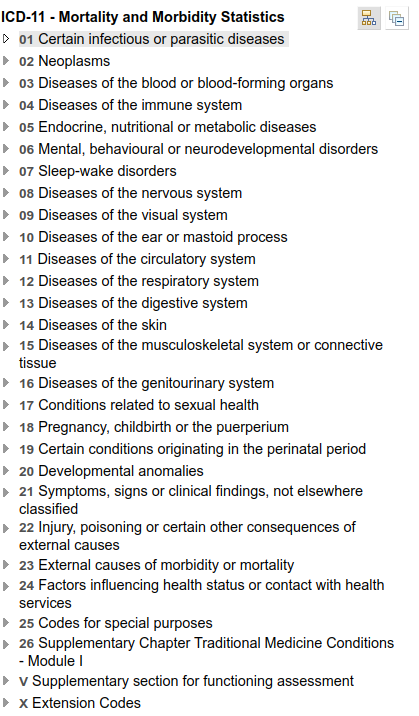
```

"A Organização Mundial de Saúde (OMS) define saúde não apenas como a ausência de doença, mas como a situação de perfeito bem-estar físico, mental e social. Essa definição, até avançada para a época em que foi realizada, é, no momento, irreal, ultrapassada e unilateral."

> Segre & Ferraz (1997)

## Objetivo da análise fatorial

O objetivo da análise fatorial é expressar um
grande número de variáveis observadas em termos de um
número mínimo de fatores comuns.

A análise fatorial é uma técnica estatística
multivariada descritiva exploratória (EFA) e confirmatória (CFA) para obtenção de fatores comuns e para validação de construto de escala de avaliação. 

Aconselha-se o uso da matriz de correlações dos itens da escala quando executar a análise fatorial exploratória, pois trabalhar com matriz de correlações equivale a padronizar os itens. É aconselhável o uso da matriz de covariância quando executar a análise fatorial confirmatória.

Os itens são as variáveis manifestas, que podem ser nominais dicotômicos ou politômicos, ordinais ou intervalares. As variáveis latentes ou fatores comuns são variáveis não observáveis e intervalares.

As observações são independentes num arquivo no formato _wide_ (cada unidade observacional em uma linha com o valor obtido em cada um dos itens). Para a análise ser possível, a matriz de correlação obtida a partir dos itens deve ser não-homogênea. 

A matriz de covariância computa com os indicadores não-padronizados (variâncias não-homogeneizadas). Se os indicadores não são medidos com as mesmas unidades de medida ou não são comparáveis, utilizar a matriz de correlações (variâncias homogeneizadas) irá padronizá-los de forma a torná-los comparáveis.

## Áreas de aplicação

```{r out.width = '70%', echo=FALSE}
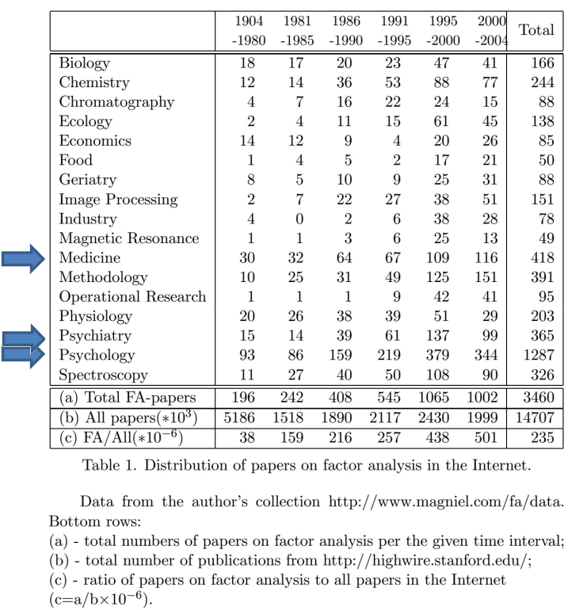
```

> Kaplunovsky (2004): http://www.magniel.com/fa/data

## Depressão

```{r out.width = '30%', echo=FALSE}
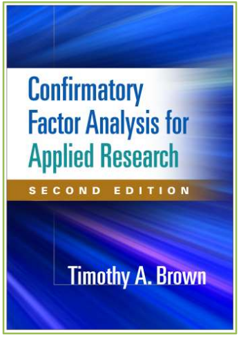
```

> Brown (2015): http://sites.bu.edu/tabrown/cfabook/;   
http://www.amarkos.gr/cfa-lavaan/


No capítulo 2 de Brown (2015, The common factor model and exploratory factor analysis) há um exemplo em que **apenas a matriz de correlação de Pearson foi fornecida**, mas isto é o suficiente para fazer a análise fatorial exploratória. 

Esta matriz de correlação foi obtida a partir de um questionário com 4 itens Likert aplicado a 300 indivíduos internados em uma ala psiquiátrica para avaliar depressão. 

```{r out.width = '80%', echo=FALSE}
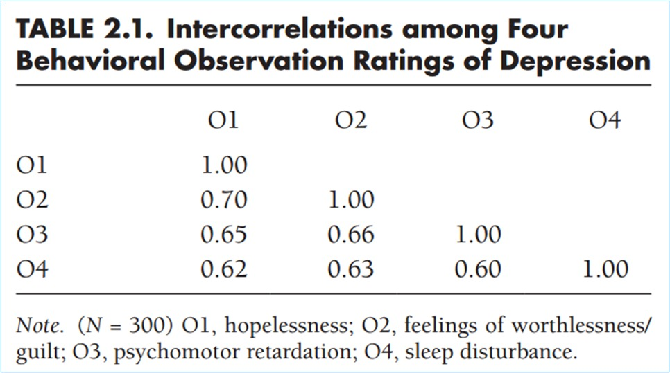
```

Os dados estão em [`Depressao.xlsx`](Depressao.xlsx){target="_blank"}, lidos a partir de <code>readxl::read_excel()</code> como um _data frame_ e convertidos em matriz para serem usados na análise. Os itens são denominados "O1", "O2", "O3" e "O4". 

Note que esta matriz de correlação é quadrada, simétrica, com valores iguais a 1 na diagonal principal. A correlação de uma variável consigo própria é unitária, a qual também é igual aos desvios-padrão e variâncias dos itens padronizados. A **variância total dos dados** é o traço da matriz (a soma desta diagonal principal) que, neste caso, coincide com o número de itens.

Implementamos em [`demo_Depressao.R`](demo_Depressao.R){target="_blank"}, cuja saída completa (discutida adiante) é:

```{r echo=FALSE}
cat(readLines("demo_Depressao.R"), sep = '\n')
```

```{r echo=FALSE}
source("demo_Depressao.R")
```

### Valor singular

A variância total pode ser particionada por meio da função <code>svd()</code> em autovalores (_eigenvalues_) robustos, chamados de valores singulares. Sua utilidade é sugerir o número de fatores comuns subjacentes aos itens. 

Os valores singulares são uma medida da relação entre o número de fatores comuns e parcela da variância total explicada por eles. Dado que cada item tem variância padronizada unitária, esperamos que a inclusão de mais um fator contribua para o modelo se ele vier a adicionar mais do que um item poderia explicar isoladamente. Assim, sugere-se selecionar quanto valores singulares estão acima de 1, o que nos sugere quantos fatores comuns esta análise sugere. Neste exemplo, com apenas um fator comum, capturamos 2.93 da variância total de 4 (cerca de 73.3%).

Esta heur&iacute;stica &eacute; pr&oacute;pria. 
  
Os valores singulares são variâncias explicadas pelas componentes. A relação entre a primeira e a segunda componentes parecem prenunciar qual tipo de modelo deverá ser a melhor representação para os dados observados.
  
Assim, a heurística é dada por
$$H = {{sv_1}\over{sv_2}}$$
em que $sv_1$ e $sv_2$ s&atilde;o os dois maiores valores singulares.

Para:

* $H > 3$: modelo unifatorial,
* 2 < $H \le 3$: modelo hierárquico (segunda ordem ou bifatorial),
* $H \le 2$: modelo de primeira ordem.
  
A lógica desta heurística é que \( H > 3 \) indica que a primeira componente captura muito mais do que a próxima (e portanto todas as outras) componentes, de forma que possivelmente um modelo com um único fator será suficiente. No extremo oposto, quando \( H \le 2 \), há equilíbrio entre as componentes e, então, vários fatores trabalhando conjuntamente podem ser necessários para compor um bom modelo. Na situação intermediária temos um modelo bifatorial, um modelo que tem um fator geral e fatores secundários.

```{r echo=FALSE}
cat("sv1 = ",round(sv1maior,2),"\n",sep="")
cat("sv2 = ",round(sv2maior,2),"\n",sep="")
cat("H = ",round(H,2),"\n",sep="")
if (H <= 2) {txt <- "\tpossible first order model, sv1/sv2 <= 2"}
if (H > 2 & H <= 3) {txt <- "\tpossible bifactor model, 2 < sv1/sv2 <= 3"}
if (H > 3) {txt <- "\tpossible unifactor model, sv1/sv2 > 3"}
```

Nesta heurística são mencionados três tipos de modelo: de primeira ordem (_first order_), bifatorial (_bifactor_) e unifatorial (_unifactor_):

```{r out.width = '80%', echo=FALSE}
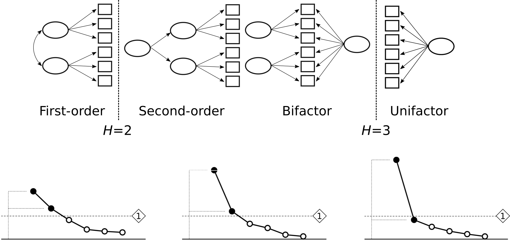
```

Neste exemplo, a heurística do modelo resultou em `r round(H,2)`, sugerindo que um modelo com um único fator pode ser adequado.

### Índice de condição

O determinante da matriz de correlações é o produtório dos valores singulares, um valor positivo porque esperamos que todos os valores singulares calculados de forma robusta sejam positivos, correspondendo a uma variabilidade generalizada, resumindo toda a informação da matriz de correlações dos itens par-a-par com um único número.

Os cálculos psicométricos precisam do inverso do determinante da matriz de correlações. No entanto, se algum dos valores singulares for muito menor do que o maior, o valor do determinante ficará muito próximo a zero e seu inverso muito grande e a solução pode apresentar instabilidade numérica.

O índice de condição é:  

$$\text{CI} = {\sqrt{ {\max(sv)} \over {\min(sv)} }}$$   (a raiz quadrada do maior valor singular sobre o menor valor singular).
  
Caso este índice seja maior que 30, prenuncia-se a instabilidade numérica.

No exemplo da Depressão obtivemos índice igual a 3.1 e podemos prosseguir a análise. 

### número sugerido de fatores comuns

A análise exploratória inicia com estimativas do número adequado de fatores que os dados sugerem. Aqui escolhemos duas funções do pacote <code>psych</code>, desenvolvido por William Revelle. A primeira é a análise paralela feita com <code>psych::fa.parallel()</code>. Neste exemplo, coerentemente com o que vimos anterioremente, sugere-se um fator comum (_number of factors_).

<!--
A segunda é o que Revelle chama de _very simple structure analysis_, executada com <code>psych::VSS()</code>. Esta saída também sugere um fator comum por meio dos indicadores map e BIC mínimos.
-->

Neste exemplo, escolheremos utilizar apenas 1 e, portanto, podemos dar-lhe um nome melhor que "fator 1". Vamos chamá-lo aqui de "Depressão".

### usabilidade da matriz de correlações

O KMO (MSA global) e os MSA (_measure of sampling adequacy_) para cada item são índices de quanto as correlações entre os pares de itens são não correlacionadas com os demais itens, ou seja, será tão mais alto quanto menor for a redundância informacional da matriz de correlação. KMO maior ou igual a 0.8 parece produzir boas análise fatorial (Kaiser, 1970). MSA do item avalia o grau de pertinência ao grupo de itens considerados. O valor mínimo de KMO e MSA é, em geral, 0.5.

Como é possível perceber, são medidas relativas de tamanho de efeito. Analogamente ao procedimento da obtenção do $\eta^2_{\text{global}}$ quando há controle através dos $\eta^2_{\text{parcial}}$ em Análise de Correlação, o KMO é computado pela composição deste processo para todas as combinações de pares de itens possíveis, sendo que o $\eta^2_{\text{global}}$ é calculado cada par e os demais itens funcionam como controles fornecendo o $\eta^2_{\text{parcial}}$:

$$KMO = { { \text{Soma de } \eta^2_{\text{global}} } \over {  \text{Soma de } \eta^2_{\text{global}} +  \text{Soma de } \eta^2_{\text{parcial}}  } }$$
Portanto, KMO aproxima-se de um quando a magnitude da influência dos controles aproxima-se de zero, indicando que existe "pureza" na correlação dos pares de itens. 

### Saída da EFA

Esta é a análise propriamente dita. Neste código precisamos definir quantos fatores comuns queremos postular, o que fizemos em <code>num.factors <- 1</code>. Sua saída tem várias partes.

Na primeira tabela, a coluna <code>MR1</code> (o fator Depressão) contém as cargas fatoriais padronizadas, que é a inclinação das retas de regressão padronizadas utilizando como VE o fator comum e como VD o item. Como vimos no capítulo de Regressão Linear Simples, em regressões feitas com valores padronizados, a inclinação da reta é numericamente igual à correlação de Pearson. Podemos, portanto, pensar nas cargas fatorias como a intensidade da correlação do fator com o item. São, neste exemplo, grandes e positivas. O R^2 está na coluna <code>h2</code> e <code>u2</code> é seu complemento (a variância do resíduo). As funções de Revelle ainda mostram as cargas fatoriais em um diagrama, que é a estrutura do modelo. 

Outra parte importante desta saída é `Proportion Var 0.64`, que é a parcela da variância total explicada pelo modelo. 

Adicionamos uma heurística para a rejeição do modelo psicométrico. Temos interesse em rejeitar a hipótese nula do modelo ser coerente com os dados representados pela matriz de correlação. A estatística de teste qui-quadrado da EFA (`fa.fit$chi`) dividida pelos graus de liberdade deve exceder o valor 2. 

Os graus de liberdade estão em <code>fa.fit\$dof</code>. O cálculo é dividido em duas partes. A primeira é o número de dados que, neste exemplo, são 10 ($[k \cdot (k+1)]/2$, onde $k$ é o número de itens). Os 10 dados são as 4 variâncias unitárias e as 6 correlações.

A segunda parte é o número de parâmetros que o modelo deve estimar, que neste caso são 8 ($2 \cdot k$ no modelo unifatorial): 4 cargas fatoriais e 4 variâncias residuais. O número de graus de liberdade é a diferença entre esta quantidade de dados e a quantidade de parâmetros do modelo, igual a 2 neste exemplo.

## Exemplo: Escala de Felicidade

No confucionismo:

“O sucesso social é uma questão de Destino. Confúcio conclui, portanto, que é fútil buscá-lo. Mas a integridade moral está sujeita ao controle de cada um, e é na verdade a única coisa que vale a pena buscar. Podemos nos empenhar em compreender os desígnios do Céu, mas é claro que devemos agir humanisticamente, não obstante o que o Céu nos mande. Mais uma vez, o importante é o cultivo de si mesmo, não o reconhecimento social. ‘O cavalheiro se perturba com sua própria falta de habilidade, não com a incapacidade alheia de admirá-lo.’ (XV.19)”

> Stevenson & Haberman (2005)

**Felicidade =  Bem-estar subjetivo**

Eudaimonia (do grego antigo: εὐδαιμονία) é um termo grego que literalmente significa 'o estado de ser habitado por um bom daemon,
um bom gênio', e, em geral, é traduzido como felicidade ou bem-estar.

Estar de bem com a vida e consigo mesmo; paz interior; estado anímico ou de satisfação e de bem-estar; estado durável de equilíbrio físico e
psíquico que varia do contentamento ao júbilo.

Um pesquisador criou um novo questionário para medir felicidade. O questionário criado tem 10 itens respondidos por 200 participantes. Não há dados faltantes (_missing values_). São itens Likert de concordância de 5 pontos (1: discordância total a 5: concordância total):

1. Sinto-me entusiasmado
1. Tenho muitos amigos
1. Adoro encontrar-me com pessoas
1. Sinto-me repleto de energia
1. Tenho várias coisas interessantes para fazer
1. Espero ansiosamente por várias coisas
1. Quero contatar amigos e parentes
1. Quero sair para uma festa
1. As pessoas do trabalho inspiram-me
1. Sinto-me animado para iniciar cada dia

Os dados são aqueles do arquivo [`Felicidade.rds`](Felicidade.rds) que já utilizamos acima. Diferente do exemplo anterior, temos os dados individualizados, em vez da matriz de correlação.

Consideraremos todos os itens como variáveis intervalares, e usaremos o método que existe na rotina disponível em [`demo_Correlacao.R`](demo_Correlacao.R){target="_blank"} para gerar a matriz de correlação e então podemos utilizá-la em código similar ao do exemplo da Depressão (o único ajuste necessário, devido à sessão "suggested number of common factors", foi alterar para <code>num.factors <- 2</code>). Implantado em [`demo_Felicidade.R`](demo_Felicidade.R){target="_blank"}, a saída é:

```{r echo=FALSE}
cat(readLines("demo_Felicidade.R"), sep = '\n')
```

```{r echo=FALSE}
source("demo_Felicidade.R")
```

A saída é a quase a mesma do exemplo anterior. Leia e interprete. A diferença é um gráfico adicional que mostra as cargas fatoriais dos itens nos dois fatores comuns extraídos, os quais o pacote denomina MR1 e MR2: perceba que dois grupos distintos claramente se formam neste caso. Os dois grupos são:

1 - Sinto-me entusiasmado<br>
4 - Sinto-me repleto de energia<br>
5 - Tenho várias coisas interessantes para fazer<br>
6 - Espero ansiosamente por várias coisas<br>
10 - Sinto-me animado para iniciar cada dia<br>

que, agora, podemos entender como "Felicidade intrínseca" ou "Felicidade confuciana".

2 - Tenho muitos amigos<br>
3 - Adoro encontrar-me com pessoas<br>
7 - Quero contatar amigos e parentes<br>
8 - Quero sair para uma festa<br>
9 - As pessoas do trabalho inspiram-me<br>

que podemos entender como "Felicidade extrínseca".


Neste exemplo, como temos os dados brutos, ainda podemos calcular os escores dos respondentes.

Para isto precisaremos usar a função <code>fa.fit <- psych::fa()</code> com outros parâmetros:

```{r echo=TRUE, eval=FALSE}
fa.fit <- psych::fa(r=Dados_brutos,
                    scores="regression",
                    nfactors=num.factors)
```

Está implementada em [`demo_Felicidade_DadosBrutos.R`](demo_Felicidade_DadosBrutos.R){target="_blank"}, resultando em:

```{r echo=FALSE}
cat(readLines("demo_Felicidade_DadosBrutos.R"), sep = '\n')
```

```{r echo=FALSE}
options(width=200)
source("demo_Felicidade_DadosBrutos.R")
options(width=80)
```

Os escores fatoriais estimados dos respondentes nos dois fatores comuns extraídos são escores-z. E.g., o primeiro respondente tem escores fatoriais estimados nos fatores comuns de felicidade extrínseca e de felicidade intrínseca iguais a -1.07 e 0.11 desvios-padrão, respectivamente. 

## Exemplo: WHOQOL

Retomando o exemplo do WHOQOL com os dados disponíveis em [`WHOQOL.rds`](WHOQOL.rds){target="_blank"}, verificaremos o que podemos obter inicialmente com uma EFA, implementada em [`demo_EFA_WHOQOL.R`](demo_EFA_WHOQOL.R){target="_blank"}. 

```{r echo=FALSE}
cat(readLines("demo_EFA_WHOQOL.R"), sep = '\n')
```

```{r echo=FALSE, fig.height=10}
source("demo_EFA_WHOQOL.R")
```

### Explained Common Variance

A importância de `g` em relação ao modelo bifatorial como um todo (calculada pelo _eigenvalue_ do fator geral em relação à somatória dos _eigenvalues_) dá uma noção da unidimensionalidade de uma possível solução (se for um valor muito alto, talvez o modelo unifatorial seja o melhor candidato; se for muito baixo, talvez o modelo de primeira ordem seja o mais indicado). Este valor aparece na saída como `Explained Common Variance of the general factor` (ECV).

<pre>
Explained Common Variance of the general factor =  0.51 
</pre>

### Ômega

Os valores de ômega que aparecem na saída são medidas de tamanho de efeito e, portanto, de significância prática do modelo. Análogo ao Alfa de Cronbach, o ômega total é seu análogo escolhido por vários autores.

O ômega hierárquico é similar ao ECV (a proporção da variância total explicada pelo fator comum geral), e portanto dá indicações sobre a uni ou multidimensionalidade do modelo.

O ômega assintótico é a proporção entre o ômega hierárquico e o total, complementando esta interpretação.

<pre>
Omega Total            0.93 
</pre>

<pre>
Omega Hierarchical:    0.67 
</pre>

<pre>
Omega H asymptotic:    0.72 
</pre>

Neste exemplo, 93% da variância total é explicada pelo modelo adotado pelos fatores geral e específicos e 67% (72% de 93%) da variância total é explicada apenas pelo fator geral. Assim, o fator geral parece contribuir importantemente para o modelo, mas cerca de outros 30% dependem de considerarmos os fatores específicos, justificando experimentarmos o ajuste com o modelo bifatorial.

A análise de valores singulares sugere 4 ou 5 domínios (para 5 está no limite). Por parcimônia e para comparar com a proposta da WHO, ensaiamos os modelos de primeira ordem com 4 fatores comuns e bifatorial com um fator comum geral e 4 específicos.

Recorde a proposta para o WHOQOL:

```{r out.width = '90%', echo=FALSE}

```

> Manual do Projeto VERAS (2011)

No entanto, os quatro domínios divergem daqueles propostos pela WHO: físico (F), psicológico (P), relações sociais (S) e ambiente (A).

Q20, Q21 e Q22 (relações sociais) foram juntadas a Q6 (psicológico):

* (S) 20. Quão satisfeito(a) você está com suas relações pessoais (amigos, parentes, conhecidos, colegas)?
* (S) 21. Quão satisfeito(a) você está com sua vida sexual?
* (S) 22. Quão satisfeito(a) você está com o apoio que você recebe de seus amigos?
* (P) 6. Em que medida você acha que a sua vida tem sentido?

Q5 (psicológico) e Q14 (ambiente) formaram um domínio pequeno:

* (P) 5. O quanto você aproveita a vida?
* (A) 14. Em que medida você tem oportunidades de atividade de lazer?

Apareceram dois domínios maiores:

Uma mistura majoritariamene dos domínios originais físico e psicológico Q17, Q18, Q10, Q7, Q19, Q16, Q8 (a única do ambiente), Q26, Q4, Q11 e Q3:

* (F) 17. Quão satisfeito(a) você está com sua capacidade de desempenhar as atividades do seu dia-a-dia?
* (F) 18. Quão satisfeito(a) você está com sua capacidade para o trabalho?
* (F) 10. Você tem energia suficiente para seu dia-a-dia?
* (P) 7. O quanto você consegue se concentrar?
* (P) 19. Quão satisfeito(a) você está consigo mesmo?
* (F) 16. Quão satisfeito(a) você está com o seu sono? 
* (A) 8. Quão seguro(a) você se sente em sua vida diária?
* (P) 26. Com que freqüência você tem sentimentos negativos tais como mau humor, desespero, ansiedade, depressão?
* (F) 4. O quanto você precisa de algum tratamento médico para levar sua vida diária?
* (P) 11. Você é capaz de aceitar sua aparência física?
* (F) 3. Em que medida você acha que sua dor (física) impede você de fazer o que você precisa?

e o outro quase que exclusivamente do domínio ambiental Q25, Q15, Q23, Q24, Q12, Q13 e Q9:

* (A) 25. Quão satisfeito(a) você está com o seu meio de transporte?
* (F) 15. Quão bem você é capaz de se locomover?
* (A) 23. Quão satisfeito(a) você está com as condições do local onde mora?
* (A) 24. Quão satisfeito(a) você está com o seu acesso aos serviços de saúde?
* (A) 12. Você tem dinheiro suficiente para satisfazer suas necessidades?
* (A) 13. Quão disponíveis para você estão as informações que precisa no seu dia-a-dia?
* (A) 9. Quão saudável é o seu ambiente físico (clima, barulho, poluição, atrativos)?

```{r fig.align="left", out.width = '8%', echo=FALSE}
knitr::include_graphics("./image/coruja.png")
```
<table style="border:1; background-color:#CAE0AB"><tr><td>
Duas observações:

**(1)** Os diagramas da EFA que mostramos aqui exibem apenas as conexões com carga fatorial igual ou superior a um determinado valor (escolhemos 0.3 nestas saídas), o que é enganoso. Na EFA, todos os fatores comuns apontam para todos os itens. O diagrama, a rigor, deveria ser apresentado completamente, mas torna-se ilegível e não ajuda a definir a quais itens um fator comum pode ser proposto na análise confirmatória. 

**(1)** A heurística do modelo que computamos

<pre>
---------------
Model heuristic
---------------
FirstSV/SecondSV = H = 8.31/2.21 ~ 3.75
    - if < 2: first order
    - if > 3: unifactor
    - otherwise: bifactor
    possible bifactor model, 2 < sv1/sv2 <= 3
</pre>

sugeriu um modelo bifatorial e, portanto, também experimentamos com ele. Há duas saídas gráficas: considere somente a segunda. A primeira vem da função <code>psych::omega</code> que emite seu gráfico e não encontramos parâmetro para suprimi-lo. A solução rotacionada é a segunda, exibida por <code>psych::omega.diagram</code>, na qual usamos os parâmetros <code>cut=0.3</code> e <code>gcut=0.3</code>, gerando: 

```{r fig.height=10}
print(psych::omega.diagram(fabi.fit,
                           main="WHOQOL",
                           cut=0.3,
                           gcut=0.3,
                           sort=TRUE))
```

Um aspecto notável na EFA (e na CFA) é que não necessitamos inverter as questões Q3, Q4 e Q26. Questões com valência negativa naturalmente associam-se com correlações negativas às demais, aparecendo como setas pontilhadas em vermelho nestas saídas.

O diagrama completo é exibido deixando-se os pontos de corte com valor nulo:

```{r fig.height=10}
print(psych::omega.diagram(fabi.fit,main="WHOQOL",cut=0,gcut=0,sort=TRUE))
```

Ilegível, como mencionamos, mas este é o diagrama que EFA considera.

</td></tr></table>

O modelo de primeira ordem proposto pela EFA (considerando as correlações mais fortes) criou fatores comuns com número de itens desiguais. Para finalizar, vamos analisar o modelo bifatorial produzido pela EFA, conforme sugerido pela heurística do modelo, considerando 4 fatores comuns secundários similares.

Com o ponto de corte de 0.3 algumas questões não foram ligadas ao fator comum secundário, mas esta ligação existe e vamos verificar qual a maior carga fatorial para propor sua inclusão em algum fator comum. A tabela completa (sem o ponto de corte de 0.3) é acessível dentro do objeto que <code>psych::omega</code> retorna:

```{r fig.height=10}
print(fabi.fit$schmid$sl, digits=2)
```

Assim, ligaremos:

* Q4 com F1 (carga fatorial de 0.26)
* Q3 com F1 (carga fatorial de 0.22)
* Q11 com F2 (carga fatorial de 0.23)
* Q9 com F3 (carga fatorial de 0.28)

Embora um pouco mais balanceados que o modelo de primeira ordem, o modelo bifatorial produziu solução similar. Em comparação com os domínios propostos pela WHO, claramente também há proximidade entre os modelos:

**F1:** 

* (F) 17. Quão satisfeito(a) você está com sua capacidade de desempenhar as atividades do seu dia-a-dia?
* (F) 18. Quão satisfeito(a) você está com sua capacidade para o trabalho?
* (F) 10. Você tem energia suficiente para seu dia-a-dia?
* (P) 7. O quanto você consegue se concentrar?
* (F) 16. Quão satisfeito(a) você está com o seu sono? 
* (A) 8. Quão seguro(a) você se sente em sua vida diária?
* (P) 26. Com que freqüência você tem sentimentos negativos tais como mau humor, desespero, ansiedade, depressão?
* (F) 4. O quanto você precisa de algum tratamento médico para levar sua vida diária?
* (F) 3. Em que medida você acha que sua dor (física) impede você de fazer o que você precisa?

**F2:**

* (S) 20. Quão satisfeito(a) você está com suas relações pessoais (amigos, parentes, conhecidos, colegas)?
* (S) 22. Quão satisfeito(a) você está com o apoio que você recebe de seus amigos?
* (S) 21. Quão satisfeito(a) você está com sua vida sexual?
* (P) 6. Em que medida você acha que a sua vida tem sentido?
* (P) 11. Você é capaz de aceitar sua aparência física?

**F3:**

* (A) 25. Quão satisfeito(a) você está com o seu meio de transporte?
* (F) 15. Quão bem você é capaz de se locomover?
* (A) 23. Quão satisfeito(a) você está com as condições do local onde mora?
* (A) 24. Quão satisfeito(a) você está com o seu acesso aos serviços de saúde?
* (A) 12. Você tem dinheiro suficiente para satisfazer suas necessidades?
* (A) 13. Quão disponíveis para você estão as informações que precisa no seu dia-a-dia?
* (A) 9. Quão saudável é o seu ambiente físico (clima, barulho, poluição, atrativos)?

**F4:**

* (A) 14. Em que medida você tem oportunidades de atividade de lazer?
* (P) 5. O quanto você aproveita a vida?

A análise foi feita sem que o modelo interpretasse o conteúdo das questões, nomeando os fatores como F1, F2, F3 e F4.
Caso fôssemos prosseguir para uma CFA, poderíamos escolher nomes para os fatores. Por exemplo:

* F1: felicidade intrínseca,
* F2: felicidade extrínseca,
* F3: infraestrutura ou condições físicas,
* F4: lazer.

A proposta da WHO, independentemente dos detalhes de como foi alcançada, poder ter tido base em critérios teóricos, proposta de especialistas ou análise com populações diversas da amostra que utilizamos aqui. 

No entanto a formação de fatores comuns proposta pela WHO não é (modelo nenhum é) a solução única. Em uma análise na qual os pesquisadores não tivessem referenciais teóricos ou proposta para a formação de fatores comuns, EFA pode auxiliar bastante, buscando obter um modelo a partir dos dados e verificando junto aos pesquisadores da área quais agrupamentos fazem sentido para suas perguntas de pesquisa. É óbvio que os domínios propostos não são estanques e não tão claramente definidos neste questionário e nada impediria a adoção de outros domínios, com outros enfoques, caso não fosse esta a proposta escolhida pela WHO.

Finalmente, é importante enfatizar que EFA não é uma etapa obrigatória que precede obrigatoriamente a CFA. Nada impede que, com base em 
conhecimento dos pesquisadores, uma CFA seja proposta diretamente. Aliás, EFA não deve ser usada para a decisão estatística final devido à ligação dos fatores comuns com todos os itens, de certa forma misturando os efeitos dos domínios. 

EFA pode ser vista como uma análise descritiva, exploratória e multivariada. É na CFA, vista em disciplina de Psicometria, que firmamos modelos explicativos com a decisão inferencial estatística. 

Para saber mais, dois artigos que auxiliam para o uso do R em análise fatorial são Lou et al. (2019) e Beaujean (2013).

```{r out.width = '60%', echo=FALSE}
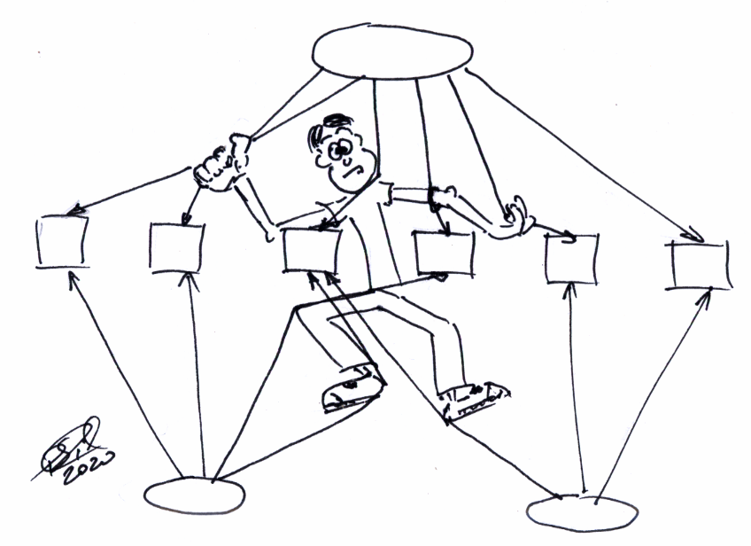
```

# Referências

* BEAUJEAN, AA (2013) Factor analysis using R. _Practical assessment, research & evaluation_ 18(4). DOI: https://doi.org/10.7275/z8wr-4j42
* BEAUJEAN, AA (2014) _Latent variable modeling using R_. NY: Routledge.
* BROWN, TA (2015) _Confirmatory factor analysis for applied research_. 2nd ed. NY: Guilford.
* CARIFIO, J & PERLA, R (2008) Resolving the 50-year debate around using and misusing Likert scales. _Medical Education_ 42: 1150-1152.
* CRONBACH, LJ (1996) _Fundamentos de testagem psicológica_. 5a ed. Porto Alegre: Artes Médicas.
* ENNS, SC et al. (2016) Medical Students’ Perception of Their Educational Environment and Quality of Life: Is There a Positive Association? _Academic Medicine_ 91(3). https://doi.org/10.1097/ACM.0000000000000952
* FINCH Jr, HW; FRENCH, BF (2015) _Latent variable modeling with R_. NY: Routledge.
* FRIBORG, O et al. (2006)  Likert-based vs. semantic differential-based scorings of positive psychological constructs: A psychometric
* GANA, K & BROC, G (2019) _Structural equation modeling with lavaan_. NJ: Wiley.
* HOWELL, D (2013) _Statistical Methods for Psychology_. 8th ed. USA: CENGAGE.
* JAMIESON, S (2004) Likert scales: how to (ab)use them. _Medical Education_ 38: 1212-1218.
* KAISER, HF (1970) A second generation little jiffy. _Psychometrika_ 35(4): 401-415.
* KAPLUNOVSKY, AS (2004) Why using factor analysis? (dedicated to the centenary of factor analysis). http://www.magniel.com/fa/data
* LEE, SY & SONG, XY (2012) _Basic and Advanced Bayesian Structural Equation Modeling: With Applications in the Medical and Behavioral Sciences_. NJ: Wiley. DOI: 10.1002/9781118358887
* LUO, L et al. (2019) Exploratory fator analysis (EFA) programs in R. _Structural equation modeling: A multidisciplinar journal_, 0: 1-8.
* MAIR, P (2018) _Modern Psychometrics with R_. USA: Springer.
* PARO, HBMS et al. (2014) Empathy among medical students: Is there a relation with quality of life and burnout? _PLoS ONE_ 9(4). https://doi.org/10.1371/journal.pone.0094133
* PASQUALI, L. (2010) _Psicometria: teoria dos testes na Psicologia e Educação_. RJ: Vozes.
* RENCHER, AC (2012) _Methods of Multivariate Analysis_. 2nd ed. NJ: Wiley.
* REVELLE, W _Personality Project_. http://www.personality-project.org/
* SEGRE, M &; FERRAZ, FC (1997) O conceito de saúde. _Rev Saúde Pública_ 31(5):538-42.
* STEVENSON, L & HABERMAN, L (2005) _Dez teorias da natureza humana_. SP: Martins Fontes, p. 46-7.
* TEMPSKY, P et al. (2015) Relationship among medical student resilience, educational environment and quality of life. _PLoS ONE_ 10(6). https://doi.org/10.1371/journal.pone.0131535
* THAKKAR, JJ (2020) _Structural equation modelling: Application for research and practice (with AMOS and R)_. Springer.
comparison of two versions of a scale measuring resilience. _Personality and Individual Differences_ 40: 873–884.

