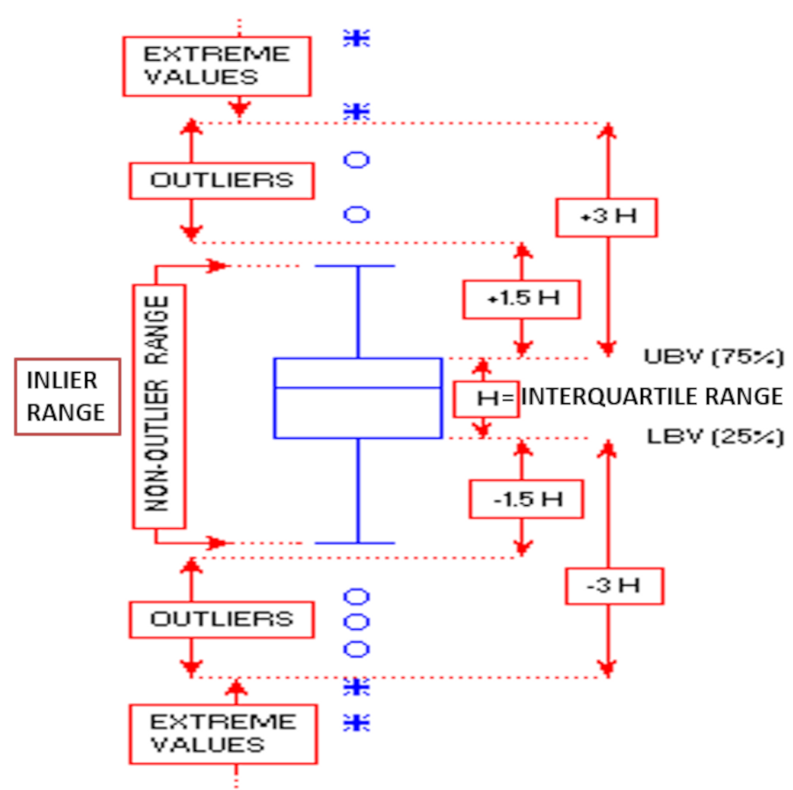

```{r set-options, echo=FALSE, cache=FALSE}
options(width=80)
```

```{css, echo=FALSE}
.code {
  font-size: 18px;
  background-color: #FFFFCC;
  border: 2px solid blue;
  font-weight: bold;
  max-width: none !important;
}
.output {
  font-size: 18px;
  background-color: white;
  border: 2px solid black;
  font-weight: bold;
  max-width: none !important;
}
.main-container {
  max-width: none !important;
}
pre {
  max-height: 500px !important;
  overflow-y: auto !important;
  overflow-x: scroll !important;
}
.bgobs {
  background-color: #a0d8d8;
}
.bgcodigo {
  background-color: #eeeeee;
}
.bgsaida {
  background-color: #ecf7db;
}
```

```{r setup, include=FALSE}
knitr::opts_chunk$set(eval=TRUE,
                      echo=TRUE, 
                      fig.width=7, 
                      fig.height=6,
                      fig.align="center",
                      comment=NA,
                      class.source="code",
                      class.output="output")
```

# Carregar pacotes

```{r class.source="code"}
options(warn=-1)
suppressMessages(library(knitr, warn.conflicts=FALSE))
# devtools::install_github("kupietz/kableExtra")
suppressMessages(library(kableExtra, warn.conflicts=FALSE))
suppressMessages(library(readxl, warn.conflicts=FALSE))
suppressMessages(library(finalfit, warn.conflicts=FALSE))
suppressMessages(library(car, warn.conflicts=FALSE))
suppressMessages(library(GGally, warn.conflicts=FALSE))
suppressMessages(library(ggplot2, warn.conflicts=FALSE))
suppressMessages(library(psych, warn.conflicts=FALSE))
suppressMessages(library(DescTools, warn.conflicts=FALSE))
suppressMessages(library(MVN, warn.conflicts=FALSE))
suppressMessages(library(ggpubr, warn.conflicts=FALSE))
suppressMessages(library(sjPlot, warn.conflicts=FALSE))
suppressMessages(library(Hmisc, warn.conflicts=FALSE))
suppressMessages(library(summarytools, warn.conflicts=FALSE))
suppressMessages(library(read.dbc, warn.conflicts=FALSE))
suppressMessages(library(reshape2, warn.conflicts=FALSE))
suppressMessages(library(data.table, warn.conflicts=FALSE))
suppressMessages(library(gplots, warn.conflicts=FALSE))
suppressMessages(library(lubridate, warn.conflicts=FALSE))
suppressMessages(library(dplyr, warn.conflicts=FALSE))
suppressMessages(library(FSA, warn.conflicts=FALSE))
suppressMessages(library(lattice, warn.conflicts=FALSE))
suppressMessages(library(htmltools, warn.conflicts=FALSE))
```

```{r}
Sys.setlocale("LC_CTYPE", "pt_BR.UTF-8")
Sys.setlocale("LC_ALL", "pt_BR.UTF-8")
```

```{r,eval=TRUE,echo=FALSE}
systoper <- Sys.info()[[1]]
if (systoper == "Linux")
{
  # Troque para o executavel de onde esta instalado o scilab em seu computador
  executable <- file.path("","home","silveira","Scilab","bin","scilab")
  parameter <- "-nw"
}
# Windows
if (systoper == "Windows")
{
  # Troque para o executavel de onde esta instalado o scilab em seu computador
  executable <- file.path("D:","Usuarios","Jose","scilab","bin","Scilex")
  parameter <- ""
}
```

```{r,eval=TRUE,echo=FALSE}
eng_scilab <- function(options) {
code <- stringr::str_c(options$code, collapse = '\n')
if (options$eval) 
{
  cmd <- sprintf("%s %s -e %s",
                 executable,
                 parameter,
                 shQuote(code,type="cmd"))
  out <- system(cmd, intern = TRUE)
}else{out <- "output when eval=FALSE and engine='scilab'"}

knitr::engine_output(options, options$code, out)
}

knitr::knit_engines$set(scilab=eng_scilab)
```

# Pensamento

## Vídeo: Clima “atípico” em Angola deixa menina do tempo preocupada: temperaturas mínimas mais altas que as máximas!

<video width="800" height="600" controls>
<source src="Minimo e maximo em Angola.mp4" type="video/mp4"> 
</video>

https://www.youtube.com/watch?v=Jp0jJMPWl6g&t=2s

# Material 

* https://drive.google.com/drive/folders/1Cadw9nO_r5rSYFhyhJknpVZYBh4gvccA?usp=sharing
* Baixar os arquivos no seu computador
* Abrir os arquivos `html` no navegador

# R

A linguagem R é uma linguagem de programação e ambiente de desenvolvimento voltado principalmente para análise estatística, manipulação de dados, visualização e criação de gráficos. Ela foi desenvolvida inicialmente por Ross Ihaka e Robert Gentleman na Universidade de Auckland, Nova Zelândia, em 2000.

O R é uma linguagem interpretada e de código aberto, o que significa que seu código-fonte está disponível livremente para que os usuários possam visualizar, modificar e distribuir. Essa característica da linguagem R encoraja uma comunidade colaborativa, levando a um grande ecossistema de pacotes e extensões criados por diversos desenvolvedores em todo o mundo.

Principais características da linguagem R:

1. **Análise Estatística:** R é amplamente utilizado em análise estatística e fornece uma grande variedade de funções e bibliotecas estatísticas para realizar cálculos, testes de hipóteses, regressão, análise de séries temporais e muitos outros procedimentos estatísticos.

2. **Manipulação de Dados:** O R oferece recursos avançados para importar, exportar e manipular dados, incluindo a capacidade de trabalhar com estruturas de dados como vetores, matrizes, data frames e listas.

3. **Visualização de Dados:** A linguagem R possui bibliotecas gráficas poderosas para criação de gráficos e visualizações estáticas e interativas, permitindo representar os dados de forma eficiente e atraente.

4. **Programação Funcional:** R é uma linguagem funcional, o que significa que ela suporta funções de primeira classe e operações de alto nível em funções.

5. **Extensibilidade:** Como mencionado anteriormente, R é altamente extensível por meio de pacotes. Há milhares de pacotes disponíveis para diferentes finalidades, permitindo que os usuários ampliem as funcionalidades da linguagem de acordo com suas necessidades.

6. **Comunidade Ativa:** A comunidade de usuários e desenvolvedores do R é ativa e vibrante. Fóruns online, grupos de discussão e conferências são realizadas regularmente para compartilhar conhecimentos, problemas e soluções.

A sintaxe do R é baseada em comandos em estilo inglês e é relativamente fácil de aprender, mesmo para pessoas que não têm uma formação em programação. Sua versatilidade e a ampla gama de pacotes disponíveis tornam o R uma das linguagens mais populares para análise de dados e estatística em diferentes campos, como ciência de dados, pesquisas acadêmicas, finanças, bioinformática, entre outros.

Até setembro de 2021, o Comprehensive R Archive Network (CRAN), o repositório oficial de pacotes R, continha mais de 17.000 pacotes disponíveis para download e uso. No entanto, é importante observar que a quantidade de pacotes R pode mudar ao longo do tempo, pois novos pacotes são desenvolvidos e adicionados regularmente, enquanto outros podem ser descontinuados ou removidos do repositório.

Além do CRAN, também existem outros repositórios de pacotes R, como o Bioconductor (especializado em bioinformática) e o GitHub, onde muitos desenvolvedores disponibilizam seus pacotes. Portanto, a quantidade total de pacotes R disponíveis pode ser ainda maior do que o número presente no CRAN.

* Tutorial de R por Paulo Silveira e José Siqueira
  * https://drive.google.com/drive/folders/11Uxzsrf_yAf69PlIIYFlckCve5-S_glL?usp=sharing
* Curso-R: Ciência de dados em R por Damiani et al.
  * https://livro.curso-r.com/index.html
* Introdução à Análise de Dados em R por Bruno Lucian & Claudia Jakelline
  * https://bookdown.org/bruno_lucian_costa/CursoBasicoR/
  
# Sumário

* Leitura e gravação de arquivo de dados
* Tipo de variável  
* Estatística descritiva gráfica e numérica
* Estrutura do arquivo de dados com medidas repetidas: _wide_ e _long_

# Quatro problemas

1. Ler e descrever [`Biometria_FMUSP.xlsx`](Biometria_FMUSP.xlsx){target="_blank"}
1. Ler e transformar a estrutura de dados de [`NewDrug.xlsx`](NewDrug.xlsx){target="_blank"} de formato _wide_ para _long_ e vice-versa
1. Ler dados em colunas e tabelas dentro de script R
1. Ler e descrever arquivo de dados grande `DOBR2020.dbc` (documentação em [`Estrutura_SIM_para_CD.pdf`](Estrutura_SIM_para_CD.pdf){target="_blank"})

# Ler arquivo de dados em planilha Excel 

Os dados da planilha [`Biometria_FMUSP.xlsx`](Biometria_FMUSP.xlsx){target="_blank"} foram coletados pelos docentes dos estudantes do segundo ano de uma mesma disciplina do curso de Medicina da FMUSP em três anos consecutivos.

As variáveis do arquivo são:

* ID: idenficador do(a) estudante	
* Ano da coleta dos dados: 1, 2, 3	
* Turma: A, B	
* Sexo: Feminino, Masculino	
* Mao: Destro, Canhoto, Ambidestro	
* TipoSang: A+, A-, ...	
* ABO: A, B, AB, O
* Rh: +, -
* AtivFisica: nível de atividade física	
* Sedentarismo: Não, Sim	
* MCT: massa corporal total (kg)
* Estatura: cm	

```{r}
Dados <- readxl::read_excel(path="Biometria_FMUSP.xlsx",
                            sheet="dados",
                            na=c("NA","na","nA","Na"))
```

## Dados 

```{r}
knitr::kable(head(Dados), format="html", caption="Biometria FMUSP")
knitr::kable(tail(Dados), format="html", caption="Biometria FMUSP")
```

## Estrutura de dados

```{r}
str(Dados)
```

# Pré-processamento

Em análise estatística de dados, o pré-processamento refere-se às etapas iniciais e fundamentais que os dados brutos passam antes de serem utilizados para análise estatística propriamente dita. Essas etapas são cruciais para garantir que os dados estejam limpos, organizados e em um formato adequado para que as análises subsequentes sejam precisas e confiáveis.

As principais etapas de pré-processamento incluem:

1. **Coleta:** Esta é a primeira etapa, onde os dados brutos são obtidos a partir de fontes diversas, como pesquisas, sensores, bancos de dados, etc.

2. **Limpeza:** Nesta etapa, os dados são revisados em busca de erros, valores ausentes ou inconsistentes. Dados ausentes podem ser tratados preenchendo-os com valores adequados ou removendo as observações afetadas, dependendo do caso. Outliers (valores extremos que não seguem o padrão dos demais dados) podem ser tratados ou removidos, caso tenham um efeito indesejado na análise.

3. **Transformação e recodificação:** Aqui, os dados podem ser transformados para atender aos requisitos de certos métodos estatísticos. Por exemplo, aplicar logaritmos a dados assimétricos ou normalizar dados para escala comparável.

4. **Integração:** Quando os dados vêm de várias fontes, é necessário combiná-los em um único conjunto de dados coerente e consistente.

5. **Redução de dimensionalidade:** Se os dados tiverem muitas variáveis, é possível utilizar técnicas de redução de dimensionalidade para simplificar a análise e visualização.

6. **Discretização:** Às vezes, é necessário transformar variáveis contínuas em categorias discretas para melhorar a interpretação ou usar certos métodos estatísticos específicos.

7. **Normalização e padronização:** Essas técnicas são aplicadas para garantir que as variáveis estejam em escalas comparáveis, especialmente quando diferentes variáveis têm unidades diferentes.

8. **Seleção de características:** Selecione as variáveis mais relevantes ou informativas para a análise, eliminando as menos relevantes.

Após o pré-processamento, os dados estarão prontos para serem utilizados em análises estatísticas, como regressão, análise de variância, análise de componentes principais, clustering, entre outras. O processo de pré-processamento pode variar dependendo da natureza dos dados e das questões de pesquisa específicas em análise estatística.

```{r}
print(summary(Dados))
print(sapply(Dados, class))
Dados <- dplyr::mutate_if(Dados, is.character, as.factor)
Dados <- dplyr::mutate_at(Dados, dplyr::vars(ID), as.factor)
print(summary(Dados))
print(sapply(Dados, class))
print(labelled::look_for(Dados[,-1]))
knitr::kable(head(Dados), format="html", caption="Biometria FMUSP")
knitr::kable(tail(Dados), format="html", caption="Biometria FMUSP")

print(class(Dados$AtivFisica))
print(levels(Dados$AtivFisica))
print(summary(subset(Dados, select=c(AtivFisica))))
Dados$AtivFisica <- factor(Dados$AtivFisica,
                           levels=c("sempre_inativo",
                                    "atualmente_inativo",
                                    "baixa_intensidade",
                                    "media_intensidade",
                                    "alta_intensidade"))
print(class(Dados$AtivFisica))
print(levels(Dados$AtivFisica))
print(summary(subset(Dados, select=AtivFisica)))

print(sjPlot::view_df(subset(Dados, select=c(-ID))))
print(summary(subset(Dados, select=-ID)))
Dados$MCT[Dados$MCT==658] <- NA
Dados$Estatura[Dados$Estatura==120] <- NA
Dados$IMC <- Dados$MCT/((Dados$Estatura/100)^2)
print(summary(subset(Dados, select=c(MCT, Estatura, IMC))))
summarytools::view(summarytools::dfSummary(Dados))

saveRDS(Dados, "Biometria_FMUSP.rds")
```

## Estratificação da amostra por sexo

```{r}
Dados <- readRDS("Biometria_FMUSP.rds")

Dados.F <- subset(Dados, Sexo=="F")
Dados.M <- subset(Dados, Sexo=="M")
```

## Análise de dados faltantes

```{r}
n.total <- nrow(Dados)
n.completo <- nrow(na.omit(Dados))
n.incompleto <- n.total - n.completo
cat("Numero de casos total = ", n.total, "\n", sep="")
cat("Numero de casos completos = ", n.completo, 
    " (",round(100*n.completo/n.total,2),"%)\n", sep="")
cat("Numero de casos incompletos = ", n.incompleto, 
    " (",round(100*n.incompleto/n.total,2),"%)\n", sep="")
obs.falt <- sum(is.na(Dados))
obs.valid <- sum(!is.na(Dados))
obs.tot <- obs.falt + obs.valid
cat("Numero de observacoes validas = ", obs.valid, 
    " (",round(100*obs.valid/obs.tot,2),"%)\n", sep="")
cat("Numero de observacoes faltantes = ", obs.falt, 
    " (",round(100*obs.falt/obs.tot,2),"%)\n", sep="")
```

## Análise de dados faltantes com `finalfit::missing_pattern`

```{r}
finalfit::missing_pattern(subset(Dados,select=-ID))
```

# Análise exploratória de dados (EDA)

A análise estatística exploratória (ou EDA - _Exploratory Data Analysis_) é uma abordagem de investigação de dados que visa entender a estrutura, padrões e características de um conjunto de dados, antes de realizar análises mais formais ou modelagem estatística. Ela é uma etapa essencial no processo de análise de dados, pois ajuda a obter insights preliminares, identificar tendências, detectar anomalias e formular hipóteses iniciais.

As principais características da análise estatística exploratória são:

1. **Sumarização de dados:** A EDA envolve a utilização de técnicas estatísticas descritivas para resumir os dados em estatísticas como média, mediana, desvio padrão, mínimo, máximo, quartis, histogramas e outras medidas relevantes. Essas estatísticas ajudam a entender a distribuição dos dados e suas principais características.

2. **Visualização de dados:** A EDA faz amplo uso de gráficos e visualizações para representar os dados de maneira compreensível. Gráficos como histogramas, box plots, gráficos de dispersão, gráficos de linha e gráficos de barras são usados para identificar padrões, relacionamentos e tendências nos dados.

3. **Detecção de outliers e dados faltantes:** Durante a análise exploratória, é essencial identificar valores extremos (outliers) e dados ausentes, entender suas possíveis causas e decidir como tratá-los, se necessário.

4. **Análise de correlação:** Explorar correlações entre variáveis ajuda a entender a relação entre diferentes características do conjunto de dados e pode fornecer insights valiosos sobre como elas estão relacionadas.

5. **Análise de distribuição:** Através de gráficos de distribuição, é possível verificar se os dados seguem uma distribuição específica, como normal, uniforme ou exponencial, por exemplo.

6. **Identificação de padrões e tendências:** A EDA permite identificar tendências temporais, sazonalidades, padrões cíclicos e outras estruturas nos dados que podem ser úteis na formulação de perguntas e hipóteses para análises posteriores.

A análise estatística exploratória é frequentemente conduzida usando ferramentas de software estatístico, como o R e Python. Essa etapa é fundamental para estabelecer uma base sólida para a análise posterior e para garantir que a interpretação dos resultados seja feita de forma mais informada e precisa.

## `psych::describe` e `table`

```{r eval=TRUE,echo=TRUE, warning=FALSE, error=FALSE}
# item name ,item number, nvalid, mean, sd,
# median, mad (Median Absolute Deviation), 
# min, max, skew, kurtosis, se
print(psych::describe(subset(Dados, select=c(MCT, Estatura))))

table(Dados$TipoSang)
round(prop.table(table(Dados$TipoSang)),2)
```

## `tapply`

```{r}
# mean,median,25th and 75th quartiles,min,max
tapply(Dados$MCT, Dados$Sexo, summary)
```

## `psych::describeBy`

```{r}
# item name, item number, nvalid, mean, sd,
# median, mad (Median Absolute Deviation), 
# min, max, skew, kurtosis, se
print(psych::describeBy(subset(Dados,select=c(MCT, Estatura)),
                  group=list(Dados$Sexo),
                  mat=TRUE,
                  digits=2))
print(psych::describeBy(subset(Dados,select=c(MCT, Estatura)),
                  group=list(Dados$Sexo, Dados$ABO),
                  mat=TRUE,
                  digits=2))
print(psych::describeBy(subset(Dados, select=c(MCT, Estatura)),
                  group=list(Dados$ABO, Dados$Sexo),
                  mat=TRUE,
                  digits=2))
```

## `aggregate`

```{r}
aggregate(subset(Dados, select=c(MCT, Estatura)),
                 by=list(Dados$Sexo),
                 FUN=mean,
                 na.rm=TRUE)
aggregate(subset(Dados, select=c(MCT, Estatura)),
                 by=list(Dados$Sexo, Dados$ABO),
                 FUN=mean,
                 na.rm=TRUE)
aggregate(subset(Dados, select=c(MCT, Estatura)),
                 by=list(Dados$ABO, Dados$Sexo),
                 FUN=mean,
                 na.rm=TRUE)
```

## `aggregate` por fórmula

```{r}
aggregate(MCT ~ Sexo,
                FUN=median,
                na.rm=TRUE,
                data=Dados)
aggregate(MCT ~ Sexo + ABO,
                FUN=median,
                na.rm=TRUE,
                data=Dados)
```

## Média e desvio-padrão: Parte A

* Higgins JPT, Li T, Deeks JJ (editors). Chapter 6: Choosing effect measures and computing estimates of effect. In: Higgins JPT, Thomas J, Chandler J, Cumpston M, Li T, Page MJ, Welch VA (editors). Cochrane Handbook for Systematic Reviews of Interventions version 6.3 (updated February 2022). Cochrane, 2022. Available from www.training.cochrane.org/handbook. 
  * Table 6.5.a em https://training.cochrane.org/handbook/current/chapter-06

* Suponha que não temos acesso aos dados brutos de MCT. Os dados disponíveis são apresentados na tabela abaixo: 

group |   n |  mean |    sd|
-----:|----:|------:|-----:|
F     | 230 | 57.63 |  9.05|     
M     | 312 | 71.59 | 12.09| 

* Quais são os valores da média e desvio-padrão amostrais dos 542 estudantes?

```{r}
m <- (230*57.63 + 312*71.59)/542
cat("Media = ", round(m,2), "\n", sep="")

dp <- sqrt(((230-1)*(9.05^2) + (312-1)*(12.09^2) + 
            (230*312/542)*((57.63-71.59)^2))/(542-1))
cat("Desvio-padrao = ", round(dp,2), " > ", max(9.05,12.09), "\n", sep="")
```

## Média e desvio-padrão: Parte B

* MCT

   n |  mean |    sd 
----:|------:|------:
 542 | 65.67 |  12.9 

group |   n |  mean |    sd 
:----:|----:|------:|-----:
F     | 230 | 57.63 |  9.05     
M     | 312 | 71.59 | 12.09

```{r}
m <- (230*57.63 + 312*71.59)/542
cat("Media = ", round(m,2), "\n", sep="")

dp <- sqrt(((230-1)*9.05^2 + (312-1)*12.09^2 + 
            (230*312/542)*(57.63-71.59)^2)/(542-1))
cat("Desvio-padrao = ", round(dp,2), "\n", sep="")

dp <- sqrt((230*9.05^2 + 312*12.09^2 + 
           230*(57.63-65.67)^2 + 312*(71.59-65.67)^2)/542)
cat("Desvio-padrao = ", round(dp,2), "\n", sep="")
```

$$\bar{x} = \dfrac{n_F \, \bar{x}_F + n_M \, \bar{x}_M}{n_F + n_M}$$

$$s=\sqrt{\dfrac{(n_F-1)\,s_F^2+(n_M-1)\,s_M^2+\dfrac{n_F\;n_M}{n_F+n_M}\left(\bar{x}_F-\bar{x}_M\right)^2}{n_F+n_M-1}}\\
\dfrac{n_F\;n_M}{n_F+n_M}=\text{ média harmônica/2}$$

$$s=\sqrt{\frac{n_F\,s_F^2+n_M\,s_M^2+n_F\,\left(\bar{x}_F-\bar{x}\right)^2+n_M\,\left(\bar{x}_M-\bar{x}\right)^2}{n_F+n_M}}$$

$$s=\sqrt{\frac{n_F\,\left(s_F^2+\left(\bar{x}_F-\bar{x}\right)^2\right)+n_M\,\left(s_M^2+\left(\bar{x}_M-\bar{x}\right)^2\right)}{n_F+n_M}}$$

## Dotplot por `plot` & `table`

```{r}
plot(Dados$Sexo, xlab="Sexo", ylab="Freq")
plot(Dados$TipoSang, xlab="Tipo Sanguineo", ylab="Freq")
plot(Dados$Sedentarismo, xlab="Sedentarismo", ylab="Freq")
plot(table(Dados$MCT), xlab="Massa corporal total (kg)", ylab="Freq")
plot(table(Dados$Estatura), xlab="Estatura (cm)", ylab="Freq")
```

## Gráfico de setores

```{r}
table(Dados$Sexo)
pie(table(Dados$Sexo), 
    xlab="Sexo")
table(Dados$ABO)
pie(table(Dados$ABO), 
    xlab="ABO")
```

## Tabela de contingência 2x2

```{r}
print(Sedentarismo.Sexo <- xtabs(~Sedentarismo+Sexo, data=Dados))
margin.table(Sedentarismo.Sexo,1)
margin.table(Sedentarismo.Sexo,2)
round(proportions(Sedentarismo.Sexo),2)
round(proportions(Sedentarismo.Sexo,1),2)
round(proportions(Sedentarismo.Sexo,2),2)
plot(Dados$Sedentarismo~Dados$Sexo, xlab="Sexo", ylab="Sedentarismo")
mosaicplot(~Sexo+Sedentarismo, data=Dados, color=FALSE)
gplots::balloonplot(t(Sedentarismo.Sexo), 
                    main ="Estudantes de Medicina\nFMUSP", 
                    xlab ="Sexo", 
                    ylab="Sedentarismo",
                    label=TRUE, 
                    show.margins=TRUE, 
                    show.zeros=TRUE, 
                    dotcolor="gray")
barplot(Sedentarismo.Sexo,
        beside=TRUE, 
        legend.text=rownames(Sedentarismo.Sexo),
        ylab="Freq",
        xlab="Sexo x Sedentarismo")
barplot(proportions(Sedentarismo.Sexo),
        beside=TRUE, 
        legend.text=rownames(Sedentarismo.Sexo),
        ylab="Freq",
        xlab="Sexo x Sedentarismo")
sexo.ABO.freq <- as.data.frame(table(Dados$Sexo, Dados$ABO))
names(sexo.ABO.freq) <- c("Sexo", "ABO", "Freq")
ggpubr::ggbarplot(sexo.ABO.freq, 
                  x="ABO", 
                  y="Freq",
                  color="Sexo",
                  palette=c("gray", "black"),
                  order=c("A", "B", "AB", "O"),
                  width=.7)
ggpubr::ggbarplot(sexo.ABO.freq, 
                  x="ABO", 
                  y="Freq",
                  color="Sexo",
                  palette=c("gray", "black"),
                  order=c("A", "B", "AB", "O"),
                  position = ggplot2::position_dodge(),
                  width=.7)
```

## Tabela de contingência 2x4

```{r}
print(ABO.Sexo <- xtabs(~ABO+Sexo, data=Dados))
round(proportions(ABO.Sexo),2)
round(proportions(ABO.Sexo,1),2)
round(proportions(ABO.Sexo,2),2)
mosaicplot(~Sexo+ABO, data=Dados, color=FALSE)
gplots::balloonplot(t(ABO.Sexo), 
                    main ="Estudantes de Medicina\nFMUSP", 
                    xlab ="Sexo", 
                    ylab="ABO",
                    label=TRUE, show.margins=TRUE, 
                    show.zeros=TRUE, 
                    dotcolor="gray")
barplot(ABO.Sexo,
        beside=TRUE, 
        legend.text=rownames(ABO.Sexo),
        ylab="Freq",
        xlab="Sexo x ABO")
barplot(proportions(ABO.Sexo),
        beside=TRUE, 
        legend.text=rownames(ABO.Sexo),
        ylab="Freq",
        xlab="Sexo x ABO")
```

## Tabelas multidimensionais: três ou mais variáveis categóricas

```{r}
ftable(Sexo + Sedentarismo ~ ABO, data=Dados)
print(xtabs(~Sexo + Sedentarismo + ABO, data=Dados))
mosaicplot(xtabs(~Sexo + Sedentarismo + ABO, data=Dados))
```

## Boxplot: estrutura

```{r fig.align="center",  out.width="60%"}

```

## Boxplot

```{r}
boxplot(Dados$MCT, horizontal=TRUE, 
        xlab="MCT (kg)")
rug(jitter(Dados$MCT))
boxplot(MCT~Sexo, data=Dados, horizontal=TRUE, 
        xlab="MCT (kg)")
boxplot(MCT~Sexo+Sedentarismo, data=Dados, horizontal=TRUE, 
        xlab="MCT (kg)")
boxplot(MCT~Sexo+Sedentarismo+Mao, data=Dados, horizontal=TRUE, 
        xlab="MCT (kg)", cex=0.6)
ggpubr::ggboxplot(data=Dados, 
                  y="MCT")
ggpubr::ggboxplot(data=Dados,
                  x="Sexo",
                  y="MCT", 
                  add="",
                  orientation="horizontal",
                  width=.7,
                  order=c("F", "M"))
ggpubr::ggboxplot(data=Dados,
                  x="Sexo",
                  y="MCT", 
                  add="",
                  orientation="horizontal",
                  width=.7,
                  order=c("M", "F"))
ggpubr::ggboxplot(data=Dados,
                  x="Sexo",
                  y="MCT", 
                  add="jitter",
                  orientation="horizontal",
                  width=.7,
                  order=c("F", "M"))
ggpubr::ggboxplot(data=Dados,
                  x="ABO",
                  y="MCT", 
                  add="",
                  orientation="horizontal",
                  width=.7,
                  select=c("A", "B", "O"),
                  order=c("O", "B", "A"))
```

## Bagplot: boxplot bidimensional

```{r eval=TRUE,  echo=TRUE, warning=FALSE, error=FALSE}
bgp.F <- DescTools::PlotBag(Dados.F$Estatura, 
                            Dados.F$MCT,
                            main=paste("Feminino"),
                            xlab="Estatura (cm)",
                            ylab="Massa Corporal Total (kg)",
                            na.rm=TRUE,
                            show.bagpoints=FALSE,
                            show.looppoints=FALSE,
                            show.whiskers=FALSE,
                            show.baghull=TRUE,
                            col.loophull="white",
                            col.looppoints="black", 
                            col.baghull="white",
                            col.bagpoints="black",
                            add=FALSE,
                            cex=1)
print(outliers.F <- as.data.frame(bgp.F$pxy.outlier))
for (o in 1:nrow(outliers.F))
{
  r.F <- which(Dados.F$Estatura==outliers.F$x[o] & 
               Dados.F$MCT==outliers.F$y[o])
  text(outliers.F$x[o],outliers.F$y[o], r.F, pos=1, cex=0.7)
}

bgp.M <- DescTools::PlotBag(Dados.M$Estatura, 
                          Dados.M$MCT,
                          main=paste("Masculino"),
                          xlab="Estatura (cm)",
                          ylab="Massa Corporal Total (kg)",
                          na.rm=TRUE,
                          show.bagpoints=FALSE,
                          show.looppoints=FALSE,
                          show.whiskers=FALSE,
                          show.baghull=TRUE,
                          col.loophull="white",
                          col.looppoints="black", 
                          col.baghull="white",
                          col.bagpoints="black",
                          add=FALSE,
                          cex=1)
print(outliers.M <- as.data.frame(bgp.M$pxy.outlier))
for (o in 1:nrow(outliers.M))
{
  r.M <- which(Dados.M$Estatura==outliers.M$x[o] & 
                 Dados.M$MCT==outliers.M$y[o])
  text(outliers.M$x[o], outliers.M$y[o], r.M, pos=1, cex=0.7)
}
```

## Histograma

* Silveira, PSP & Siqueira, JO (2022) Histogram lies about distribution shape and Pearson’s coefficient of variation lies about relative variability.  [_The Quantitative Methods for Psychology_](https://www.tqmp.org/RegularArticles/vol18-1/p091/p091.pdf){target="_blank"} 18(1). [DOI 10.20982/tqmp.18.1.p091](https://www.tqmp.org/RegularArticles/vol18-1/p091/){target="_blank"}

* How to Lie with Histograms
  * https://www.rossidata.com/LinLog

```{r eval=TRUE,  echo=TRUE, warning=FALSE, error=FALSE}
hist(Dados$MCT)
rug(jitter(Dados$MCT))
```

## Gráfico de densidade

```{r}
car::densityPlot(~MCT, data=Dados)
car::densityPlot(MCT~Sexo, data=Dados, 
                 col=c("black","black"))
car::densityPlot(MCT~Sedentarismo, data=Dados.F, 
                 col=c("black","black"),
                 main="Feminino")
car::densityPlot(MCT~Sedentarismo, data=Dados.M, 
                 col=c("black","black"),
                 main="Masculino")
car::densityPlot(MCT~ABO, data=Dados.F,
                 main="Feminino")
car::densityPlot(MCT~ABO, data=Dados.M,
                 main="Masculino")
```

## Gráfico de distribuição de probabilidade: ECDF plot

```{r}
ggpubr::ggecdf(data=Dados,
               x="MCT",
               linetype="Sexo")
```
               
## Gráfico de dispersão com `sunflowerplot`

```{r}
sunflowerplot(MCT~Estatura,
              main="Estatura x MCT: Feminino",
              data=Dados.F, 
              rotate=TRUE, 
              pch=1,
              size=.1,
              col="black", 
              seg.col="black",
              xlim=c(145,190),
              ylim=c(40,140),
              seg.lwd=.8)
sunflowerplot(MCT~Estatura,
              main="Estatura x MCT: Masculino",
              data=Dados.M, 
              rotate=TRUE, 
              pch=2,
              size=.1,
              col="black", 
              seg.col="black", 
              xlim=c(150,200),
              ylim=c(40,110),
              seg.lwd=.8,
              add=FALSE)

sunflowerplot(MCT~Estatura,
              main="Estatura x MCT: Feminino & Masculino",
              data=Dados.F, 
              rotate=TRUE, 
              pch=1,
              size=.1,
              col="black", 
              seg.col="black", 
              xlim=c(145,200),
              ylim=c(40,140),
              seg.lwd=.8)
sunflowerplot(MCT~Estatura,
              data=Dados.M, 
              rotate=TRUE, 
              pch=2,
              size=.1,
              col="black", 
              seg.col="black", 
              seg.lwd=.8,
              add=TRUE)
```

## Gráfico de dispersão com `car::scatterplot`

```{r}
car::scatterplot(MCT~Estatura,
                 group=Dados$Sexo,
                 jitter=list(x=1, y=1),
                 regLine=FALSE, 
                 smooth=FALSE, 
                 ellipse=FALSE,
                 grid=FALSE,
                 col="black",
                 xlim=c(145,200),
                 ylim=c(30,130),
                 data=Dados)
car::scatterplot(MCT~Estatura,
                 group=Dados$Sexo, 
                 jitter=list(x=1, y=1),
                 regLine=FALSE, 
                 smooth=FALSE, 
                 boxplots=TRUE, 
                 ellipse=list(levels=c(0.68), 
                              robust=TRUE, 
                              fill=FALSE, 
                              fill.alpha=0.2),
                 grid=FALSE,
                 col="black", 
                 xlim=c(145,200),
                 ylim=c(30,130),
                 data=Dados)
car::scatterplot(MCT~Estatura,
                 group=Dados$Sexo, 
                 jitter=list(x=1, y=1),
                 regLine=FALSE, 
                 smooth=FALSE, 
                 ellipse=list(levels=c(0.68,0.999), 
                              robust=TRUE, 
                              fill=FALSE, 
                              fill.alpha=0.2),
                 grid=FALSE,
                 col="black",
                 xlim=c(145,200),
                 ylim=c(30,130),
                 data=Dados)
car::scatterplot(MCT~Estatura,
                 group=Dados$Sexo, 
                 jitter=list(x=1, y=1),
                 regLine=TRUE, 
                 smooth=FALSE, 
                 ellipse=FALSE,
                 grid=FALSE,
                 col="black",
                 xlim=c(145,200),
                 ylim=c(30,130),
                 data=Dados)
```

## Gráfico de dispersão matricial

```{r}
car::scatterplotMatrix(Dados[,c("Estatura",
                                "MCT")], 
                       groups=Dados$Sexo,
                       lower.panel=NULL,
                       regLine=TRUE, 
                       smooth=FALSE, 
                       by.groups=TRUE,
                       ellipse=list(levels=c(0.5), 
                                    robust=TRUE, 
                                    fill=FALSE),
                       col=c("#666666","#888888","#cccccc"), 
                       cex=0.5,
                       cex.labels=1,
                       row1attop=TRUE)
GGally::ggpairs(subset(Dados, 
                       select=-c(ID,Ano,Turma,Mao,TipoSang,
                                 ABO,AtivFisica,IMC)), 
                ggplot2::aes(colour=Sexo))
```

## Intervalo de confiança: comparação de médias populacionais

```{r}
alpha <- 0.05
gplots::plotmeans(Dados$MCT~Dados$Sexo,
                  main="Intervalo de confiança de 95%\ncom correção de Bonferroni",
                  col="black",
                  barcol="black",
                  p=1-alpha/length(unique(levels(Dados$Sexo))),
                  connect=FALSE)
gplots::plotmeans(Dados$MCT~Dados$Sedentarismo,
                  main="Intervalo de confiança de 95%\ncom correção de Bonferroni",
                  col="black",
                  barcol="black",
                  p=1-alpha/length(unique(levels(Dados$Sexo))),
                  connect=FALSE)
gplots::plotmeans(Dados$MCT~ interaction(Dados$Sexo, 
                                         Dados$Sedentarismo),
                  main="Intervalo de confiança de 95%\ncom correção de Bonferroni",
                  col="black",
                  barcol="black",
                  p=1-alpha/(length(unique(levels(Dados$Sexo)))*
                    length(unique(levels(Dados$Sedentarismo)))),
                  connect=FALSE)

```

## Gráficos avançados

* ggplot2
  * https://ggplot2.tidyverse.org/
* Módulo V:  Gráficos com ggplot2 por Bruno Lucian & Claudia Jakelline
  * https://bookdown.org/bruno_lucian_costa/CursoBasicoR/m5.html#gr%C3%A1ficos-com-ggplot2
* ggplot2 - Essentials
  * http://www.sthda.com/english/wiki/ggplot2-essentials
* The R Graph Gallery
  * https://r-graph-gallery.com/index.html
* Advanced plotting by Jeff Powell and Remko Duursma 
  * http://www.hiercourse.com/advancedplot
  * http://www.hiercourse.com/docs/advanced_plotting.html
* Chapter 19. Advanced graphics with ggplot2
  * https://livebook.manning.com/book/r-in-action-second-edition/chapter-19/1
* Top 50 ggplot2 Visualizations - The Master List (With Full R Code)
  * http://r-statistics.co/Top50-Ggplot2-Visualizations-MasterList-R-Code.html
  
# Ler arquivo de dados com medidas repetidas

## Ler e transformar a estrutura de dados de wide para long 

* [`NewDrug.xls`](NewDrug.xls){target="_blank"}
  * Fonte dos dados: Norusis, M (2021) _IBM SPSS Statistics 19 Statistical Procedures Companion_. Chapter: GLM Repeated Measures. USA: Addison Wesley.

Este arquivo tem 12 pacientes, em dois grupos (nova droga e placebo), dada um deles com três medidas de `resp` e três de `pulse`. 

```{r}
Dados.wide <- readxl::read_xlsx("NewDrug.xlsx")
Dados.wide$drug <- factor(Dados.wide$drug)
knitr::kable(Dados.wide, format="html", caption="New Drug: wide")
print(psych::describeBy(subset(Dados.wide,select=c(-drug)),
                    group=list(Dados.wide$drug),
                    mat=TRUE,
                    digits=2))
str(Dados.wide)
labelled::look_for(Dados.wide)

Dados.wide <- cbind(seq(1:nrow(Dados.wide)),Dados.wide)
names(Dados.wide) <- c("ID",names(Dados.wide[,2:ncol(Dados.wide)]))
labelled::look_for(Dados.wide)

Dados.long <- Hmisc::reShape(Dados.wide,
                             id=c("ID"),
                             colvar=c("drug"),
                             base=c("resp", "pulse"),
                             reps=3,
                             timevar="time",
                             times=c(1,2,3))
str(Dados.long)
knitr::kable(Dados.long, format="html", caption="New Drug: long")
rownames((Dados.long))

Dados.lista <- list(Dados.wide, Dados.long)
names(Dados.lista) <- c("NewDrug_wide", "NewDrug_long")
saveRDS(Dados.lista, "NewDrug_wide_long.rds")
Dados_wide_long <- readRDS("NewDrug_wide_long.rds")
str(Dados_wide_long)
knitr::kable(Dados_wide_long$NewDrug_wide, format="html", caption="New Drug: wide")
knitr::kable(Dados_wide_long$NewDrug_long, format="html", caption="New Drug: long")
```

## Ler e transformar a estrutura de dados de long para wide

```{r}
Dados.wide.resp <- reshape2::dcast(Dados.long, 
                                   ID + drug ~ time, 
                                   value.var="resp")
names(Dados.wide.resp) <- c("ID","drug","resp1","resp2","resp3")
knitr::kable(Dados.wide.resp, format="html", caption="New Drug: resp wide")
Dados.wide.pulse <- reshape2::dcast(Dados.long, 
                                    ID + drug ~ time, 
                                    value.var="pulse")
names(Dados.wide.pulse) <- c("ID","drug","pulse1","pulse2","pulse3")
knitr::kable(Dados.wide.pulse, format="html", caption="New Drug: pulse wide")
Dados.wide <- cbind(Dados.wide.resp, 
                    Dados.wide.pulse[c("pulse1","pulse2","pulse3")])
knitr::kable(Dados.wide, format="html", caption="New Drug: wide")
```

# Ler dados dentro do script R

```{r}
# https://rcompanion.org 
 
Dados <- read.table(header=TRUE, 
                    stringsAsFactors=TRUE, 
                    text="
 Medico   Conceito
 A        3
 A        5
 A        4
 A        4
 A        4
 A        4
 A        4
 A        4
 A        5
 A        5
 B        2
 B        4
 B        2
 B        2
 B        1
 B        2
 B        3
 B        2
 B        2
 B        3
")
Dados$Conceito <- factor(Dados$Conceito, ordered=TRUE)
levels(Dados$Conceito)
class(Dados)
str(Dados)
knitr::kable(Dados, format="html", caption="Médico: conceito")
summary(Dados)
FSA::Summarize(as.numeric(Conceito) ~ Medico,
               digits=3,
               data=Dados)
lattice::histogram(~ Conceito | Medico,
                   data=Dados,
                   aspect="fill",
                   col="lightgray",
                   layout=c(1,2)) 

tabela <- xtabs(~ Medico + Conceito, data=Dados)
addmargins(tabela)
round(prop.table(tabela, margin=1), 2)
spineplot(tabela)
mosaicplot(tabela, shade=TRUE)
saveRDS(object=Dados, file="MediConceito.rds")
rm(Dados)
Dados <- readRDS(file="MediConceito.rds")
class(Dados)
str(Dados)

# Para este exemplo hipotético, os agricultores foram pesquisados sobre com que frequência eles utilizam uma determinada prática de manejo adequado. As respostas são organizadas de acordo com o tamanho da operação. Ambas as variáveis na tabela de contingência são categorias ordenadas.

tabela <- ("
                     Sempre 'AsVezes' Nunca
   Hobbista          0       1         5
   'Pequeno negócio' 2       3         4
   Pequeno           4       4         4
   Médio             3       2         0
   Grande            2       0         0
")

Dados.tabela <- as.matrix(read.table(textConnection(tabela), 
                                     header=TRUE, 
                                     row.names=1))
names(dimnames(Dados.tabela)) <- c("Tamanho", "Frequência")
Dados.tabela <- as.table(Dados.tabela)
addmargins(Dados.tabela)
str(Dados.tabela)
gplots::balloonplot(t(Dados.tabela), 
                    main ="Tabela de contingência\nDuas variáveis ordinais", 
                    xlab ="Freq prática manejo", 
                    ylab="Tamanho operação",
                    dotcolor="gray",
                    show.zeros=TRUE,
                    show.margins=TRUE)
Dados <- DescTools::Untable(Dados.tabela)
Dados$Tamanho <- factor(Dados$Tamanho, 
                        ordered=TRUE,
                        levels=c("Hobbista", "Pequeno negócio",
                                 "Pequeno", "Médio", "Grande"))
Dados$Frequência <- factor(Dados$Frequência, 
                           ordered=TRUE,
                           levels=c("Nunca", "AsVezes", "Sempre"))

str(Dados)
summary(Dados)
xtabs(~Tamanho+Frequência, data=Dados)

round(prop.table(Dados.tabela,
           margin=NULL),2)
spineplot(Dados.tabela)
mosaicplot(Dados.tabela, shade=TRUE)

DadosLista <- list(Dados.tabela, Dados)
names(DadosLista) <- c("Dados.tabela", "Dados")
saveRDS(object=DadosLista, file="PraticaManejoLista.rds")
rm(DadosLista)
DadosLista <- readRDS(file="PraticaManejoLista.rds")
DadosLista$Dados.tabela
DadosLista$Dados

# Tabela de contingência 2x2 estratificada  
# Teste robusto de Mantel-Haenszel de OR comum

# Relação entre tabagismo e sobrevivência em 20 anos (1974-1994) 
# em 1.134 mulheres adultas do Reino Unido
# Delineamento: coorte
# Fonte:  APPLETON, DR et al. (1996) Ignoring a covariate:
# An example of Simpson's paradox. The American Statistician,
# 50(4): 340-1.
# A aspa inicial TEM que começar na primeira coluna da linha
# e os espaçamentos distintos dos dessa tabela podem causar 
# problemas na geração da tabela horizontalizada (ftable).
tabela3D <- (
  "         FaixaEtaria 18-24 25-34 35-44 45-54 55-64 65-74 75+
Tabagista Desfecho 
Sim       Morta       2     3     14    27    51    29   13  
          Viva        53    121   95    103   64    7    0 
Nao       Morta       1     5     7     12    40    101  64
          Viva        61    152   114   66    81    28   0
")
Dados.tabela3D <- as.table(read.ftable(textConnection(tabela3D)))
ftable(Dados.tabela3D) # Display a flattened table (tabela horizontalizada)
mosaicplot(Dados.tabela3D, shade=TRUE)
saveRDS(object=Dados.tabela3D, file="Tabagismo3D.rds")
rm(Dados.tabela3D)
Dados.tabela3D <- readRDS(file="Tabagismo3D.rds")
Dados.tabela2D <- margin.table(Dados.tabela3D, margin=c(1,2))
addmargins(Dados.tabela2D)
Dados.tabela.margin <- addmargins(Dados.tabela3D, margin=c(1,2))
Dados.tabela.margin

DadosLista <- list(Dados.tabela3D, Dados.tabela2D)
names(DadosLista) <- c("Dados.tabela3D", "Dados.tabela2D")
saveRDS(object=DadosLista, file="DadosLista.rds")
rm(DadosLista)
tabelas <- readRDS(file="DadosLista.rds")
ftable(tabelas$Dados.tabela3D)
ftable(tabelas$Dados.tabela2D)
```

# Ler arquivo de dados grande

* `DOBR2020.dbc`: Declarações de Óbitos (DO) de BR em 2020 do Sistema de Informações de Mortalidade (SIM) do DATASUS: https://datasus.saude.gov.br/transferencia-de-arquivos/ 

A documentação sobre as variáveis está no arquivo [`Estrutura_SIM_para_CD.pdf`](Estrutura_SIM_para_CD.pdf){target="_blank"}.

## Dicionário de dados

```{r out.height="460px", out.width='800px', echo=FALSE}
knitr::include_graphics("./image/Estrutura_SIM_para_CD.pdf")
```

## Ler e descrever `DOBR2020.dbc`

```{r}
# SIM - Sistema de Informaçõess de Mortalidade
# DO - Declarações de Óbitos 
# 2020 - BR
# 1.556.824 linhas x 88 colunas
# age <- function(dob, age.death, units="years", floor=TRUE) {
#                 calc.age <- lubridate::interval(dob, age.death)/
#                              lubridate::duration(num = 1, units=units)
#                 if (floor) return(as.integer(floor(calc.age)))
#                 return(calc.age)
# }
# df <- read.dbc::read.dbc("DOBR2020.dbc")
# Dados$DTOBITO <- as.Date(as.character(Dados$DTOBITO),
#                          format="%d%m%Y")
# Dados$DTNASC <- as.Date(as.character(Dados$DTNASC),
#                          format="%d%m%Y")
# Dados$IdadeObito <- age(Dados$DTNASC, Dados$DTOBITO)
# Dados$IdadeObito[Dados$IdadeObito < 0 | Dados$IdadeObito > 130] <- NA
# Dados <- subset(Dados, 
#                 select=-c(19, 47, 74, 81, 85))
# sjPlot::view_df(Dados)
# Dados$TIPOBITO <- factor(Dados$TIPOBITO,
#                          levels=c(1,2),
#                          labels=c("Fetal",
#                                   "Não fetal"))
# Dados$LOCOCOR <- factor(Dados$LOCOCOR,
#                         levels=c(1:6,9),
#                         labels=c("Hospital",
#                                  "Outros estabelecimentos de saúde",
#                                  "Domicílio",
#                                  "Via pública",
#                                  "Outros",
#                                  "Aldeia indígena",
#                                  "Ignorado"))
# Dados$SEXO <- factor(Dados$SEXO,
#                      levels=0:2,
#                      labels=c("Ignorado",
#                               "Masculino",
#                               "Feminino"))
# Dados$RACACOR <- factor(Dados$RACACOR,
#                         levels=1:5,
#                         labels=c("Branca",
#                                  "Preta",
#                                  "Amarela",
#                                  "Parda",
#                                  "Indígena"))
# Dados$ESTCIV <- factor(Dados$ESTCIV,
#                        levels=c(1:5,9),
#                        labels=c("Solteiro",
#                                 "Casado",
#                                 "Viúvo",
#                                 "Separado judicialmente/ divorciado",
#                                 "União Estável",
#                                 "Ignorado"))
# Dados$ESC2010 <- factor(Dados$ESC2010,
#                         levels=c(0:5,9),
#                         labels=c("Sem",
#                                  "Fundamental I",
#                                  "Fundamental II",
#                                  "Médio",
#                                  "Superior incompleto",
#                                  "Superior completo",
#                                  "Ignorado"))
# Dados$CIRCOBITO <- factor(Dados$CIRCOBITO,
#                          levels=c(1:4,9),
#                          labels=c("Acidente",
#                                   "Suicídio",
#                                   "Homicídio",
#                                   "Outros",
#                                   "Ignorado"))
# Dados$ACIDTRAB <- factor(Dados$ACIDTRAB,
#                          levels=c(1,2,9),
#                          labels=c("Sim",
#                                   "Não",
#                                   "Ignorado"))
# saveRDS(Dados, "DOBR2020.rds")
Dados <- readRDS("DOBR2020.rds")

Variaveis <- c("TIPOBITO","IdadeObito", "SEXO",
               "RACACOR", "ESTCIV", "ESC2010","PESO",
               "LOCOCOR","CIRCOBITO","ACIDTRAB")
Dados <- subset(Dados, select=Variaveis)
sjPlot::view_df(Dados)
print(sapply(Dados,function(x){sum(!is.na(x))}))
print(sapply(Dados,function(x){sum(is.na(x))}))
n.total <- nrow(Dados)
n.completo <- nrow(na.omit(Dados))
n.incompleto <- n.total - n.completo
cat("Numero de casos total = ", n.total, "\n", sep="")
cat("Numero de casos completos = ", n.completo, 
    " (",round(100*n.completo/n.total,2),"%)\n", sep="")
cat("Numero de casos incompletos = ", n.incompleto, 
    " (",round(100*n.incompleto/n.total,2),"%)\n", sep="")
obs.falt <- sum(is.na(Dados))
obs.valid <- sum(!is.na(Dados))
obs.tot <- obs.falt + obs.valid
cat("Numero de observacoes validas = ", obs.valid, 
    " (",round(100*obs.valid/obs.tot,2),"%)\n", sep="")
cat("Numero de observacoes faltantes = ", obs.falt, 
    " (",round(100*obs.falt/obs.tot,2),"%)\n", sep="")

pie(table(Dados$CIRCOBITO), main="Tipo de óbito")
xtabs(~ Dados$CIRCOBITO)
round(prop.table(xtabs(~ Dados$CIRCOBITO)),2)
pie(table(Dados$LOCOCOR), main="Local de ocorrência do óbito")
xtabs(~ Dados$LOCOCOR)
round(prop.table(xtabs(~ Dados$LOCOCOR)),2)
plot(xtabs(~ Dados$LOCOCOR + Dados$CIRCOBITO))
tabela <- xtabs(~ Dados$LOCOCOR + Dados$CIRCOBITO)
print(tabela)
round(prop.table(tabela),2)
gplots::balloonplot(t(tabela), main ="Declarações de Óbito\nBrasil 2020", 
                    xlab ="Tipo de óbito", 
                    ylab="Local ocorrência",
                    label=TRUE, show.margins=TRUE, 
                    show.zeros=TRUE, 
                    dotcolor="gray")

# car::densityPlot(Dados$IdadeObito~Dados$SEXO) # demora demais!
print(psych::describeBy(Dados$IdadeObito, Dados$SEXO, mat=1, digits=2))
plot(table(Dados$IdadeObito))
boxplot(Dados$IdadeObito~Dados$SEXO, horizontal=TRUE)
ggplot2::ggplot(Dados, 
                ggplot2::aes(IdadeObito, 
                             fill=SEXO, 
                             colour=SEXO)) +
  ggplot2::geom_density(alpha=0.2) +
  ggplot2::theme_bw()
```

```{r}
summarytools::st_options(lang="pt")
section_title <- "**DOBR2020**"
summarytools::define_keywords(title.freq=section_title,
                              freq="n")
summarytools::view(summarytools::dfSummary(Dados), 
                   file="./image/Summary.html")
```

```{r}
# htmltools::includeHTML("./image/Summary.html")
```

```{r}
# summarytools::view(summarytools::freq(Dados[,"SEXO"],
#                                       plain.ascii=FALSE,
#                                       style="rmarkdown"))
# summarytools::view(summarytools::freq(Dados[,"SEXO"],
#                                       plain.ascii=FALSE,
#                                       style="rmarkdown",
#                                       report.nas=FALSE))
# summarytools::view(summarytools::freq(Dados[,"SEXO"],
#                                       plain.ascii=FALSE,
#                                       style="rmarkdown",
#                                       report.nas=FALSE,
#                                       totals=FALSE,
#                                       cumul=FALSE,
#                                       headings=FALSE))
# summarytools::view(summarytools::freq(Dados,
#                                       plain.ascii=FALSE,
#                                       style="rmarkdown"))
# 
# summarytools::view(summarytools::freq(Dados,
#                                       plain.ascii=FALSE,
#                                       style="rmarkdown",
#                                       order="freq",
#                                       rows=1:5))
# summarytools::view(summarytools::ctable(Dados$SEXO,
#                                         Dados$RACACOR,
#                                         prop='n',
#                                         totals=FALSE,
#                                         headings=TRUE,
#                                         useNA="no"))
# summarytools::view(summarytools::ctable(Dados$SEXO,
#                                         Dados$RACACOR,
#                                         prop="t"))
# summarytools::view(summarytools::descr(Dados,
#                                        transpose=TRUE,
#                                        headings=TRUE))
# summarytools::view(summarytools::descr(Dados,
#                                        stats=c("mean", "sd","n.valid"),
#                                        transpose=TRUE,
#                                        headings=TRUE))
# summarytools::view(stby(Dados,
#                         INDICES=list(Dados$SEXO),
#                         FUN=summarytools::descr,
#                         stats="common",
#                         transpose=TRUE))
# summarytools::view(stby(data=list(Dados$SEXO, Dados$RACACOR),
#                         INDICES=list(Dados$ESTCIV),
#                         FUN=summarytools::ctable,
#                         prop="n",
#                         totals=FALSE,
#                         headings=TRUE,
#                         useNA="no"))
# summarytools::view(stby(data=list(Dados$SEXO, Dados$RACACOR),
#                         INDICES=list(Dados$ESTCIV),
#                         FUN=summarytools::ctable,
#                         prop="t"))
# summarytools::view(Dados %>%
#                      dplyr::group_by(SEXO) %>%
#                      summarytools::descr(stats=c("mean", "sd","n.valid"),
#                                          transpose=TRUE,
#                                          headings=TRUE))
```

# Script R 

*  `MLS4001_Aula01_Biometria.R`

```{r class.output="bgcodigo"}
  cat(readLines("MLS4001_Aula01_Biometria.R"), sep="\n")
```

* `MLS4001_Aula01_NewDrug.R`

```{r class.output="bgcodigo"}
  cat(readLines("MLS4001_Aula01_NewDrug.R"), sep="\n")
```

* `MLS4001_Aula01_TextToDataframe.R`

```{r class.output="bgcodigo"}
  cat(readLines("MLS4001_Aula01_TextToDataframe.R"), sep="\n")
```

* `MLS4001_Aula01_DATASUS_DOBR2020.R`

```{r class.output="bgcodigo"}
  cat(readLines("MLS4001_Aula01_DATASUS_DOBR2020.R"), sep="\n")
```

