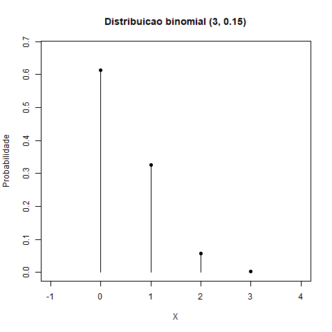
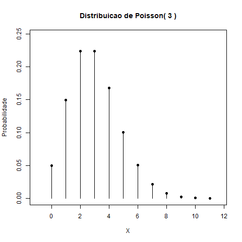
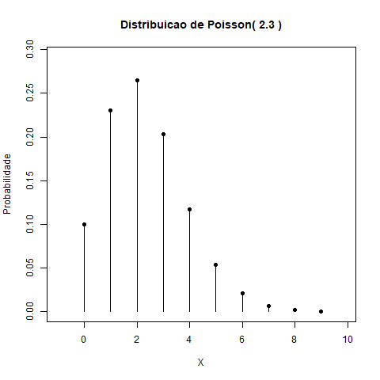
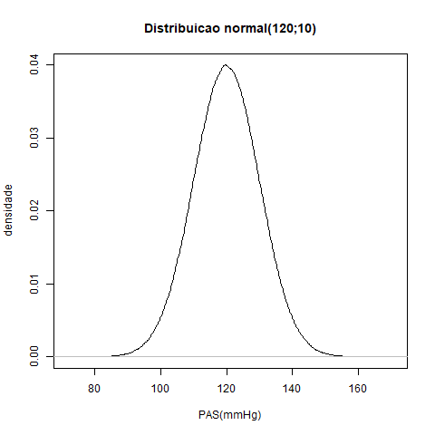
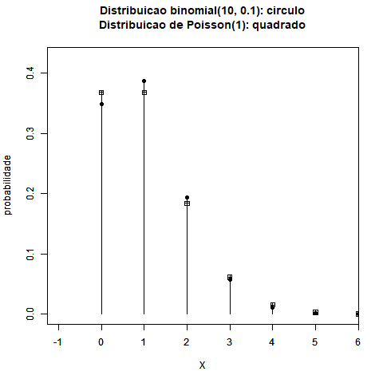
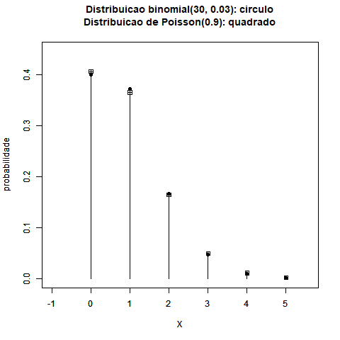
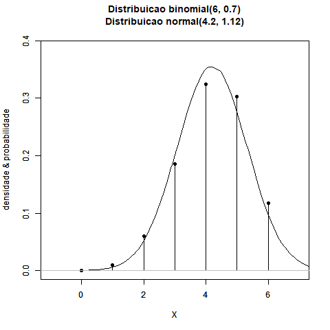
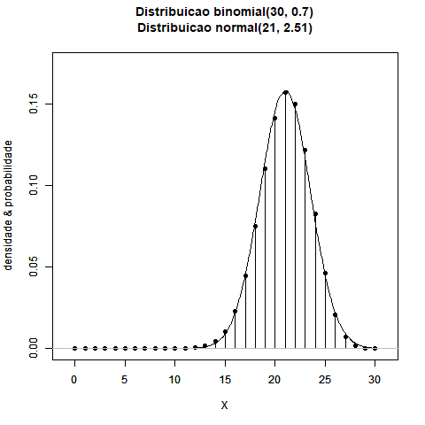
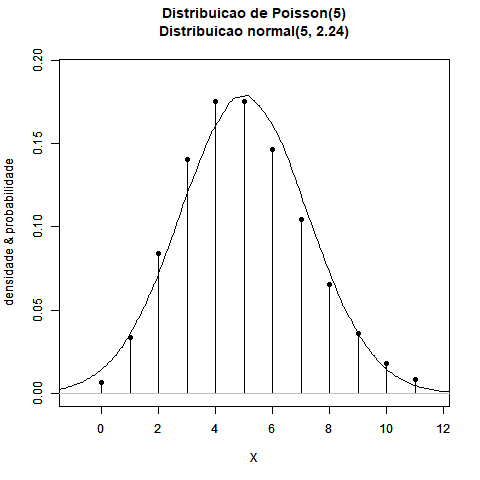
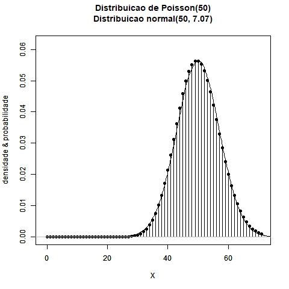

```{r set-options, echo=FALSE}
options(width = 80)
```

```{css, echo=FALSE}
.code {
  font-size: 18px;
  background-color: white;
  border: 2px solid darkgray;
  font-weight: bold;
  max-width: none !important;
}
.output {
  font-size: 18px;
  background-color: white;
  border: 1px solid black;
  font-weight: bold;
  max-width: none !important;
}
.main-container {
  max-width: none !important;
 }
pre {
  max-height: 500px !important;
  overflow-y: auto !important;
  overflow-x: scroll !important;
 }
.bgobs {
  background-color: #a0d8d8;
 }
.bgcodigo {
  background-color: #eeeeee;
 }
.bgsaida {
  background-color: #ecf7db;
 }
```

```{r setup, include=FALSE}
knitr::opts_chunk$set(eval=TRUE,
                      echo=TRUE, 
                      fig.width=7, 
                      fig.height=6,
                      fig.align="center",
                      comment=NA,
                      class.source="code",
                      class.output="output")
```

```{r}
invisible(Sys.setlocale("LC_CTYPE", "pt_BR.UTF-8"))
invisible(Sys.setlocale("LC_ALL", "pt_BR.UTF-8"))
```

```{r eval=TRUE,  echo=TRUE, warning=FALSE, error=FALSE}
options(warn=-1)
suppressMessages(library(knitr, warn.conflicts=FALSE))
suppressMessages(library(readxl, warn.conflicts=FALSE))
suppressMessages(library(finalfit, warn.conflicts=FALSE))
suppressMessages(library(car, warn.conflicts=FALSE))
suppressMessages(library(GGally, warn.conflicts=FALSE))
suppressMessages(library(ggplot2, warn.conflicts=FALSE))
suppressMessages(library(psych, warn.conflicts=FALSE))
suppressMessages(library(DescTools, warn.conflicts=FALSE))
suppressMessages(library(MVN, warn.conflicts=FALSE))
suppressMessages(library(ggpubr, warn.conflicts=FALSE))
suppressMessages(library(HH, warn.conflicts=FALSE))
```

# Material

* HTML de R Markdown em [`RPubs`](http://rpubs.com/josiqueira/){target="_blank"}
* Arquivos em [`GitHub`](https://github.com/josiqueira/EstatMedR){target="_blank"}
* [Prof. José Siqueira: ResearchGate](https://www.researchgate.net/profile/Jose-Siqueira-18){target="_blank"}

# R

* [R no Google Colab](https://colab.research.google.com/#create=true&language=r){target="_blank"}
* [RStudio Cloud](https://rstudio.cloud/plans/free){target="_blank"}

# Módulo 1: Parte 1

* Tipos de variáveis e apresentação dos dados. 
* Estatística descritiva e apresentação dos resultados por meio de gráficos e tabelas. 
* Medidas de tendência central e de dispersão. 

# Ler planilha 

Os dados da planilha `Biometria_FMUSP.xlsx` foram coletados pelos docentes do curso de Medicina da FMUSP dos estudantes do segundo ano de uma mesma disciplina em três anos consecutivos.

As variáveis do arquivo são ($missing = NA$):

* ID: idenficador do(a) estudante	
* Ano da coleta dos dados: 1, 2, 3	
* Turma: A, B	
* Sexo: Feminino, Masculino	
* Mao: Destro, Canhoto, Ambidestro	
* TipoSang: A+, A-, ...	
* ABO: A, B, AB, O
* AtivFisica: nível de atividade física	
* Sedentarismo: Não, Sim	
* MCT: massa corporal total (kg)
* Estatura: cm	

```{r eval=TRUE,  echo=TRUE, warning=FALSE, error=FALSE}
Dados <- readxl::read_excel(path="Biometria_FMUSP.xlsx",
                            sheet="dados",
                            na=c("NA","na","nA","Na"))
```

# Visualização dos dados

```{r eval=TRUE, echo=TRUE, error=FALSE, warning=FALSE}
print(head(Dados))
print(tail(Dados))
```

# Dados

```{r eval=TRUE,  echo=TRUE, warning=FALSE, error=FALSE}
knitr::kable(Dados[1:10,1:ncol(Dados)], format="markdown")
```

# Estrutura dos dados

```{r eval=TRUE, echo=TRUE, warning=FALSE, error=FALSE}
str(Dados)
```

# Converter variável alfanumérica para fator (nominal)

```{r eval=TRUE, echo=TRUE, warning=FALSE, error=FALSE}
Dados$ID <- factor(Dados$ID)
Dados$Ano <- factor(Dados$Ano)
Dados$Turma <- factor(Dados$Turma)
Dados$Sexo <- factor(Dados$Sexo)
Dados$Mao <- factor(Dados$Mao)
Dados$TipoSang <- factor(Dados$TipoSang)
Dados$ABO <- factor(Dados$ABO)
Dados$AtivFisica <- factor(Dados$AtivFisica,
                           levels=c("sempre_inativo",
                                    "atualmente_inativo",
                                    "baixa_intensidade",
                                    "media_intensidade",
                                    "alta_intensidade"),
                           labels=c("sempre_inativo",
                                    "atualmente_inativo",
                                    "baixa_intensidade",
                                    "media_intensidade",
                                    "alta_intensidade"))
Dados$Sedentarismo <- factor(Dados$Sedentarismo)
Dados$Rh <- factor(Dados$Rh)
str(Dados)
```

# `summary`

```{r eval=TRUE, echo=TRUE, warning=FALSE, error=FALSE}
print(summary(subset(Dados, select=-ID)))
```

## Vídeo: Clima “atípico” em Angola deixa menina do tempo preocupada… mínimas mais altas que as máximas!

* https://www.youtube.com/watch?v=Jp0jJMPWl6g&t=2s

# Exclusão de dados de MCT e Estatura com erros tipográficos de MCT e estatura

```{r eval=TRUE, echo=TRUE, warning=FALSE, error=FALSE}
Dados$MCT[Dados$MCT==max(Dados$MCT,na.rm=TRUE)] <- NA
Dados$Estatura[Dados$Estatura==min(Dados$Estatura,na.rm=TRUE)] <- NA
summary(subset(Dados, select=c(MCT, Estatura)))
Dados.F <- subset(Dados, Sexo=="F")
Dados.M <- subset(Dados, Sexo=="M")
```

# Análise de dados faltantes

```{r eval=TRUE, echo=TRUE, warning=FALSE, error=FALSE}
n.total <- nrow(Dados)
n.completo <- nrow(na.omit(Dados))
n.incompleto <- n.total - n.completo
cat("Numero de casos total = ", n.total, "\n", sep="")
cat("Numero de casos completos = ", n.completo, 
    " (",round(100*n.completo/n.total,2),"%)\n", sep="")
cat("Numero de casos incompletos = ", n.incompleto, 
    " (",round(100*n.incompleto/n.total,2),"%)\n", sep="")
obs.falt <- sum(is.na(Dados))
obs.valid <- sum(!is.na(Dados))
obs.tot <- obs.falt + obs.valid
cat("Numero de observacoes validas = ", obs.valid, 
    " (",round(100*obs.valid/obs.tot,2),"%)\n", sep="")
cat("Numero de observacoes faltantes = ", obs.falt, 
    " (",round(100*obs.falt/obs.tot,2),"%)\n", sep="")
```

# Análise de dados faltantes com `finalfit::missing_pattern`

```{r eval=TRUE, echo=TRUE, warning=FALSE, error=FALSE}
finalfit::missing_pattern(subset(Dados,select=-ID))
```

# `psych::describe` e `table`

```{r eval=TRUE,echo=TRUE, warning=FALSE, error=FALSE}
# item name ,item number, nvalid, mean, sd,
# median, mad (Median Absolute Deviation), 
# min, max, skew, kurtosis, se
print(psych::describe(subset(Dados, select=c(MCT, Estatura))))

table(Dados$TipoSang)
round(table(Dados$TipoSang)/sum(table(Dados$TipoSang),
                                na.rm=TRUE),2)
```

# `tapply`

```{r eval=TRUE, echo=TRUE, warning=FALSE, error=FALSE}
# mean,median,25th and 75th quartiles,min,max
tapply(Dados$MCT,Dados$Sexo,summary)
```

# `psych::describeBy`

```{r eval=TRUE, echo=TRUE, warning=FALSE, error=FALSE}
print(psych::describeBy(subset(Dados,select=c(MCT, Estatura)),
                        group=list(Dados$Sexo),
                        mat=TRUE,
                        digits=2))
print(psych::describeBy(subset(Dados,select=c(MCT, Estatura)),
                        group=list(Dados$Sexo, Dados$ABO),
                        mat=TRUE,
                        digits=2))
print(psych::describeBy(subset(Dados, select=c(MCT, Estatura)),
                        group=list(Dados$ABO, Dados$Sexo),
                        mat=TRUE,
                        digits=2))
```

# `aggregate`

```{r eval=TRUE, echo=TRUE, warning=FALSE, error=FALSE}
print(aggregate(subset(Dados, select=c(MCT, Estatura)),
                by=list(Dados$Sexo),
                FUN=mean,
                na.rm=TRUE))
print(aggregate(subset(Dados, select=c(MCT, Estatura)),
                by=list(Dados$Sexo, Dados$ABO),
                FUN=mean,
                na.rm=TRUE))
print(aggregate(subset(Dados, select=c(MCT, Estatura)),
                by=list(Dados$ABO, Dados$Sexo),
                FUN=mean,
                na.rm=TRUE))
```

# `aggregate` com fórmula

```{r eval=TRUE, echo=TRUE, warning=FALSE, error=FALSE}
print(aggregate(MCT ~ Sexo,
                FUN=median,
                na.rm=TRUE,
                data=Dados))
print(aggregate(MCT ~ Sexo + ABO,
                FUN=median,
                na.rm=TRUE,
                data=Dados))
```

# Média e desvio-padrão: Parte 1

* Higgins JPT, Li T, Deeks JJ (editors). Chapter 6: Choosing effect measures and computing estimates of effect. In: Higgins JPT, Thomas J, Chandler J, Cumpston M, Li T, Page MJ, Welch VA (editors). Cochrane Handbook for Systematic Reviews of Interventions version 6.3 (updated February 2022). Cochrane, 2022. Available from www.training.cochrane.org/handbook. 
  * Table 6.5.a em https://training.cochrane.org/handbook/current/chapter-06

* Suponha que não temos acesso aos dados brutos de MCT. Os dados disponíveis são apresentados na tabela abaixo: 

group |   n |  mean |    sd
:----:|----:|------:|-----:
F     | 230 | 57.63 |  9.05     
M     | 312 | 71.59 | 12.09 

* Quais são os valores da média e desvio-padrão amostrais dos 542 estudantes?

```{r eval=TRUE, echo=TRUE, warning=FALSE, error=FALSE}
m <- (230*57.63 + 312*71.59)/542
cat("Media = ", round(m,2), "\n", sep="")

dp <- sqrt(((230-1)*(9.05^2) + (312-1)*(12.09^2) + 
            (230*312/542)*((57.63-71.59)^2))/(542-1))
cat("Desvio-padrao = ", round(dp,2), " > ", max(9.05,12.09), "\n", sep="")
```

# Média e desvio-padrão: Parte 2

* MCT

   n |  mean |    sd 
----:|------:|------:
 542 | 65.67 |  12.9 

group |   n |  mean |    sd 
:----:|----:|------:|-----:
F     | 230 | 57.63 |  9.05     
M     | 312 | 71.59 | 12.09

```{r eval=TRUE, echo=TRUE, warning=FALSE, error=FALSE}
m <- (230*57.63 + 312*71.59)/542
cat("Media = ", round(m,2), "\n", sep="")

dp <- sqrt(((230-1)*9.05^2 + (312-1)*12.09^2 + 
            (230*312/542)*(57.63-71.59)^2)/(542-1))
cat("Desvio-padrao = ", round(dp,2), "\n", sep="")

dp <- sqrt((230*9.05^2 + 312*12.09^2 + 
           230*(57.63-65.67)^2 + 312*(71.59-65.67)^2)/542)
cat("Desvio-padrao = ", round(dp,2), "\n", sep="")
```

$$\bar{x} = \dfrac{n_F \, \bar{x}_F + n_M \, \bar{x}_M}{n_F + n_M}$$

$$\begin{align}
s&=\sqrt{\dfrac{(n_F-1)\,s_F^2+(n_M-1)\,s_M^2+\dfrac{n_F\;n_M}{n_F+n_M}\left(\bar{x}_F-\bar{x}_M\right)^2}{n_F+n_M-1}}\\
s&=\sqrt{\dfrac{n_F\,s_F^2+n_M\,s_M^2+n_F\,\left(\bar{x}_F-\bar{x}\right)^2+n_M\,\left(\bar{x}_M-\bar{x}\right)^2}{n_F+n_M}}\\
s&=\sqrt{\dfrac{n_F\,\left(s_F^2+\left(\bar{x}_F-\bar{x}\right)^2\right)+n_M\,\left(s_M^2+\left(\bar{x}_M-\bar{x}\right)^2\right)}{n_F+n_M}}
\end{align}$$

# "Dotplot" com `plot` & `table`

```{r eval=TRUE, echo=TRUE, warning=FALSE, error=FALSE}
plot(Dados$Sexo, xlab="Sexo", ylab="Freq")
plot(Dados$TipoSang, xlab="Tipo Sanguineo", ylab="Freq")
plot(Dados$Sedentarismo, xlab="Sedentarismo", ylab="Freq")
plot(table(Dados$MCT), xlab="Massa corporal total (kg)", ylab="Freq")
plot(table(Dados$Estatura), xlab="Estatura (cm)", ylab="Freq")
```

# Gráfico de setores

```{r eval=TRUE, echo=TRUE, warning=FALSE, error=FALSE}
table(Dados$Sexo)
pie(table(Dados$Sexo), 
    xlab="Sexo")
table(Dados$ABO)
pie(table(Dados$ABO), 
    xlab="ABO")
```

# Tabela de contingência 2x2

```{r eval=TRUE, echo=TRUE, warning=FALSE, error=FALSE}
print(Sedentarismo.Sexo <- xtabs(~Sedentarismo+Sexo, data=Dados))
margin.table(Sedentarismo.Sexo,1)
margin.table(Sedentarismo.Sexo,2)
round(proportions(Sedentarismo.Sexo),2)
round(proportions(Sedentarismo.Sexo,1),2)
round(proportions(Sedentarismo.Sexo,2),2)
plot(Dados$Sedentarismo~Dados$Sexo, xlab="Sexo", ylab="Sedentarismo")
mosaicplot(~Sexo+Sedentarismo, data=Dados, color=FALSE)
barplot(Sedentarismo.Sexo,
        beside=TRUE, 
        legend.text=rownames(Sedentarismo.Sexo),
        ylab="Freq",
        xlab="Sexo x Sedentarismo")
barplot(proportions(Sedentarismo.Sexo),
        beside=TRUE, 
        legend.text=rownames(Sedentarismo.Sexo),
        ylab="Freq",
        xlab="Sexo x Sedentarismo")
sexo.ABO.freq <- as.data.frame(table(Dados$Sexo, Dados$ABO))
names(sexo.ABO.freq) <- c("Sexo", "ABO", "Freq")
ggpubr::ggbarplot(sexo.ABO.freq, 
                  x="ABO", 
                  y="Freq",
                  color="Sexo",
                  palette=c("gray", "black"),
                  order=c("A", "B", "AB", "O"),
                  width=.7)
ggpubr::ggbarplot(sexo.ABO.freq, 
                  x="ABO", 
                  y="Freq",
                  color="Sexo",
                  palette=c("gray", "black"),
                  order=c("A", "B", "AB", "O"),
                  position = ggplot2::position_dodge(),
                  width=.7)
```

# Tabela de contingência 2x4

```{r eval=TRUE, echo=TRUE, warning=FALSE, error=FALSE}
print(ABO.Sexo <- xtabs(~ABO+Sexo, data=Dados))
round(proportions(ABO.Sexo),2)
round(proportions(ABO.Sexo,1),2)
round(proportions(ABO.Sexo,2),2)
mosaicplot(~Sexo+ABO, data=Dados, color=FALSE)
barplot(ABO.Sexo,
        beside=TRUE, 
        legend.text=rownames(ABO.Sexo),
        ylab="Freq",
        xlab="Sexo x ABO")
barplot(proportions(ABO.Sexo),
        beside=TRUE, 
        legend.text=rownames(ABO.Sexo),
        ylab="Freq",
        xlab="Sexo x ABO")
```

# Tabela multivariada: mais de duas variáveis categóricas

```{r eval=TRUE, echo=TRUE, warning=FALSE, error=FALSE}
print(xtabs(~Sexo + Sedentarismo + ABO, data=Dados))
ftable(Sexo + Sedentarismo ~ ABO, data=Dados)
mosaicplot(xtabs(~Sexo + Sedentarismo + ABO, data=Dados))
```

# Boxplot

```{r eval=TRUE, echo=TRUE, warning=FALSE, fig.align="center",  out.width="60%"}
knitr::include_graphics("./image/IQR.png")
```

```{r eval=TRUE, echo=TRUE, warning=FALSE, error=FALSE}
boxplot(Dados$MCT, horizontal=TRUE, 
        xlab="MCT (kg)")
rug(jitter(Dados$MCT))
boxplot(MCT~Sexo, data=Dados, horizontal=TRUE, 
        xlab="MCT (kg)")
boxplot(MCT~Sexo+Sedentarismo, data=Dados, horizontal=TRUE, 
        xlab="MCT (kg)")
boxplot(MCT~Sexo+Sedentarismo+Mao, data=Dados, horizontal=TRUE, 
        xlab="MCT (kg)", cex=0.6)
ggpubr::ggboxplot(data=Dados, 
                  y="MCT")
ggpubr::ggboxplot(data=Dados,
                  x="Sexo",
                  y="MCT", 
                  add="",
                  orientation="horizontal",
                  width=.7,
                  order=c("F", "M"))
ggpubr::ggboxplot(data=Dados,
                  x="Sexo",
                  y="MCT", 
                  add="",
                  orientation="horizontal",
                  width=.7,
                  order=c("M", "F"))
ggpubr::ggboxplot(data=Dados,
                  x="Sexo",
                  y="MCT", 
                  add="jitter",
                  orientation="horizontal",
                  width=.7,
                  order=c("F", "M"))
ggpubr::ggboxplot(data=Dados,
                  x="ABO",
                  y="MCT", 
                  add="",
                  orientation="horizontal",
                  width=.7,
                  select=c("A", "B", "O"),
                  order=c("O", "B", "A"))
```

# Bagplot: boxplot bidimensional

```{r eval=TRUE,  echo=TRUE, warning=FALSE, error=FALSE}
bgp.F <- DescTools::PlotBag(Dados.F$Estatura, 
                            Dados.F$MCT,
                            main=paste("Feminino"),
                            xlab="Estatura (cm)",
                            ylab="Massa Corporal Total (kg)",
                            na.rm = TRUE,
                            show.bagpoints=FALSE,
                            show.looppoints=FALSE,
                            show.whiskers=FALSE,
                            col.loophull = "white",
                            col.looppoints = "black", 
                            col.baghull = "white",
                            col.bagpoints = "black",
                            cex=1)
print(outliers.F <- as.data.frame(bgp.F$pxy.outlier))
for (o in 1:nrow(outliers.F))
{
  r.F <- which(Dados.F$Estatura==outliers.F$x[o] & 
               Dados.F$MCT==outliers.F$y[o])
  text(outliers.F$x[o],outliers.F$y[o], r.F, pos=1, cex=0.7)
}

bgp.M <- DescTools::PlotBag(Dados.M$Estatura, 
                          Dados.M$MCT,
                          main=paste("Masculino"),
                          xlab="Estatura (cm)",
                          ylab="Massa Corporal Total (kg)",
                          na.rm = TRUE,
                          show.bagpoints=FALSE,
                          show.looppoints=FALSE,
                          show.whiskers=FALSE,
                          col.loophull = "white",
                          col.looppoints = "black", 
                          col.baghull = "white",
                          col.bagpoints = "black",
                          cex=1)
print(outliers.M <- as.data.frame(bgp.M$pxy.outlier))
for (o in 1:nrow(outliers.M))
{
  r.M <- which(Dados.M$Estatura==outliers.M$x[o] & 
                 Dados.M$MCT==outliers.M$y[o])
  text(outliers.M$x[o], outliers.M$y[o], r.M, pos=1, cex=0.7)
}
```

# Histograma

Um histograma é uma representação gráfica da distribuição de um conjunto de dados. Ele é utilizado para mostrar a frequência com que diferentes intervalos de valores ocorrem em um conjunto de dados. A estrutura básica de um histograma inclui:

1. **Eixo X (Horizontal)**: Este eixo representa os intervalos (ou "bins") nos quais os dados são agrupados. Cada intervalo abrange uma faixa específica de valores.
2. **Eixo Y (Vertical)**: Este eixo mostra a frequência (ou contagem) de dados que se enquadram em cada intervalo.

Para construir um histograma:
- Primeiro, os dados são divididos em intervalos não sobrepostos.
- Em seguida, contam-se quantos dados caem em cada intervalo.
- Finalmente, retângulos (ou barras) são desenhados para cada intervalo, onde a altura de cada barra é proporcional à frequência de dados naquele intervalo.

```{r eval=TRUE,  echo=TRUE, warning=FALSE, error=FALSE}
hist(Dados$MCT)
rug(jitter(Dados$MCT))
```

```{r out.width='90%', echo=FALSE}
knitr::include_graphics("./image/Hist.png")
```

* Silveira, PSP & Siqueira, JO (2022) Histogram lies about distribution shape and Pearson’s coefficient of variation lies about relative variability. _The Quantitative Methods for Psychology_ 18(1). DOI 10.20982/tqmp.18.1.p091 

* How to Lie with Histograms
  * https://www.rossidata.com/LinLog
  
```{r out.width='100%', echo=FALSE}
knitr::include_graphics("./image/H1.png")
knitr::include_graphics("./image/H2.png")
knitr::include_graphics("./image/H3.png")
knitr::include_graphics("./image/H8.png")
knitr::include_graphics("./image/H7.png")
knitr::include_graphics("./image/H5.png")
```  

# Gráfico de densidade

```{r eval=TRUE, echo=TRUE, warning=FALSE, error=FALSE}
car::densityPlot(~MCT, data=Dados)
car::densityPlot(MCT~Sexo, data=Dados, 
                 col=c("black","black"))
car::densityPlot(MCT~Sedentarismo, data=Dados.F, 
                 col=c("black","black"),
                 main="Feminino")
car::densityPlot(MCT~Sedentarismo, data=Dados.M, 
                 col=c("black","black"),
                 main="Masculino")
car::densityPlot(MCT~ABO, data=Dados.F,
                 main="Feminino")
car::densityPlot(MCT~ABO, data=Dados.M,
                 main="Masculino")
```

# Gráfico de distribuição de probabilidade: ECDF plot

```{r eval=TRUE, echo=TRUE, warning=FALSE, error=FALSE}
ggpubr::ggecdf(data=Dados,
               x="MCT",
               linetype="Sexo")
```
               
# Gráfico de dispersão com `sunflowerplot`

```{r eval=TRUE, echo=TRUE, warning=FALSE, error=FALSE}
sunflowerplot(MCT~Estatura,
              data=Dados.F, 
              rotate=TRUE, 
              pch=1,
              size=.1,
              col="black", 
              seg.col="black", 
              seg.lwd=.8)
sunflowerplot(MCT~Estatura,
              data=Dados.M, 
              rotate=TRUE, 
              pch=2,
              size=.1,
              col="black", 
              seg.col="black", 
              seg.lwd=.8,
              add=FALSE)

sunflowerplot(MCT~Estatura,
              data=Dados.F, 
              rotate=TRUE, 
              pch=1,
              size=.1,
              col="black", 
              seg.col="black", 
              seg.lwd=.8)
sunflowerplot(MCT~Estatura,
              data=Dados.M, 
              rotate=TRUE, 
              pch=2,
              size=.1,
              col="black", 
              seg.col="black", 
              seg.lwd=.8,
              add=TRUE)
```

# Gráfico de dispersão com `car::scatterplot`

```{r eval=TRUE, echo=TRUE, warning=FALSE, error=FALSE}
car::scatterplot(MCT~Estatura,
                 group=Dados$Sexo, 
                 regLine=FALSE, 
                 smooth=FALSE, 
                 ellipse=FALSE,
                 grid=FALSE,
                 col="black",
                 xlim=c(145,200),
                 ylim=c(30,130),
                 data=Dados)
car::scatterplot(MCT~Estatura,
                 group=Dados$Sexo, 
                 regLine=FALSE, 
                 smooth=FALSE, 
                 boxplots=TRUE, 
                 ellipse=list(levels=c(0.68), 
                              robust=TRUE, 
                              fill=FALSE, 
                              fill.alpha=0.2),
                 grid=FALSE,
                 col="black",
                 xlim=c(145,200),
                 ylim=c(30,130),
                 data=Dados)
car::scatterplot(MCT~Estatura,
                 group=Dados$Sexo, 
                 regLine=FALSE, 
                 smooth=FALSE, 
                 ellipse=list(levels=c(0.68,0.95), 
                              robust=TRUE, 
                              fill=FALSE, 
                              fill.alpha=0.2),
                 grid=FALSE,
                 col="black",
                 xlim=c(145,200),
                 ylim=c(30,130),
                 data=Dados)
car::scatterplot(MCT~Estatura,
                 group=Dados$Sexo, 
                 regLine=TRUE, 
                 smooth=FALSE, 
                 ellipse=FALSE,
                 grid=FALSE,
                 col="black",
                 xlim=c(145,200),
                 ylim=c(30,130),
                 data=Dados)
```

# Gráfico matricial

```{r eval=TRUE, echo=TRUE, warning=FALSE, error=FALSE}
car::scatterplotMatrix(Dados[,c("Estatura",
                               "MCT")], 
                       groups=Dados$Sexo,
                       regLine=TRUE, 
                       smooth=FALSE, 
                       boxplots=TRUE, 
                       by.groups=TRUE,
                       ellipse=list(levels=c(0.5), 
                                    robust=TRUE, 
                                    fill=FALSE),
                       grid=FALSE,
                       col=c("#666666","#888888","#cccccc"), 
                       cex=0.5,
                       cex.labels=1,
                       row1attop=TRUE)
GGally::ggpairs(subset(Dados, 
                       select=-c(ID,Ano,Turma,Mao,TipoSang,
                                 ABO,AtivFisica)), 
                ggplot2::aes(colour=Sexo))
```

# Gráficos avançados

* ggplot2
  * https://ggplot2.tidyverse.org/
* Módulo V:  Gráficos com ggplot2 por Bruno Lucian & Claudia Jakelline
  * https://bookdown.org/bruno_lucian_costa/CursoBasicoR/m5.html#gr%C3%A1ficos-com-ggplot2
* ggplot2 - Essentials
  * http://www.sthda.com/english/wiki/ggplot2-essentials
* The R Graph Gallery
  * https://r-graph-gallery.com/index.html
* Advanced plotting by Jeff Powell and Remko Duursma 
  * http://www.hiercourse.com/advancedplot
  * http://www.hiercourse.com/docs/advanced_plotting.html
* Chapter 19. Advanced graphics with ggplot2
  * https://livebook.manning.com/book/r-in-action-second-edition/chapter-19/1
* Top 50 ggplot2 Visualizations - The Master List (With Full R Code)
  * http://r-statistics.co/Top50-Ggplot2-Visualizations-MasterList-R-Code.html

# Teste de distribuição normal 

```{r eval=TRUE, echo=TRUE, warning=FALSE, error=FALSE}
result <- MVN::mvn(data=subset(Dados, 
                               select=c(Sexo, MCT, Estatura)), 
                   subset="Sexo", 
                   mvnTest="hz", 
                   univariateTest="SW")
result$multivariateNormality
result$univariateNormality
```

# Script R completo

```{r eval=TRUE, echo=TRUE, class.output="bgcodigo"}
  cat(readLines("Modulo1.R"), sep="\n")
```

# Módulo 1: Parte 2

* Descrição dos princípios básicos de probabilidade e as formas mais comuns de distribuição de probabilidade. 
* Conceitos de distribuição normal, [Poisson e] binomial.

# Distribuição de probabilidade

* Distribuição de probabilidade é uma maneira estatística de expressar a incerteza dos eventos de uma variável.
* A variável pode ter dois ou mais eventos mutuamente excludentes.
* O conjunto de eventos pode ser discreto ou contínuo, finito ou infinito.
* As probabilidades dos eventos variam de 0 (exclusive) a 1 (exclusive).
* A soma das probabilidades dos eventos é igual a 1. 
* E.g.: Variável discreta finita 
  * Sexo de recém-nascido: $P(Masc) = 0.51$ e $P(Fem) = 0.49$.
* E.g.: Variável discreta infinita 
  * Número de recém-nascidos (vivos) por dia no estado de São Paulo: $média = 2000/dia$.
* E.g.: Variável contínua 
  * MCT de recém-nascido: mínimo = 1300 g, máximo = 4300 g, média = 3200 g e desvio-padrão = 400 g.
 
# Distribuição binomial

* Distribuição de probabilidade de variável discreta finita $X$
* $n=1,2,3,...$: número de realizações independentes do experimento
* Cada repetição do experimento produz um de dois resultados possíveis, denominados genericamente de sucesso (S) e fracasso (F)
* A probabilidade de sucesso, $P(S) = p$, é constante em cada repetição. 
* A probabilidade de fracasso, $P(F) = 1 – p$, é constante em cada repetição. 
* $X \sim binomial(n, p)$ : variável aleatória $X$ com distribuição binomial representando o número de sucessos em $n$ repetições do experimento; $X=0,...,n$
* Média de $X$: $n p$
* Desvio-padrão de $X$: $\sqrt{n p (1 – p)}$

```{r eval=TRUE, echo=TRUE}
k <- 0:10
plot(k,dbinom(x=k,size=10,prob=.45),
     type='h',
     main='Distribuicao binomial(n=10, p=0.3)',
     ylab='Probabilidade',
     xlab ='Numero de sucessos',
     lwd=3)
```

# Exemplo de distribuição binomial

## Fator Rh 

"Além da classificação comum de sangue nos grupos A, B, AB e O, é importante a subdivisão de acordo com uma substância chamada fator Rhesus (Rh), que pode ser positivo (Rh+) ou negativo (Rh-). Podem ocorrer reações de incompatibilidade em transfusões de sangue. Por exemplo, um indivíduo Rh- só deve receber transfusão de sangue Rh-. Caso receba sangue Rh+, haverá sua sensibilização e a formação de anticorpos anti-Rh. Além disso, pode acontecer incompatibilidade Rh entre o sangue materno e o fetal. Aproximadamente 85% da população são Rh+, os outros 15% são Rh-.'' 

> Siqueira & Tibúrcio, 2011, p. 198-9

> Siqueira, AL & Tibúrcio, JD (2011) _Estatística na Área de Saúde: conceitos, metodologia, aplicações e prática computacional_. BH: Coopmed.

* $n = 3$ é o número de pacientes que realizarão um transplante.
* $X$ é o número de pacientes com Rh- que realizarão um transplante (sucesso), variando de 0 e 3.
* $P(Rh^-) = 0.15$
* $X \sim binomial(3, 0.15)$

```{r eval=TRUE, echo=TRUE, warning=FALSE}
source("exemplo01_binomial.R")
```

```{r eval=TRUE, echo=TRUE, class.output="bgcodigo"}
  cat(readLines("exemplo01_binomial.txt"), sep="\n")
```

```{r eval=TRUE, echo=TRUE, warning=FALSE, fig.align="left",  out.width="60%"}

```

```{r eval=TRUE, echo=TRUE, class.output="bgcodigo"}
  cat(readLines("exemplo01_binomial.R"), sep="\n")
```

# Distribuição binomial: Questão 1

Qual é a probabilidade que nenhum paciente que realizará transplante seja Rh-?

R.: $P(X=0) = 0.61$ 

```{r eval=TRUE, echo=TRUE}
dbinom(x=0, size=3, prob=0.15)
```

# Distribuição binomial: Questão 2

Qual é a probabilidade que pelo menos um paciente que realizará transplante seja Rh-?

R.: $1 – P(X=0) = 1 – 0.61 = 0.39$

```{r eval=TRUE, echo=TRUE}
1 - dbinom(x=0, size=3, prob=0.15)
```

# Distribuição binomial: Questão 3

Qual é a probabilidade que todos os pacientes que realizarão transplante sejam Rh-?

R.: $P(X=3) = 0.003$

```{r eval=TRUE, echo=TRUE}
dbinom(x=3, size=3, prob=0.15) 
```

# Distribuição de Poisson

* Distribuição de probabilidade de variável discreta infinita $X$
* A distribuição de Poisson surge de um experimento de contagem de $X$ ocorrências de um evento de interesse por determinado período de tempo, área ou volume.
* $X \sim Poisson(\lambda)$: variável aleatória $X$ representando o número de ocorrências do evento com  distribuição de Poisson de taxa média de ocorrências $\lambda$
* $X=0,1,2,...$
* Média de $X$: $\lambda$
* Desvio-padrão de $X$: $\sqrt{\lambda}$
* Suposições
  * Modela evento raro;
  * As condições permanecem estáveis no decorrer do tempo ou espaço, i.e., a taxa média de ocorrências,$\lambda$, é constante;
  * Intervalos de tempo ou espaço disjuntos são independentes, i.e., a informação sobre o número de ocorrências num intervalo nada revela sobre o número de ocorrências em outro intervalo;
  * A probabilidade de ocorrência de um evento em um certo intervalo é a mesma para todos os demais intervalos de tempo;
  * A probabilidade de ocorrência dos eventos é proporcional ao tamanho do intervalo;
  * Em uma porção infinitesimal do intervalo, a probabilidade de mais de uma ocorrência do evento é desprezível.
  
```{r eval=TRUE, echo=TRUE}
k <- 0:10
plot(k,dpois(x=k,lambda=2),
     type='h',
     main='Distribuicao de Poisson(lambda=2)',
     ylab='Probabilidade',
     xlab ='x',
     lwd=3)
```

# Exemplo de distribuição de Poisson: 1

## Número de atendimentos completos em pronto-atendimento 

O número de pacientes que têm atendimento completo num pronto-socorro de uma pequena cidade durante uma madrugada, $X$, tem distribuição de Poisson com taxa média $\lambda=3$.

Portanto, 

* $X \sim Poisson(3)$
* Média de $X$: $3$
* Desvio-padrão de $X$: $\sqrt{3} \approx 1.732$

Se forem consideradas duas madrugadas, a taxa média de atendimentos completos é $6 = 2 \times 3$. 

Num mês espera-se que a taxa média de atendimentos completos durante a madrugada seja $90 = 30 \times 3$.

> Siqueira & Tibúrcio, 2011, p. 201-2

```{r eval=TRUE, echo=TRUE, warning=FALSE}
source("exemplo02_Poisson.R")
```

```{r eval=TRUE, echo=TRUE, class.output="bgcodigo"}
  cat(readLines("exemplo02_Poisson.txt"), sep="\n")
```

```{r eval=TRUE, echo=TRUE, warning=FALSE, fig.align="left",  out.width="60%"}

```

```{r eval=TRUE, echo=TRUE, class.output="bgcodigo"}
  cat(readLines("exemplo02_Poisson.R"), sep="\n")
```

# Distribuição de Poisson: Questão 1

Qual é a probabilidade que nenhum paciente tenha atendimento completo durante uma madrugada no pronto-atendimento dessa pequena cidade?

R.: $P(X=0) = 0.05$ 

```{r eval=TRUE, echo=TRUE}
dpois(x=0, lambda=3)
```

# Distribuição de Poisson: Questão 2

Qual é a probabilidade que pelo menos um paciente tenha atendimento completo durante uma madrugada no pronto-atendimento dessa pequena cidade?

R.: $1 – P(X=0) = 1 – 0.05 = 0.95$ 

```{r eval=TRUE, echo=TRUE}
1 - dpois(x=0, lambda=3)
```

# Distribuição de Poisson: Questão 3

Qual é a probabilidade que mais de dez pacientes tenham atendimento completo durante uma madrugada no pronto-atendimento dessa pequena cidade?

R.: $P(X>10) = 0.0003$ 

```{r eval=TRUE, echo=TRUE}
ppois(q=10, lambda=3, lower.tail=FALSE)
# OU
1 - ppois(q=10, lambda=3)
```

# Exemplo de distribuição de Poisson: 2

## Exemplo: Número de consultas médicas anual de plano de saúde 

> Siqueira & Tibúrcio, 2011, p. 202

O número de consultas médicas anual de um associado de um plano de saúde é finito.

No entanto, uma aproximação pode ser feita supondo que o número de consultas anual de um associado pode ser infinito.

Num plano de saúde com 5694 filiados, ao fim de um ano foram realizadas 13098 consultas, conforme tabela a seguir:

Número de consultas anuais de um associado	| Frequência
:------------------- | :----------
0	                  | 589
1	                  | 1274
2	                  | 1542
3	                  | 1144
4                   |	663
5	                  | 304
6	                  | 126
7	                  | 39
8	                  | 10
9	                  | 3

$$\begin{align}
\lambda&=\dfrac{0\times589+1\times1274+\cdots+9\times3}{589+1274+\cdots+3}\\
\lambda&=2.3 \;\text{consultas por associado por ano}
\end{align}$$

O valor 2.3 é o número médio de consultas anual de um associado típico deste plano de saúde.

```{r eval=TRUE, echo=TRUE, warning=FALSE}
source("exemplo03_Poisson.R")
```

```{r eval=TRUE, echo=TRUE, class.output="bgcodigo"}
  cat(readLines("exemplo03_Poisson.txt"), sep="\n")
```

```{r eval=TRUE, echo=TRUE, warning=FALSE, fig.align="left",  out.width="60%"}

```

```{r eval=TRUE, echo=TRUE, class.output="bgcodigo"}
  cat(readLines("exemplo03_Poisson.R"), sep="\n")
```

# Distribuição normal (gaussiana)

* Distribuição de probabilidade de variável contínua ilimitada bilateralmente $X$
* $X \sim normal(\mu,\sigma)$: variável aleatória $X$ representa valores contínuos reais
* $X\in\Re$
* Média de $X$: $\mu$
* Desvio-padrão de $X$: $\sigma$
* O desvio-padrão, $\sigma$, é a distância entre a média, $\mu$, e o ponto de inflexão da curva da normal
* A curva da normal é unimodal
* A curva da normal é simétrica 

```{r fig.align="center", out.width = '80%', out.height = '70%', echo=FALSE}
knitr::include_graphics("./image/normalpadrao.png")
```


# Variável com distribuição normal

* Variável bruta ou com transformação potência de Tukey (e.g., logaritmo, raiz quadrada)

* Somatométrica
  * Massa corporal total 
  * Comprimento total/ estatura
  * Comprimento de garra, presa, unha, pelo
  * Medidas fisiológicas: pressão sanguínea de humanos adultos
* Psicológica
  * Escore de teste cognitivo: QI
* Física
  * A soma de pequenos erros independentes de mensuração 

```{r fig.align="center", out.width = '50%', out.height = '40%', echo=FALSE, fig.cap="Figure 1. Line graphs show smoothed weighted frequency distribution, median, and 90th percentile of systolic pressures for populations 18 to 29 years and 60 to 74 years of age in the United States, 1960 to 1991. (Source: Centers for Disease Control and Prevention, National Center for Health Statistics.); https://www.ahajournals.org/doi/10.1161/01.HYP.26.1.60"}
knitr::include_graphics("./image/PA.png")
```

```{r fig.align="center", out.width = '50%', out.height = '50%', echo=FALSE}
knitr::include_graphics("./image/Lee2015.png")
```

```{r fig.align="center", out.width = '90%', out.height = '90%', echo=FALSE}
knitr::include_graphics("./image/Lee2015distrib.png")
```

# Exemplo de distribuição de normal: 1

## Pressão arterial sistólica de jovens saudáveis 

A pressão arterial sistólica (PAS) medida em milímetro de mercúrio (mmHg) em jovens gozando de boa saúde tem distribuição $normal(120,10)$.

> Siqueira & Tibúrcio, 2011, p. 2010-1

```{r eval=TRUE, echo=TRUE, warning=FALSE}
source("exemplo05_normal.R")
```

```{r eval=TRUE, echo=TRUE, class.output="bgcodigo"}
  cat(readLines("exemplo05_normal.txt"), sep="\n")
```

```{r eval=TRUE, echo=TRUE, warning=FALSE, fig.align="left",  out.width="60%"}

```

```{r eval=TRUE, echo=TRUE, class.output="bgcodigo"}
  cat(readLines("exemplo05_normal.R"), sep="\n")
```

# Distribuição normal: Questão 1

Qual é a probabilidade que nenhum paciente tenha atendimento completo durante uma madrugada no pronto-atendimento dessa pequena cidade?

R.: $P(X > 140) = 0.023$ 

```{r eval=TRUE, echo=TRUE}
print(p <- pnorm(q=140, mean=120, sd=10, lower.tail=FALSE))
# OU
1-pnorm(q=140, mean=120, sd=10)
DescTools::PlotProbDist(breaks=c(80,140,160), 
                        function(x) dnorm(x, mean=120, sd=10), 
                        blab=c(140), 
                        alab=c("",round(p,3)),
                        xlim=c(80,160),
                        main="normal(120,10)",
                        col=c("black", "black"), 
                        density=c(0,20))
```

# Distribuição normal: Questão 2

Qual é a probabilidade dos valores de PAS de jovens sadios estarem entre 100 e 140 mmHg?

R.: $P(100 < X < 140) = 0.9545$ 

```{r eval=TRUE, echo=TRUE}
print(p <- pnorm(q=140, mean=120, sd=10)-pnorm(q=100, mean=120, sd=10))
DescTools::PlotProbDist(breaks=c(80,100,140,160), 
                        function(x) dnorm(x, mean=120, sd=10), 
                        blab=c(100,140), 
                        alab=c("",round(p,4),""),
                        xlim=c(80,160),
                        main="normal(120,10)",
                        col=c("black", "black"), 
                        density=c(0,20,0))
```

# Distribuição normal: Questão 3

Quais são os limites de um intervalo simétrico em relação à média que engloba 95% dos valores de PAS de jovens sadios?

R.: $P(100.4 < X < 139.6) = 0.95$ 

```{r eval=TRUE, echo=TRUE}
qnorm(p=0.025, mean=120, sd=10)
qnorm(p=0.975, mean=120, sd=10)
q1 <- round(qnorm(p=0.025, mean=120, sd=10),2)
q2 <- round(qnorm(p=0.975, mean=120, sd=10),2)
DescTools::PlotProbDist(breaks=c(80,q1,q2,160), 
                        function(x) dnorm(x, mean=120, sd=10), 
                        blab=c(q1,q2), 
                        alab=c("",0.95,""),
                        xlim=c(80,160),
                        main="normal(120,10)",
                        col=c("black", "black"), 
                        density=c(0,20,0))
```

# Relações entre distribuições de probabilidade

* [Relationships among probability distributions: Wikipedia](https://en.wikipedia.org/wiki/Relationships_among_probability_distributions){target="_blank"}

* [`Univariate Distribution Relationships` ](https://www.math.wm.edu/~leemis/chart/UDR/UDR.html){target="_blank"}

```{r echo=FALSE, out.width="80%", fig.cap="Relações da distribuição normal com outras distribuições discretas e contínuas."}
knitr::include_graphics("./image/Normal_Relacoes.png")
```

```{r eval=TRUE, echo=FALSE, warning=FALSE, fig.align="left",  out.width="100%"}
knitr::include_graphics("./image/DistribRelations.png")
```

# Aproximação da binomial pela Poisson

$X \sim binomial(n,p)$

Se $n > 20$ e $p<0.05$, então a binomial é aproximadamente igual à Poisson$(np)$.

```{r eval=TRUE, echo=TRUE, warning=FALSE}
source("exemplo09_binomial_aproxPois_n10p10.R")
```

```{r eval=TRUE, echo=TRUE, class.output="bgcodigo"}
cat(readLines("exemplo09_binomial_aproxPois_n10p10.txt"), sep="\n")
```

```{r eval=TRUE, echo=TRUE, warning=FALSE, fig.align="left",  out.width="60%"}

```

```{r eval=TRUE, echo=TRUE, warning=FALSE}
source("exemplo09_binomial_aproxPois_n30p3.R")
```

```{r eval=TRUE, echo=TRUE, class.output="bgcodigo"}
cat(readLines("exemplo09_binomial_aproxPois_n30p3.txt"), sep="\n")
```

```{r eval=TRUE, echo=TRUE, warning=FALSE, fig.align="left",  out.width="60%"}

```

```{r eval=TRUE, echo=TRUE, class.output="bgcodigo"}
cat(readLines("exemplo09_binomial_aproxPois_n30p3.R"), sep="\n")
```

# Aproximação da binomial pela Poisson: Questão 1

## Anestésico

Uma em cada mil pessoas que utilizam determinado anestésico sofre uma reação negativa (choque).

Num total de 500 cirurgias em que se empregou esse anestésico, a probabilidade de que uma pessoa sofra a reação negativa é:

R.: $0.3$

Como $n = 500 > 20$ e $p = 1/1000 \le 0.05$, então a $binomial(500,1/1000)$ é aproximadamente igual à Poisson$(500\times(1/1000))$.

```{r eval=TRUE, echo=TRUE}
dbinom(x=1, size=500, prob=1/1000)
dpois(x=1,lambda=500*(1/1000))
```

> Arango, 2012, p. 187

> ARANGO, HG (2012) _Bioestatística_. 3a ed. RJ: Guanabara Koogan.

# Aproximação da binomial pela Poisson: Questão 2

## Anestésico

Uma em cada mil pessoas que utilizam determinado anestésico sofre uma reação negativa (choque).

Num total de 500 cirurgias em que se empregou esse anestésico a probabilidade de que nenhuma pessoa sofra a reação negativa é:

R.: $0.61$

Como $n = 500 > 20$ e $p = 1/1000 \le 0.05$, então a $binomial(500,1/1000)$ é aproximadamente igual à Poisson$(500\times(1/1000))$.

```{r eval=TRUE, echo=TRUE}
dbinom(x=0, size=500, prob=1/1000)
dpois(x=0,lambda=500*(1/1000))
```

# Aproximação da binomial pela Poisson: Questão 3

## Anestésico

Uma em cada mil pessoas que utilizam determinado anestésico sofre uma reação negativa (choque).

Num total de 500 cirurgias em que se empregou esse anestésico a probabilidade de que mais de uma pessoa sofra a reação negativa é:

R.: $0.09$

Como $n = 500 > 20$ e $p = 1/1000 \le 0.05$, então a $binomial(500,1/1000)$ é aproximadamente igual à Poisson$(500\times(1/1000))$.

```{r eval=TRUE, echo=TRUE}
1-pbinom(q=1, size=500, prob=1/1000)
1-ppois(q=1, lambda=500*(1/1000))
```

# Aproximação da binomial pela normal

* $X \sim binomial(n, p)$
* Se 
  * $np > 5$ e 
  * $n(1-p) > 5$ e 
  * ${\frac{1}{\sqrt{n}} \left|\sqrt{\frac{1-p}{p}}-\sqrt{\frac{p}{1-p}}\right|} < 0.3$, 
* $binomial(n, p)$ é aproximadamente igual à 
$normal\left(np, \sqrt{np(1-p)}\right)$

```{r eval=TRUE, echo=TRUE, warning=FALSE}
source("exemplo07_binomial_aproxnormal_n6.R")
```

```{r eval=TRUE, echo=TRUE, class.output="bgcodigo"}
cat(readLines("exemplo07_binomial_aproxnormal_n6.txt"), sep="\n")
```

```{r eval=TRUE, echo=TRUE, warning=FALSE, fig.align="left",  out.width="60%"}

```

```{r eval=TRUE, echo=TRUE, warning=FALSE}
source("exemplo07_binomial_aproxnormal_n30.R")
```

```{r eval=TRUE, echo=TRUE, class.output="bgcodigo"}
cat(readLines("exemplo07_binomial_aproxnormal_n30.txt"), sep="\n")
```

```{r eval=TRUE, echo=TRUE, warning=FALSE, fig.align="left",  out.width="60%"}

```

```{r eval=TRUE, echo=TRUE, class.output="bgcodigo"}
cat(readLines("exemplo07_binomial_aproxnormal_n30.R"), sep="\n")
```

# Aproximação da Poisson pela normal

$X \sim Poisson(\lambda)$

Se $\lambda > 10$, então a binomial é aproximadamente igual à 
$normal\left(\lambda, \sqrt{\lambda}\right)$.

```{r eval=TRUE, echo=TRUE, warning=FALSE}
source("exemplo08_Poisson_aproxnormal_n5.R")
```

```{r eval=TRUE, echo=TRUE, class.output="bgcodigo"}
cat(readLines("exemplo08_Poisson_aproxnormal_n5.txt"), sep="\n")
```

```{r eval=TRUE, echo=TRUE, warning=FALSE, fig.align="left",  out.width="60%"}

```

```{r eval=TRUE, echo=TRUE, warning=FALSE}
source("exemplo08_Poisson_aproxnormal_n50.R")
```

```{r eval=TRUE, echo=TRUE, class.output="bgcodigo"}
cat(readLines("exemplo08_Poisson_aproxnormal_n50.txt"), sep="\n")
```

```{r eval=TRUE, echo=TRUE, warning=FALSE, fig.align="left",  out.width="60%"}

```

```{r eval=TRUE, echo=TRUE, class.output="bgcodigo"}
cat(readLines("exemplo08_Poisson_aproxnormal_n50.R"), sep="\n")
```

# Distribuição normal e t em R

```{r}
HH::normal.and.t.dist()
HH::normal.and.t.dist(xmin=-4)
HH::normal.and.t.dist(std.dev=2)
HH::normal.and.t.dist(std.dev=2, Use.alpha.left=TRUE, deg.free=6)
HH::normal.and.t.dist(std.dev=2, Use.alpha.left=TRUE, deg.free=6,
                      gxbar.max=.20)
HH::normal.and.t.dist(std.dev=2, Use.alpha.left=TRUE, deg.free=6,
                  gxbar.max=.20, polygon.density=10)
HH::normal.and.t.dist(std.dev=2, Use.alpha.left=FALSE, deg.free=6,
                  gxbar.max=.20, polygon.density=10,
                  mu.H1=2, Use.mu.H1=TRUE,
                  obs.mean=2.5, Use.obs.mean=TRUE, xmin=-7)
HH::normal.and.t.dist(std.dev=2, hypoth.or.conf="Conf")
HH::normal.and.t.dist(std.dev=2, hypoth.or.conf="Conf", deg.free=8)

old.par <- par(oma=c(4,0,2,5), mar=c(7,7,4,2)+.1)

HH::norm.setup()
HH::norm.curve()

HH::norm.setup(xlim=c(75,125), mean=100, se=5)
HH::norm.curve(100, 5, 100+5*(1.645))
HH::norm.observed(112, (112-100)/5)
HH::norm.outline("dnorm", 112, par()$usr[2], 100, 5)

HH::norm.setup(xlim=c(75,125), mean=100, se=5)
HH::norm.curve(100, 5, 100+5*(-1.645), shade="left")

HH::norm.setup(xlim=c(75,125), mean=100, se=5)
HH::norm.curve(mean=100, se=5, col='red')

HH::norm.setup(xlim=c(75,125), mean=100, se=5)
HH::norm.curve(100, 5, 100+5*c(-1.96, 1.96))

HH::norm.setup(xlim=c(-3, 6))
HH::norm.curve(critical.values=1.645, mean=1.645+1.281552, col='green',
           shade="left", axis.name="z1")
HH::norm.curve(critical.values=1.645, col='red')

HH::norm.setup(xlim=c(-6, 12), se=2)
HH::norm.curve(critical.values=2*1.645, se=2, mean=2*(1.645+1.281552),
           col='green', shade="left", axis.name="z1")
HH::norm.curve(critical.values=2*1.645, se=2, mean=0,
           col='red', shade="right")


par(mfrow=c(2,1))
HH::norm.setup()
HH::norm.curve()
mtext("norm.setup(); norm.curve()", side=1,  line=5)
HH::norm.setup(n=1)
HH::norm.curve(n=1)
mtext("norm.setup(n=1); norm.curve(n=1)", side=1,  line=5)
par(mfrow=c(1,1))


par(mfrow=c(2,2))

## naively scaled,
## areas under the curve are numerically the same but visually different
HH::norm.setup(n=1)
HH::norm.curve(n=1)
HH::norm.observed(1.2, 1.2/(1/sqrt(1)))
HH::norm.setup(n=2)
HH::norm.curve(n=2)
HH::norm.observed(1.2, 1.2/(1/sqrt(2)))
HH::norm.setup(n=4)
HH::norm.curve(n=4)
HH::norm.observed(1.2, 1.2/(1/sqrt(4)))
HH::norm.setup(n=10)
HH::norm.curve(n=10)
HH::norm.observed(1.2, 1.2/(1/sqrt(10)))
mtext("areas under the curve are numerically the same but visually different",
      side=3, outer=TRUE)

## scaled so all areas under the curve are numerically and visually the same
HH::norm.setup(n=1, ylim=c(0,1.3))
HH::norm.curve(n=1)
HH::norm.observed(1.2, 1.2/(1/sqrt(1)))
HH::norm.setup(n=2, ylim=c(0,1.3))
HH::norm.curve(n=2)
HH::norm.observed(1.2, 1.2/(1/sqrt(2)))
HH::norm.setup(n=4, ylim=c(0,1.3))
HH::norm.curve(n=4)
HH::norm.observed(1.2, 1.2/(1/sqrt(4)))
HH::norm.setup(n=10, ylim=c(0,1.3))
HH::norm.curve(n=10)
HH::norm.observed(1.2, 1.2/(1/sqrt(10)))
mtext("all areas under the curve are numerically and visually the same",
      side=3, outer=TRUE)

par(mfrow=c(1,1))

## t distribution
mu.H0 <- 16
se.val <- .4
df.val <- 10
crit.val <- mu.H0 - qt(.95, df.val) * se.val
mu.alt <- 15
obs.mean <- 14.8

alt.t <- (mu.alt - crit.val) / se.val
HH::norm.setup(xlim=c(12, 19), se=se.val, df.t=df.val)
HH::norm.curve(critical.values=crit.val, se=se.val, 
               df.t=df.val, mean=mu.alt,
           col='green', shade="left", axis.name="t1")
HH::norm.curve(critical.values=crit.val, se=se.val, 
           df.t=df.val, mean=mu.H0,
           col='gray', shade="right")
HH::norm.observed(obs.mean, (obs.mean-mu.H0)/se.val)

## normal
HH::norm.setup(xlim=c(12, 19), se=se.val)
HH::norm.curve(critical.values=crit.val, se=se.val, mean=mu.alt,
           col='green', shade="left", axis.name="z1")
HH::norm.curve(critical.values=crit.val, se=se.val, mean=mu.H0,
           col='gray', shade="right")
HH::norm.observed(obs.mean, (obs.mean-mu.H0)/se.val)

## normal and t
HH::norm.setup(xlim=c(12, 19), se=se.val, main="t(6) and normal")
HH::norm.curve(critical.values=15.5, se=se.val, mean=16.3,
           col='gray', shade="right")
HH::norm.curve(critical.values=15.5, se.val, df.t=6, mean=14.7,
           col='green', shade="left", axis.name="t1", second.axis.label.line=4)
HH::norm.curve(critical.values=15.5, se=se.val, mean=16.3,
           col='gray', shade="none")

HH::norm.setup(xlim=c(12, 19), se=se.val, main="t(6) and normal")
HH::norm.curve(critical.values=15.5, se=se.val, mean=15.5,
           col='gray', shade="right")
HH::norm.curve(critical.values=15.5, se=se.val, df.t=6, mean=15.5,
           col='green', shade="left", axis.name="t1", second.axis.label.line=4)
HH::norm.curve(critical.values=15.5, se=se.val, mean=15.5,
           col='gray', shade="none")

par(old.par)

```


