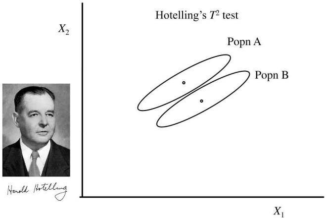
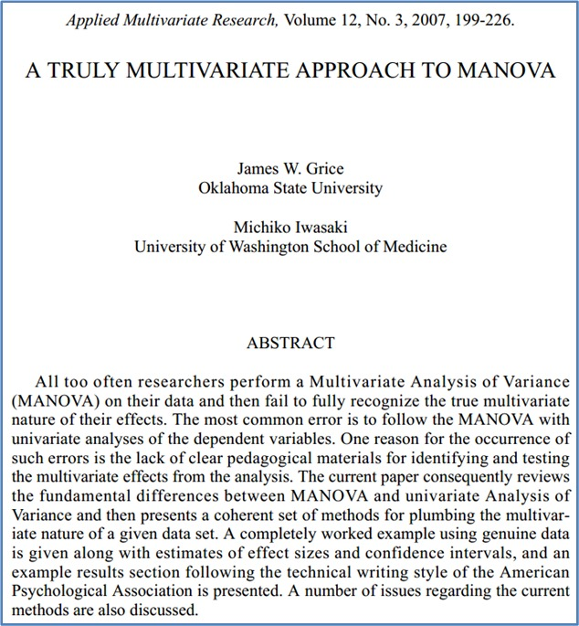
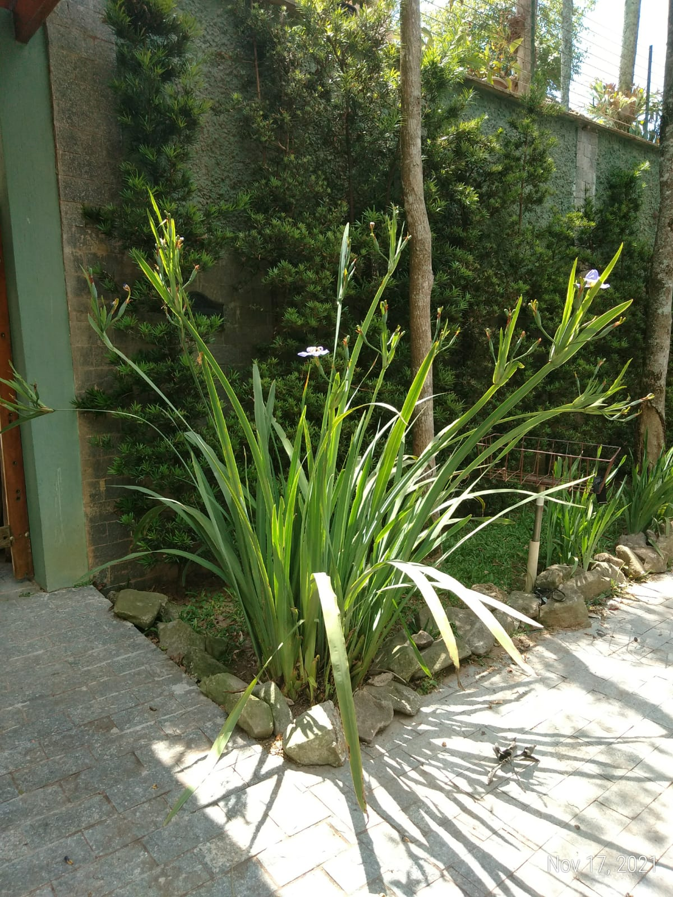
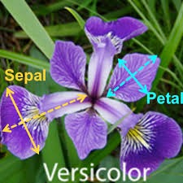
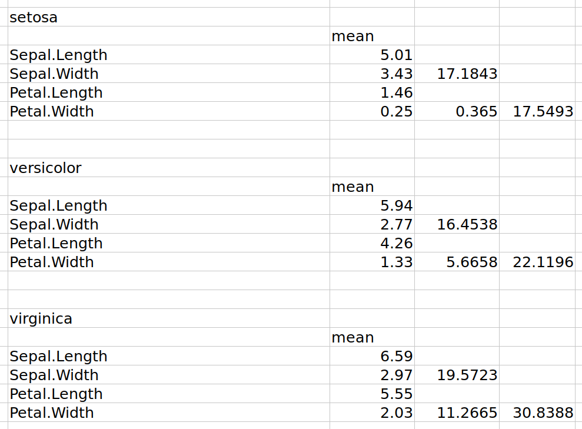
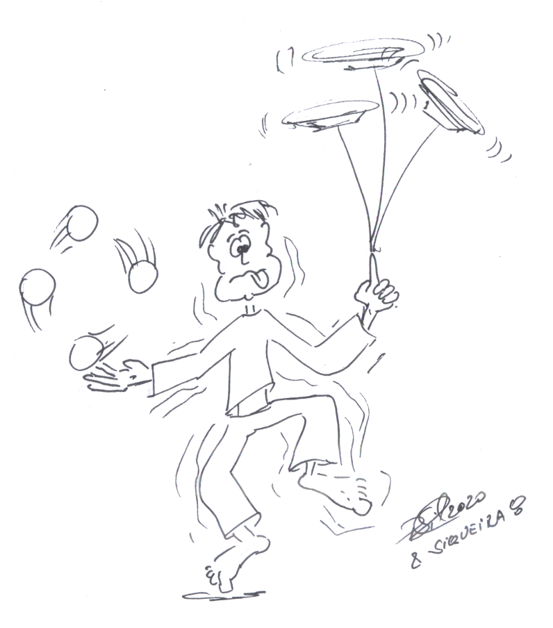

```{r set-options, echo=FALSE, cache=FALSE}
options(width = 80)
```

```{css, echo=FALSE}
.code {
  font-size: 18px;
  background-color: white;
  border: 2px solid darkgray;
  font-weight: bold;
  max-width: none !important;
}
.output {
  font-size: 18px;
  background-color: white;
  border: 2px solid black;
  font-weight: bold;
  max-width: none !important;
}
.main-container {
  max-width: none !important;
}
.pre {
  max-height: 500px !important;
  overflow-y: auto !important;
  overflow-x: scroll !important;
}
.bgobs {
  background-color: #a0d8d8;
}
.bgcodigo {
  background-color: #eeeeee;
}
.bgsaida {
  background-color: #ecf7db;
}
```

```{r setup, include=FALSE}
knitr::opts_chunk$set(eval=TRUE,
                      echo=TRUE, 
                      fig.width=7, 
                      fig.height=6,
                      fig.align="center",
                      comment=NA,
                      class.source="code",
                      class.output="output")
```

```{r eval=TRUE, echo=FALSE}
# Linux
systoper <- Sys.info()[[1]]
if (systoper == "Linux")
{
  # Troque para o executavel de onde esta instalado o scilab em seu computador
  executable <- file.path("","home","silveira","Scilab","bin","scilab")
  parameter <- "-nw"
}
# Windows
if (systoper == "Windows")
{
  # Troque para o executavel de onde esta instalado o scilab em seu computador
  executable <- file.path("D:","Usuarios","Jose","scilab","bin","Scilex")
  parameter <- ""
}
```

```{r,eval=TRUE,echo=FALSE}
systoper <- Sys.info()[[1]]
if (systoper == "Linux")
{
  # Troque para o executavel de onde esta instalado o scilab em seu computador
  executable <- file.path("","home","silveira","Scilab","bin","scilab")
  parameter <- "-nw"
}
# Windows
if (systoper == "Windows")
{
  # Troque para o executavel de onde esta instalado o scilab em seu computador
  executable <- file.path("D:","Usuarios","Jose","scilab","bin","Scilex")
  parameter <- ""
}
```

```{r,eval=TRUE,echo=FALSE}
eng_scilab <- function(options) {
code <- stringr::str_c(options$code, collapse = '\n')
if (options$eval) 
{
  cmd <- sprintf("%s %s -e %s",
                 executable,
                 parameter,
                 shQuote(code,type="cmd"))
  out <- system(cmd, intern = TRUE)
}else{out <- "output when eval=FALSE and engine='scilab'"}

knitr::engine_output(options, options$code, out)
}

knitr::knit_engines$set(scilab=eng_scilab)
```

```{r}
invisible(Sys.setlocale("LC_CTYPE", "pt_BR.UTF-8"))
invisible(Sys.setlocale("LC_ALL", "pt_BR.UTF-8"))
```

```{r eval=TRUE,  echo=TRUE, warning=FALSE, error=FALSE}
options(warn=-1)
suppressMessages(library(knitr, warn.conflicts=FALSE))
suppressMessages(library(readxl, warn.conflicts=FALSE))
suppressMessages(library(psych, warn.conflicts=FALSE))
suppressMessages(library(emmeans, warn.conflicts=FALSE))
suppressMessages(library(multcomp, warn.conflicts=FALSE))
suppressMessages(library(ggplot2, warn.conflicts=FALSE))
suppressMessages(library(GGally, warn.conflicts=FALSE))
suppressMessages(library(effects, warn.conflicts=FALSE))
suppressMessages(library(effectsize, warn.conflicts=FALSE))
suppressMessages(library(tidyr, warn.conflicts=FALSE))
suppressMessages(library(MASS, warn.conflicts=FALSE))
suppressMessages(library(car, warn.conflicts=FALSE))
suppressMessages(library(MVN, warn.conflicts=FALSE))
suppressMessages(library(heplots, warn.conflicts=FALSE))
suppressMessages(library(rrcov, warn.conflicts=FALSE))
suppressMessages(library(DescTools, warn.conflicts=FALSE))
suppressMessages(library(SHT, warn.conflicts=FALSE))
suppressMessages(library(mvdalab, warn.conflicts=FALSE))
source("eiras.friendlycolor.R")
source("eiras.correg.R")
source("eiras.bivCI.R")
source("eiras.showdataframe.R")
source("eiras.numeric.summary.R")
source("eiras.bartitle.R")
```

# Material

* HTML de R Markdown em [`RPubs`](http://rpubs.com/josiqueira/){target="_blank"}
* Arquivos em [`GitHub`](https://github.com/josiqueira/EstatMedR){target="_blank"}

# Objetivos

* Conceituar MANOVA, distinguindo-a de ANOVA e ANCOVA.
* Conceituar e testar as suposições da MANOVA.
* Proceder com a análise descritiva numérica e gráfica dos dados.
* Formular e implementar:
  * $T^2$ de Hotelling
  * MANOVA unifatorial independente
  * MANCOVA
* Determinar as significâncias estatística e prática do efeito do fator.

# O que é MANOVA

Técnicas estatísticas multivariadas são extensões das técnicas univariadas e bivariadas para situações nas quais temos mais do que uma variável dependente ou medida:

* $T^2$ de Hotelling: testar centróides de medidas intervalares multivariadas observadas em duas condições independentes.
* MANOVA: Análise de Variância Multivariada Independente
* MANCOVA: Análise de Covariância Multivariada
* rmMANOVA unifatorial: Análise de Variância Multivariada para Medidas Repetidas (um fator intraparticipantes)
* MANOVA mista (um fator entre participantes e um fator intraparticipantes)

O teste $T^2$ de Hotelling é o primeiro e mais básico dos testes multivariados. Originalmente, era possível testar a igualdade de dois centróides multivariados populacionais.

```{r out.width = '70%', echo=FALSE}

```

Em MANOVA, o efeito de um fator com três ou mais condições pode ser testado e, em MANCOVA, incluiremos covariáveis. Com estes testes, completamos o uso do modelo linear geral (GLM).

## Por que utilizar MANOVA?

Um construto pode ser medido por meio de alguns itens intervalares, por exemplo, compleição que poderia ser decomposta com medidas de massa corporal total (MCT) e estatura. Em geral, as medidas são correlacionadas. Além disto, para indicar o uso de MANOVA independente, deve existir um fator como, por exemplo, sexo (masculino e feminino). Queremos determinar se existe diferença de compleição masculina e feminina. 

Diferentemente dos testes feitos anteriomente, a variável de desfecho (VD), aqui, não é composta de uma medida única: neste exemplo a VD é a combinação das medidas de MCT e estatura. O fator nominal que explicaria esta diferença é sexo. Outros fatores (nominais) ou covariáveis (intervalares) também podem ser adicionados a estes modelos como variáveis explicativas. 

Da mesma forma que ocorre com testes _t_ em relação à ANOVA, tentar substituir uma MANOVA pela realização de um conjunto de ANOVAs aumenta a
probabilidade do erro do tipo I (falso-positivo). MANOVA permite tratar o conjunto em uma única análise, aproveitando as correlações entre as medidas.

# Os testes básicos e o GLM

Os testes básicos podem ser vistos como manifestações do GLM com graus crescentes de complexidade:

* Teste t<br>
<small>1 medida intervalar & 1 fator entre ou intraparticipantes com duas condições</small>
* ANOVA unifatorial<br>
<small>1 medida intervalar & 1 fator com três ou mais condições</small>
* Regressão univariada simples<br>
<small>1 medida intervalar & 1 VE intervalar</small>
* ANCOVA unifatorial simples<br>
<small>1 medida intervalar & 1 fator e 1 VE intervalar (covariável)</small>
* Regressão univariada múltipla<br>
<small>1 medida intervalar & 2 ou mais VEs intervalares</small>
* Regressão multivariada múltipla<br>
<small>2 ou mais medidas intervalares & 2 ou mais VEs intervalares</small>
* $T^2$ de Hotelling<br>
<small>2 ou mais medidas intervalares & 1 fator entre ou intraparticipantes (duplamente multivariada) com duas condições</small>
* MANOVA unifatorial<br>
<small>2 ou mais medidas intervalares & 1 fator entre ou intraparticipantes (duplamente multivariada) com três ou mais condições</small>
* MANCOVA unifatorial simples<br>
<small>2 ou mais medidas intervalares & 1 fator entre ou intraparticipantes (duplamente multivariada) e 1 VE intervalar (covariável)</small>
* ...

Modelos podem evoluir daqui em diante. Se as medidas fossem estatura e MCT, e as variáveis explicativas fossem sexo e raça (ambas nominais), teremos uma MANOVA independente bifatorial. Se adicionarmos idade e tempo de prática esportiva (intervalares), é uma MANCOVA independente bifatorial múltipla. Caso as medidas sejam repetidas, uma MANCOVA bifatorial múltipla relacionada.

# A lógica da MANOVA

Na ANOVA, particionamos a variância da medida que pode ser atribuída aos efeitos principais e de interação das VIs. Na MANOVA, a situação é mais complexa porque há mais de uma medida envolvida e, portanto, há uma matriz de covariância compondo a variabilidade total das medidas. Em nosso exemplo, a variabilidade total depende da variância da estatura, da variância da massa corporal e da covariância entre elas. Além disto, se há um fator com dois níveis (e.g., sexos masculino e feminino), então há dois destes conjuntos de variância a serem levados em conta. 

No processo de cálculo da MANOVA, as diversas medidas são internamente convertidas em um escore intervalar similar ao que acontece com um modelo de análise fatorial unidimensional e utiliza este escore, chamado de combinação linear ótima das medidas, criando uma única VD para a análise. A análise informa se existe(m) efeito(s) das VIs na combinação linear das VDs.

# As suposições subjacentes ao uso da MANOVA

As duas grandes suposições são de normalidade multivariada e homocedasticidade multivariada das medidas nos níveis do fator. 

# MANOVA unifatorial independente

## MANOVA para uma condição

O exemplo de estatura e MCT tem um fator entre participantes (sexo) com dois níveis e duas medidas (estatura e MCT). 

Vamos supor, no entanto, que estejamos interessados apenas nos participantes do sexo masculino. Adiante verificaremos se estes estudantes são brasileiros típicos de acordo com a medida de Moreira et al. (2013) que indica, em média, estatura de $172~cm$ e MCT de $76.68~kg$.

O arquivo de dados usado neste caso é [`Adm2008.rds`](Adm2008.rds){target="_blank"}.

```{r}
Dados <- data.frame(readxl::read_excel("Adm2008.xlsx"))
Dados$Nome <- factor(Dados$Nome)
Dados$Sexo <- factor(Dados$Sexo)
Dados$Estatura <- Dados$Estatura*100
saveRDS(Dados, "Adm2008.rds")
```

Iniciando pela estatística descritiva, sugere-se o que está implementado em 
[`demo_Adm2008Masc_descritiva.R`](demo_Adm2008Masc_descritiva.R){target="_blank"}:

```{r echo=FALSE}
cat(readLines("demo_Adm2008Masc_descritiva.R"), sep = "\n")
```

```{r echo=FALSE}
source("demo_Adm2008Masc_descritiva.R")
```

A novidade é a região elíptica de confiança de 95% do centroíde populacional. Como a hipótese nula está fora desta região elíptica, podemos esperar que a hipótese nula será rejeitada adiante.   

### Suposições

A MANOVA supõe normalidade multivariada das medidas em cada tratamento (neste caso bivariada porque só temos duas medidas: estatura e MCT, nas condições masculino e feminino). Os testes estão implementados em [`demo_Adm2008Masc_normalidade.R`](demo_Adm2008Masc_normalidade.R){target="_blank"}:

```{r echo=FALSE}
cat(readLines("demo_Adm2008Masc_normalidade.R"), sep = "\n")
```

```{r echo=FALSE}
source("demo_Adm2008Masc_normalidade.R")
```

Estes testes foram realizados com <code>MVN::mvn</code> e mostram os testes de uninormalidade e binormalidade. Para o nível de significância de 5%. 

Isoladamente, as distribuições são consideradas normais. Houve rejeição da binormalidade para o grupo Masculino (mas não seria rejeitada com $\alpha=1\%$). No entanto, a amostra tem 51 homens e podemos invocar o teorema central do limite.

### Aplicação do teste

Admitindo que as medidas relatadas em Moreira et al. (2013) são estimativas da população brasileira, as hipóteses nula e alternativa são:

$$H_0: \left[ \mu_{Est}~~~\mu_{MCT} \right] = \left[ 172~cm~~~76.68~kg \right]$$
$$H_1: \left[ \mu_{Est}~~~\mu_{MCT} \right] \ne \left[ 172~cm~~~76.68~kg \right]$$

Implementado em [`demo_MANOVA_umacondicao.R`](demo_MANOVA_umacondicao.R){target="_blank"}:

```{r echo=FALSE}
cat(readLines("demo_MANOVA_umacondicao.R"), sep = "\n")
```

```{r echo=FALSE}
source("demo_MANOVA_umacondicao.R")
```

Rejeita-se $H_0$ para qualquer nível de significância convencional. Os estudantes de administração de 2008 têm compleição média diferente da população brasileira geral de 2013.

## MANOVA com duas condições independentes

O exemplo de estatura e MCT tem um fator entre participantes (sexo) e duas medidas (estatura e MCT). Iniciando pela estatística descritiva, sugere-se o que está implementado em [`demo_Adm2008_descritiva.R`](demo_Adm2008_descritiva.R){target="_blank"}:

```{r echo=FALSE}
cat(readLines("demo_Adm2008_descritiva.R"), sep = "\n")
```

```{r echo=FALSE}
source("demo_Adm2008_descritiva.R")
```

Este gráfico mostra o plano das medidas brutas. As observações para os dois grupos foram representados separadamente. Assinalamos o centróide (um par ordenado) para cada grupo. 

As regiões elípticas de confiança de 95% dos centróides populacionais podem ser vistos como uma extensão bivariada do intervalo de confiança de 95% das médias populacionais de estatura e MCT combinadas. Podemos perceber que as elipses dos dois grupos estão distantes: quando não há sobreposição, podemos esperar que a hipótese nula de igualdade dos centróides populacionais será rejeitada.   

### Suposições

#### Normalidade multivariada e univariada 

Implementado em [`demo_Adm2008_normalidade.R`](demo_Adm2008_normalidade.R){target="_blank"}:

```{r echo=FALSE}
cat(readLines("demo_Adm2008_normalidade.R"), sep = "\n")
```

```{r echo=FALSE}
source("demo_Adm2008_normalidade.R")
```

Estes testes foram feitos com <code>MVN::mvn</code> e mostram os testes de uninormalidade e binormalidade em cada nível do fator. Para o nível de significância de 5%. Isoladamente, as distribuições são consideradas normais. Houve rejeição apenas da binormalidade para o grupo Masculino (mas não seria rejeitada com $\alpha=1\%$). No entanto, a amostra tem 51 homens e 38 mulheres, e podemos apelar para o teorema central do limite.

"O teste da suposição de multinormalidade, em geral, é necessário para amostra pequena. Se a amostra é suficientemente grande (maior que '20 + número de medidas' para cada condição entre participantes), o TCL entra em ação e a suposição de multinormalidade não é mais necessária." 

> Johnson & Wichern, 2007, p. 294

#### Homocedasticidade multivariada

Avaliamos a homogeneidade das matrizes de covariância. Implementado em [`demo_Adm2008_homocedasticidade.R`](demo_Adm2008_homocedasticidade.R){target="_blank"}:

```{r echo=FALSE}
cat(readLines("demo_Adm2008_homocedasticidade.R"), sep = "\n")
```

```{r echo=FALSE}
source("demo_Adm2008_homocedasticidade.R")
```

Há heterocedasticidade entre os níveis do fator, porém...

<!--
> “...with reasonably large samples, the MANOVA tests of means or treatment effects are rather robust to nonnormality. Thus Box’s M-test may reject H0 in some non-normal cases where it not damaging to the MANOVA tests. Moreover, with equal sample sizes, some differences in covariance matrices have little effect on the MANOVA tests. To summarize, we may decide to continue with the usual MANOVA tests even though the Box’s M test leads to rejection of H0.” 
--> 

"... com amostras razoavelmente grandes, os testes de médias ou de efeito de tratamentos por MANOVA são bastante robustos à não normalidade. Assim, o teste M de Box pode rejeitar a hipótese nula em alguns casos sem normalidade sem prejuízo para MANOVA. Além disso, com tamanhos de amostra iguais, alguma diferença nas matrizes de covariância têm pouco efeito na MANOVA. Para resumir, podemos decidir continuar com os testes de MANOVA habituais, mesmo que o teste M de Box leve à rejeição da hipótese nula."

> Johnson & Wichern, 2007, p. 291-6

### Aplicação do teste

A hipótese nula a seguir é a igualdade dos centróides populacionais. 
Formalmente é:

$$H_0: \left[ \mu^{F}_{Est}~ \;\mu^{F}_{MCT} \right] = \left[ \mu^{M}_{Est}~\;\mu^{M}_{MCT} \right]$$
$$H_1: \left[ \mu^{F}_{Est}~\;\mu^{F}_{MCT} \right] \ne \left[ \mu^{M}_{Est}~\;\mu^{M}_{MCT} \right]$$

A matriz que conjuga Estatura e MCT para cada um dos sexos é a representação da compleição. Portanto, as hipóteses nula e alternativa podem ser reescritas como:

$$H_0: \text{Compleição Média Feminina} = \text{Compleição Média Masculina}$$
$$H_1: \text{Compleição Média Feminina} \ne \text{Compleição Média Masculina}$$

Implementado em [`demo_MANOVA_independente.R`](demo_MANOVA_independente.R){target="_blank"}:

```{r echo=FALSE}
cat(readLines("demo_MANOVA_independente.R"), sep = "\n")
```

```{r echo=FALSE}
source("demo_MANOVA_independente.R")
```

Utilizamos, como em capítulos anteriores, a função <code>lm</code> nativa do R, chamada com a sintaxe:

```{r eval=FALSE}
manova(cbind(Estatura, MCT) ~ Sexo,  
       data=Dados)
```


```{r fig.align="left", out.width = '8%', echo=FALSE}
knitr::include_graphics("./image/coruja.png")
```

<table style="border:1; background-color:#CAE0AB"><tr><td>
O modelo utilizado emprega uma matriz das medidas combinadas (<code>cbind(Estatura, MCT)</code>) em função do sexo. 

Observe o que faz a função <code>cbind</code>:

```{r eval=FALSE}
nomes <- c("Juvêncio", "Palmério", "Sofrêncio", "Coríntio")
idades <- c(34,23,56,10)
juntos <- cbind(nomes,idades)
cat(paste("juntos é data frame? ",is.data.frame(juntos),"\n",sep=""))
cat(paste("juntos é matrix? ",is.matrix(juntos),"\n",sep=""))
cat("juntos contém:\n")
print(juntos)
```

```{r echo=FALSE}
nomes <- c("Juvêncio", "Palmério", "Sofrêncio", "Coríntio")
idades <- c(34,23,56,10)
juntos <- cbind(nomes,idades)
cat(paste("juntos é data frame? ",is.data.frame(juntos),"\n",sep=""))
cat(paste("juntos é matrix? ",is.matrix(juntos),"\n",sep=""))
cat("juntos contém:\n")
print(juntos)
```

Observe que <code>cbind</code> cria uma matriz e, como tal, todos os elementos precisam ser do mesmo tipo. Como o conteúdo do vetor <code>a</code> é alfanumérico, apesar de <code>b</code> ser numérico, todos os elementos foram "demovidos" a character. No entanto, é fácil trabalhar com esta matriz se quiser tratar a coluna de idades como numérica:

```{r eval=FALSE}
juntos <- as.data.frame(juntos) # converte em data frame
juntos$idades <- as.numeric(juntos$idades) # converte a coluna em numérica
cat(paste("juntos é data frame? ",is.data.frame(juntos),"\n",sep=""))
cat(paste("juntos é matrix? ",is.matrix(juntos),"\n",sep=""))
cat("juntos contém:\n")
print(juntos)
```

```{r echo=FALSE}
juntos <- as.data.frame(juntos) # converte em data frame
juntos$idades <- as.numeric(juntos$idades) # converte a coluna em numérica
cat(paste("juntos é data frame? ",is.data.frame(juntos),"\n",sep=""))
cat(paste("juntos é matrix? ",is.matrix(juntos),"\n",sep=""))
cat("juntos contém:\n")
print(juntos)
```

</td></tr></table>

A hipótese nula de igualdade das compleições de homens e mulheres foi rejeitada pelos testes $T^2$ de Hotelling e por MANOVA. 

O código, por razões históricas, aplica primeiro o $T^2$ de Hotelling ainda usado na literatura e implementado com a função <code>DescTools::HotellingsT2Test</code>. Este teste não é robusto à falta de normalidade e homocedasticidade multivariadas em amostras pequenas e desbalanceadas. Formas robustas são descritas e comparadas em Lin (1992). O pacote <code>SHT</code> implementa as formas robustas do artigo e outras que apareceram posteriormente na literatura.

Como foi feito em ANCOVA, a saída produz uma "Tabela ANOVA da MANOVA" que o teste de Pillai (default), sendo que o mais utilizado na literatura é o teste de Wilks. Neste caso particular, todos os métodos apresentam o mesmo resultado. No teste de Pillai, a coluna <code>test stat</code> coincide com o $\eta^2_{\text{parcial}}$ obtido com <code>effectsize::eta_squared</code>. No teste de Wilks, este valor é chamado de $\lambda$ de Wilks, que é igual a $1-\eta^2_{\text{parcial}}$ (estas estimativas dos dois métodos, portanto, somam um). Para qualquer nível de significância habitual, $H_0$ foi rejeitada.

Adicionalmente, podem ser computadas ANOVAs univariadas, que são ANOVAS unifatoriais para cada medida. A primeira parte é uma forma sintética para obter a ANOVA de cada medida. A segunda parte foi feita com os comandos habituais que vimos no capítulo de ANOVA unifatorial. Note que os valores _p_ desta segunda forma coincidem com os valores _p_ não ajustados da primeira forma. Estas análises univariadas são criticáveis porque não levam em conta a correlação entre estatura e massa corporal.

```{r out.width = '70%', echo=FALSE}

```

> GRICE & IWASAKI, 2007

### MANOVA robusta

Existe função para executar MANOVA utilizando _bootstrapping_, implementada em [`demo_MANOVA_robusta.R`](demo_MANOVA_robusta.R){target="_blank"}:

```{r echo=FALSE}
cat(readLines("demo_MANOVA_robusta.R"), sep = "\n")
```

```{r echo=FALSE}
source("demo_MANOVA_robusta.R")
```

A função `rrcov::Wilks.test` computa a MANOVA reportando apenas o $\lambda$ de Wilks, que corresponde a $1-\eta^2_{\text{pacial}}$ e rejeita-se a hipótese nula de igualdade de compleição entre homens e mulheres deste exemplo.

## MANOVA com três ou mais condições independentes

O $T^2$ de Hotelling permite duas ou mais medidas, mas o fator é limitado em dois grupos. MANOVA (assim como _t_ em relação à one-way ANOVA) permite mais de dois grupos. Para exemplificar, usaremos o famoso arquivo [`iris`](https://pt.wikipedia.org/wiki/Conjunto_de_dados_flor_Iris){target="_blank"}, usando código similar ao anterior. 

<table><tr>
<td>
```{r fig.align="center", out.width = '90%', echo=FALSE}

```
</td>
<td>
```{r fig.align="center", out.width = '90%', echo=FALSE}

```
</td>
</tr></table>
```{r fig.align="center", out.width = '45%', echo=FALSE}

```

Estes dados estão sempre disponíveis no RStudio (veja a documentação com <code>?iris</code>) e contém as medidas de comprimento e largura de sépalas e pétalas (quatro medidas) de flores de três espécies de _Iris sp_ (fator com três níveis: _setosa_, _versicolor_ e _virginica_). 

A estatística descritiva está implementada em [`demo_iris_descritiva.R`](demo_iris_descritiva.R){target="_blank"}:

```{r echo=FALSE}
cat(readLines("demo_iris_descritiva.R"), sep = "\n")
```

```{r echo=FALSE}
source("demo_iris_descritiva.R")
```

Uma das novidades que aparece nesta saída é o gráfico produzido pela função <code>car::scatterplotMatrix</code> que exibe _density plots_ na diagonal principal e _scatterplots_ para as combinações dois a dois das quatro medidas. Estes dados estão associados com elipses de predição de 95% dos pontos observados.

### Suposições

#### Normalidade univariada e multivariada

Implementado em [`demo_iris_normalidade.R`](demo_iris_normalidade.R){target="_blank"}:

```{r echo=FALSE}
cat(readLines("demo_iris_normalidade.R"), sep = "\n")
```

```{r echo=FALSE}
source("demo_iris_normalidade.R")
```

No teste de multinormalidade, a hipótese nula de tetranormalidade não foi rejeitada para as três espécies se considerarmos correção de Bonferroni (três testes simultâneos de multinormalidade, $\alpha/3 \approx 0.167$). Adicionalmente, podemos invocar o Teorema Central do Limite e prosseguirmos com a análise.

#### Homocedasticidade multivariada

Avaliamos a homogeneidade das matrizes de covariância. Implementado em [`demo_iris_homocedasticidade.R`](demo_iris_homocedasticidade.R){target="_blank"}:

```{r echo=FALSE}
cat(readLines("demo_iris_homocedasticidade.R"), sep = "\n")
```

```{r echo=FALSE}
source("demo_iris_homocedasticidade.R")
```

Apesar de ser heterocedástico, os grupos são perfeitamente balanceados e, por isso, podemos prosseguir com a MANOVA. 

### Aplicação do teste

Implementado em [`demo_MANOVA_iris.R`](demo_MANOVA_iris.R){target="_blank"}:

```{r echo=FALSE}
cat(readLines("demo_MANOVA_iris.R"), sep = "\n")
```

```{r echo=FALSE}
source("demo_MANOVA_iris.R")
```

Pelo teste de Pillai, rejeita-se $H_0$.

Os supostos testes _post hoc_ estão implementados aqui por ilustração, exibindo a saída por duas formas diferentes (para o leitor escolher sua preferida), mas (como já dissemos acima) são testes fracos porque desprezam as correlações entre as medidas. 

#### Testes _post hoc_

A forma adequada de fazer o teste é comparar os grupos dois a dois mas considerando conjuntamente todas as medidas usadas para o teste _omnibus_. Implementado em [`demo_MANOVA_iris_posthoc.R`](demo_MANOVA_iris_posthoc.R){target="_blank"}:

```{r echo=FALSE}
cat(readLines("demo_MANOVA_iris_posthoc.R"), sep = "\n")
```

```{r echo=FALSE}
source("demo_MANOVA_iris_posthoc.R")
```

Utilizando correção de Bonferroni para o nível de significância de 5% (i.e., $\alpha \approx 0.0167$), conclui-se que os tamanhos totais das três espécies são diferentes. 

Podemos imaginar como indicador o produto do comprimento e largura das pétalas e sépalas (que são uma aproximação das respectivas áreas) para colocar as flores das três espécies em ordem de tamanho: 

```{r out.width = '60%', echo=FALSE}

```

```{r out.width = '80%', echo=FALSE}

```

### MANOVA robusta

A versão robusta, utilizando _bootstrapping_, implementada em [`demo_MANOVA_robusta_iris.R`](demo_MANOVA_robusta_iris.R){target="_blank"}:

```{r echo=FALSE}
cat(readLines("demo_MANOVA_robusta_iris.R"), sep = "\n")
```

```{r echo=FALSE}
source("demo_MANOVA_robusta_iris.R")
```

A conclusão é a mesma neste exemplo.

# MANCOVA

Retomando o exemplo da estatura e MCT dos estudantes de administração, podemos controlar por uma covariável intervalar que, neste exemplo, é a idade. Implementamos em [`demo_MANCOVA.R`](demo_MANCOVA.R){target="_blank"}:

```{r echo=FALSE}
cat(readLines("demo_MANCOVA.R"), sep = "\n")
```

```{r echo=FALSE}
source("demo_MANCOVA.R")
```

O valor _p_ que interessa é o que está associado com <code>Sexo</code> e, portanto, rejeita-se $H_0$. A MANCOVA é, simplesmente, feita com

`manova(cbind(Estatura, MCT) ~ Sexo + Idade, data=Dados)`

A VD é a composição <code>cbind(Estatura, MCT)</code> e a <code>Idade</code> é adicionada como covariável, da mesma forma que foi feito na ANCOVA. 

```{r out.width = '40%', echo=FALSE}

```

# Referências

* Borm, GF et al. (2007) A simple sample size formula for analysis of covariance in randomized clinical trials. _Journal of Clinical Epidemiology_ 60: 1234-8.
* Crawley, MJ (2012) _The R Book_. 2nd ed.
* Grice, JW & Iwasaki, M (2007) A truly multivariate approach to MANOVA. _Applied Multivariate Research_ 12(30): 199-226.
* Johnson, R & Wichern, D (2007) _Applied Multivariate Statistical Analysis_. 6ª ed. NJ: Prentice-Hall.
* Lin, W-Y (1992) An Overview of the Performance of Four Alternatives to Hotelling's T Square. _Educational Research Journal_ 7:110-114.
* Moreira, NF et al. (2018) Self-reported weight and height are valid measures to determine weight status: Results from the Brazilian National Health Survey (PNS 2013). _Cadernos de Saúde Pública_ 34(5). https://doi.org/10.1590/0102-311x00063917
* Sakae, TM et al. (2016) Efeitos da anestesia geral da cognição do idoso. _Arquivos Catarinenses de Medicina_ 45(3): 107-16.
* Xiaofeng, L (2011) The Effect of a Covariate on Standard Error and Confidence Interval Width. _Communications in Statistics: Theory and Methods_ 40(3): 449-456, DOI: 10.1080/03610920903391337

