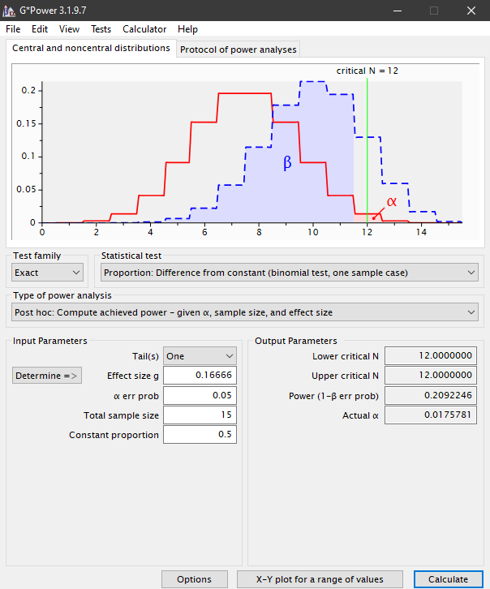
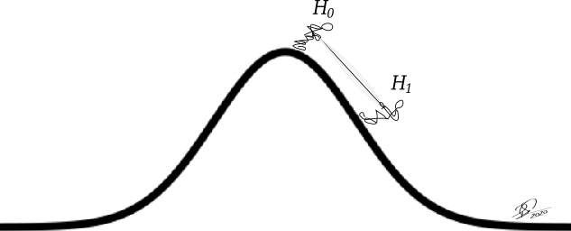

```{r set-options, echo=FALSE, cache=FALSE}
options(width = 80)
```

```{css, echo=FALSE}
.code {
  font-size: 18px;
  background-color: white;
  border: 2px solid darkgray;
  font-weight: bold;
  max-width: none !important;
}
.output {
  font-size: 18px;
  background-color: white;
  border: 2px solid black;
  font-weight: bold;
  max-width: none !important;
}
.main-container {
  max-width: none !important;
}
.pre {
  max-height: 500px !important;
  overflow-y: auto !important;
  overflow-x: scroll !important;
}
.bgobs {
  background-color: #a0d8d8;
}
.bgcodigo {
  background-color: #eeeeee;
}
.bgsaida {
  background-color: #ecf7db;
}
```

```{r eval=TRUE, echo=FALSE}
# Linux
systoper <- Sys.info()[[1]]
if (systoper == "Linux")
{
  # Troque para o executavel de onde esta instalado o scilab em seu computador
  executable <- file.path("","home","silveira","Scilab","bin","scilab")
  parameter <- "-nw"
}
# Windows
if (systoper == "Windows")
{
  # Troque para o executavel de onde esta instalado o scilab em seu computador
  executable <- file.path("D:","Usuarios","Jose","scilab","bin","Scilex")
  parameter <- ""
}
```

```{r setup, include=FALSE}
knitr::opts_chunk$set(eval=TRUE,
                      echo=TRUE, 
                      fig.width=7, 
                      fig.height=6,
                      fig.align="center",
                      comment=NA,
                      class.source="code",
                      class.output="output")
```

```{r}
invisible(Sys.setlocale("LC_CTYPE", "pt_BR.UTF-8"))
invisible(Sys.setlocale("LC_ALL", "pt_BR.UTF-8"))
```

# Carregar pacotes

```{r}
options(warn=-1)
suppressMessages(library(knitr, warn.conflicts=FALSE))
suppressMessages(library(readxl, warn.conflicts=FALSE))
suppressMessages(library(BSDA, warn.conflicts=FALSE))
```

# Material

* HTML de R Markdown em [`RPubs`](http://rpubs.com/josiqueira/){target="_blank"}
* Arquivos em [`GitHub`](https://github.com/josiqueira/EstatMedR){target="_blank"}

# Objetivos

Ao final desta aula (capítulo 5) o aluno deve ser capaz de:

- discorrer sobre a lógica da testagem de hipótese nula;
- definir hipóteses nula e alternativa;
- definir hipótese nula para testes estatísticos bilateral e unilateral;
- aplicar o teste estatístico de uma média populacional;
- aplicar o teste estatístico de uma variância populacional;
- diferenciar as probabilidades de erros do tipo I e II (alfa e beta);
- interpretar os elementos da decisão estatística: 
  - valor _p_;
  - nível de significância;
  - poder prospectivo;
  - tamanho de efeito populacional;
  - tamanho de amostra;
- interpretar significância estatística e significância prática;
- citar métodos de planejamento do estudo.

Os arquivos de dados e os _scripts_ R podem ser utilizados explicitamente ou estão disponíveis para que os explore. Além disto, outros códigos serão criados por você e podem ser salvos com nomes que você mesmo escolherá na pasta do mesmo projeto. 

# Retomando a incerteza

```{r echo=FALSE, out.width='40%'}


```

# Distribuição binomial

<table style="border:1; background-color:#CAE0AB"><tr><td>
A distribuição binomial tem dois parâmetros, o número de tentativas ($n$) e a probabilidade de sucesso em cada tentativa ($p$).
</td></tr></table>

## Distribuição binomial: 1 jogada (Bernoulli)
Com apenas uma jogada temos um experimento de Bernoulli. A distribuição é composta por 50% de probabilidade de ter não ter sucesso (cara) e 50% de ter 1 sucesso (coroa).
```{r echo=FALSE}
source("demo_binomial_1jogada.R")
```

## Distribuição binomial: 2 jogadas
Repetidos experimentos de Bernoulli independentes têm distribuição binomial. Com duas jogadas há 25% de probabilidade de não haver sucesso (duas caras), 50% de probabilidade de 1 sucesso (cara e coroa ou coroa e cara) e 25% de dois sucessos (duas coroas).
```{r echo=FALSE}
source("demo_binomial_2jogadas.R")
```

## Distribuição binomial: 3 jogadas
Com três jogadas há 12.5% de probabilidade de não haver sucesso (três caras), 37.5% de probabilidade de 1 sucesso (cara, cara e coroa; cara, coroa e cara; coroa, cara e cara) e 37.5% de 2 sucessos (coroa, coroa e cara; coroa, cara e coroa; cara, coroa e coroa) e 12.5% para 3 sucessos (três coroas).
```{r echo=FALSE}
source("demo_binomial_3jogadas.R")
```


```{r fig.align="left", echo=FALSE, out.width='6%'}
knitr::include_graphics("image/coruja.png")
```
<table style="border:1; background-color:#CAE0AB"><tr><td>
A função R é **dbinom(x, size, prob)**, indicando, respectivamente, quantas jogadas, o total de
jogadas e a probabilidade de sucesso de uma jogada.

Para uma moeda balanceada (prob=0.5), a probabilidade de 0 sucesso (x=0) em 3 jogadas (size=3) é:

```{r}
dbinom(x=0, size=3, prob=0.5)
```
1 sucesso em 3 jogadas:
```{r}
dbinom(x=1, size=3, prob=0.5)
```
2 sucessos em 3 jogadas:
```{r}
dbinom(x=2, size=3, prob=0.5)
```
3 sucessos em 3 jogadas:
```{r}
dbinom(x=3, size=3, prob=0.5)
```
Mais que três jogadas não é possível: a binomial tem número máximo, finito, de jogadas. Então, para 3 jogadas, de 0 a 3 sucessos cobre toda a distribuição de probabilidades.
</td></tr></table>


## Distribuição binomial: 5 jogadas

Os gráficos acima foram produzidos utilizando um _script_ R similar a este:
```{r echo=FALSE}
cat(readLines("demo_5jogadas.R"), sep = '\n')
```
obtendo-se:
```{r echo=FALSE}
source("demo_5jogadas.R")
```


```{r fig.align="left", echo=FALSE, out.width='6%'}
knitr::include_graphics("image/coruja.png")
```
<table style="width:100%; border:1; background-color:#CAE0AB;"><tr><td>
É possível ver todos os valores em uma tabela:
```{r echo=FALSE}
cat(readLines("demo_5jogadas_tab.R"), sep = '\n')
```
obtendo-se:
```{r echo=FALSE}
source("demo_5jogadas_tab.R")
```

... ou, mais facilmente ainda, criando um _data frame_:
```{r echo=FALSE}
cat(readLines("demo_5jogadas_df.R"), sep = '\n')
```
```{r echo=FALSE}
source("demo_5jogadas_df.R")
```
</td></tr></table>


## Distribuição binomial: 15 jogadas

Este código foi modificado para usar um _data frame_.
```{r echo=FALSE}
cat(readLines("demo_15jogadas_df.R"), sep = '\n')
```
```{r echo=FALSE}
source("demo_15jogadas_df.R")
```


```{r fig.align="left", echo=FALSE, out.width='6%'}
knitr::include_graphics("image/coruja.png")
```
<table style="border:1; background-color:#CAE0AB"><tr><td>
Observe que a soma de todas as colunas é igual a 1. Então, quanto mais jogadas, maior a dispesão e menor a altura das distribuições.
</td></tr>
<tr><td>
```{r echo=FALSE, fig.height=2.5}
source("demo_binomial_1a15.R")
```

</td></tr>
</table>


#### (alterando a escala e os nomes dos eixos)
Com o uso de um _data frame_, a função <code>plot()</code> joga os nomes das variáveis que nomeiam as colunas para os eixos $x$ e $y$. Use os parâmetros <code>xlab</code> e <code>ylab</code>:

```{r echo=FALSE}
cat(readLines("demo_15jogadas_df_2.R"), sep = '\n')
```
```{r echo=FALSE}
source("demo_15jogadas_df_2.R")
```

#### Distribuição binomial: 15 jogadas, moeda desbalanceada
Usando [demo_15jogadas_df_p.R](demo_15jogadas_df_p.R), que é um _script_ R mais generalizado:
```{r}
color<-20
background<-23
prob.sucesso <- 0.7
source("demo_15jogadas_df_p.R")
```

#### Cauda = 1
Implementamos [Binomial_com_caudas.R](Binomial_com_caudas.R) para ilustrar a somatória das probabilidades dos valores mais extremos de uma distribuição binomial.

```{r}
cauda <- 1
source("Binomial_com_caudas.R")
```
```{r}
total <- sum(dbinom(c(0,15),jogadas,p.sucesso))
cat("Total = ", total, sep="")
```
$P[s \le 0] + P[s \ge 15] \approx 6/100000 = 0.006\%$


#### Cauda = 2
```{r}
cauda <- 2
source("Binomial_com_caudas.R")
```
```{r}
total <- sum(dbinom(c(0:1,14:15),jogadas,p.sucesso))
cat("Total = ", total, sep="")
```
$P[s \le 1] + P[s \ge 14] \approx 1/1000 = 0.1\%$


#### Cauda = 3
```{r}
cauda <- 3
source("Binomial_com_caudas.R")
```
```{r}
total <- sum(dbinom(c(0:2,13:15),jogadas,p.sucesso))
cat("Total = ", total, sep="")
```
$P[s \le 2] + P[s \ge 13] \approx 0.7\%$

#### Cauda = 4
```{r}
cauda <- 4
source("Binomial_com_caudas.R")
```
```{r}
total <- sum(dbinom(c(0:3,12:15),jogadas,p.sucesso))
cat("Total = ", total, sep="")
```
$P[s \le 3] + P[s \ge 12] \approx 3.52\%$

#### Cauda = 5
```{r}
cauda <- 5
source("Binomial_com_caudas.R")
```
```{r}
total <- sum(dbinom(c(0:4,11:15),jogadas,p.sucesso))
cat("Total = ", total, sep="")
```
$P[s \le 4] + P[s \ge 11] \approx 11.85\%$


#### Cauda = 6
```{r}
cauda <- 6
source("Binomial_com_caudas.R")
```
```{r}
total <- sum(dbinom(c(0:5,10:15),jogadas,p.sucesso))
cat("Total = ", total, sep="")
```
$P[s \le 5] + P[s \ge 10] \approx 30.18\%$

### Voltando para cauda = 4

$P[s \le 3] + P[s \ge 12] \approx 3.52\%$

$H_0: P[\text{sucesso}] = 0.5$

$H_1: P[\text{sucesso}] \ne 0.5$

```{r}
cauda <- 4
source("Binomial_com_caudas_2.R")
```

<table  align="center" style="border:1; background-color:#dddddd;"><tr><td>
$\alpha$ ... probabilidade do erro do tipo I

(rejeitar $H_0$ incorretamente)
</td></tr></table>


## Simulação 1
Usamos, aqui, [`Goodcoin.R`](Goodcoin.R).


```{r eval=FALSE}
source("Goodcoin.R")
```
<table style="width:600px; font-family:Courier New; font-size:80%"><tr><td>
 -----------------------
  Goodcoin v.20201009  
 -----------------------

Dado um valor a receber em moedas de R$1.00, metade da quantia
eh oferecida em moedas com um balanceamento de referencia,
e metade em moedas falsas, conhecidas por balanceamento distinto.
Seu desafio eh distinguir os dois conjuntos atraves de experimentos.
Numero de moedas (inteiro, default=10000): **10000**

Para testar se a moeda eh verdadeira, joga-se
cara ou coroa certo numero de vezes cada moeda (um experimento).
Numero de lancamentos por experimento (numero inteiro, default=15):  **15**

Qual a proporcao maxima de moedas verdadeiras
que voce aceita perder, i.e. alfa = probabilidade do
erro do tipo I ou de falso-positivo).
(numero entre 0 e 1).
alfa (default=0.05): **0.05**

As moedas verdadeiras tem balanceamento de referencia (H0).
(caso queira moedas balanceadas, escolha o valor igual a 0.5)
Qual a probabilidade de sortear coroa para uma moeda verdadeira?
(número entre 0 e 1).
P[coroa|H0] (default=0.5): **0.5**
</td></tr></table>

```{r echo=FALSE, out.width='90%'}

```

## Binomial adaptada a um tratamento

Certo método educacional consegue ensinar higiene pessoal a 50% dos pacientes com autismo. 

Com o novo método proposto pelo Instituto Ayres Soares, no entanto, entre 15 crianças acompanhadas, 10 (66.66%) conseguiram aprender a cuidar de sua higiene. 

Se os métodos fossem iguais, somente metade das crianças (7 ou 8) deveriam aprender. 

O novo método é melhor?

```{r echo=FALSE, out.width='70%'}

```
```{r echo=FALSE, out.width='50%'}


```

## Verificando se o novo tratamento é melhor que o antigo

## Hipótese nula e alternativa

Iniciamos presumindo que o novo tratamento é igual ao anterior:

$$H_0: \mu_{novo} = 1 \big/ 2$$
$$H_1: \mu_{novo} > 1 \big/ 2$$
$$\alpha = 0.05$$

<div align=center><font style="font-size:120%">
(este tipo de teste é chamado de unicaudal ou unilateral, pois tem direção)
</font></div>


### alfa ($\alpha$)
Como a distribuição binomial é discreta, nem sempre é possível conseguir a cauda com a probabilidade do erro do tipo I escolhida pelo pesquisador. Vamos encontrar a probabilidade acumulada da cauda direita abaixo de 5% para estabelecer nosso critério:
```{r echo=FALSE}
cat(readLines("demo_binomial_caudaD.R"), sep = '\n')
```
```{r echo=FALSE}
source("demo_binomial_caudaD.R")
```
O maior valor abaixo de $\alpha=5\%$ é associado com `r s` sucessos. 

$P[s \ge 12] \approx 1.76\% = \alpha~~~\text{(este é o valor possível nesta condição de 15 crianças)}$

Significa que a probabilidade de `r s` ou mais crianças em 15 se beneficiarem do novo tratamento, supondo que o novo tratamento não é diferente do anterior, é menor do que $5\%$ (ou, como é o valor possível, menor que $1.76\%$). Caso isto aconteça com o novo tratamento consideraremos que é uma observação improvável, pois presumimos que o novo trtamento tem o mesmo sucesso do tradicional (de 50%) e, portanto, poderemos rejeitar $H_0$ (i.e., acreditaremos que é mais provável que o novo tratamento não seja igual ao antigo).

### experimento único

Então colhemos a amostra. Apenas uma:
```{r echo=FALSE, out.width='70%'}

```

com este resultado:
```{r echo=FALSE, out.width='100%'}

```
e com esta amostra precisamos chegar à decisão estatística.

### valor $p$ 

Com 10 crianças bem sucedidas, já sabemos que não será o suficiente para declarar diferença entre os tratamentos, pois não rejeitaremos $H_0$.

Mesmo assim, podemos computar o valor $p$ observado neste estudo: o valor $p$ é a probabilidade de observar a melhora de 10 ou mais crianças em 15 testadas sob $H_0$ (i.e., assumindo-se que o novo tratamento tem o mesmo efeito que o tratamento antigo): 
```{r echo=FALSE}
source("eiras.friendlycolor.R")
p.sucesso <- 0.5 # *** probabilidade de sucesso ***
jogadas <- 15
sucesso <- 0:jogadas
probabilidade <- dbinom(sucesso,jogadas,p.sucesso)
binomial <- data.frame(sucesso,probabilidade)
names(binomial) <- c("Sucesso", "FR")
```
```{r}
p <- sum(binomial$FR[binomial$Sucesso>=10])
cat("p = ",p,"\n")
```
$P[s \ge 10 | H_0] \approx 15.09\%$

Em outras palavras, o valor $p$ é uma probabilidade condicionada à hipótese nula, indicando a probabilidade de termos observado determinada diferença (neste caso, pelo menos 10 crianças) supondo que o tratamento novo é igual ao de referência (que tem sucesso em 50% das crianças e, portanto, deveria ter sucesso em 7 ou 8 crianças pelo menos metade das vezes). Então, como observar 10 ou mais crianças é provável (cerca de 15%), não acreditamos que o novo tratamento é melhor (não rejeitamos $H_0$) com base neste experimento.

Implementamos [Binomial_H0.R](Binomial_H0.R) para exibir as áreas de não rejeição e rejeição de $H_0$ e o valor $p$:
```{r}
cauda <- 4
source("Binomial_H0.R")
```

Em outras palavras, observar 10 crianças bem sucedidas em 15, para um tratamento que consegue sucesso em 50% das crianças, é provável (probabilidade $p$). Como esta probabilidade é alta ($p>\alpha$), não arriscaremos afirmar que estes 10 sucessos sejam devidos a um desempenho melhorado do novo tratamento:

<div align=center>
<font style="font-size:120%; color:#507052;">Não se rejeita $H_0$</font>
</div>

Concluindo não haver evidência de que o novo tratamento seja superior ao tratamento tradicional, tomado como referência.
```{r echo=FALSE, out.width='60%'}

```

## Simulação 2

Supondo que o tratamento alternativo (ou uma moeda desbalanceada) tivesse 66.66% de sucesso, qual seria o comportamento da aplicação deste tratamento em 10 mil institutos, cada um deles com 15 crianças?
<table style="width:600px; font-family:Courier New; font-size:80%"><tr><td>
 -----------------------
  Goodcoin v.20201009  
 -----------------------

Dado um valor a receber em moedas de R$1.00, metade da quantia
eh oferecida em moedas com um balanceamento de referencia,
e metade em moedas falsas, conhecidas por balanceamento distinto.
Seu desafio eh distinguir os dois conjuntos atraves de experimentos.
Numero de moedas (inteiro, default=10000): **10000**

Para testar se a moeda eh verdadeira, joga-se
cara ou coroa certo numero de vezes cada moeda (um experimento).
Numero de lancamentos por experimento (numero inteiro, default=15):  **15**

Qual a proporcao maxima de moedas verdadeiras
que voce aceita perder, i.e. alfa = probabilidade do
erro do tipo I ou de falso-positivo).
(numero entre 0 e 1).
alfa (default=0.05): **0.05**

As moedas verdadeiras tem balanceamento de referencia (H0).
(caso queira moedas balanceadas, escolha o valor igual a 0.5)
Qual a probabilidade de sortear coroa para uma moeda verdadeira?
(número entre 0 e 1).
P[coroa|H0] (default=0.5): **0.6666**
</td></tr></table>
```{r echo=FALSE, out.width='90%'}

```

Caso a moeda fosse desbalanceada (ou se o tratamento funcionasse em cerca de $\frac{2}{3}$ das crianças), o mais provável seria observar 10 crianças com sucesso, mas poderíamos encontrar mais ou menos: cerca de 97% das vezes observaríamos entre 6 e 13 sucessos; em outros 3% observaríamos menos que 6 ou mais que 13 sucessos.

## Simulação 3

Na prática não sabemos se nosso único experimento tem sucesso em metade das vezes (é o tratamento antigo, de referência) ou em $\frac{2}{3}$ das vezes (que é o efeito que esperamos medir, no mínimo, para declarar que o tratamento novo é melhor). Vamos colocar ambas as situações hipotéticas juntas:

```{r eval=FALSE}
source("Goodcoin.R")
```
<table style="width:600px; font-family:Courier New; font-size:80%"><tr><td>
 -----------------------
  Goodcoin v.20201009  
 -----------------------

Dado um valor a receber em moedas de R$1.00, metade da quantia
eh oferecida em moedas com um balanceamento de referencia,
e metade em moedas falsas, conhecidas por balanceamento distinto.
Seu desafio eh distinguir os dois conjuntos atraves de experimentos.
Numero de moedas (inteiro, default=10000): **20000**

Para testar se a moeda eh verdadeira, joga-se
cara ou coroa certo numero de vezes cada moeda (um experimento).
Numero de lancamentos por experimento (numero inteiro, default=15): **15**

Qual a proporcao maxima de moedas verdadeiras
que voce aceita perder, i.e. alfa = probabilidade do
erro do tipo I ou de falso-positivo).
(numero entre 0 e 1).
alfa (default=0.05): **0.05**

As moedas verdadeiras tem balanceamento de referencia (H0).
(caso queira moedas balanceadas, escolha o valor igual a 0.5)
Qual a probabilidade de sortear coroa para uma moeda verdadeira?
(número entre 0 e 1).
P[coroa|H0] (default=0.5): **0.5**

As moedas falsas tem outro balanceamento.
(para simular, forneça uma probabilidade diferente de 0.5 
 ou deixe em branco para simular somente a moeda verdadeira)
Qual a probabilidade de sortear coroa para uma moeda falsa?
(número entre 0 e 1).
P[coroa|H1] (default=nao simular): **0.6666**
</td></tr></table>

```{r echo=FALSE, out.width='90%'}

```

Na prática, lembramos, teremos apenas um estudo. 

> Como decidiremos se, por exemplo, encontrarmos 10 sucessos?

```{r echo=FALSE, out.width='100%'}

```

Caso o treinamento novo tenha 10 sucessos concluímos por **não rejeitar a hipótese nula** de que o treinamento novo é igual ao treinamento antigo, que usamos como referência. Isto é o mesmo que dizer que **não encontramos evidência suficiente** para dizer que o treinamento novo é melhor que o antigo.

> Então, neste caso, não podemos dizer que **são iguais**?

**Quando não rejeitamos a hipótese nula:**

* caso o treinamento novo fosse, na verdade, igual ao treinamento antigo:
    * nossa observação de 10 sucessos é um dos muitos possíveis estudos representados pela curva azul. 
    * estaremos corretos ao não encontrar diferença entre os treinamentos.
    * esta probabilidade de estarmos corretos é $1-\alpha$ (95% ou 98%).
    * em outras palavras, $1-\alpha$ é a probabilidade de **não rejeitarmos $H_0$ corretamente**.
* caso o treinamento novo fosse, na verdade, melhor ao treinamento antigo:
    * nossa observação de 10 sucessos é um dos muitos possíveis estudos representados pela curva marrom. 
    * estaremos errados, falhamos em encontrar diferença entre os treinamentos.
    * esta probabilidade de estarmos errados é $\beta$ (80% ou 78%);
    * em outras palavras, $\beta$ é a probabilidade de **não rejeitarmos $H_0$ incorretamente**.

<table  align="center" style="border:1; background-color:#dddddd;"><tr><td>
$\beta$ ... probabilidade do erro do tipo II

(não rejeitar $H_0$ incorretamente)
</td></tr></table>


> Como decidiremos se, por exemplo, nosso estudo 12 sucessos resultasse em 12 crianças bem sucedidas com o novo treinamento?

```{r echo=FALSE, out.width='100%'}

```

Com 12 sucessos concluímos por **rejeitar a hipótese nula** de que o treinamento novo é melhor ao treinamento antigo, que usamos como referência. Isto é o mesmo que dizer que **encontramos evidência suficiente** para dizer que o treinamento novo é melhor que o antigo.

> Podemos dizer que **são diferentes** (neste exemplo, que o treinamento novo é melhor)?

**Quando rejeitamos a hipótese nula:**

* caso o treinamento novo fosse, na verdade, igual ao treinamento antigo:
    * nossa observação de 12 sucessos é um dos muitos possíveis estudos representados pela curva azul. 
    * estaremos errados ao encontrar diferença entre os treinamentos.
    * esta probabilidade de estarmos errados é $\alpha$ (5% ou 2%).
    * em outras palavras, $\alpha$ é a probabilidade de **rejeitarmos $H_0$ incorretamente**.
* caso o treinamento novo fosse, na verdade, melhor ao treinamento antigo:
    * nossa observação de 12 sucessos é um dos muitos possíveis estudos representados pela curva marrom. 
    * estaremos corretos em encontrar diferença entre os treinamentos.
    * esta probabilidade de estarmos corretos é $1-\beta$ (20% ou 22%);
    * em outras palavras, $1-\beta$ é a probabilidade de **rejeitarmos $H_0$ corretamente**.

<table  align="center" style="border:1; background-color:#dddddd;"><tr><td>
$1-\beta$ ... poder do teste

(em rejeitar $H_0$ corretamente)
</td></tr></table>

<div align=center><big><big>
Qual é a verdade? Qual é a "realidade"?
</big></big></div>

> A resposta é que nunca sabemos!

## Tomada de decisão: $\alpha$ e $\beta$
<div align=center>
<table center>
<tr>
<td></td>
<td style="color:#26a169; background-color:#cccccc; border:1px; padding:15px;">$H_0$ verdadeira</td>
<td style="color:#E65518; background-color:#cccccc; border:1px; padding:15px;">$H_0$ falsa</td>
</tr>
<tr>
<td style="color:#26a169; background-color:#cccccc; border:1px; padding:15px;">não rejeita $H_0$</td>
<td style="text-align: center;">ok</td>
<td style="font-size:180%; text-align: center;">$\beta$</td>
</tr>
<tr>
<td style="color:#E65518; background-color:#cccccc; border:1px; padding:15px;">rejeita $H_0$</td>
<td style="font-size:180%; text-align: center;">$\alpha$</td>
<td style="text-align: center;">ok</td>
</tr>
</table>
</div>

### poder ($1-\beta$)

Probabilidade de rejeitar $H_0$ corretamente:

<div align=center>
<table center>
<tr>
<td></td>
<td style="color:#26a169; background-color:#cccccc; border:1px; padding:15px;">O efeito<br>**não existe**</td>
<td style="color:#E65518; background-color:#cccccc; border:1px; padding:15px;">O efeito<br>**existe**</td>
</tr>
<tr>
<td style="color:#26a169; background-color:#cccccc; border:1px; padding:15px;">**sem** evidência<br>de efeito</td>
<td style="text-align: center;">não rejeitou $H_0$<br>corretamente<br>
<font style="font-size:100%;">$\text{confiança} = 1-\alpha$</font></td>
<td style="font-size:100%; text-align: center;">$\beta$</td>
</tr>
<tr>
<td style="color:#E65518; background-color:#cccccc; border:1px; padding:15px;">**com** evidência<br>de efeito</td>
<td style="font-size:100%; text-align: center;">$\alpha$</td>
<td style="text-align: center;">rejeitou $H_0$<br>corretamente<br>
<font style="font-size:100%;">$\text{poder} = 1-\beta$</font></td>
</tr>
</table>
</div>

### e o que acontece na prática?
<div align=center>
<table center>
<tr>
<td></td>
<td style="color:#1965B0; background-color:#cccccc; border:1px; padding:15px;">**Não sabemos** se o efeito existe **na população**</td>
</tr>
<tr>
<td style="color:#26a169; background-color:#cccccc; border:1px; padding:15px;">não rejeitou $H_0$,<br>**sem** evidência<br>de efeito, então...</td>
<td style="text-align: center; background-color:#a6da9a;">
... o efeito não existe e a confiança que<br>
temos na **decisão correta é** $1-\alpha$<br>**OU**<br>
... o efeito existe e a probabilidade<br>
de **decisão errada é $\beta$**<br>
(se o efeito existe -> erro do tipo II)
</td>
</tr>
<tr>
<td style="color:#E65518; background-color:#cccccc; border:1px; padding:15px;">rejeitou $H_0$,<br>**com** evidência<br>de efeito, então...</td>
<td style="text-align: center; background-color:#F7CB45;">
... o efeito não existe e a probabilidade<br>
de **decisão errada é $\alpha$**<br>
(se o efeito não existe -> erro do tipo I)<br>
**OU**<br>
... o efeito existe e a probabilidade<br>
de **decisão correta é $1-\beta$**,<br>
i.e., o poder do teste<br>
de declarar o efeito acertadamente.
</td>
</tr>
</table>
</div>


Então, neste exemplo, como **não rejeitamos** $H_0$, declarar que os dois treinamentos são iguais (i.e., aceitar $H_0$) é a decisão incorreta com probabilidade de ...

```{r}
p.sucesso <- 0.6666
jogadas <- 15
beta <- sum(dbinom(0:11,jogadas,p.sucesso))
cat("beta = ",beta,"\n")
```

#### Conclusão: ESTE ESTUDO É INCONCLUSIVO.

Caso insistamos em dizer que o novo treinamento é melhor que o tradicional, temos a probabilidade $p \approx 15\%$ de estarmos errados. Caso insistamos em dizer que os dois treinamentos têm o mesmo desempenho, temos a probabilidade $\beta \approx 79\%$ de estarmos errados.

<font style="text-align:center; font-size:160%;">
Não temos evidência para dizer que os dois treinamentos são diferentes, e menos ainda podemos afirmar que os dois são iguais.
</font>

```{r echo=FALSE, out.width='40%'}

```

## O que fazer para reduzir $\beta$?
A literatura costuma usar o nível de significância $\alpha=0.05=5\%$ e poder entre $80\%$ e $90\%$ ($\beta$ entre $20\%$ e $10\%$). Implementamos [`Binomial_H0H1.R`](Binomial_H0H1.R) para exibir a região de $\beta$.

```{r}
alfa <- 0.05
source("Binomial_H0H1.R")
```

### Estratégia 1: aumentar o valor de $\alpha$

Não é boa estratégia: neste exemplo precisaríamos de valores tão altos quanto $\alpha=0.6$ ...
```{r}
alfa <- 0.6
source("Binomial_H0H1.R")
```
A probabilidade de erro do tipo I exagerada fará com que rejeitemos $H_0$ com grande incerteza, criando a contradição de declarar a diferença entre os testes quando seus desempenhos forem numericamente iguais (com probabilidade inaceitável de errar igual a $60\%$).

### Estratégia 2: tornar as distribuições mais estreitas

Com 78 crianças e $\alpha=0.05$ ...
```{r}
alfa <- 0.05
jogadas <- 78
source("Binomial_H0H1.R")
```

Aplicando-se o novo método aplicado a 78 crianças:

 - se 47 ou mais crianças aprenderem higiene pessoal, rejeitamos $H_0$ e podemos afirmar que o novo treinamento é melhor que o tradicional com $90\%$ de probabilidade de estarmos corretos (no entanto, pode ser que os treinamentos sejam iguais e estejamos errados, com $\alpha=5\%$ de probabilidade).
 
 - se somente até 46 crianças aprenderem higiene pessoal, não podemos rejeitar $H_0$. No entanto, como escolhemos poder de $90\%$ **antes do iniciarmos o estudo**, podemos aceitar $H_0$ e afirmar que os dois treinamentos são iguais porque a igualdade não deve ser decorrente de insuficiência amostral (no entanto, podemos estar enganados e, na verdade, o novo treinamento ser melhor, com $\beta=10\%$ de probabilidade).
 
<table align=center style="border:1; background-color:#CAE0AB"; padding:15px;><tr><td>
Notou que, agora, podemos dizer que o treinamento novo é melhor com pelo menos

$${47 \over 78} = 0.6025641 \approx 60\%$$
de sucesso

e antes, quando

$${10 \over 15} = 0.6666667 \approx 67\%$$

das crianças tiveram sucesso, o estudo era inconclusivo?

```{r echo=FALSE, out.width='30%'}

```
</td></tr></table>


### Estratégia 3: ser capaz de detectar, somente, maiores efeitos 

Caso eu não tenha como avaliar mais do que 15 crianças, o estudo só poderá distinguir o novo treinamento do tradicional caso sua performance seja ainda maior. Por tentativa e erro podemos encontrar a situação em que alcançamos pelo menos 80% de poder:

```{r}
alfa <- 0.05
jogadas <- 15
pH1 <- 13/15
source("Binomial_H0H1.R")
```
Com apenas 15 crianças disponíveis, o estudo de um novo método poderá ser conclusivo se esperamos ter um método capaz de ensinar com sucesso $13 \big/ 15$ ou mais das crianças, correspondendo a poder de 87.08%. Poderá ser considerado igual ao tradicional no caso de até `r cutoff-1` crianças terem sucesso, ou melhor que o tradicional se  `r cutoff` ou mais crianças aprenderem higiene pessoal. 

Para ter uma ideia do comportamento do poder, podemos conjecturar com a variação do possível sucesso do novo treinamento:
```{r fig.width=7, fig.height=4}
source("Binomial_H0H1variavel.R")
```

# Distribuição normal

<table style="border:1; background-color:#CAE0AB"><tr><td>
A distribuição normal tem dois parâmetros, média ($\mu$) e desvio-padrão ($\sigma$).
</td></tr></table>

## aparência
Vamos assumir uma distribuição $N(\mu=15,\sigma=8)$:
```{r echo=FALSE, out.width='50%'}

```

## simetria
É uma distribuição simétrica, portanto média, moda e mediana coincidem:
```{r echo=FALSE, out.width='50%'}

```
Metade da área sob a curva está à esquerda e metade à direita da média.

## áreas sob a curva

### $\pm 1 dp$
cerca de 68% da área entre -1 e +1 desvio-padrão:
```{r echo=FALSE, out.width='50%'}

```

### $\pm 2 dp$
cerca de 95% da área entre -2 e +2 desvio-padrão:
```{r echo=FALSE, out.width='50%'}
knitr::include_graphics("image/distnormal2dp.png")
```

### $\pm 3 dp$
cerca de 99.7% da área entre -3 e +3 desvio-padrão:
```{r echo=FALSE, out.width='50%'}

```


```{r fig.align="left", echo=FALSE, out.width='6%'}
knitr::include_graphics("image/coruja.png")
```
<table style="border:1; background-color:#CAE0AB"><tr><td>
Por que a distribuição normal é importante em estatística?

Porque suas propriedades são conhecidas e ela aparece naturalmente sob determinadas circunstâncias. Veja, por exemplo, a aula sobre "Amostragem e Reamostragem".
</td></tr></table>


# Teste de média populacional, para uma condição, bilateral

## intervalos de confiança

Assuma que a distribuição da estatura do homem brasileiro em 2016 é normal com média $\mu=173~cm$ desvio-padrão $\sigma=7~cm$.
<div align=right><font style="font-size:80%">
https://www.pragmatismopolitico.com.br/2016/07/ranking-mundial-de-estatura-brasileiro-cresce-mas-ainda-e-baixinho.html
</font></div>

A distribuição da estatura nesta população é:
```{r}
mu <- 173
sigma <- 7
xpop <- seq(mu-4*sigma, mu+4*sigma, length.out=1000)
ypop <- dnorm(xpop, mean=mu, sd=sigma)
plot(xpop, ypop, 
     main="Distribuição normal populacional",
     xlab="Estatura (cm)",
     ylab="Densidade",
     type="l")
abline(v=mu, lty=2)
```

Quatro participantes de um estudo em 2020, desta mesma idade, tiveram suas estaturas medidas. Gostaríamos de saber se este grupo pode ter sido amostrado da população descrita acima quanto à média de estatura, supondo que nestes últimos quatro anos não houve alteração na estatura do homens jovens brasileiros. 

Suas estaturas são 169, 174, 175 e 186 cm.

Formulamos as hipóteses nula e alternativa:
$$H_0: \mu = 173~cm$$
$$H_1: \mu \ne 173~cm$$

Calculamos a média amostral:
```{r}
estatura <- c(169, 174, 175, 186)
n <- length(estatura)
media <- mean(estatura)
cat("média = ",media, sep="")
```
A tentação é imaginar que os jovens são `r media-mu` cm mais altos atualmente, um crescimento "significativo" de `r round(((media-mu)/mu)*100,2)`% em apenas 4 anos.

No entanto, para comparar mais adequadamente a média amostral com a populacional, podemos utilizar uma métrica como o erro padrão da média (EP):
```{r}
ep <- sigma / sqrt(n)
cat("ep = ",ep, sep="")
```
O que precisamos saber, em unidades de erro padrão, qual é a distância entre o valor populacional conhecido, $\mu$=`r mu` e a média amostral <code>media</code>=`r media`.

Podemos decidir pelo intervalo de confiança de 95%:
```{r}
alfa <- 0.05
z <- abs(qnorm(p=alfa/2, mean=0, sd=1)) # |z| em 2.5%
IC95 = round(c(media-z*ep, media+z*ep),2)
cat("IC95 = [",IC95[1],",",IC95[2],"]", sep="")
```
Como o valor da média populacional está dentro do intervalo de confiança, não rejeitamos a hipótese nula, portanto não temos evidência amostral de que estes 4 jovens de 19 anos não pertençam à população brasileira desta idade.

Graficamente, integrando todo o teste desenvolvido acima em [demo_zbilateral1condicao.R](demo_zbilateral1condicao.R), obtemos:
```{r echo=FALSE}
source("demo_zbilateral1condicao.R")
```
Observe que <code>ep</code> é metade do valor de <code>sigma</code> porque a amostra tem tamanho  <code>n</code>=`r n`. A curva em preto é a da distribuição hipotética (analítica, paramétrica) das médias amostrais, com média igual à da amostra e desvio padrão igual a EP estimado por $\sigma/\sqrt{n}$. Como a média populacional correspondente à $H_0$ está dentro do IC95% estimado a partir da amostra, não rejeitamos a hipótese nula. As áreas hachuradas correspondem a 5% da área sob a curva da distribuição normal (2.5% em cada cauda). Por isso que o intervalo de confiança é de 95%.


O que aconteceria se tivéssemos uma amostra com 100 homens de 19 anos que, por acaso, tivesse a mesma média amostral de `r media` cm. O código é o mesmo, exceto por utilizarmos o R para gerar a nova amostra:

```{r eval=FALSE}
set.seed(3)
estatura <- rnorm(mean=176, sd=7, n=100)
```
Obtendo:
```{r echo=FALSE}
source("demo_zbilateral1condicao_100tmp.R")
```
É problemático representar graficamente a distribuição populacional junto à distribuição das médias amostrais, mas o fazemos aqui para que observe o comportamento da distribuição das médias amostrais com EP agora 10 vezes menor que $\sigma$:
```{r echo=FALSE}
source("demo_zbilateral1condicao_grfruim.R")
```
Portanto, a seguir representaremos somente a distribuição das médias amostrais ([`demo_zbilateral1condicao_100.R`](demo_zbilateral1condicao_100.R)):
```{r echo=FALSE}
source("demo_zbilateral1condicao_100.R")
```

Agora o intervalo de confiança 95% não engloba a média populacional e, portanto, rejeitamos a hipótese nula de que esta amostra de 100 indivíduos veio da população geral de homens brasileiros de 19 anos.

## estatística $z$

Tudo o que foi feito acima pode ser feito com distribuições normais padronizadas. A diferença é que usaremos a população hipotética como uma distribuição normal padronizada. Todos os valores de estatura em cm são convertidos em escores $z$ adimensionais, e a distância em $z$ entre a média amostral e populacional (hipotetizada) é que nos dará a decisão sobre rejeição ou não rejeição da hipótese nula. 

Para a amostra com 4 indivíduos ([`demo_zbilateral1condicao_padrao.R`](demo_zbilateral1condicao_padrao.R)) teremos:
```{r echo=FALSE}
source("demo_zbilateral1condicao_padrao.R")
```
A média amostral (<code>m</code>) dista `r format(round(z,2),scientific=FALSE,nsmall=2)` erros-padrão da média populacional (veja, no _script_ R, a linha <code>z <- (media-mu)/ep)</code>). Recordando-se da anatomia da distribuição normal, 95% da área sob a normal está entre $-1.96 \le z \le 1.96$. Então, neste caso, <code>m</code> está situada na região de não rejeição de $H_0$. 

Para a amostra com 100 indivíduos ([`demo_zbilateral1condicao_padrao100.R`](demo_zbilateral1condicao_padrao100.R)) teremos:
```{r echo=FALSE}
source("demo_zbilateral1condicao_padrao100.R")
```

Aqui, a mesma média amostral (<code>m</code>=`r round(media,0)`) dista `r format(round(z,2),scientific=FALSE,nsmall=2)` erros-padrão da média populacional. Este valor está fora do intervalo entre $-1.96 \le z \le 1.96$ e então <code>m</code> está situada na região de rejeição de $H_0$. 

As conclusões são as mesmas. Não rejeitamos $H_0$ quando $n=4$, mas rejeitamos quando $n=100$. A diferença entre as duas situações é o valor de $z$, resultado da mudança de EP.

## teste $z$

A terceira maneira de abordar o mesmo problema é o teste $z$. Existe um teste $z$ disponível em <code>BSDA::z.test()</code>. A novidade é o valor $p$. 

A decisão estatística, aqui, compara o valor de $p$ com o nível de significância $\alpha$. As áreas hachuradas que vimos nos gráficos anteriores é de 5% ($\alpha=5\%$). O valor $p$ está associado ao $z$ calculado, correspondendo, graficamente, à área sob a curva além do valor $z$ (área mais extrema). 

O teste $z$ foi implementado em [demo_ztest.R](demo_ztest.R) para a amostra com 4 indivíduos:
```{r echo=FALSE}
cat(readLines("demo_ztest.R"), sep = '\n')
```
obtendo-se:
```{r echo=FALSE}
source("demo_ztest.R")
```
Observe que o intervalo de confiança e valor de $z$ são os mesmos calculados antes. O valor $p$=`r format(round(fit$p.value,4),scientific=FALSE,nsmall=4)` é maior que $\alpha=0.05$ e, portanto, não rejeitamos $H_0$.

Graficamente, onde está esta área de cerca de `r round(fit$p.value*100,2)`\%? Considere que o teste é bilateral e, portanto, poderíamos ter verificado a diferença entre as médias amostral e populacional como <code>`r round(media,)` - `r round(mu,0)` = `r round(media-mu,0)`</code> ou <code>`r round(mu,0)` - `r round(media,0)` = `r round(mu-media,0)`</code>. Portanto, esta área abaixo de $z$=`r round(-abs(fit$statistic),2)` ou além de $z$=`r round(abs(fit$statistic),2)` está assinalada em verde:

```{r echo=FALSE}
source("demo_zbilateral1condicao_padrao_2.R")
```

Para 100 indivíduos ([demo_ztest100.R](demo_ztest100.R)) resulta:
```{r echo=FALSE}
source("demo_ztest100.R")
```
Aqui valor $p$=`r format(fit$p.value,scientific=FALSE)` é menor que $\alpha=0.05$ e, portanto, rejeitamos $H_0$.

Graficamente, as áreas abaixo de $z$=`r round(-abs(fit$statistic),2)` ou além de $z$=`r round(abs(fit$statistic),2)` correspondem a cerca de `r round(fit$p.value*100,5)`% e mal são visíveis:
```{r echo=FALSE}
source("demo_zbilateral1condicao_padrao100_2.R")
```

Novamente, as decisões com $n=4$ e $n=100$ foram mantidas. 

Portanto, para o nível de significância $\alpha=0.05$, as três formas de decidir são equivalentes, rejeitando-se $H_0$ quando:

* quando o intervalo de confiança 95% não engloba a média populacional hipotetizada;
* pelo valor $z$ menor que -1.96 ou maior que 1.96;
* pelo valor $p<\alpha$ calculado por um teste $z$.

> Estas conclusões são referentes à significância estatística.

Em geral, estatísticas de teste tendem a aumentar (maior valor de $z$), correspondendo a menores valores de $p$ quando o tamanho da amostra aumenta.


```{r fig.align="left", echo=FALSE, out.width='6%'}
knitr::include_graphics("image/coruja.png")
```
<table style="border:1; background-color:#CAE0AB"><tr><td>

> Quando $H_0$ é rejeitada, não importa o poder _a priori_!

Aqui não exploramos o poder do teste. O valor de $1-\beta$ deve ser definido durante o planejamento do experimento: é o poder prospectivo ou _a priori_.

Na literatura aparece o cálculo do poder retrospectivo, ou _a posteriori_, utilizando a estatística obtida com os dados coletados. Este cálculo do poder não faz sentido, pois será alto quando rejeitamos a hipótese nula (e, neste caso, a probabilidade de cometer erro é $\alpha$), e será mais baixo quando não rejeitamos a hipótese nula, que é quando deveria interessar. 

O valor de $\beta$ (recomendado ser igual ou menor que 10%), portanto, tem que ser estabelecido **antes** do experimento para sabermos, no caso de não rejeitarmos a hipótese nula, que a causa da não rejeição não é insuficiência amostral. 
</td></tr></table>


## tamanho de efeito

Além da significância estatística (existência do efeito na população), é necessário analisar, também, a significância prática (importância do efeito  na população).

O tamanho de efeito pode ser visto como uma medida da magnitude do efeito que não depende do tamanho da amostra (https://en.wikipedia.org/wiki/Effect_size). Uma das medidas muito usadas é o $d$ de Cohen. Nas palavras o próprio criador do coeficiente:

```{r echo=FALSE, out.width='60%'}

```
<div align=right><font style="font-size:80%">
Cohen (1988)
</font></div>

Então, neste caso bilateral, o $d$ de Cohen é dado por
$$d = { {|m - \mu|}\over{\sigma} }$$
ou seja, é a diferença padronizada entre as médias amostral e populacional. Obviamente, para os dois exemplos acima, o tamanho de efeito é o mesmo:

```{r}
d = abs(176-173)/7
cat("d de Cohen = ",d,"\n")
```

Adotando a seguinte tabela:
```{r echo=FALSE}
knitr::include_graphics("./image/tabela_sawilowsky.png")
```

> Documentação da função <code>effectsize::interpret_cohens_d</code>

Podemos classificar o tamanho de efeito de `r round(d,2)` como "pequeno" ($0.20 \le d < 0.50$). Em outras palavras, seja com 4 ou 100 indivíduos, a magnitude da diferença entre as médias amostral e populacional é pequena, do ponto de vista prático (uma diferença de 3 cm em um fenômeno que tem desvio-padrão de 7 cm é algo de pequena magnitude segundo este coeficiente). Como regra prática, se a média amostral distar mais do que $1 \over 2$ desvio-padrão da média populacional, a diferença começa a ter maior importância prática.

Medidas de significância prática não podem depender do tamanho da amostra.

Uma forma de obter o tamanho de efeito é eliminar a influência do tamanho da amostra do escore $z$ dividindo-o por $\sqrt{n}$. No exemplo das estaturas, quando $n=4$, $z$=`r (176-173)/(7/(4^0.5))`. Então, 

$d = \dfrac{|z|}{\sqrt{n}}$ = `r ((176-173)/(7/(4^0.5)))/(4^0.5)`.

Para $n=100$, obtemos $z$ = `r (176-173)/(7/(100^0.5))`. Então, $d = {z/\sqrt{n}}$ = `r ((176-173)/(7/(100^0.5)))/(100^0.5)`, que é o mesmo valor.

```{r}
# n = 4
mu <- 173
sigma <- 7
alfa <- 0.05
estatura <- c(169, 174, 175, 186)
fit <- BSDA::z.test(x=estatura, 
                    sigma.x=sigma, 
                    mu=mu,
                    alternative="two.sided", 
                    conf.level=1-alfa)
print(fit)
dC <- abs(fit$statistic)/sqrt(length(estatura))
print(dC)
```

```{r}
# n = 100
mu <- 173
sigma <- 7
alfa <- 0.05
set.seed(3)
estatura <- rnorm(mean=176, sd=sigma, n=99)
v <- 100*176-99*mean(estatura)
estatura <- c(estatura, v)
fit <- BSDA::z.test(x=estatura, 
                    sigma.x=sigma, 
                    mu=mu,
                    alternative="two.sided", 
                    conf.level=1-alfa)
print(fit)
dC <- abs(fit$statistic)/sqrt(length(estatura))
print(dC)
```

Há outro exemplo em https://www.youtube.com/watch?v=JLs2znSuv3A para tentar entender a diferença entre significância estatística e prática.

# Conceito do valor $p$

A decisão sobre a significância estatística utilizando o valor $p$ é a mais habitualmente utilizada. O problema é que muitos iniciantes "robotizam" suas decisões e adotam a regra mecânica de que "se $p$ é menor que $5\%$, rejeita-se a hipótese nula."

É importante ter consciência do significado do valor $p$:

* constitui um dos problemas enfrentados quando conduzimos uma pesquisa o fato de não sabermos qual é o padrão existente na população de interesse.
* o motivo de realizarmos a pesquisa é, em primeiro lugar, determinar esse padrão.
* você precisa estar ciente de que, algumas vezes, devido ao erro amostral, obteremos padrões nas amostras que não refletem de forma acurada a população de onde as amostras foram retiradas.
* precisamos, portanto, de um algum meio para avaliar a probabilidade de que a amostra selecionada seja um retrato fiel da população.

Os testes estatísticos nos auxiliam nesta decisão, mas isso ocorre de uma forma não de todo intuitiva.

## da população para a amostra

Quando mencionamos população, as pessoas costumam ter a totalidade dos indivíduos existentes em mente. No entanto, o que define uma população depende dos critérios de inclusão e exclusão de um estudo. Por exemplo:

* a população mundial;
* mulheres adultas diabéticas;
* mulheres adultas diabéticas, brasileiras, entre 30 e 50 anos de idade;
* mulheres adultas diabéticas, brasileiras, entre 30 e 50 anos de idade, com complicações vasculares;

Também podemos ter critérios de exclusão, por exemplo, entre as mulheres selecionadas, excluímos:

* as que têm IMC acima de 40;
* as hipertensas;
* as que sofreram intervenção cirúrgica nos últimos 12 meses.

Populações nem precisam ser indivíduos (humanos ou não). Por exemplo:

* municípios brasileiros;
* escolas estaduais de ensino médio da Cidade de São Paulo;
* células hepáticas de camundongos.

Portanto, um conjunto de entidades de acordo com os critérios de inclusão e exclusão constituem uma população válida. Em geral, não temos acesso à população inteira; muitas vezes nem conhecemos seu perfil exato. No exemplo das mulheres diabéticas acima, no máximo teremos acesso às que sabem do diagnóstico e, na prática, àquelas cadastradas no serviço médico ao qual o pesquisador tem acesso. Precisamos, portanto, trabalhar com amostras, subconjuntos obtidos a partir da população.

```{r echo=FALSE, out.width='70%'}

```

A amostragem precisa ser cuidadosa, utilizando técnicas que procurem obter um subconjunto representativo da população de interesse. No entanto, por mais cuidados que tomemos, existem flutuações que podem produzir amostras que não refletem o padrão da população.

Por exemplo, observe a imagem de uma população caricata, construída artificialmente.
```{r echo=FALSE}
source("image/fig_compadrao1.R")
```
Esta população tem, obviamente, um padrão crescente. O que poderia acontecer com amostras obtidas desta população?
```{r echo=FALSE}
source("image/fig_compadrao2.R")
```
Das três amostras ilustradas aqui, as duas primeiras pegaram um padrão decrescente e um padrão neutro, que não refletem a população. A expectativa do processo de amostragem é que a probabilidade de se obter uma boa amostra (i.e., representativa da população) seja bem maior do que a de obter uma amostra que não reflita o padrão populacional.

Apresentamos, aqui, um pequeno demonstrativo que faz repetidas amostras desta população e conta quantas vezes houve sucesso ou falha em capturar um padrão crescente: experimente com [demo_compadrao.R](demo_compadrao.R).

Na situação oposta, pode haver uma população que não tenha padrão algum, com amostras eventuais não representativas, produzindo um padrão inexistente. Experimente com  [demo_sempadrao.R](demo_sempadrao.R)
```{r echo=FALSE}
source("image/fig_sempadrao1.R")
```

> A replicação é uma das pedras angulares da ciência:<br><br>
• Se você observa um fenômeno uma vez, então pode ter sido por acaso; se o observa duas, três ou mais vezes, pode estar começando a aprender algo sobre o fenômeno estudado<br>
• Se o seu estudo foi o primeiro neste assunto, é sensato que você trate os resultados com certo grau de cautela<br>
<div align=right><font style="font-size:80%">
Dancey & Reidy (2019) 
</font></div>

## da amostra para a população

Como temos acesso somente às informações amostrais, o problema prático é invertido: saber se a amostra nos permite inferir sobre a população de onde, presumivelmente, a obtivemos. A certeza é impossível, então só podemos calcular probabilidades.

Um teste estatístico é o **teste da hipótese nula**. Assim, a primeira probabilidade a ser calculada é o valor $p$, que corresponde da amostra não ter padrão dado que o padrão não existe na população. 

Quando existe padrão na amostra, é improvável que esta tenha vindo de uma população sem padrão, de forma que o valor $p$ será pequeno quando condicionado à hipótese nula; a hipótese nula é rejeitada e, por exclusão, ficamos com a hipótese alternativa:

```{r echo=FALSE, out.width='60%'}

```
<div align=right><font style="font-size:80%">
Dancey & Reidy (2019) 
</font></div>

O contrário acontece quando a amostra não revela padrão, obtendo-se um valor $p$ elevado; neste caso não temos evidência para rejeitar a hipótese nula:

```{r echo=FALSE, out.width='60%'}

```
<div align=right><font style="font-size:80%">
Dancey & Reidy (2019) 
</font></div>

## efeito

O efeito pode significar a associação entre variáveis ou a diferença entre condições. A estatística tem, portanto, dois objetivos: verificar a existência do efeito e sua intensidade na população, a partir da evidência amostral, respectivamente conhecidas como significância estatística e prática.

Neste contexto, o termo mais vago, "padrão", que utilizamos antes é substituído por efeito. Sobre os possíveis efeitos podemos definir as hipóteses.

## hipóteses nula e alternativa

Todo teste estatístico enuncia, pelo menos, as hipóteses nula e alternativa. A hipótese nula ou $H_0$ sempre declara que não existe efeito na população. A hipótese alternativa, $H_a$ ou $H_1$ é a nossa previsão de como
condições específicas podem estar relacionadas. 

Portanto, a pergunta da pesquisa costuma estar expressa em $H_1$, mas todo o procedimento testa apenas $H_0$. Evidência a favor de $H_1$, consequentemente, é obtida por exclusão. Este é o motivo para que, no jargão dos estatísticos, a hipótese nula é rejeitada ou a hipótese nula não é rejeitada, e não se enuncia aceitação de nenhuma das duas.


<div align=center>
<table center>
<tr>
<td>
Decisão do<br>pesquisador

</td>
<td style="color:#26a169; background-color:#cccccc; border:1px; padding:15px;">$H_0$: O efeito<br>**não existe**<br>na população</td>
<td style="color:#E65518; background-color:#cccccc; border:1px; padding:15px;">$H_1$: O efeito<br>**existe**<br>na população</td>
</tr>
<tr>
<td style="color:#26a169; background-color:#cccccc; border:1px; padding:15px;">**sem** evidência<br>de efeito<br>na amostra</td>
<td style="text-align: center;">não rejeitou $H_0$ corretamente<br>
$1-\alpha$<br>**(nível de confiança)**</td>
<td style="font-size:100%; text-align: center;">Probabilidade de erro do tipo II<br>$\beta$</td>
</tr>
<tr>
<td style="color:#E65518; background-color:#cccccc; border:1px; padding:15px;">**com** evidência<br>de efeito<br>na amostra</td>
<td style="font-size:100%; text-align: center;">Probabilidade de erro do tipo I<br>$\alpha$<br>**(nível de significância)**<br></td>
<td style="text-align: center;">rejeitou $H_0$ corretamente<br>
<font style="font-size:100%;">$1-\beta$<br>**(poder)**</font></td>
</tr>
</table>
</div>

A regra de decisão, como vimos antes, pode ser feita pela comparação do valor $p$ ou por intervalos de confiança. Portanto, além de formular as hipóteses, precisamos definir o valor de $\alpha$ _a priori_.

**Por que estabelecer $\alpha=5\%$?**
```{r echo=FALSE, out.width='30%'}

```
<div align=right><font style="font-size:80%">
Moore, 1997
</font></div>

## falácias 

```{r echo=FALSE, out.width='60%'}

```
```{r echo=FALSE, out.width='60%'}

```

# Teste $z$

Retomamos o teste $z$ bilateral utilizando as medidas de estatura (em) de uma amostra de 100 homens de 19 anos:
```{r echo=FALSE}
cat(readLines("demo_ztest100.R"), sep = '\n')
```
```{r echo=FALSE}
source("demo_ztest100.R")
```

Interpretando esta saída com mais detalhes:

**<code>alternative hypothesis: true mean is not equal to 173</code>**

Formamente, devemos definir as hipóteses nula e alternativa antes de executar um teste. No entanto, esta saída relata, de acordo com a forma como chamamos a função R, a hipótese alternativa "média verdadeira não é igual a 173". Por contraste, a hipótese nula precisa ser "média verdadeira igual a 173". O teste é bilateral Podem ser redigidas assim:
$$H_0: \mu = 173~cm$$
$$H_1: \mu \ne 173~cm$$
$$\alpha=0.05$$
Observe que o termo "verdadeira" neste contexto significa "populacional". As hipóteses devem ser escritas com letras gregas de acordo com a convenção que as reserva para a população. O teste é feito com a amostra, para inferir seu resultado populacional.

O nível de significância não é informado para esta função. Deve ser relatado e estar em mente do pesquisador para a tomada de decisão. O teste, como vimos, fornece os valores de intervalo de confiança 95% e de $z$, além do valor $p$ associado, correspondendo à área sob a curva igual ou mais extrema que o valor $z$ observado.

O valor $p$ é a probabilidade de observarmos determinado afastamento ($z$) sob a hipótese nula $H_0$. Isto é dizer que, se não existisse diferença entre a média populacional e a média observada na amostra, o valor $z$ encontrado tem probabilidade $p$ de acontecer. Caso o valor de $p$ seja grande, maior do que o nível de significância ($p \ge \alpha$), este valor é provável e não há evidência para rejeitar $H_0$. Caso contrário, se $p < \alpha$, é improvável que a diferença seja observada, rejeitamos $H_0$ e temos evidência que apoia a existência desta diferença.

## teste $z$ unilateral para uma condição

Quando a direção do relacionamento ou da diferença (efeito) é especificada, então o teste é unilateral/unicaudal; caso
contrário, é bilateral/bicaudal. Em geral (mas nem sempre), se você tiver obtido um valor $p$ para um teste bilateral e quiser saber o valor mínimo correspondente para o teste unilateral, então: $p_{\text{unilateral}}  ≥ {p_{\text{bilateral}} \over 2}$.

Por exemplo:


Um pesquisador deseja investigar se o etilismo durante a prenhez diminui
o peso dos ratos recém-nascidos (PRRN).

PRRN tem distribuição normal com média e o desvio-padrão populacionais
sem etilismo na prenhez iguais, respectivamente, a 20 g e 4 g. Essas
estimativas foram obtidas de uma amostra de 20 PRNs independentes.

50 fêmeas foram emprenhadas num experimento no qual elas receberam
doses diárias de álcool. Um rato recém-nascido de cada fêmea foi
selecionado aleatoriamente para compor a amostra de 50 PRNs
independentes.

A média do PRRN das fêmeas que receberam doses diárias de álcool no
experimento é 18 g.


**Teste**

* Média populacional do PRRN hipotetizada: $\mu = 20~g$

**Suposições**

* PRRN tem distribuição normal (desnecessária, devido ao teorema central do limite, TCL, pois $n > 30$)
* Desvio-padrão $\sigma=4~g$ conhecido
* $n = 50$ observações independentes
* Teste unilateral
* Nível de confiança de 95% (ou nível de significância adotado de 5%)

**Hipóteses**

* $H_0: \mu = 20~g$
* $H_1: \mu < 20~g~~\text{(baixo PRRN)}$

**Estatísticas**

Implementado em [demo_zunilateral_PRRN.R](demo_zunilateral_PRRN.R):

```{r echo=FALSE}
source("demo_zunilateral_PRRN.R")
```
Note que neste teste unilateral, o limite inferior é indefinido (só interessa o valor máximo).

**Decisão**

* Critério do valor crítico da estatística de teste: Como $z$=`r round(z.test$statistic,2)` < `r round(qnorm(p=alfa, mean=0, sd=1),2)`, rejeitar $H_0$;
* Critério do IC95: Como IC95 [`r round(z.test$conf.int[1],2)`,`r round(z.test$conf.int[2],2)`] não contém `r mu` (o valor máximo não o alcança), rejeitar $H_0$;
* Critério do valor $p$: Como o valor $p$ unilateral (<code>less</code>) = `r format(round(z.test$p.value,5),scientific=TRUE)` é menor que 5%, rejeitar $H_0$.


> "O valor-p é a probabilidade de que a estatística de teste seja igual ou mais extrema que o valor observado na direção prevista
pela hipótese alternativa ($H_1$), presumindo que a hipótese nula ($H_0$) é verdadeira."<br>
<div align=right><font style="font-size:80%">
Agresti & Finlay (2012)
</font></div>

```{r fig.align="left", echo=FALSE, out.width='6%'}
knitr::include_graphics("image/coruja.png")
```
<table style="border:1; background-color:#CAE0AB"><tr><td>
O teste é unilateral (só investigamos se há redução da peso dos ratos recém-nascidos) e a direção é explícita em $H_1$, com o símbolo $<$. É comum encontrar a anotação da hipótese nula com o símbolo complementar ($\ge$ neste exemplo):

* $H_0: \mu \ge 20~g$
* $H_1: \mu < 20~g~~\text{(baixo PRRN)}$

Optamos por usar o símbolo de igualdade ($=$) porque mais adequadamente espelha o que se espera de $H_0$, a ausência de efeito. Matematicamente, também, é equivalente (Gatás, 1978, p. 220-223)

</td></tr></table>


# Teste de desvio-padrão populacional

No exemplo do estudo sobre o baixo peso ao nascer de ratos submetidos a etilismo, o desvio-padrão populacional foi informado ($\sigma=4$). Podemos testar se, de acordo com a amostra, o desvio-padrão populacional deve ser este.


**Teste**

* Desvio-padrão populacional do PRRN hipotetizada: $\sigma = 4~g$

**Suposições**

* PRRN tem distribuição normal (desnecessária pelo TCL)
* $n = 50$ observações independentes
* Teste bilateral
* Nível de confiança de 95% (ou nível de significância adotado de 5%)

**Hipóteses**

* $H_0: \sigma = 4~g$
* $H_1: \sigma \ne 4~g$

**Estatísticas**

Implementado em [demo_qui2dp_PRRN.R](demo_qui2dp_PRRN.R), utilizando o teste de variância <code>EnvStats::varTest()</code> adaptado:
```{r echo=FALSE}
source("demo_qui2dp_PRRN.R")
```

**Decisão**

Os três critérios podem ser usados: 

* Critério do valor crítico da estatística de teste utiliza a distribuição qui-quadrado ($\chi^2$), que será visto em capítulos adiante e vamos dispensá-lo neste momento (os outros critérios bastam, são equivalentes);
* Critério do IC95: como IC95(dp) [`r round(IC95dp[1],2)`,`r round(IC95dp[2],2)`] não contém `r sigma`, rejeitar $H_0$;
* Critério do valor $p$: Como o valor $p$ bilateral = `r format(round(out$p.value,5),scientific=TRUE)` é menor que 5%, rejeitar $H_0$.

# Planejamento do estudo (utilizando o G*Power)

Para o planejamento existe um programa chamado [G*Power](https://www.psychologie.hhu.de/arbeitsgruppen/allgemeine-psychologie-und-arbeitspsychologie/gpower.html). 

Habitualmente as pessoas pensam apenas em calcular o tamanho da amostra após escolherem os valores de $\alpha$ e $\beta$. Comentamos acima, quando apresentávamos a distribuição binomial, situações em que o pesquisador tem determinado número de pacientes possíveis, e nada adianta um estatístico impor outro tamanho de amostra.

Quatro elementos entram no cálculo amostral: nível de significância ($\alpha$), poder do teste (1-$\beta$), significância prática (tamanho de efeito a ser detectado) e tamanho da amostra ($n$). Dados quaisquer três, o quarto é determinado. Estão errados os pesquisadores que pensam que o cálculo da amostra é o cálculo **do tamanho** da amostra. A tabela seguinte mostra outras possibilidades, todas oferecidas pelo G*Power:

```{r echo=FALSE, out.width='850%'}
knitr::include_graphics("image/GPower_Coelho2008.png")
```

> Coelho, 2008


Vamos exercitar o G*Power nas mesmas situações que mostramos com o exemplo das crianças autistas aprendendo higiene pessoal. 

## n=15, detectando efeito de 2/3 em comparação com 1/2

Computamos, nesta condição, que $\beta$ era alto e, consequentemente, seu complemento - o poder do teste - era baixo.

```{r}
pH0 <- 0.5
pH1 <- 2/3
alfa <- 0.05
source("Binomial_H0H1.R")
```

Imaginando que estávamos na fase de planejamento, para verificar que o poder seria insuficiente no G*Power:

* indicar o tipo de teste: "Proportion: Difference from constant (binomial test, one sample case)".
* escolher a estratégia: "Compute achieved power - given $\alpha$, sample size, and effect size",
* informar que é unilateral: "Tails(s) = One",
* tamanho do efeito: Effect size g = 0.16666 (pois buscamos 2/3 - 1/2),
* nível de significância: "$\alpha~\text{err prob}$ = 0.05"
* $n$: "Total sample size = 15"

```{r echo=FALSE, out.width='70%'}

```
A clicar o botão [Calculate], o G*Power mostra no lado direito da tela o ponto de corte, o poder e o $\alpha$ possível ($\approx 1.76\%$), com os mesmos valores que calculamos antes.

## aumentado $\alpha$

Buscando aumentar o poder, tentamos algumas estratégias. A primeira era aumentar o valor de $\alpha$.

```{r}
pH0 <- 0.5
pH1 <- 2/3
alfa <- 0.6
source("Binomial_H0H1.R")
```
O poder chega aos 90%, mas o valor de $\alpha$ é tão alto que o novo treinamento, atingindo o mesmo desempenho médio do treinamento de referência (8 crianças com sucesso em 15), rejeitaríamos $H_0$ com o valor $p$ de 50% - não faz sentido!

No G*Power, existe a possibilidade de perguntar qual o $\alpha$ a ser utilizado, dado o poder, tamanho de efeito e tamanho da amostra (estratégia que não costuma ser vista na literatura):

```{r echo=FALSE, out.width='70%'}

```

Obtivemos a mesma resposta: caso o número de crianças disponível fosse 15, sem possibilidade de aumentar a amostra (o que pode acontecer, por exemplo, com uma doença pouco frequente), saberíamos que o teste teria baixo poder (como antes) ou teria que usar um valor de $\alpha$ inaceitável; nestas condições, nem deveríamos perder tempo tentando realizar este estudo.

## aumentando o tamanho da amostra

Na sequência buscamos aumentar o tamanho da amostra. Por tentativa-e-erro vimos que com $n=78$ conseguíamos, mantendo $\alpha=0.05$, o poder mínimo de 90%.

```{r}
pH0 <- 0.5
pH1 <- 2/3
alfa <- 0.05
jogadas <- 78
source("Binomial_H0H1.R")
```

No G*Power é mais fácil. Basta solicitar "A priori: Compute required sample size - given $\alpha$, power, and effect size". Esta é a abordagem que a maioria dos pesquisadores adota:

```{r echo=FALSE, out.width='70%'}

```
Observe o tamanho da amostra calculada no lado direito da tela: 78 participantes é a quantidade adequada para atender $\alpha=0.05$, $\text{poder}=1-\beta=0.90$, tamanho de efeito ($g=0.166666\approx {2 \over 3}-{1 \over 2}$).

## incapacidade de aumentar o tamanho da amostra

Nossa terceira opção foi conformar-se em saber qual é o tamanho de efeito que seríamos capazes de detectar, dado que não podemos dispor de mais que 15 crianças. Por tentativa-e-erro encontramos que éramos capazes de distinguir treinamentos que dessem 88% de sucesso em comparação com o treinamento de referência, bem sucedido em 50% das tentativas:

```{r}
pH0 <- 0.5
pH1 <- 0.88
alfa <- 0.05
jogadas <- 15
source("Binomial_H0H1.R")
```

No G*Power este valor é facilmente encontrado com a escolha de "Sensitivity: Compute required effect size - given $\alpha$, power, and sample size". 

```{r echo=FALSE, out.width='70%'}

```

Verifique, na saída à direita, que o G*Power informa "Effect size g = 0.3782313", aproximadamente o mesmo que escolhemos acima ($0.88-0.50=0.38$). Portanto, em um estudo no qual não temos como obter mais do que 15 pacientes, já saberíamos que nada encontraríamos se o novo treinamento não tivesse pelo menos 88% de sucesso médio. Caso nossos indícios mostrassem que o efeito não seria tão grande ou se diferenças menores não nos interessassem, poderíamos evitar levar este estudo adiante.

```{r echo=FALSE, out.width='80%'}

```

# Referências

Agresti A, Finlay B (2012) _Métodos estatísticos para as Ciências Sociais_. Porto Alegre: PENSO, p. 171.

Coelho JP et al. (2008) _Inferência Estatística: com utilização do SPSS e G*Power_. Lisboa: Sílabo.

Cohen J (1988) _Statistical power analysis for the behavioral sciences_. 2nd ed., NY, IEA, p.20

Dancey CP, Reidy J (2019) _Estatística sem Matemática para Psicologia_ 7ª ed. Porto Alegre: Penso.

Gatás RR (1978) _Elementos de Probabilidade e Inferência_. SP: Atlas.
Moore, D. S. (1997) _Statistics: Concepts and Controversies_, 4th ed.. New York: Freeman.

van Belle, G (2008) _Statistical rules of thumb_. 2nd ed. NJ: Wiley
