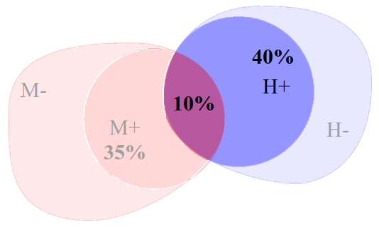

```{r set-options, echo=FALSE, cache=FALSE}
options(width=80)
```

```{css, echo=FALSE}
.code {
  font-size:  18px;
  background-color: white;
  border: 2px solid darkgray;
  font-weight: bold;
  max-width: none !important;
}
.output {
  font-size: 18px;
  background-color: white;
  border: 2px solid black;
  font-weight: bold;
  max-width: none !important;
}
.main-container {
  max-width: none !important;
}
pre {
  max-height: 500px !important;
  overflow-y: auto !important;
  overflow-x: scroll !important;
}
.bgobs {
  background-color: #a0d8d8;
}
.bgcodigo {
  background-color: #eeeeee;
}
.bgsaida {
  background-color: #ecf7db;
}
```

```{r echo=FALSE}
invisible(Sys.setlocale("LC_CTYPE", "pt_BR.UTF-8"))
invisible(Sys.setlocale("LC_ALL", "pt_BR.UTF-8"))
```

```{r setup, include=FALSE}
knitr::opts_chunk$set(eval=TRUE,
                      fig.width=7, 
                      fig.height=6,
                      fig.align="center",
                      comment=NA,
                      class.source="code",
                      class.output="output")
```

```{r eval=TRUE,  echo=TRUE, warning=FALSE, error=FALSE}
options(warn=-1)
suppressMessages(library(epiR, warn.conflicts=FALSE))
source("eiras.friendlycolor.R")
options(warn=0)
```

# Material

* HTML de R Markdown em [`RPubs`](http://rpubs.com/josiqueira/){target="_blank"}
* Arquivos em [`GitHub`](https://github.com/josiqueira/EstatMedR){target="_blank"}

# Objetivos

- calcular a probabilidade conjunta de eventos independentes e a probabilidade condicionada de eventos não independentes;
- definir e aplicar a regra de Bayes;
- definir e diferenciar “reference standard” e "gold-standard" para um procedimento diagnóstico;
- definir teste diagnóstico sob a perspectiva da bioestatística;
- definir e calcular sensibilidade, especificidade, valores preditivos e razão de verossimilhança de testes diagnósticos.
- aplicar e justificar as implicações dos valores calculados para uma decisão diagnóstica.

# Situação típica

* Pacientes chegam ao médico com queixas e sintomas, e então são submetidos a exames físicos em busca de sinais, e exames laboratoriais ou de imagens em busca de mensurações. 
* Dificilmente algum destes elementos, de queixas a exames sofisticados, traz 100% de certeza diagnóstica. Sinais ou medidas de um exame, por exemplo, acontecem na doença que se investiga mas também em outras; ao contrário. 
* Como a associação entre determinada doença e sinais ou exames que a sugerem não é completa, precisamos de critérios para determinar a probabilidade de acerto diagnóstico. 

# Probabilidade condicional

Quando a probabilidade de um evento depende de outro, temos probabilidade condicional ou condicionada. Por exemplo:

Qual a probabilidade, em casais, de que a mulher seja hipertensa quando o marido é hipertenso?

Considere que a probabilidade de hipertensão de um dos conjuges dificilmente pode ser considerada independente do outro. Compartilham o mesmo ambiente e, possivelmente, adotam a mesma dieta, estão sujeitos aos mesmos problemas familiares, cultivam os mesmos hábitos ou têm estilos de vida similares.

Suponha um estudo fictício, que obteve a seguinte contagem em 500 casais:

<table id="t01" class="center">
<tr>
<td></td>
<th colspan=2>Mulheres</th>
<th></th>
</tr>
<tr>
<td></td>
<th>Hipertensas</th>
<th>Normotensas</th>
<th>Total</th>
</tr>
<tr>
<th>Homens<br>Hipertensos</th>
<td>$50$</td>
<td>$150$</td>
<td>$200$</td>
</tr>
<tr>
<th>Normotensos<br> </th>
<td>$125$</td>
<td>$175$</td>
<td>$300$</td>
</tr>
<tr>
<th>Total<br> </th>
<td>$175$</td>
<td>$325$</td>
<td>$500$</td>
</tr>
</table>

A probabilidade condicionada em questão é denotada por 

$$P(M+|H+)$$ 

Em que:

$$M+ : \text{ probabilidade de que a mulher seja hipertensa (positivo para hipertensão)}$$

$$H+ : \text{probabilidade de que o homem seja hipertenso (positivo para hipertensão)}$$

A barra vertical ("$|$") é lida como "dado que". Portanto, $P(M+|H+)$ é a probabilidade de que a mulher seja positiva (para o diagnóstico de hipertensão), dado que o marido é positivo. 

# Tabela em R

Podemos montar uma tabela em R. Adotaremos a seguinte convenção para este texto:

```{r echo=FALSE}
source("demo_montatabela.R")
```

<div align=right><small><small>
Implementado por [`demo_montatabela.R`](demo_montatabela.R){target="_blank"}
</small></small></div>

Então, neste exemplo:

```{r echo=FALSE}
source("demo_montatabela2.R")
```

<div align=right><small><small>
Implementado por [`demo_montatabela2.R`](demo_montatabela2.R){target="_blank"}
</small></small></div>

A probabilidade simples das mulheres serem hipertensas, $P(M+)$, nesta amostra é $P(M+)={{a+c} \over {a+b+c+d}}$ = `r a+c` / `r a+b+c+d` = `r (a+c)/(a+b+c+d)`.

Ao condicionarmos $P(M+|H+)$ basta imaginar que estamos restritos ao "mundo" da linha de **H+**. Então, $P(M+|H+)={{a} \over {a+b}}$ = `r a` / `r a+b` = `r (a)/(a+b)`.

```{r fig.align="left", out.width="8%", echo=FALSE}
knitr::include_graphics("./image/coruja.png")
```

<table style="border:1; background-color:#CAE0AB"><tr><td>

A tabela foi construída como um _data frame_. Também é possível montá-la como uma matriz:

```{r echo=FALSE}
cat(readLines("demo_matriz.R"), sep = '\n')
```

```{r echo=FALSE}
source("demo_matriz.R")
```

<div align=right><small><small>
Implementado por [`demo_matriz.R`](demo_matriz.R){target="_blank"}
</small></small></div>

Neste formato é mais fácil endereçar os valores pela posição <code>tabela[l,c]</code>, onde <code>l</code> é a linha e <code>c</code> é a coluna. Por exemplo, para obter $P(M+|H+)$ poderíamos calcular:

```{r echo=FALSE}
cat(readLines("demo_matriz2.R"), sep = '\n')
```

```{r echo=FALSE}
source("demo_matriz2.R")
```

<div align=right><small><small>
Implementado por [`demo_matriz2.R`](demo_matriz2.R){target="_blank"}
</small></small></div>
</td></tr></table>
<br>

É fácil converter uma matriz em porcentagens:

```{r echo=FALSE}
source("demo_montatabela3.R")
```

<div align=right><small><small>
Implementado por [`demo_montatabela3.R`](demo_montatabela3.R){target="_blank"}
</small></small></div>
</td></tr></table>

# Diagramas de Venn

Graficamente, podemos ilustrar com diagramas de [Venn](https://pt.wikipedia.org/wiki/Diagrama_de_Venn){target="_blank"}. Do total de mulheres, 35% são hipertensas e do total de homens 40% são hipertensos. A intersecção entre o grupo de homens e mulheres é 10%. Neste diagrama vemos os conjuntos:

```{r echo=FALSE, out.width = "70%"}
knitr::include_graphics("./image/venn_pmh01.png")
```

Quando queremos $P(M+|H+)$, este "dado que homens são positivos" restringe nosso ambiente ao círculo azul, à direita:

```{r echo=FALSE, out.width = "70%"}

```

Por isso, $P(M+|H+)={10 \over 40} = 0.25$

Generalizando o diagrama, podemos perceber que a probabilidade condicionada é uma medida da intersecção das áreas dividida pelo tamanho da área "dada por":

```{r echo=FALSE, out.width = "70%"}

```

$$P(A|B)={ {P(A \cap B)} \over {P(B)} }={ {P(A) \cdot P(B|A)} \over {P(B)} }$$

Pode parecer que esta alteração não resolve nada porque, para sabermos o valor de $P(A|B)$ agora precisamos de $P(B|A)$, mas veremos adiante que a segunda probabilidade é facilmente conhecida. 

Para voltar ao exemplo dos casais, mostramos a equivalência:

```{r echo=FALSE, out.width = "70%"}

```

$$P(M+|H+)={{P(M+) \cdot P(H+|M+)} \over {P(H+)}}={{P(M+) \cdot {P(H+~ \cap ~M+) \over P(M+)}} \over {P(H+)}}$$

$$P(M+|H+)={{0.35 \cdot {0.10 \over 0.35}} \over {0.4}}={0.10 \over 0.4}=0.25$$

Podemos usar esta equação no contexto de diagnóstico médico, onde temos um teste $T$ e buscamos um diagnóstico $D$:

```{r echo=FALSE, out.width = "70%"}

```

então:

$$P(D+|T+)={ {P(D+) \cdot P(T+|D+)} \over {P(T+)} }$$

em que se lê: "a probabilidade de ter doença, dado que o teste resultou positivo é igual à probabilidade de existir a doença (incondicional) multiplicada pela probabilidade do teste ser positivo dado que a doença exista, dividido pelo total de testes positivos".

$P(D+|T+)$ é o que geralmente o médico busca para firmar o diagnóstico. Veremos adiante que as informações de $P(D+)$ é a prevalência da doença e $P(T+|D+)$ é vinda do laboratório, chamada de sensibilidade; ambas as informações são relativamente fáceis de serem conhecidas.

<table><tr>
<td>

Esta equação é conhecida como Regra de Bayes, elaborada originalmente por [Thomas Bayes (1701-1761)](https://en.wikipedia.org/wiki/Thomas_Bayes){target="_blank"}, que procurava equacionar como a crença sobre a chance das coisas é influenciada pelas informações prévias que temos. É o caso do diagnóstico médico, quando temos hipóteses diagnósticas e buscamos exames subsidiários que a confirmem ou refutem.

</td>
<td>

```{r out.width='90%', echo=FALSE}

```

</td>
</tr></table>

Vamos retomar a tabela:

```{r echo=FALSE}
source("demo_tabteorica.R")
```

<div align=right><small><small>
Implementado por [`demo_tabteorica.R`](demo_tabteorica.R){target="_blank"}
</small></small></div>

As colunas contém dois grupos, $D+$ e $D-$, respectivamente pacientes sabidamente portadores de uma doença e saudáveis. Este é o padrão ouro (_gold-standard_), que assumimos como referência e cujo diagnóstico foi firmado por outros métodos (avaliação médica, outros exames, etc.). Nas linhas temos um exame $T$ cujo desempenho queremos verificar. 

Como nenhum exame acerta 100% das vezes, uma vez aplicado comparamos com a referência, e definimos a proporção de acertos e erros, tanto quando o exame resultou positivo, $T+$, quanto quando resultou negativo, $T-$. 

Se o exame diagnóstico não acerta sempre, como saber o quanto ele é válido?

Para isto analisaremos a qualidade do exame e a qualidade do diagnóstico.

# Qualidade do exame

Retomando a convenção de letras adotada acima:

```{r echo=FALSE}
source("demo_tabletras.R")
```

<div align=right><small><small>
Implementado por [`demo_tabletras.R`](demo_tabletras.R){target="_blank"}
</small></small></div>

precisamos definir as **probabilidades do exame acertar** em seus resultados, definindo suas **sensibilidade** e **especificidade**.

## sensibilidade

É o acerto do **verdadeiro positivo**, i.e., a probabilidade do exame ser positivo nos doentes:

$$P(T+|D+) = { {a}\over{a+c} }$$

Enfatizamos que esta não é a pergunta que o médico faz. Não há o menor interesse para o diagnóstico em saber se o teste é positivo em pacientes que já sabemos serem doentes. É uma medida, no entanto, obtida por estudos que medem a probabilidade de detecção acertada do exame.

## especificidade

É o acerto do **verdadeiro negativo**, i.e., a probabilidade do exame ser negativo nos não doentes:

$$P(T-|D-) = { {d}\over{b+d} }$$

Da mesma forma, não é a pergunta do médico, mas a probabilidade de **não** detecção acertada do exame entre pessoas que sabemos não estarem doentes.

É fácil notar que um 

<big>exame de maior sensibilidade reduz os **falso-negativos**</big>

e um

<big>exame de maior especificidade reduz os **falso-positivos**.</big>

<table id="t01" class="center">
<tr>
<td></td>
<th colspan=2>Doentes</th>
<th></th>
</tr>
<tr>
<td></td>
<th>sim</th>
<th>não</th>
<th>Total</th>
</tr>
<tr>
<th>Exame<br>positivo</th>
<td>verdadeiros<br>positivos</td>
<td>falsos<br>positivos</td>
<td>total de<br>positivos</td>
</tr>
<tr>
<th></th><td colspan=2>

```{r out.width='30%', echo=FALSE}

```

</td><td></td>
</tr>
<tr>
<th>Exame<br>negativo</th>
<td>falsos<br>negativos</td>
<td>verdadeiros<br>negativos</td>
<td>total de<br>negativos</td>
</tr>
<tr>
<th>Total<br> </th>
<td>total de<br>doentes</td>
<td>total de<br>não doentes</td>
<td></td>
</tr>
</table>

Por outro lado pode ser impossível entender a interação entre sensibilidade, especificidade e resultados falsos sem o conceito de valor limite (_cutoff_) que separa um exame positivo de um negativo. 

# Exemplo: ferritina sérica

Considere um estudo de anemia ferropriva em crianças de uma comunidade. O exame/teste analisa a concentração de ferritina sérica no sangue.

A concentração de ferritina no sangue é uma variável quantitativa contínua. Estudos prévios estabeleceram um _cutoff_, e distingue as crianças como positivas (i.e., anêmicas) se o valor observado for menor que $15~\mu g/dl$.

Suponha que tenhamos encontrado o seguinte:

```{r echo=FALSE}
source("demotab_ferritina.R")
```

<div align=right><small><small>
Implementado por [`demotab_ferritina.R`](demotab_ferritina.R){target="_blank"}
</small></small></div>

e que a distribuição dos dados seja:

```{r echo=FALSE}
source("demogrf_ferritina.R")
```

<div align=right><small><small>
Implementado por [`demogrf_ferritina.R`](demogrf_ferritina.R){target="_blank"}
</small></small></div>

A linha vertical pontilhada é o cutoff ($15~\mu g/dl$). Portanto, há `r nfneg` resultados falso-negativos (de crianças sabidamente anêmicas com $\text{ferritina sérica} \ge 15~\mu g/dl$) e `r nfpos` falso-positivos (de crianças sabidamente não anêmicas com $\text{ferritina sérica} < 15~\mu g/dl$).

Aumentar a sensibilidade é procurar detectar maior número de anemias, aumentando o valor da fração $a \over {a+c}$, i.e., aumentar o número de crianças anêmicas que receberão o diagnóstico com o uso de maior valor do _cutoff_. Digamos que o critério fosse considerar anemia até $16~\mu g/dl$:

```{r echo=FALSE}
source("demogrf_ferritina16.R")
```

<div align=right><small><small>
Implementado por [`demogrf_ferritina16.R`](demogrf_ferritina16.R){target="_blank"}
</small></small></div>

Reduzindo, neste exemplo, os falso-negativos para `r nfneg`, aumentou-se para `r nfpos` o número de falso-positivos.

Reversamente, aumentar a especificidade é descartar mais o diagnóstico naqueles que não tem a doença aumentando o valor de $d \over {b+d}$, i.e., aumentar o número de crianças não anêmicas com resultado negativo aplicando-se menor valor do _cutoff_. Digamos que o critério fosse considerar anemia até $14~\mu g/dl$:

```{r echo=FALSE}
source("demogrf_ferritina14.R")
```

<div align=right><small><small>

Implementado por [`demogrf_ferritina14.R`](demogrf_ferritina14.R){target="_blank"}

</small></small></div>

Consequentemente, reduzir para `r nfpos` o número de falso-positivos, fez com que o número de falso-negativos aumentasse para `r nfneg`.

```{r fig.align="left", out.width="8%", echo=FALSE}
knitr::include_graphics("./image/coruja.png")
```

<table style="border:1; background-color:#CAE0AB"><tr><td>
O _cutoff_ de $15~\mu g/dl$ busca determinado custo-benefício e a forma como os estudos os definem está fora do escopo deste texto. 

Aqui basta dizer que busca-se o valor que maximiza sensibilidade e especificidade simultaneamente, levando-se em conta o objetivo do exame: maior sensibilidade para os exames para os quais não se deseja deixar de fazer o diagnóstico (como, por exemplo, para rastreamento da doença em uma população) ou maior especificidade para situações em que se quer firmar o diagnóstico sem confundir com outros (como, por exemplo, no diagnóstico diferencial para a prática médica).
</td></tr></table>
<br>

Voltando ao exemplo da ferritina sérica, com o _cutoff_=$15~\mu g/dl$ computamos:

$\text{sensibilidade} = P(T+|D+) = {a \over {a+c}}$ = `r a/(a+c)`

$\text{especificidade} = P(T-|D-) = {d \over {b+d}}$ = `r d/(b+d)`

# Razões de verossimilhança

Da relação entre sensibilidade e especificidade, obtém-se as razões de verossimilhança positiva ($LR+$, do inglês: _likelihood ratio_) e negativa ($LR-$), definidas por:

$$LR+ = { {P(\text{verdadeiro positivo})}\over{P(\text{falso positivo})} } =  { {\text{sensibilidade}}\over{1-\text{especificidade}} } $$

$$LR- = { {P(\text{falso negativo})}\over{P(\text{verdadeiro negativo})} } =  { {1-\text{sensibilidade}}\over{\text{especificidade}} } $$

Portanto, ambos os $LR$ são medidas de chance (_odds_) e, então, precisam ter valor diferente de 1 para que o exame tenha qualidade: $LR+ > 1$ e $LR- < 1$. 

```{r fig.align="left", out.width="8%", echo=FALSE}
knitr::include_graphics("./image/coruja.png")
```

<table style="border:1; background-color:#CAE0AB"><tr><td>
<font size=4>_Odds_ e probabilidade</font>

_Odds_ (traduzido habitualmente por chance) e probabilidade são formas equivalentes para expressar possibilidades e relacionadas por:

$$\textit{Odds} = {{\text{Probabilidade}} \over{1-\text{Probabilidade}}}$$

e

$$\text{Probabilidade} = {{\textit{Odds}} \over{1+\textit{Odds}}}$$

Por exemplo, uma probabilidade de $80\%$ corresponde a 

$$\textit{Odds} = {{0.8} \over {1-0.8}} = {0.8 \over 0.2} = 4$$

indicando que dizer "$80\%$ de probabilidade" é equivalente a dizer "4 vezes mais chance de ocorrer do que não ocorrer" um determinado evento.

Reversamente, _Odds_ de 2 é:

$$\text{Probabilidade} = {2 \over {1+2}} = {2 \over 3} \approx 66.67\%$$

e $\textit{Odds}=1$ resulta em: 

$$\text{Probabilidade} = {1 \over {1+1}} = {1 \over 2} = 50\%$$

Associa-se o máximo de incerteza com probabilidade de $50\%$; por este motivo, $Odds=1$ será um valor necessário para decisões estatísticas, adiante.

</td></tr></table>
<br>

$LR+$ expressa quantas vezes (i.e. $odds$) é mais provável que um exame positivo esteja correto do que não correto **entre os doentes**. Quanto **maior** for seu valor, melhor é o exame.

$LR-$ expressa o **inverso** (i.e., $1/odds$) de quantas vezes é mais provável que um exame negativo esteja correto do que não correto **entre os não doentes**. Quanto **menor** for seu valor, melhor é o exame.

Estas quatro medidas --- sensibilidade, especificidade, $LR+$ e $LR-$ definem a qualidade de um sintoma, sinal ou exame, e seus valores podem ser obtidos da literatura especializada ou fornecidos pelos bons laboratórios. Conhecê-las, porém, não basta, e mesmo com valores adequados podem não ser suficientes para firmar o diagnóstico. Por que?

Voltaremos a elas adiante. Vamos esclarecer sobre a qualidade do diagnóstico.

# Qualidade do diagnóstico

Sensibilidade e especificidade (consequentemente também $LR+$ e $LR-$) são características do exame e não dependem da prevalência.

A prevalência é essencial para o diagnóstico.

## valor preditivo positivo

Recorde que frente a um paciente do qual não sabemos se é portador da doença, e feito um exame que resultou positivo, a regra de Bayes fornece a probabilidade de que seja doente por:
$$P(D+|T+)={ {P(D+) \cdot P(T+|D+)} \over {P(T+)} }$$
Este é o valor preditivo positivo, $VPP$, ou $PPV$ nos pacotes estatísticos (inglês, _negative predictive value_). Na equação reconhecemos $P(T+|D+)$, a sensibilidade do exame. $P(D+)$ é a fração de doentes na população, definida como prevalência verdadeira da doença (que chamaremos adiante simplesmente de "prevalência", e equivale à probabilidade de, sorteando-se um indivíduo desta população, encontrarmos um doente). Caso a tabela reflita as proporções de doentes e não doentes na população, $P(D+)={{a+c}\over{a+b+c+d}}$.

Falta definir o denominador, $P(T+)$, a probabilidade de testes positivos. Observe a tabela:

```{r echo=FALSE}
source("demo_prevalencia_aparente.R")
```

<div align=right><small><small>
Implementado por [`demo_prevalencia_aparente.R`](demo_prevalencia_aparente.R){target="_blank"}
</small></small></div>

$P(T+)$, a probabilidade de exames positivos, também conhecido como prevalência aparente (no sentido de que é a prevalência que seria encontrada na ausência de um padrão de referência), pode ser decomposto em:

$$P(T+) = { {{{a+c}\over {a+b+c+d} }\cdot{a \over {a+c}}}+ {{b+d}\over{a+b+c+d}}\cdot{b \over {b+d}} }$$

temos, portanto, todos os elementos necessários: 

- ${a+c} \over {a+b+c+d}$ é $\text{prevalência da doença}$. 

- $a \over {a+c}$ é $\text{sensibilidade}$. 

- ${{b+d} \over {a+b+c+d}} = 1 - {{a+c} \over {a+b+c+d}}$ é $1 - \text{prevalência da doença}$. 

- ${b \over {b+d}} = {1 - {d \over {b+d}}}$ é $1-\text{especificidade}$. 
Para colocar nos termos da notação utilizada acima,

$$P(T+) = P(D+) \cdot \text{sensibilidade} + [1-P(D+)] \cdot (1 - \text{especificidade})$$

Em outras palavras, o total de exames positivos é dado pela sensibilidade e especificidade ponderadas pela probabilidades de termos doentes (i.e., prevalência) e não doentes (i.e., complemento da prevalência). Assim, podemos reescrever a regra de Bayes:

$$P(D+|T+)=PPV={ {P(D+) \cdot P(T+|D+)} \over { P(D+) \cdot P(T+|D+) + [1-P(D+)] \cdot [1 - P(T-|D-)] } }$$

## valor preditivo negativo

Quando o resultado de um exame for negativo, o valor preditivo negativo $VPN$ ($NPV$, _negative predictive value_) é a probabilidade do paciente não estar doente. Por raciocínio similar ao anterior, a regra de Bayes é:

$$P(D-|T-)={ {[1-P(D+)] \cdot P(T-|D-)} \over {P(T-)} }$$

reescrita na forma:

$$P(D-|T-)=NPV={ [1-{P(D+)] \cdot P(T-|D-)} \over { [1-P(D+)] \cdot P(T-|D-) + P(D+) \cdot [1 - P(T+|D+)]}}$$

Portanto, para o acerto do diagnóstico, precisamos conhecer a informação epidemiológica (a prevalência populacional da doença de onde veio o paciente) e a qualidade do exame dada pela sensibilidade e especificidade.

PPV e NPV são as probabilidade de diagnóstico correto e dependem da prevalência.

```{r fig.align="left", out.width="8%", echo=FALSE}
knitr::include_graphics("./image/coruja.png")
```

<table style="border:1; background-color:#CAE0AB"><tr><td>
Caso pretenda fazer os cálculos manualmente. Um atalho mais simples que os cálculos acima é usar a tabela

```{r echo=FALSE}
source("demo_tabletras.R")
```

<div align=right><small><small>
Implementado por [`demo_tabletras.R`](demo_tabletras.R){target="_blank"}
</small></small></div>

e pensar em sensibilidade, especificidade, $PPV$ e $NPV$ como probabilidades de acerto, respectivamente:

- do exame positivo em doentes, $\text{sensibilidade} = {{a}\over{a+c}}$
- do exame negativo em não doentes, $\text{especificidade} = {{d}\over{b+d}}$
- do diagnóstico quando o exame é positivo, $PPV = {{a}\over{a+b}}$
- do afastamento do diagnóstico quando o exame é negativo, $NPV = {{d}\over{c+d}}$

No entanto, cuidado com o uso de tabelas. Os valores de sensibilidade e especificidade, como ocorrem nas colunas, não são afetados pela prevalência da doença e serão igualmente obtidos ainda que a amostra de pacientes seja, por exemplo, escolhida para termos 50% de doentes e 50% de não doentes, procedimento totalmente possível para o estabelecimento do desempenho do exame em um estudo experimental.

No entanto, $PPV$ e $NPV$ dependem da prevalência e este atalho só funciona se a tabela refletir a distribuição de doentes e não doentes de acordo com a prevalência da doença, i.e., se ${a+c}\over{a+b+c+d}$ estiver na proporção igual a $P(D+)$ e, consequentemente, somente se ${b+d}\over{a+b+c+d}$ for igual a $1-P(D+)$. 

</td></tr></table>
<br>

# Operacionalização em R

Todos os cálculos estão implementados em pacotes do R e em RScripts que fornecemos para estas aulas. Vamos reconstruir o exemplo da ferritina sérica, cujos dados são

```{r echo=FALSE}
cat(readLines("demotab_ferritina.R"), sep = '\n')
```

```{r echo=FALSE}
source("demotab_ferritina.R")
```

<div align=right><small><small>
Implementado por [`demotab_ferritina.R`](demotab_ferritina.R){target="_blank"}
</small></small></div>

Supondo que a prevalência da população esteja refletida nesta tabela, temos:

```{r echo=FALSE}
cat(readLines("demotab_ferritina_calc.R"), sep = '\n')
```

```{r echo=FALSE}
source("demotab_ferritina_calc.R")
```

<div align=right><small><small>
Implementado por [`demotab_ferritina_calc.R`](demotab_ferritina_calc.R){target="_blank"}
</small></small></div>

Alternativamente, o _script_ [`TesteDiagnostico.R`](TesteDiagnostico.R){target="_blank"} faz diversos procedimentos e agrega a testagem estatística através de algumas funções que selecionamos e por método robusto (_bootstrapping_). Para reproduzir este exemplo, rode-o e forneça:

<code>
[...]<br>
P(D+)=(a+c)/n ... prevalencia da Desfecho<br>
prevalencia: <font style="color:blue"><b>0.3137</b></font><br> 
[...]<br>
P(T+|D+) = a/(a+c) ... sensibilidade do teste<br>
sensibilidade: <font style="color:blue"><b>0.9036</b></font><br>
[...]<br>
P(T-|D-) = d/(b+d) ... especificidade do teste<br>
especificidade: <font style="color:blue"><b>0.8475</b></font><br>
[...]<br>
Qual o tamanho da população (Total)?<br>
n: <font style="color:blue"><b>2579</b></font><br>
[...]<br>
Defina alfa = probabilidade do erro do tipo I
alfa: <font style="color:blue"><b>0.05</b></font><br>
[...]<br>
Exibir tabelas? (exibir lentifica a simulacao)<br>
0=nao, 1=sim; default eh 0: <font style="color:blue"><b>0</b></font><br>
[...]<br>
Quantas iteracoes para simular?<br>
iteracoes: <font style="color:blue"><b>1000</b></font><br>
</code>

Obtendo:

```{r echo=FALSE}
source("TesteDiagnostico_ferritina.R")
```

# Pacote `epiR`

A saída é longa, então vamos entendê-la por partes.

No início da saída aparece a mensagem

<code>
Package epiR XXXXX is loaded
</code>

O pacote `epiR` (no lugar de XXXXX aparecerá o número da versão instalada em seu computador) foi o que escolhemos para computar a regra de Bayes. Em certo ponto de [`TesteDiagnostico.R`](TesteDiagnostico.R){target="_blank"} aparece:

```{r echo=FALSE}
cat(readLines("TesteDiagnostico_ferritina_tabela.R"), sep = '\n')
```

```{r echo=FALSE}
source("TesteDiagnostico_ferritina_tabela.R")
```

<div align=right><small><small>
Implementado por [`TesteDiagnostico_ferritina_tabela.R`](TesteDiagnostico_ferritina_tabela.R){target="_blank"}
</small></small></div>

Observe que nesta tabela os valores não são exatamente os planejados por causa de arredondamento em casas decimais.

A essência deste código está no trecho em que exibimos o resultado armazendo na variáveis **out** e **sumario**, que produzem:

```{r echo=FALSE}
cat(readLines("TesteDiagnostico_ferritina_out.R"), sep = '\n')
```

```{r echo=FALSE}
source("TesteDiagnostico_ferritina_out.R")
```

<div align=right><small><small>
Implementado por [`TesteDiagnostico_ferritina_out.R`](TesteDiagnostico_ferritina_out.R){target="_blank"}
</small></small></div>

Bastariam estas linhas para suas conclusões. Repare que **out** tem o problema de arredondar para duas casas decimais, o que não costuma ser o suficiente. É preferível produzir o **summary(out)**, mais completo. Todos os valores são fornecidos em sua estimativa pontual e intervalo de confiança 95%. São todas as variáveis que vimos e mais algumas:

- aprev: prevalência aparente
- tprev: prevalência  
- se: sensibilidade
- sp: especificidade
- diag.acc: acurácia
- diag.or: _odds ratio_ do diagnóstico
- nnd: _number needed to diagnose_
- youden: índice de Youden
- ppv: valor preditivo positivo
- npv: valor preditivo negativo
- plr: _likelihood_ positivo
- nlr: _likelihood_ negativo

Dos valores adicionais:

# índice de Youden

O índice de Youden é um ótimo preditor da qualidade global de um exame:

$$\text{Youden} = \text{probabilidade de verdadeiro positivo} - \text{probabilidade de falso positivo}$$

ou 

$$\text{Youden} = {se - (1 - sp)} = {se + sp - 1}$$

(em que $se$ é sensibilidade e $sp$ é especificidade do exame)

Quando este índice é menor do que 0 (i.e., $\text{sensibilidade}+\text{especificidade} \le 1$), o exame tem desempenho ruim e, possivelmente, é inútil para qualquer diagnóstico. Portanto, como regra prática, quando quiser avaliar um novo exame, use o índice de Youden para ter uma noção preliminar do desempenho esperado.

Por exemplo, se a sensibilidade for igual a 0.9 e especificidade igual a 0.8, 

$$Y = 0.9 + 0.8 - 1 = 0.7$$

e, portanto, o exame é um teste diagnóstico.

# $nnd$

O _nnd_ é muito usado em epidemiologia. 

"the number of patients who need to be examined in order to correctly detect one person with the disease of interest in a study population of persons with and without the known disease" 

<div align=right>
Larner A.J. (2018) Number Needed to Diagnose, Predict, or Misdiagnose: Useful Metrics for Non-Canonical Signs of Cognitive Status? _Dement Geriatr Cogn Disord Extra_ 8:321–327. https://doi.org/10.1159/000492783
</div>

Por exemplo, se $nnd=1.5$, é necessário testar 15 pacientes para ter 10 resultados verdadeiramente positivos.

Numericamente, porém, do ponto de vista da estatística, 

$$nnd = {{1}\over{\text{Youden}}}$$

Por exemplo, calculamos, para sensibilidade=0.9 e especificidade=0.8, 
$\text{ìndice de Youden} = 0.9 + 0.8 - 1 = 0.7$. Então:

$$nnd = { {1 \over 0.7} = 1.43 }$$

significando que precisamos testar cerca de 14 pacientes para encontrar 10 resultados positivos.

```{r fig.align="left", out.width="8%", echo=FALSE}
knitr::include_graphics("./image/coruja.png")
```

<table style="border:1; background-color:#CAE0AB"><tr><td>
Não confunda com outros índices, como o conhecido $nnt$ (_number needed to treat_), dado por

$$nnt = { {1}\over{p(1-RR)} }$$

em que $p$ é a prevalência da doença na população não tratada e $RR$ é o _risk ratio_.

<div align=right>
van Belle, G (2008) _Statistical rules of thumb_. 2nd ed. NJ: Wiley.
</div>

</td></tr></table>
<br>

# prevalência aparente

Já vista antes, também pode ser computada como função do índice de Youden.

$$P(T+) = p \cdot se + (1-p)(1-sp) = 1 - sp + p \cdot Y$$

Então, se $p=0.05$, $se=0.9$, $sp=0.8$ (portanto $Y=0.7$), 

$$P(T+) = 0.235$$

significando que 23.5% dos pacientes submetidos a este teste diagnóstico de uma população com 5% de prevalência para uma doença testarão positivamente.

# acurácia

É a proporção de testes diagnósticos corretos para certa população, dada (pelo atalho de acordo com a convenção da tabela) por:

$$\text{Acurácia}={{a+d}\over{total}}$$

funcionando como uma forma sintética de reportar a combinação da sensibilidade e especificidade no contexto da prevalência observada.

Outra maneira de expressar a acurácia é:

$$\text{Acurácia} = P(D+) \cdot \text{sensibilidade} + [1 – P(D+)] \cdot {\text{especificidade}}$$.

Por exemplo, se sensibilidade é 0.9 e especificidade é 0.8 com prevalência de 0.05, temos

$$A = p \cdot se + (1 – p) \cdot sp = 0.05 \cdot 0.9 + 0.95 \cdot 0.8 = 0.805$$

significando que 80.5% dos pacientes de uma população com prevalência de 0.05 têm o resultado do teste correto (negativo ou positivo).

```{r fig.align="left", out.width="8%", echo=FALSE}
knitr::include_graphics("./image/coruja.png")
```

<table style="border:1; background-color:#CAE0AB"><tr><td>

Em epidemiologia há vários outros índices que seguem a mesma lógica do _nnd_, por exemplo:

- inaccuracy: the total number of false positives and false negatives divided by the total number of patients assessed (= 1 – accuracy);
- predictive summary index (PSI, or Ψ): a combination of positive and negative predictive values given by (PPV + NPV – 1) .
- inverse of PSI (1/PSI or 1/Ψ), the “number needed to predict” (NNP), interpreted as the number of patients who need to be examined in the patient population in order to correctly predict the diagnosis of one person.
(Larner, 2018)

- number needed to misdiagnose” (NNM), 1/(1 – accuracy) = 1/inaccuracy. NNM is the number of patients who need to be tested in order for one to be misdiagnosed by the test.
(Habibzadeh, F., & Yadollahie, M. (2013). Number needed to misdiagnose: a measure of diagnostic test effectiveness. Epidemiology (Cambridge, Mass.), 24(1), 170. https://doi.org/10.1097/EDE.0b013e31827825f2)

</td></tr></table>
<br>

# _odds ratio_ do diagnóstico

Como podemos verificar no teste Qui-quadrado, é equivalente a decidir pelo _odds ratio_ com seu intervalo de confiança. Sabemos que:
$$OR = {{a \cdot d}\over{b \cdot c}}$$
e que existe significância estatística para $\alpha=0.05$ quando o valor unitário não está dentro do intervalo de confiança 95%, rejeitando-se a hipótese nula de ausência de associação entre as variáveis.

Aqui temos uma aplicação deste princípio: um teste diagnóstico útil tem que mostrar associação de seus resultados positivo e negativo com a presença ou ausência da doença. 

O pacote `epiR`, portanto, verifica a associação entre o exame e a doença; a associação precisa existir para que o exame seja um teste diagnóstico.

O restante da saída com gráficos é uma versão nossa, usando _bootstrapping_ e mostrando várias distribuições para conferirmos os valores da saída acima (não são exatamente iguais, mas muito próximos), além de estatística de tamanho de efeito por $OR$ e $V$ de Cramér com as mesmas interpretações que discutimos no teste Qui-quadrado. São informação útil para decidir sobre os valores que mensuram a qualidade do exame e do diagnóstico.

# Aplicações para um paciente

Até aqui tivemos uma abordagem populacional. O que fazemos quando lidamos com um único paciente?

Fundamentalmente, os conceitos discutidos acima são aplicáveis na prática médica.

<table><tr><td>

A adaptação ocorre a  partir dos dados da consulta de um paciente, o médico “intui” a probabilidade de um ou mais diagnósticos. 

Pode ser atribuído um valor que passaremos a chamar de Probabilidade Pré-teste, fundamentada na experiência do clínico e em suas informações da literatura. 

Para confirmar ou descartar as hipóteses diagnósticas, são feitos exames de laboratório ou de imagem. 

Com a Probabilidade Pré-teste, pode-se estimar a Probabilidade Pós-teste, utilizando a Razão de Verossimilhança do exame diagnóstico. 
</td>
<td>

```{r echo=FALSE, out.width = "90%"}

```

<div align=right>
https://pt.wikipedia.org/wiki/Peirópolis
</div>
</td>
</tr></table>

Quando não existia apoio computacional, o procedimento (nunca muito difundido, possivelmente pela falta de praticidade) era utilizar os valores de $LR+$ ou $LR-$ para transformar a crença prévia (a intuição médica sobre a probabilidade do paciente ter determinada doença) e atualizá-la de acordo com o resultado do exame. Iniciando pela opinião médica, transforma-se a probabilidade pré-exame em _odds_:

$$Odds_{\text{pré exame}}={ {P_{\text{pré exame}}} \over {1 - P_{\text{pré exame}} }}$$

Então, dependendo do resultado do exame ser positivo ou negativo, atualiza-se a crença no diagnóstico, multiplicando-se respectivamente _odds_ por $LR+$ ou $LR-$

$$Odds_{\text{pós exame}}={ {Odds_{\text{pré exame}}} \cdot { LR}}$$
E, então, para nosso raciocínio, reconverte-se _odds_ para probabilidade.

$$P_{\text{pós exame}}={ {Odds_{\text{pós exame}}} \over {1 + Odds_{\text{pós exame}} }}$$

Por exemplo, para o teste de ferritina sérica, encontramos $LR+=5.9252459$ e $LR-=0.1137463$. Suponha, por exemplo, que uma nova criança seja examinada e, clinicamente, o médico tem 80% de convicção de que a criança esteja anêmica. Então

```{r echo=FALSE}
source("demo_ferritina_oddspre.R")
```

<div align=right><small><small>
Implementado por [`demo_ferritina_oddspre.R`](demo_ferritina_oddspre.R){target="_blank"}
</small></small></div>

Feito a dosagem de ferritina sérica, se o resultado for positivo:

```{r echo=FALSE}
source("demo_ferritina_oddsposLRmais.R")
```

<div align=right><small><small>
Implementado por [`demo_ferritina_oddsposLRmais.R`](demo_ferritina_oddsposLRmais.R){target="_blank"}
</small></small></div>

aumentando a probabilidade de anemia para cerca de `r round(prob.pos*100,0)`%, assim reforçando a crença do médico no diagnóstico.

Caso o resultado seja negativo:

```{r echo=FALSE}
source("demo_ferritina_oddsposLRmenos.R")
```

<div align=right><small><small>
Implementado por [`demo_ferritina_oddsposLRmenos.R`](demo_ferritina_oddsposLRmenos.R){target="_blank"}
</small></small></div>

reduzindo a probabilidade de anemia para cerca de `r round(prob.pos*100,0)`%, enfraquecendo o diagnóstico.

Um atalho gráfico era o uso de um nomograma. Embora obsoleto, é interessante para ilustrar o porquê de computarmos os valores de $LR+$ como um _odds_ direto e $LR-$ como o inverso de um _odds_. Basta ligar a probabilidade pré-exame na escala da esquerda com o valor adequado de $LR$ para obter a probabilidade pós-exame na escala da direita.

```{r echo=FALSE, out.width = "70%"}

```

<div align=right>
https://ebm-tools.knowledgetranslation.net/card
</div>

Repare que a ligação com $LR=1$ faz com que a probabilidade pré-exame seja igual à probabilidade pós-exame, ou seja, seria um exame inútil.

# Onde está a prevalência?

Lembrando que  $LR+$ e $LR–$ são relações entre sensibilidade e especificidade

$$LR+ = { {\text{sensibilidade}}\over{1-\text{especificidade}} } $$

$$LR- = { {1 - \text{sensibilidade}}\over{\text{especificidade}} } $$

e portanto não dependem da prevalência, e considerando que a probabilidade pós-exame é $PPV$ ou $NPV$, os quais não podem ser computados sem a prevalência, uma dúvida que pode surgir é, então, como este cálculo é possível e se relaciona com os conceitos discutidos anteriormente?

Claramente, a probabilidade pré-exame faz o papel da prevalência. No tratamento individualizado não importa a prevalência da população geral, mas a prevalência à qual o paciente em análise está sujeito. É como se o indivíduo fosse parte de um grupo que tem sua prevalência particular e, na falta de dados, cabe ao médico intuir a probabilidade de doença para o quadro clínico que encontra.

Observe o que acontece se usarmos os valores de sensibilidade e especificidade para compor uma tabela com um único indivíduo e prevalência de 80%:

```{r echo=FALSE}
source("demo_tabela80.R")
```

<div align=right><small><small>
Implementado por [`demo_tabela80.R`](demo_tabela80.R){target="_blank"}
</small></small></div>

Observe a saída. Para um único indivíduo os intervalos de confiança perdem o significado, mas as estimativas pontuais são perfeitamente utilizáveis. Os valores relatados estão em 
**sumario\$est[9]**=`r sumario$est[9]` e **sumario\$est[10]**=`r sumario$est[10]`. 


```{r fig.align="left", out.width="8%", echo=FALSE}
knitr::include_graphics("./image/coruja.png")
```

<table style="border:1; background-color:#CAE0AB"><tr><td>

Cuidado! 

Esta função do epiR relata a probabilidade do indivíduo **estar doente** caso o exame seja positivo (ppv) e a probabilidade do indivíduo **não estar doente** caso o exame seja negativo (npv). Portanto:

- $PPV = ppv$ = sumario\$est[9] = `r sumario$est[9]`
- $NPV = npv$ = sumario\$est[10] = `r sumario$est[10]`
- $P(D+|T-) = 1-npv$ = 1-sumario\$est[10] = `r 1-sumario$est[10]`

Fornecendo em $P(D+|T-)$ a probabilidade do paciente **estar** doente de acordo com a forma vista no cálculo manual ou no nomograma.

</td></tr></table>
<br>

# Exemplo 1: HIV

Exemplo 1: HIV

Sabe-se que a prevalência do HIV  em usuários de cocaína é de 5% (0.05)[1] e na população geral a prevalência é de 0.24% (0.0024)[2]. Assuma a sensibilidade do ELISA igual a 99.7% e especificidade de 98.5%[3]. 

Calcule o VPP e o VPN do ELISA para um paciente vindo de cada um dos grupos e explique as diferenças observadas.

<div align=right>
[1] <small>França DDS et al (2018) HIV-1 infection among crack cocaine users in a region far from the epicenter of the HIV epidemic in Brazil: Prevalence and molecular characteristics 
[https://journals.plos.org/plosone/article?id=10.1371/journal.pone.0199606]</small>

[2] <small>Alves BM et al. (2019) Estimating HIV-1 Genetic Diversity in Brazil Through Next-Generation Sequencing. _Front Microbiol._ 10: 749. [https://www.ncbi.nlm.nih.gov/pmc/articles/PMC6465556/]</small>

[3] <small>Chou R et al (2005) Screening for HIV: A Review of the Evidence for the U.S. Preventive Services Task Force. _Ann Intern Med._ 143(1):55-73. [https://annals.org/aim/fullarticle/718529/screening-hiv-review-evidence-u-s-preventive-services-task-force]</small>
</div>

## - para o paciente da população geral: 

```{r echo=FALSE}
source("demo_HIV_popgeral.R")
```

<div align=right><small><small>
Implementado por [`demo_HIV_popgeral.R`](demo_HIV_popgeral.R){target="_blank"}
</small></small></div>

Obtemos, portanto,

- $PPV = \text{sumario\$est[9]} \approx$ `r round(sumario$est[9]*100,2)`%
- $NPV = \text{sumario\$est[10]} \approx$ `r round(sumario$est[10]*100,2)`%

Portanto, no caso de exame negativo, obtivemos praticamente 100% de segurança em descartar a presença de HIV (quase igual a 1: `r sumario$est[10]`). 

Surpreendentemente, mesmo para um exame com sensibilidade de `r round(sensibilidade*100,2)`% e especificidade de `r round(especificidade*100,2)`%, no caso de exame positivo a probabilidade do paciente ter HIV é de apenas `r round(sumario$est[9]*100,2)`%. É preciso muito cuidado com aqueles exames pedidos sem hipótese diagnóstica, "só para descartar" como gostam de dizer.

## - para o paciente usuário de drogas: 

```{r echo=FALSE}
source("demo_HIV_popdroga.R")
```

<div align=right><small><small>
Implementado por [`demo_HIV_popdroga.R`](demo_HIV_popdroga.R){target="_blank"}
</small></small></div>

Obtemos, portanto,

- $PPV = \text{sumario\$est[9]} \approx$ `r round(sumario$est[9]*100,2)`%
- $NPV = \text{sumario\$est[10]} \approx$ `r round(sumario$est[10]*100,2)`%

Novamente, no caso de exame negativo, muito provavelmente descartamos a infecção pelo HIV. Para exame positivo, embora a probabilidade tenha subido de 5% para `r round(sumario$est[9]*100,2)`%, não é ainda um diagnóstico confirmado. Este exame é mais sensível que específico e, portanto, um segundo exame, mais específico, pode ser necessário para a confirmação diagnóstica para quem resultou positivo no primeiro exame.

# Exemplo 2: câncer de próstata

## - primeira situação

Ao atender em seu consultório um homem de 68 anos com queixa de ter seu sono interrompido toda noite para ir ao banheiro urinar, o Dr. Sasaki chegou à conclusão, depois do exame de toque retal, que a próstata estava aumentada, e considerou que o paciente tinha 30% de probabilidade de estar com câncer de próstata. Solicitou alguns exames de laboratório, entre eles a dosagem de antígeno prostático específico (PSA), que tem 34.9% de sensibilidade e 63.1% de especificidade[4]. Qual a probabilidade de o paciente ter câncer de próstata sabendo-se que o resultado do PSA foi negativo? E se o resultado fosse positivo?

<div align=right>
[4] <small>Sonya Parpart, Alysia Rudis, Amber Schreck, Nikhil Dewan, Paul Warren (2007) Sensitivity and Specificity in Prostate Cancer Screening Methods and Strategies. _Journal of Young Investigators_ 16(4).
“While Prostate Specific Antigen (PSA) testing is the most widespread form of prostate cancer screening, its specificity of 63.1% and low sensitivity of 34.9% calls for a statistically improved and more effective method to more accurately and consistently detect the ninth most common form of cancer.”</small>
</div>

```{r echo=FALSE}
source("demo_prostata_consulta.R")
```

<div align=right><small><small>
Implementado por [`demo_prostata_consulta.R`](demo_prostata_consulta.R){target="_blank"}
</small></small></div>

Obtemos, portanto,

- $PPV = \text{sumario\$est[9]} \approx$ `r round(sumario$est[9]*100,2)`%
- $NPV = \text{sumario\$est[10]} \approx$ `r round(sumario$est[10]*100,2)`%

Algo estranho parece ter acontecido. O médico achava que o paciente tinha probabilidade de estar doente de 30%: com o exame positivo, esta convicção diminui para `r round(sumario$est[9]*100,2)`%; reversamente, a probabilidade de não estar doente, era 70%; com o exame negativo, diminuiu para `r round(sumario$est[10]*100,2)`%. Na prática, parece que encontramos um exemplo no qual o exame não mudou a percepção do médico.

## - segunda situação

”[...] A escolha da faixa etária estudada (50 anos ou mais de idade) considerou os dados científicos que apontam o aumento da incidência do câncer de próstata a partir desta idade [5][6][7]. Estudo realizado na cidade de São Paulo com o objetivo de verificar a presença do adenocarcimona de próstata em população assintomática encontrou prevalência ascendente de 1,3% na faixa de 50-59 anos, a 5,2% na mais idosa (70 anos ou mais), mostrando o crescimento de risco deste câncer com a idade mais avançada.”

<div align=right><b>
Vivian Mae Schmidt Lima Amorim et al. (2011) Fatores associados à realização dos exames de rastreamento para o câncer de próstata: um estudo de base populacional. _Cad. Saúde Pública_ 27(2). Disponível em http://www.scielosp.org/scielo.php?script=sci_arttext&pid=S0102-311X2011000200016&lng=en&nrm=iso&tlng=en
</b></div>

<div align=right>
[5] <small>Brawley OW, Ankerst DP, Thompson IM. Screening for prostate cancer. _CA Cancer J Clin_ 2009; 59: 264-73</small>

[6] <small>Damber JE, Aus G. Prostate cancer. _Lancet_ 2008; 371:1710-21</small>

[7] <small>Grönberg H. Prostate cancer epidemiology. _Lancet_ 2003; 361:859-64</small>
</div>

O que podemos dizer sobre os mais idosos, para o uso do PSA na faixa etária com maior prevalência de câncer de próstata?

```{r echo=FALSE}
source("demo_prostata_populacao.R")
```

<div align=right><small><small>
Implementado por [`demo_prostata_populacao.R`](demo_prostata_populacao.R){target="_blank"}
</small></small></div>

Obtemos, portanto,

- $PPV = \text{sumario\$est[9]} \approx$ `r round(sumario$est[9]*100,2)`%
- $NPV = \text{sumario\$est[10]} \approx$ `r round(sumario$est[10]*100,2)`%

Os exames com resultado positivo e negativo dão probabilidades para doença e não doença similares à prevalências gerais! 

Este tipo de exame parece não promover mudança dos valores em âmbito individual e em âmbito populacional Como é possível usar este exame para rastreamento populacional?

Comentamos sobre índice de Youden, que precisa ser maior que zero para que um exame diagnóstico seja de fato um teste diagnóstivo informativo. Aqui encontramos $\text{Youden} \approx$ `r sumario$est[8]`, negativo.

Mais um indício de que o exame de PSA não tem qualidade é dado por uma simulação com o script [`TesteDiagnostico.R`](TesteDiagnostico.R){target="_blank"}. Neste tipo de procedimento, nosso _script_ é ativado sem fornecermos $n$. O algoritmo, então, aumenta o valor de $n$ até que $LR+$ e $LR-$ não varie mais que o critério de parada (delta=1e-4, por default). Com isto, temos o tamanho mínimo de população que, hipoteticamente, estabilizaria o desempenho da qualidade do exame e, então, simula o que este experimento encontraria. Fornecendo:

<code>
[...]<br>
P(D+)=(a+c)/n ... prevalencia da Desfecho<br>
prevalencia: <font style="color:blue"><b>0.052</b></font><br> 
[...]<br>
P(T+|D+) = a/(a+c) ... sensibilidade do teste<br>
sensibilidade: <font style="color:blue"><b>0.349</b></font><br>
[...]<br>
P(T-|D-) = d/(b+d) ... especificidade do teste<br>
especificidade: <font style="color:blue"><b>0.631</b></font><br>
[...]<br>
Qual o tamanho da população (Total)?<br>
n: <font style="color:blue"><b>[DEIXE EM BRANCO]</b></font><br>
[...]<br>
Definindo n.<br>
(criterio de parada, default = 1e-4)<br>
delta < <font style="color:blue"><b>1e-4</b></font><br>
[...]<br>
Defina alfa = probabilidade do erro do tipo I<br>
alfa: <font style="color:blue"><b>0.05</b></font><br>
[...]<br>
Um momento, encontrando 'n'<br>
</code>

O sistema, então, faz uma pequena pausa e emite um gráfico com $LR+$ e $LR-$ e relata o valor encontrado para $n$:

<code>
Total (n) = 1789<br> 
[...]<br>
Exibir tabelas? (exibir lentifica a simulacao)<br>
0=nao, 1=sim; default eh 0: <font style="color:blue"><b>0</b></font><br>
[...]<br>
Quantas iteracoes para simular?<br>
iteracoes: <font style="color:blue"><b>1e3</b></font><br>
</code>

obtém-se:

```{r echo=TRUE}
exemplo <- 'y'
source("TesteDiagnostico_PSA.R")
```

<div align=right><small><small>
Implementado por [`TesteDiagnostico_PSA.R`](TesteDiagnostico_PSA.R){target="_blank"}
</small></small></div>

Observa-se que _odds ratio_ inclui o valor unitário (ou o ln(_odds ratio_) não inclui o valor zero, o que é o mesmo) e o intervalo de confiança do Índice de Youden inclui o valor zero. Com isto, os intervalos de confiança de $PPV$ e $NPV$ sempre incluem os valores de entrada, portanto não auxiliam em mudar a crença médica pré-exame. Adicionalmente, os intervalos de confiança de $LR+$ e $LR-$ incluem o valor 1 (caso volte ao nomograma, percebe que é um exame incapaz de mudar a probabilidade pré-teste). Ao final, o teste Qui-quadrado por _bootstrapping_ não rejeita a hipótese nula, portanto os resultados de PSA parecem não associar-se ao câncer de próstata que pretende detectar.

# Medidas

Várias destas medidas são redundantes. Por exemplo,

```{r echo=FALSE, out.width = "70%"}


```

mostrando que o Índice de Youden ser maior do que 1, $PPV$ resultar maior que a prevalência e $LR+$ ser maior que 1 estão interligados e são critério equivalentes. Por estes critérios, portanto, o PSA talvez não possa ser chamado de exame diagnóstico.

# Metanálise

O grupo Cochrane que trabalha com metanálise e busca firmar evidências, não tem encontrado apoio destes exames para a prevenção do câncer de próstata e alerta para possíveis danos que podem causar:

```{r echo=FALSE, out.width = "70%"}
knitr::include_graphics("./image/Cochrane.png")
```

<div align=right>
https://www.cochrane.org/CD004720/PROSTATE_screening-for-prostate-cancer
</div>

O grupo americano USPSTF é cauteloso, não apoia _screening_ populacional e deixa a critério pessoal para quem tem 69 anos ou menos, ressaltando potenciais iatrogenias. Para quem tem 70 anos ou mais posicionam-se contrários: 

```{r echo=FALSE, out.width = "70%"}

```

<div align=right>
https://www.uspreventiveservicestaskforce.org/Page/
Document/RecommendationStatementFinal/
prostate-cancer-screening1
</div>

Parece estar na contra-mão das recomendações acima um texto que começa com certezas ao afirmar que "A única forma de garantir..." ao promover o Novembro Azul no Brasil. Tendo como base o PSA que analisamos e o exame de toque, há risco de iatrogenia.

```{r echo=FALSE, out.width = "70%"}

```

<div align=right>
http://bvsms.saude.gov.br/ultimas-noticias/2535-novembro-azul-mes-mundial-de-combate-ao-cancer-de-prostata
</div>

No entanto, o mesmo Ministério da Saúde, em seu excelente guia para o diagnóstico de HIV/AIDS, exige sensibilidade e especificidade acima de 99%:

```{r echo=FALSE, out.width = "70%"}

```

<br>

```{r echo=FALSE, out.width = "70%"}

```
