```{r set-options, echo=FALSE, cache=FALSE}
options(width=80)
```

```{css, echo=FALSE}
.code {
  font-size: 18px;
  background-color: white;
  border: 2px solid darkgray;
  font-weight: bold;
  max-width: none !important;
}
.output {
  font-size: 18px;
  background-color: white;
  border: 2px solid black;
  font-weight: bold;
  max-width: none !important;
}
.main-container {
  max-width: none !important;
}
pre {
  max-height: 500px !important;
  overflow-y: auto !important;
  overflow-x: scroll !important;
}
.bgobs {
  background-color: #a0d8d8;
}
.bgcodigo {
  background-color: #eeeeee;
}
.bgsaida {
  background-color: #ecf7db;
}
```

```{r setup, include=FALSE}
knitr::opts_chunk$set(eval=TRUE,
                      echo=TRUE, 
                      fig.width=7, 
                      fig.height=6,
                      fig.align="center",
                      comment=NA,
                      class.source="code",
                      class.output="output")
```

```{r}
invisible(Sys.setlocale("LC_CTYPE", "pt_BR.UTF-8"))
invisible(Sys.setlocale("LC_ALL", "pt_BR.UTF-8"))
```


```{r}
options(warn=-1)
suppressMessages(library(knitr, warn.conflicts=FALSE))
# devtools::install_github("kupietz/kableExtra")
suppressMessages(library(kableExtra, warn.conflicts=FALSE))
source("eiras.boxplot.jitter.R")
source("eiras.friendlycolor.R")
```

# Material

* HTML de R Markdown em [`RPubs`](http://rpubs.com/josiqueira/){target="_blank"}
* Arquivos em [`GitHub`](https://github.com/josiqueira/EstatMedR){target="_blank"}

# Introdução

O RStudio é um ambiente que facilita o uso do R. Além do terminal R (chamado também de console, no qual pode dar comandos diretos) agrupa arquivos, disponibiliza janelas auxiliares e dá acesso à documentação do R. 

RStudio roda em Linux, Macintosh e Windows sob R. Para que tudo funcione, o primeiro passo é instalá-los (primeiro R e, depois, o RStudio).

Para experimentar seu uso, vamos:

* criar um projeto no RStudio,
* ler um arquivo texto com dados e 
* experimentarmos alguns comandos de estatística descritiva. 

# Preparação do ambiente

A linguagem de programação R é de uso livre e código aberto.

Roda em Linux, Macintosh e Windows, mas o procedimento muda de acordo com seu sistema operacional.

O RStudio é um ambiente que roda sob R, facilmente instalado depois que o R estiver em ordem.

## Instalação do R

O projeto R está em https://www.r-project.org/

Neste site encontrará todo o desenvolvimento e documentação, mas a instalação pode não ser óbvia. Encontre o link para **Download R**, que levava a uma página com espelhos (mirrors) de onde se pode pegar o R. Escolhendo um deles, encontrará uma página similar a esta:
```{r fig.align="center", out.width="100%", echo=FALSE}
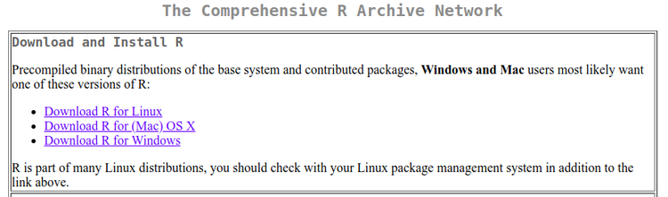
```

Siga as instruções para a instalação, diferentes para cada sistema operacional. 

## Instalação do RStudio

Uma vez instalada a linguagem R, você pode instalar o RStudio. O procedimento, novamente, depende do sistema operacional. O RStudio funciona nos três: Linux, Macintosh e Windows.

No site oficial do RStudio, https://www.rstudio.com/products/rstudio/download/, encontrará o que precisa. Pegue a versão gratuita do **RStudio Desktop**.

## Áreas da tela no RStudio

Ao entrar no RStudio, encontrará a uma tela como esta:

```{r, echo=FALSE, out.width="90%"}
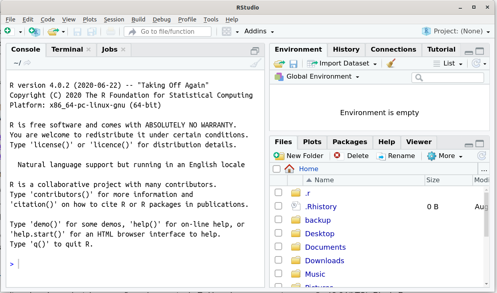
```

Reconheça os seguintes elementos:

* uma área com as abas _Console_ e _Terminal_. Usaremos a _Console_ sempre (o terminal serve para usos mais avançados e desnecessários para nosso contexto). A console permite que usemos comandos diretos em R (veremos adiante).
* uma área com as abas _Environment_ (ambiente), _History_ (histórico) e _Connections_ (conexões). Usaremos principalmente o ambiente, onde as variáveis ativas aparecem (as veremos em ação adiante).
* uma área com as abas _Files_ (arquivos), _Plots_ (gráficos), _Packages_ (pacotes), _Help_ (ajuda) e _Viewer_ (visualizador). Os dois primeiros e a área de ajuda são os mais importantes para começar.

## Começando a usar a _Console_

É através da _Console_ que usamos comandos para o R. Vamos experimentar algumas coisas simples, para começar. 

O símbolo <code>></code> é o _prompt_ do R, indicando que está pronto para receber uma instrução qualquer. Por exemplo, podemos fazer uma conta digitando na _Console_ (digite após o símbolo <code>></code> e pressione [enter] ao final da linha):
```{r, comment=NA, echo=TRUE, eval=FALSE}
4+5
```
obtendo
```{r,  comment=NA, echo=FALSE}
4+5
```
A soma de quatro e cinco resulta em 9.

Podemos guardar os valores em **variáveis** (pressione [enter] ao final de cada linha):
```{r, comment=NA, echo=TRUE}
a <- 4
b <- 5
a + b
```

Dando nomes, <code>a</code> e <code>b</code> são variáveis que receberam (com o operador de atribuição, <code><-</code>) os valores 4 e 5, respectivamente. Sua soma, <code>a + b</code> (<code>+</code> é o operador da adição), é 9. Podemos guardar este resultado em uma outra variável:
```{r, comment=NA, echo=TRUE}
soma <- a + b
```
e podemos ecoar o conteúdo da variável <code>soma</code>, simplesmente escrevendo seu nome:
```{r, comment=NA, echo=TRUE}
soma
```

<br>
```{r fig.align="left", out.width="8%", echo=FALSE}
knitr::include_graphics("coruja.png")
```

<table style="border:1; background-color:#CAE0AB"><tr><td>
Observe que nomes de variáveis podem ter várias letras e números (desde que comece com letra). Não use letras acentuadas e tenha cuidado com a grafia porque o R distingue maiúsculas de minúsculas: <code>soma</code>, <code>Soma</code> e <code>SOMA</code> são variáveis diferentes, cada uma criada com conteúdo independente. 

Nomes como <code>soma_1</code>, <code>Soma_b</code>, <code>x</code> ou <code>A</code> são, também, nomes válidos para variáveis. Crie variáveis com nomes que facilitem, para você, lembrar o tipo de conteúdo depositado nelas.   
</td></tr></table>
<br>


O resultado armazenado na variável <code>soma</code> pode ser usado:
```{r,  comment=NA, echo=TRUE}
raiz <- sqrt(soma)
raiz
```
Neste exemplo, pela primeira vez, usamos uma função, <code>sqrt()</code>, que extrai a raiz quadrada (_square root_, em inglês) de <code>soma</code> e a armazena em outra variável, <code>raiz</code>. O R distingue variáveis de funções porque as funções recebem parâmetros (neste caso, um valor numérico contido em <code>soma</code>) entre parênteses. A função <code>sqrt()</code> faz parte do  conjunto de funções básicas do R.

<br>
```{r fig.align="left", out.width="8%", echo=FALSE}
knitr::include_graphics("coruja.png")
```

<table style="border:1; background-color:#CAE0AB"><tr><td>
Nada impede a criação de uma variável chamada <code>sqrt</code>, mas não é recomendável. O R não confundirá, mas você sim. Uma possível sugestão, se você não pretende distribuir seu código internacionalmente, é dar nomes em português para as variáveis (e.g., <code>raiz_quadrada</code>); outra opção é usar algum tipo de prefixo (e.g., <code>v_sqrt</code> ou <code>v.sqrt</code>).
</td></tr></table>
<br>

Usar a console desta forma só é útil para tarefas pequenas ou testes para acertar a sintaxe. Adiante veremos como colocar vários comandos em um _Rscript_ e, mais sofisticadamente, em uma função, usando decisões ou _loops_, para facilitar seu trabalho. Por exemplo, apenas como um "aperitivo", experimente um _loop_:

```{r,  comment=NA, echo=TRUE, class.source="bgcodigo", class.output="bgsaida"}
for (n in 0:10) 
{
  cat(n,"x 3 =",n*3,"\n")
}
```

É um _loop_ (usando a palavra reservada <code>for</code>) no qual a variável <code>n</code> vai de 0 a 10, usa o operador de multiplicação, <code>*</code>, e exibe a tabuada do 3 com um único comando.

Em muitas situações podemos evitar _loops_ deste tipo, lançando mão de intervalos com o operador <code>:</code>, ou fazendo operações sobre vetores ou __dataframe_s_ inteiros.

Por exemplo, a tabuada acima pode ser obtida com:
```{r,  comment=NA, echo=TRUE}
paste(0:10,"x 3 =",(0:10)*3)
```
Entenda o código. A instrução <code>0:10</code> gera
```{r,  comment=NA, echo=TRUE}
0:10
```
e a função <code>paste()</code> concatena o que está dentro dela, sendo chamada 11 vezes por causa <code>0:10</code>, variando os números e mantendo a parte fixa entre aspas,  <code>"x 3 ="</code>.

Variáveis podem conter listas de valores. A mais simples são **vetores**, criadas com a função de contatenação, <code>c()</code>:

```{r,  comment=NA, echo=TRUE}
vetor <- c(0,1,2,3,4,5,6,7,8,9,10)
vetor
```
ou, o que é o mesmo, 

```{r,  comment=NA, echo=TRUE}
vetor <- 0:10
vetor
```
Vetores permitem operações "em lote", por exemplo, mostrando os resultados da tabuada do 3 sem precisar do _loop_:

```{r,  comment=NA, echo=TRUE}
vetor * 3
```
Em R, como <code>vetor</code> tem 11 valores, a multiplicação por 3 será repetida para cada um deles, e 11 resultados (de 3x0 a 3x10) serão computados. Porém, perdemos o formato da tabuada. Funções podem ser aninhadas:

```{r,  comment=NA, echo=TRUE}
vetor <- 0:10
tabuada <- paste(vetor,"x",3,"=",vetor*3)
m <- matrix(data=tabuada, ncol=1, nrow=11)
prmatrix(m, collab="", rowlab=rep("",11), quote=FALSE)
```
A função <code>prmatrix()</code> imprime uma matriz. Matrizes podem ser criadas quando queremos uma coleção de valores com duas dimensões (o vetor é unidimensional), cujos elementos individuais são todos do mesmo tipo (neste exemplo, _strings_ alfanuméricas) endereçados por <code>[linha,coluna]</code>. Neste exemplo, linha vai de 1 a 11, mas só existe uma coluna. Para ver, por exemplo, o conteúdo da terceira linha, podemos usar

```{r,  comment=NA, echo=TRUE}
cat("A terceira linha contém",m[3,1],"\n")
```

<br>
```{r fig.align="left", out.width="8%", echo=FALSE}
knitr::include_graphics("coruja.png")
```
<table style="border:1; background-color:#CAE0AB"><tr><td>
As funções <code>cat()</code>, <code>print()</code> e <code>prmatrix()</code> que usamos até aqui têm comportamentos similares em várias situações, mas diferentes em outras. A mais simples é <code>cat()</code>. Repare que existe um <code>"\\n"</code>, que tem pouco efeito aqui mas é importante em _Rscripts_. O efeito de <code>"\\n"</code> é de _carriage return_, similar ao que ocorre quando pressiona [enter] em um processador de textos para continuar escrevendo na próxima linha (aparecerão exemplos adiante). 

Note, também, que um espaço foi adicionado após a palavra "contém".
```{r,  comment=NA, echo=TRUE}
cat("A terceira linha contém",m[3,1],"\n")
```
Isto nem sempre é desejado, quando colocamos os espaços do nosso jeito e não queremos a interferência da função, que inclui um espaço em branco como separador por _default_. Podemos mudar o separador com o parâmetro <code>sep()</code> e escrever:
```{r,  comment=NA, echo=TRUE}
cat("A terceira linha contém ",m[3,1],"\n",sep="")
```
(o separador é vazio e o espaço após "contém" foi explicitamente colocado dentro das aspas).

O equivalente com a função <code>print()</code> precisa da ajuda de <code>paste()</code> mas não precisa de "\\n" (pois <code>print()</code> já termina mudando de linha):
```{r,  comment=NA, echo=TRUE}
print(paste("A terceira linha contém ",m[3,1],sep=""))
```
A função <code>print()</code> "suja" o início da linha com <code>[1]</code> e não é a mais indicada para uma saída destinada a quem não é usuário do R e não sabe o que isto significa. No entanto, <code>print()</code> consegue exibir estruturas mais complexas, como por exemplo a matriz <code>m</code> que definimos acima. Compare:
```{r,  comment=NA, echo=TRUE}
cat(m,"\n")
```
com
```{r,  comment=NA, echo=TRUE}
print(m)
```
Por fim, <code>prmatrix()</code> é uma especialização de <code>print()</code>, com parâmetros que podem ocultar os endereçamentos das linhas e colunas, como fizemos com
```{r,  comment=NA, echo=TRUE}
prmatrix(m, collab="", rowlab=rep("",11), quote=FALSE)
```
substituindo os rótulos (_labels_, em inglês) das colunas (<code>collab</code>) e linhas (<code>rowlab</code>) por um vazio, além de não exibir aspas (<code>quote=FALSE</code>). Experimente alterar estes parâmetros para ver o que acontece.
</td></tr></table>
<br>

## Criando um projeto

**Antes** de fazer qualquer coisa **recomendamos SEMPRE iniciar um Projeto**. Repare no canto superior-direito da tela que existe um menu mostrando que não há um projeto aberto (veja, por exemplo, a tela do RStudio acima).

<br>
```{r fig.align="left", out.width="8%", echo=FALSE}
knitr::include_graphics("coruja.png")
```

<table style="border:1; background-color:#CAE0AB"><tr><td>
O principal motivo para criar um projeto é a organização. O projeto reserva uma pasta, dentro da qual ficarão os _Rscripts_ que desenvolverá, os arquivos com dados ou resultados, ou o que mais você fizer pertinentemente ao projeto.
</td></tr></table>
<br>

Para criar um projeto novo no RStudio, no canto superior-direito clique em _New project_ e aponte-o para uma pasta de sua preferência (ou crie uma pasta nova). Terá, também, que dar um nome ao projeto. Neste exemplo vou chamá-lo de _**Anticoncepcional**_.  

```{r, echo=FALSE, out.width="90%"}
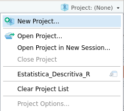
```

Você pode apontar uma pasta existente ou criar uma nova através do próprio RStudio. No caso de pasta nova, chegará em uma tela assim:

```{r, echo=FALSE, out.width="90%"}
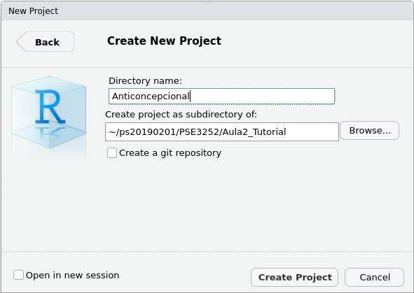
```

O nome do diretório (sinônimo de pasta) será a pasta nova e, também, o nome do projeto. A segunda parte é sob qual pasta seu projeto ficará subordinado.

<br>
```{r fig.align="left", out.width="8%", echo=FALSE}
knitr::include_graphics("coruja.png")
```

<table style="border:1; background-color:#CAE0AB"><tr><td>
Em meu caso uso o RStudio em _Linux_, e este sistema operacional endereça as pastas com sua própria sintaxe, separando os níveis por _slash_ ('/'). No Windows aparecerão caminhos como "C:\\Meus Documentos\\...", separando os níveis por _backslash_ ('\\')). </td></tr></table>
<br>

O RStudio, na pasta que você apontar, criará o arquivo _Anticoncepcional.Rproj_ e mostrará, na janela inferior-direita, o caminho até a pasta apontada e os arquivos que ela contém na aba _Files_.

```{r, echo=FALSE, out.width="90%"}
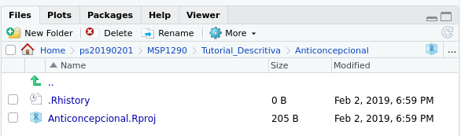
```

Neste exemplo, como criei uma pasta nova, só aparece nela (por enquanto) o que o RStudio criou para mim.

### Criando um _Rscript_

Vamos aproveitar o que testamos na _Console_ para ilustrar como guardá-lo junto ao projeto que acabamos de criar.

Use o menu e selecione 

_File -> New file -> Rscript_

(que, no meu sistema, pode ser substituído por um "atalho" pelo teclado, pressionando as teclas Ctrl+Shift+N, simultaneamente).
```{r, echo=FALSE, out.width="90%"}
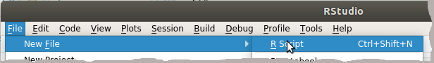
```

Uma nova aba, chamada _Untitled1_ deve abrir-se:
```{r, echo=FALSE, out.width="90%"}
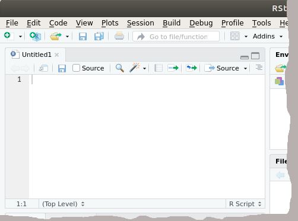
```

Coloque, dentro desta nova área, a tabuada do 3 que ensaiamos acima, digitando:
```{r, echo=TRUE, eval=FALSE}
# Este é meu primeiro Rscript
cat("Apresentando a tabuada do 3\n")
for (n in 0:10) 
{
  cat(n,"x",3,"=",n*3,"\n")
}
```

<br>

```{r fig.align="left", out.width="8%", echo=FALSE}
knitr::include_graphics("coruja.png")
```
<table style="border:1; background-color:#CAE0AB"><tr><td>
Entenda a sintaxe do R:

* O símbolo de _hashtag_ (<code>#</code>) indica uma linha de comentário (algo para você lembrar o que faz determinado trecho de um _Rscript_, que não será executada).
* <code>cat()</code> é uma função R que ecoa na Console o texto que for passado como parâmetro; neste exemplo, o primeiro <code>cat()</code> apenas escreve "Apresentando a tabuada do 3" e avança uma linha (por causa do caracter especial <code>\\n</code>).
* o <code>for()</code> já foi apresentado, e faz a variável <code>n</code> assumir sequencialmente os valores 0, 1, 2, ..., 10.
* tudo que está entre as chaves, <code>{...}</code>, é executado repetidamente a cada ciclo do <code>for()</code>.
* este segundo <code>cat</code> tem parte do texto fixo com parte variável, ecoando o resultado de cada multiplicação, uma em cada linha.
</td></tr></table>
<br>

Salve seu _Rscript_ na mesma pasta em que está o projeto, usando

_File -> Save_

com o nome _tabuada3.R_. Agora a aba tem o nome do arquivo que acabou de ser criado.

```{r, echo=FALSE, out.width="90%"}
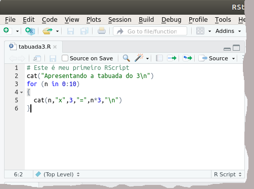
```

Execute seu _Rscript_ clicando o botão [Source] e observe o resultado na _Console_
```{r, echo=FALSE, comment=NA}
# Este é meu primeiro Rscript
cat("Apresentando a tabuada do 3\n")
for (n in 0:10) 
{
  cat(n,"x",3,"=",n*3,"\n")
}
```

Um uso um pouco mais avançado é a criação de funções. Você não precisa se contentar com as milhares de funções já disponíveis em R. A linguagem é expansível, e você pode criar mais funções. É assim que R, com a cooperação de muitas pessoas, cresce continuamente.

Por exemplo, podemos criar uma função chamada <code>tabuada()</code> assim:
```{r, echo=TRUE, comment=NA}
tabuada <- function (multiplicando=1)
{
  cat("Apresentando a tabuada do ",multiplicando,":\n", sep="")
  for (n in 0:10) 
  {
    cat(n,"x",multiplicando,"=",n*multiplicando,"\n")
  }
}
```
Salve este _Rscript_ com o nome de <code>tabuada.R</code>. Rode este _Rscript_ com [Source] uma única vez para que a função <code>tabuada()</code> fique disponível na memória. Esta função recebe um parâmetro, o <code>multiplicando</code>. Caso nenhum parâmetro seja passado, a declaração da função tem o valor 1 como _default_ (<code>multiplicando=1</code>). Passando qualquer outro valor, aparecerá a tabuada solicitada. Por exemplo, experimente com a _Console_  várias possibilidades:
```{r, echo=TRUE, comment=NA}
tabuada()
tabuada(multiplicando=5)
tabuada(8)
tabuada(-2)
```

Esta função recebe somente um parâmetro e não retorna valores. Podemos melhorá-la, guardando a tabuada em uma matriz e retornando-a para que seus valores possam ser usados separadamente e/ou manipulados por outras partes de um _Rscript_. Por exemplo:

```{r, echo=TRUE, comment=NA}
tabuada <- function (multiplicando=1, echo=TRUE)
{
  if (echo)
  {
    cat("Tabuada do ",multiplicando,"\n",sep="")
  }  
  matriz <- matrix(data=NA, ncol=4, nrow=11)
  colnames(matriz) <- c("multiplicando", "multiplicado", "produto", "texto")
  for (m in seq(from=0,to=10,by=1))
  {
    produto <- m*multiplicando
    matriz[m+1,1] <- m
    matriz[m+1,2] <- multiplicando
    matriz[m+1,3] <- produto
    matriz[m+1,4] <- paste(m,"x",multiplicando,"=",produto,sep="")
    if (echo)
    {
      cat(matriz[m+1,4],"\n")
    }
  }
  return(matriz)
}
```
Esta nova versão recebe dois parâmetros. O segundo, <code>echo=TRUE</code>, por _default_ ecoa a tabuada enquanto a calcula. Caso passe <code>echo=FALSE</code>, a função trabalhará "em silêncio". No entanto, retornará uma matriz que tem quatro colunas, respectivamente contendo o número a ser multiplicado (variando de 0 a 10), o multiplicando, o produto resultante da multiplicação e uma _string_ alfanumérica que pode ser usada para ecoar o resultado. 


<br>
```{r fig.align="left", out.width="8%", echo=FALSE}
knitr::include_graphics("coruja.png")
```
<table style="border:1; background-color:#CAE0AB"><tr><td>
Esta função está implementada como <code>eiras::times.tables</code>.
O pacote <code>eiras</code> está disponível em https://drive.google.com/drive/folders/1KR_ds0mb3bpoG5ekigjZbD1Wo1ZN6i0d?usp=sharing.
</td></tr></table>
<br>

Uma vez construída, esta função pode ser usada em outros _Rscripts_. Por exemplo, crie e salve o seguinte com o nome de <code>TesteTabuada.R</code>:
```{r, echo=TRUE, eval=FALSE, comment=NA}
source ("tabuada.R")

cat("Chamando as tabuadas\n")
for (t in 0:10)
{
  m <- tabuada(t, echo=FALSE)
  cat("-Tabuada do ",t,":\n",sep="")
  cat("\t",m[1:nrow(m),4],"\n")
}
```
A primeira linha coloca a função <code>tabuada()</code> na memória (tal como está declarada dentro do arquivo <code>tabuada.R</code>). O nome da função e do arquivo não precisam ser iguais e um arquivo pode conter a declaração de mais que uma função. O restante do código chama <code>tabuada()</code> em silêncio, trazendo seus resultados para a matriz <code>m</code> e, depois mostra apenas as _strings_ armazenadas na quarta coluna com <code>as.character(m[r,4])</code>. Execute-a com [Source] e veja seu resultado na _Console_:
```{r, echo=FALSE, comment=NA}
source ("tabuada.R")

cat("Chamando as tabuadas\n")
for (t in 0:10)
{
  m <- tabuada(t, echo=FALSE)
  cat("-Tabuada do ",t,":\n",sep="")
  cat("\t",m[1:nrow(m),4],"\n")
}
```

Quando a execução terminar, a última tabuada estará na memória. Experimente:
```{r, echo=TRUE, comment=NA}
print(m)
```
Este objeto, <code>m</code>, pode ter seus elementos acessados. A quinta linha, por exemplo, 
```{r, echo=TRUE, comment=NA}
print(m[5,])
```
que pede a linha 5 e todas as colunas. Veremos melhor estes endereçamentos de <code>[linha,coluna]</code> nos __dataframe_s_, adiante.


<br>
```{r fig.align="left", out.width="8%", echo=FALSE}
knitr::include_graphics("coruja.png")
```
<table style="border:1; background-color:#CAE0AB"><tr><td>
Como <code>TesteTabuada.R</code> não é uma função, seus valores estão acessíveis depois que foi executado. As variáveis internas de uma função, no entanto, não estão. Tente acessar, por exemplo, a variável <code>matriz</code> construída dentro de <code>tabuada.R</code> e verá que não existe. As funções, uma vez desenvolvidas, funcionam como "caixas-pretas", e seus conteúdos ficam protegidos, de forma que não haverá conflito se variáveis externas tiverem o mesmo nome daquelas usadas dentro de suas funções. O que retornamos, neste exemplo, foi uma cópia da <code>matriz</code> para a variável <code>m</code> que é, portanto, também uma matriz e podemos acessá-la. 
</td></tr></table>
<br>


# Lendo arquivos de dados

Existem formas de ler vários tipos de arquivo com R. As duas formas mais comuns são um arquivo texto que utilize algum tipo de delimitador (vírgula, ponto e vírgula ou caracteres de tabulação são os mais comuns), ou planilhas (o formato Excel, "xls" ou "xlsx" são os mais difundidos). 

Arquivos no formato texto são simples e completamente portáveis entre diferentes sistemas operacionais. Há problemas, porém, com a comunicação com pesquisadores menos habituados a eles: atrapalham-se com os delimitadores, criam arquivos usando vírgulas como separador decimal (misturando-os com vírgulas usadas como delimitadores e, assim, bagunçando os dados de colunas diferentes), digitam números ora com pontos decimais, ora com vírgulas (bagunçando os dados numéricos ao transformar 1300 em 1.3 ou levar o sistema operacional a interpretar 1,3 como se fosse um texto) ou esquecem de especificar os delimitadores.  

## Arquivos em formato texto

Para este exemplo lidaremos com um arquivo _[MetodoAnticoncepcional.txt](MetodoAnticoncepcional.txt)_, que deve ser baixado e colocado na pasta do projeto. Ele aparecerá na lista de arquivos, junto aos arquivos Anticoncepcional.Rproj e tabuada3.R mencionados acima. Este é um exemplo hipotético, usando o seguinte enredo: 

> Um agente comunitário do programa de saúde da família deseja escrever um pequeno texto alertando os jovens de sua comunidade sobre o problema da gravidez indesejada. Com este propósito, ele decide investigar quais os
métodos que os jovens estão usando. 

> Após pesquisa realizada com 60 jovens (14 – 19 anos), escolhidos aleatoriamente, obteve as respostas contidas em um arquivo texto.

Este é um arquivo texto tem 61 linhas. A  primeira linha tem os nomes das colunas (que se tornarão os nomes das variáveis) e, em seguida, os dados de cada indivíduo (um indivíduo em cada linha). 

Você pode ter uma ideia do arquivo com a ajuda do RStudio: basta clicar sobre ele na área de _Files_, e o arquivo se abrirá em uma nova janela à esquerda. Agora o RStudio mostra quatro áreas:

```{r, echo=FALSE, out.width="90%"}
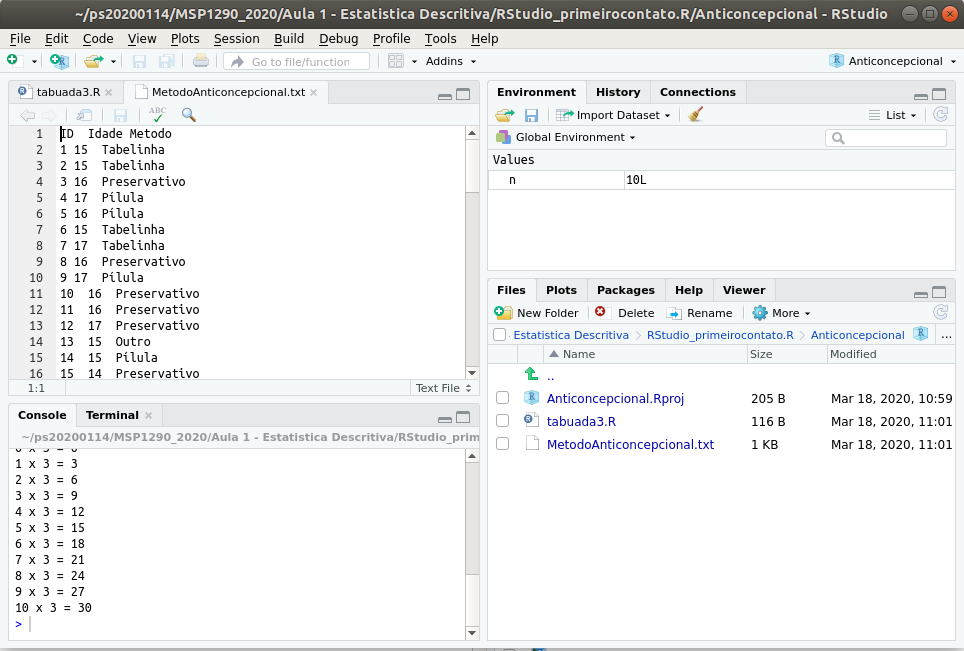
```
  
A _Console_ foi deslocada para baixo e o arquivo _MetodoAnticoncepcional.txt_ está aberto em uma nova aba. 

<br>
```{r fig.align="left", out.width="8%", echo=FALSE}
knitr::include_graphics("coruja.png")
```
<table style="border:1; background-color:#CAE0AB"><tr><td>
Este arquivo ainda não foi convertido a um formato com o qual R possa lidar, tanto que as colunas parecem desalinhadas por causa dos conteúdos com diferentes larguras. As colunas estão separadas por caracteres de tabulação (_tabs_, que normalmente têm a mesma aparência de um espaço em branco, dando a impressão de que as colunas estão desalinhadas, um dos motivos para a confusão que estes arquivos causam para usuários "_não iniciados_"). 

Repare, também, que não foram utilizadas letras acentuadas nos nomes das variáveis (Metodo em vez de Método); caso o faça, poderá ter que lidar com alguns problemas adicionais, especialmente quando seu sistema operacional não for capaz de resolver sozinho, como acontece com o _Windows_ (com o passar dos anos os problemas diminuiram, mas é melhor não arriscar: sugere-se evitar acentos em nomes de variáveis e em nomes de arquivos). 
</td></tr></table>
<br>

Variáveis, em R, podem ter estruturas mais elaboradas do que as que contém apenas um valor ou um vetor com valores de mesma natureza. Criaremos uma, chamada <code>metodos</code>, que conterá toda a informação que está neste arquivo _.txt_ com o seguinte comando no console (janela à esquerda):

```{r, comment=NA, echo=TRUE}
metodos <- read.table("MetodoAnticoncepcional.txt", 
                         header=TRUE,  dec=".", sep="\t")
```

Repare as especificações sobre o arquivo que foram passadas para a função <code>read.table()</code>:

* <code>header=TRUE</code> informa que a primeira linha deve ser usada como nome das variáveis;
* <code>dec="."</code> informa que ponto, se existir, é o separador decimal usado;
* <code>sep="\\t"</code> informa o uso do tab como delimitador. 

Outro formato comum de arquivo texto é o que recebe a extensão _.csv_, no qual as colunas são separadas por vírgula (_comma_) ou ponto e vírgula (quando a vírgula já está usada para separar decimais em língua portuguesa). O processo de importação é o mesmo, exceto que precisará ajustar os parâmetros <code>dec</code> e <code>sep</code> adequadamente.

Na janela _Environment_ (superior-direita) aparece a variável <code>metodos</code>, mostrando que a importação aconteceu. Clique no nome da variável e na seta que aparece ao lado esquerdo do nome da variável para ver algumas informações sobre seus detalhes, e sobre o nome da variável para que o RStudio mostre-lhe seu conteúdo:

```{r, echo=FALSE, out.width="90%"}
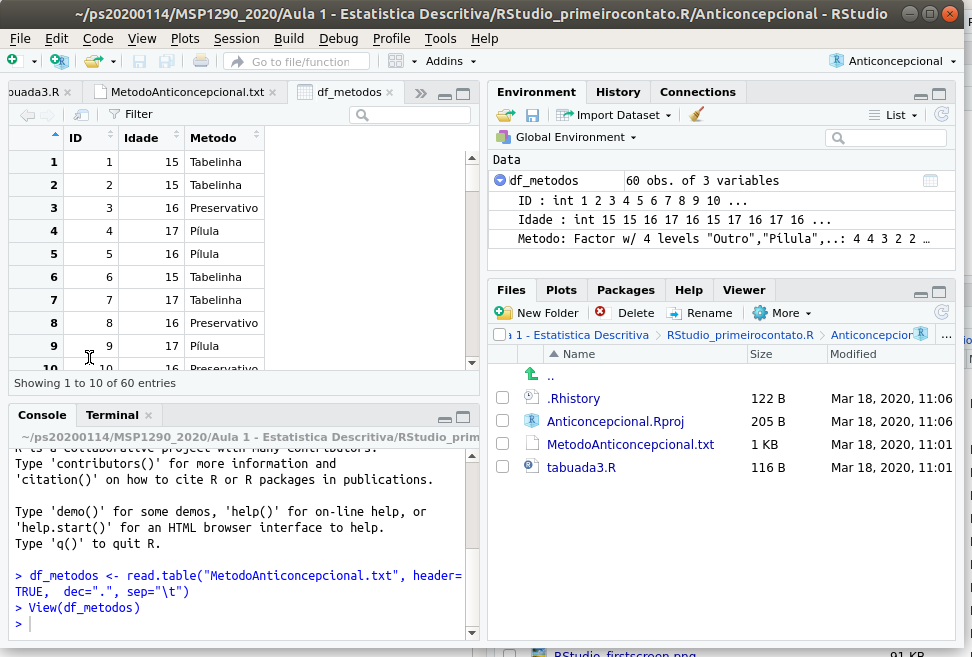
```

Como pode observar, o RStudio lhe informa que <code>metodos</code> contém três variáveis internas:

* ID, do tipo int (número inteiro, quantitativa)
* Idade, do tipo int (número inteiro, quantitativa)
* Metodo, fator com 4 níveis

A identificação do tipo de variável é automática, de acordo com o conteúdo encontrado. Não havia números fracionários, então <code>dec="."</code> não era necessário (o símbolo usado como separador decimal - quem importa arquivo texto precisa saber se os números foram escritos com a notação inglesa, usando pontos, ou portuguesa, usando vírgulas). <code>ID</code>, identificação do indivíduo, foi identificada como numérica, embora não o seja, mas não atrapalha muito deixar assim por enquanto. <code>Idade</code>, ao contrário, interessa como variável quantitativa, foi identificada como tal, e podemos fazer cálculos com ela. A coluna <code>Metodo</code> foi reconhecida, corretamente, como fator, i.e., pode ser usada para separar grupos. Como é variável categórica (veremos, adiante, que são 4 categorias), podemos fazer contagens.

Além de conhecer os tipos de variável de cada coluna, precisamos saber qual é o tipo de <code>metodos</code>. Use (na _Console_) o comando:
```{r, comment=NA, echo=TRUE}
is.table(metodos)
```
O que é uma surpresa! Apesar do nome e do comando de importação, <code>metodos</code> **NÃO É** do tipo _table_. Experimente:
```{r, comment=NA, echo=TRUE}
is.data.frame(metodos)
```
<code>metodos</code> é um _dataframe_. Confuso, mas muito conveniente. A função <code>read.table()</code>, lê um arquivo que encaramos como uma "tabela", mas cria (retorna) um _dataframe_, o qual guardamos em <code>metodos</code>; é um formato muito flexível, como veremos adiante. 

<br>
```{r fig.align="left", out.width="8%", echo=FALSE}
knitr::include_graphics("coruja.png")
```
<table style="border:1; background-color:#CAE0AB"><tr><td>
 Uma das coisas confusas em R, especialmente para quem conhece outras linguagens de programação, é a quantidade de tipos diferentes de variáveis. Há uma série de comandos em R para que se verifique qual tipo foi assumido (veremos isto adiante).
</td></tr></table>
<br>

## Arquivos em formato Excel

Este é um formato muito comum, e vai encontrá-lo com as extensões _.xls_ ou _.xlsx_ e é muito conveniente porque não é necessário preocupar-se com separadores de coluna ou delimitadores das casas decimais.

Basta que a planilha esteja estruturada com a mesma regra que usamos para o arquivo-texto: a primeira linha contém os nomes das variáveis (se houver acentos, sugere-se que os remova) e cada linha abaixo desta deve conter os dados de um indivíduo ou de uma unidade experimental.

O RStudio tem mecanismos de importação. Um dos métodos aparece em _Environment_ -> _Import Dataset_. Outra maneira é clicar sobre o nome do arquivo e o RStudio lhe oferecerá a opção _Import Dataset_. Pode experimentar estes métodos, mas é
bom saber como seria em uma _Console_ "pura" (e que, depois, você pode colocar em um _Rscript_).

<br>
```{r fig.align="left", out.width="8%", echo=FALSE}
knitr::include_graphics("coruja.png")
```
<table style="border:1; background-color:#CAE0AB"><tr><td>
O ambiente do RStudio é um facilitador. Os puristas do R podem preferir um terminal, que funciona como a _Console_ sem a ajuda do ambiente do RStudio. Assim, tudo que aparece nas janelas do RStudio é, também, obtido por comandos.
</td></tr></table>
<br>

Baixe o arquivo  _[MetodoAnticoncepcional.xlsx](MetodoAnticoncepcional.xlsx)_  para a pasta do projeto (este é um arquivo Excel com os mesmos dados do arquivo texto que utilizamos acima). 


Para ler uma planilha Excel usaremos um pacote (também chamado de _library_ no R) chamado <code>readxl</code>. 
Caso <code>readxl</code> esteja instalado, bastará clicar sobre o nome do arquivo (na aba _Files_) e escolher _Import Dataset_. 
Na _Console_ o RStudio mostra a operação que fez:

```{r, echo=TRUE, eval=FALSE}
library(readxl)
MetodoAnticoncepcional <- read_excel("MetodoAnticoncepcional.xlsx")
View(MetodoAnticoncepcional)
```

<br>
```{r fig.align="left", out.width="8%", echo=FALSE}
knitr::include_graphics("coruja.png")
```
<table style="border:1; background-color:#CAE0AB"><tr><td>
Caso o comando <code>library(readxl)</code> dê erro, o pacote precisa ter sido instalado. A mensagem de erro será algo como:

<span style="color: red">Error in library(readxl) : there is no package called ‘readxl’</span>

Neste caso, precisará instalar com:
```{r, echo=TRUE, eval=FALSE}
install.packages("readxl")
```
e seguir as instruções na tela.

Ainda há um detalhe: fazer isto dentro do RStudio funciona bem no Windows, mas não deve ser feito no Linux ou Macintosh. Isto porque o Windows é desprotegido, e o usuário é administrador da máquina o tempo todo. Nos outros sistemas operacionais mencionados, abra um terminal e inicie o R _Console_ como root. Em meu Ubuntu, por exemplo, o comportamento do terminal é assim:
```{r, echo=FALSE, out.width="70%"}
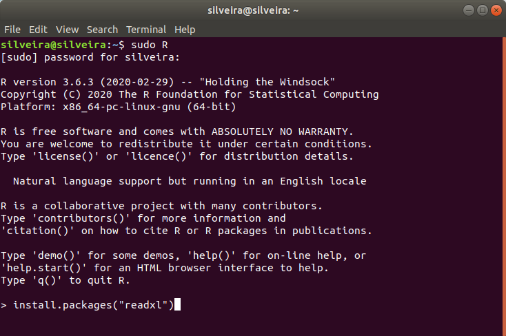
```
Um instalação, geralmente, escreve várias coisas no terminal, que o instalador precisará ler _**apenas no caso de algo dar errado**_. Observe, principalmente, as últimas linhas. Caso termine com  

<span style="color: darkgreen">* DONE (readxl)</span>

sua instalação foi bem sucedida.
```{r, echo=FALSE, out.width="70%"}
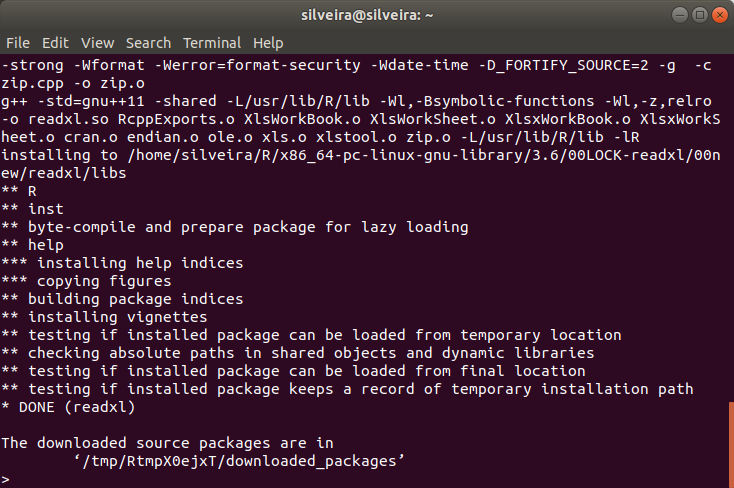
```
</td></tr></table>
<br>

Estando tudo funcionando, a função <code>library()</code> aparece pela primeira vez neste texto. A segunda função, <code>read_excel()</code> lê a planilha e o operador de atribuição, <code><-</code>, coloca seu conteúdo em uma variável que o RStudio escolhe ter o nome da planilha (o que pode não ser conveniente). A terceira linha, <code>View(MetodoAnticoncepcional)</code> exibe a variável da mesma forma que obtivemos acima, quando clicamos sobre o nome da variável na aba _Environment_. Estes comandos podem ser executados na _Console_ com resultados idênticos. 

<br>
```{r fig.align="left", out.width="8%", echo=FALSE}
knitr::include_graphics("coruja.png")
```
<table style="border:1; background-color:#CAE0AB"><tr><td>
Os mesmos comandos que o RStudio ecoa na _Console_ podem ser colocados dentro de um _Rscript_, com a vantagem de que você poderá escolher um nome de variável que lhe convenha. Por exemplo:
```{r, echo=TRUE, eval=FALSE}
library(readxl)
metodos <- readxl::read_excel("MetodoAnticoncepcional.xlsx")
```

**O que fazem?**

- <code>library()</code> ativa um _package_ (pacote). As funções do R fazem parte de pacotes. Na primeira instalação do R é comum termos apenas as funções básicas com as funções vistas até aqui. 
- A função <code>read_excel()</code>, uma das funções de <code>readxl</code>, só funciona depois que <code>library(readxl)</code> for executada uma vez. 
- Observe a chamada da função com <code>readxl::read_excel()</code>, na qual <code>readxl::</code> é opcional. Sugerimos adotar este hábito por dois motivos: (1) lembrar de qual pacote a função veio e (2) evitar ambiguidades porque pacotes diferentes podem ter funções com nomes iguais, e é melhor ter certeza de que o R está usando a função que você escolheu.
- a variável <code>metodos</code> é o nome que escolhemos (note que sem acentuação; pode ser qualquer nome válido para um variável), e conterá os dados da planilha importada.

</td></tr></table>
<br>

Para saber qual é o tipo de objeto que <code>readxl::read_excel()</code> podemos perguntar ao R:
```{r, echo=TRUE}
library(readxl)
metodos <- readxl::read_excel("MetodoAnticoncepcional.xlsx")
cat(is.data.frame(metodos))
```

O R informa que é um _dataframe_ mas, cuidado... observe:
```{r, echo=TRUE}
library(readxl)
metodos <- readxl::read_excel("MetodoAnticoncepcional.xlsx")
print(str(metodos))
metodos <- as.data.frame(metodos)
print(str(metodos))
```

Isto significa que <code>readxl::read_excel()</code> devolve um objeto que se parece com um _dataframe_, aceito como tal pela função <code>is.data.frame()</code>, mas que não é exatamente um _dataframe_. É um objeto tão parecido que, para muitas funções, é equivalente. A função <code>str()</code> revela que <code>metodos</code> é um <code>tibble</code>. Depois de forçarmos a conversão em _dataframe_ com 

<code>metodos <- as.data.frame(metodos)</code>

confirmamos que algo mudou usando, novamente, a função <code>str()</code>. Portanto, para garantir que o objeto seja um _dataframe_, pode-se fazer a leitura de planilhas assim:
```{r, echo=TRUE}
library(readxl)
metodos <- as.data.frame(readxl::read_excel("MetodoAnticoncepcional.xlsx"))
print(str(metodos))
```


<br>
```{r fig.align="left", out.width="8%", echo=FALSE}
knitr::include_graphics("coruja.png")
```
<table style="border:1; background-color:#CAE0AB"><tr><td>
O pacote <code>eiras</code> (disponível em 
https://github.com/pspsilveira/eiras) ainda não está no CRAN. Para instalá-lo,
então, você precisará baixar do **github** o arquivo que está na subpasta <code>source_package</code> e, então, usar a linha de comando

> install.packages("**pathname**eiras_X.X.X.tar.gz")

onde **pathname** é o caminho até a pasta onde você baixou o arquivo e <code>eiras_X.X.X.tar.gz</code>
deve ser substituído pela versão mais recente que estiver disponível. 
Por exemplo, no terminal Linux, tendo baixado a versão 0.1.1. para uma 
pasta chamada <code>tmp</code> localizada na área de trabalho de meu 
usuário, o comando é

> install.packages("/home/silveira/tmp/eiras_0.1.1.tar.gz")


ou usar o auxílio do RStudio (Tools -> Install packages...), mudando do CRAN para um
_Package Archive File (.tar.gz)_ e apontando o arquivo para instalar.

</td></tr></table>
<br>

## Arquivos em outros formatos

Há alguns outros formatos pré-instalados no RStudio. Funcionará como no caso do Excel. 

Por exemplo, para SPSS:

```{r, echo=TRUE, eval=FALSE}
library(haven)
dt_anxproc1 <- haven::read_sav("AnxietyProcrastination.sav")
```

Para Stata:

```{r, echo=TRUE, eval=FALSE}
library(haven)
lbw <- haven::read_dta("lbw.dta")
```

Para o formato do LibreOffice (_.ods_) não há nada pronto no RStudio. Não é problema: existe _package_ para isto, como:
```{r, echo=TRUE, eval=FALSE}
library(readODS)
dt_anxproc2 <- readODS::read_ods("AnxietyProcrastination.ods")
```
Caso os execute serão criados __dataframe_s_, respectivamente chamados <code>dt_anxproc1</code>, <code>lbw</code> e <code>dt_anxproc2</code>, todos com o mesmo conteúdo (claramente, é preciso antes baixar os arquivos  _[AnxietyProcrastination.sav](AnxietyProcrastination.sav)_,  _[lbw.dta](lbw.dta)_ e  _[AnxietyProcrastination.ods](AnxietyProcrastination.ods)_ para a pasta do projeto).


<br>
```{r fig.align="left", out.width="8%", echo=FALSE}
knitr::include_graphics("coruja.png")
```
<table style="border:1; background-color:#CAE0AB"><tr><td>
Estes dados também estão disponíveis no pacote <code>eiras</code>, disponível
em https://github.com/pspsilveira/eiras (em inglês).

A maneira de obtê-los depende do formato em que foram armazenados. No formato 
padrão do R:

```{r, echo=TRUE, eval=FALSE}
ctcp <- eiras::contraceptive
print(ctcp)

procrastinacao <- eiras::procrastination
print(procrastinacao)

lbw <- eiras::lbw
print(lbw)
```

Nos outros formatos mencionados, a sintaxe é similar à dos exemplos acima:
```{r, echo=TRUE, eval=FALSE}
cm <- readxl::read_excel(system.file("extdata","contraceptive.xlsx",package="eiras"))
print(cm)

anxproc <- haven::read_sav(system.file("extdata","procrastination.sav",package="eiras"))
print(anxproc)

lbw <- haven::read_dta(system.file("extdata","lbw.dta",package="eiras"))
print(lbw)

anxproc2 <- readODS::read_ods(system.file("extdata","procrastination.ods",package="eiras"))
print(anxproc2)
```


</td></tr></table>
<br>


# Manipulando um _dataframe_

## retomando o _dataframe_
Vamos retormar o _dataframe_ <code>metodos</code> com os seguintes comandos, já executados:
```{r, comment=NA, echo=TRUE}
library(readxl)
metodos <- readxl::read_excel("MetodoAnticoncepcional.xlsx")
is.data.frame(metodos)
```

## acessando elementos individuais de um _dataframe_
Podemos verificar tanto o conteúdo das colunas de um _dataframe_ quanto os tipos de variável nele contidos.

O conteúdo das colunas podem ser acessados, fornecendo simplesmente o nome da variável:
```{r, comment=NA, echo=TRUE}
metodos$Idade
```
Note o símbolo <code>$</code>, significando que queremos a coluna <code>Idade</code> que está dentro do _dataframe_ <code>metodos</code>.

Os números entre colchetes à esquerda representam a posição do primeiro elemento exibido em cada linha. Por exemplo, o primeiro elemento contém o valor 15
```{r, comment=NA, echo=TRUE}
metodos$Idade[1]
```
o vigésimo sexto elemento contém o valor 18:
```{r, comment=NA, echo=TRUE}
metodos$Idade[26]
```
o quinquagésimo terceiro contém o valor 16: 
```{r, comment=NA, echo=TRUE}
metodos$Idade[53]
```
e o último elemento contém o valor 15: 
```{r, comment=NA, echo=TRUE}
metodos$Idade[60]
```

<br>
```{r fig.align="left", out.width="8%", echo=FALSE}
knitr::include_graphics("coruja.png")
```
<table style="border:1; background-color:#CAE0AB"><tr><td>
Em situações em que o número de linhas (_rows_, em inglês) não é conhecido, o último elemento pode ser acessado com:
```{r, comment=NA, echo=TRUE}
metodos$Idade[nrow(metodos)]
```
A função <code>nrow()</code>, aninhada dentros dos colchetes, devolve o número de linhas que <code>metodos</code> tem; neste caso:
```{r, comment=NA, echo=TRUE}
nrow(metodos)
```
devolve o valor 60.

Note que o R executa os colchetes e parênteses em uma expressão do mais interno para fora. Então, <code>metodos\$Idade[nrow(metodos)]</code> torna-se <code>metodos\$Idade[60]</code> e esta variável contém o valor 15.
</td></tr></table>
<br>

Os elementos da coluna <code>metodos$Idade</code> são todos números:
```{r, comment=NA, echo=TRUE}
is.numeric(metodos$Idade)
```

E podemos perguntar se são, por exemplo, finitos (e, neste caso, cada valor é verificado):

```{r, comment=NA, echo=TRUE}
is.finite(metodos$Idade)
```

<br>
```{r fig.align="left", out.width="8%", echo=FALSE}
knitr::include_graphics("coruja.png")
```
<table style="border:1; background-color:#CAE0AB"><tr><td>
Em conexão com o comentário, acima, de que em R há muitos tipos de variáveis que não têm correspondência em outras linguagens de programação, note também que uma variável pode ser vista como se tivesse vários "tipos" e ou "subtipos" simultaneamente. Por exemplo, a coluna <code>Idade</code>, além de numérica e contendo números finitos, também pode ser tratada como um vetor.
```{r, comment=NA, echo=TRUE}
is.vector(metodos$Idade)
```
</td></tr></table>

<br>

A coluna <code>Metodo</code>, obviamente, não é numérica:
```{r, comment=NA, echo=TRUE}
is.numeric(metodos$Metodo)
```

<br>
```{r fig.align="left", out.width="8%", echo=FALSE}
knitr::include_graphics("coruja.png")
```
<table style="border:1; background-color:#CAE0AB"><tr><td>
Não confunda <code>metodos</code>, que é o nome que demos ao _dataframe_, com <code>Metodo</code> que é uma coluna do _dataframe_, a qual é endereçada por <code>metodos$Metodo</code>.
</td></tr></table>
<br>

A coluna <code>metodos$Metodo</code> poderia ser um fator, uma vez que tem poucos valores diferentes:
```{r, comment=NA, echo=TRUE}
unique(metodos$Metodo)
```

No entanto, a função <code>read_excel</code> a trouxe como uma variável _character_:
```{r, comment=NA, echo=TRUE}
is.factor(metodos$Metodo)
is.character(metodos$Metodo)
```
Isto pode ser corrigido; voltaremos a lidar com fatores adiante.
 
__dataframe_s_ são organizados em <code>[linha,coluna]</code>. É possível acessar  uma linha específica de um _dataframe_ pelo seu número. A segunda linha contém:

```{r, comment=NA, echo=TRUE}
metodos[2,]
```
Podemos também acessar uma coluna pelo seu número. A terceira coluna contém:

```{r, comment=NA, echo=TRUE}
metodos[,3]
```

o mesmo que buscar por
```{r, comment=NA, echo=TRUE}
metodos[, "Metodo"]
```

Podemos combinar linha e coluna. O conteúdo da segunda linha, terceira coluna contém:
```{r, comment=NA, echo=TRUE}
metodos[2,3]
```

<br>
```{r fig.align="left", out.width="8%", echo=FALSE}
knitr::include_graphics("coruja.png")
```
<table style="border:1; background-color:#CAE0AB"><tr><td>
A coluna <code>Idade</code> é a segunda coluna do _dataframe_. Antes, acessamos esta coluna com 
```{r, comment=NA, echo=TRUE}
metodos$Idade
```
e vimos que R nos fornece um vetor numérico. Podemos acessar os dados também pelo número da coluna com
```{r, comment=NA, echo=TRUE}
metodos[,2]
```
Observe que os dados são os mesmos, mas o formato não é. Acessando pelo número da coluna não obtivemos um vetor numérico. Caso precise, por exemplo para que uma função que aguarde dados neste formato, o equivalente é:
```{r, comment=NA, echo=TRUE}
as.numeric(unlist(metodos[,2]))
```
ou
```{r, comment=NA, echo=TRUE}
as.numeric(unlist(metodos["Idade"]))
```

Caso queiramos os métodos em um vetor alfanumérico, pode usar (pelo número da coluna ou pelo nome da coluna) algo como:
```{r, comment=NA, echo=TRUE}
as.character(unlist(metodos["Metodo"]))
```
</td></tr></table>
<br>

## selecionando dados

É possível filtrar por determinadas condições. Existem operadores: 

* de comparação: <code><</code> (menor), <code><=</code> (menor ou igual), <code>==</code> (igual), <code>!=</code> (diferente), <code>>=</code> (maior ou igual) e <code>></code> (maior).
* lógicos: <code>&</code> (_and_), <code>|</code> (_or_) e <code>!</code> (_not_). 

As linhas dos indivíduos com idade menor ou igual a 15 anos são:
```{r, comment=NA, echo=TRUE}
dftmp <- metodos[metodos$Idade<=15,]
print(dftmp)
```
Este <code>dftmp</code> é um _dataframe_, contendo um subconjunto de <code>metodos</code>. Caso não apareça inteiro na _Console_ (<code>print()</code> só exibe as primeiras linhas), use a aba _Environment_ para ver todo o seu conteúdo e confira o sucesso desta operação.

Quem não tem 17 é dado por:
```{r, comment=NA, echo=TRUE}
dftmp <- metodos[metodos$Idade!=17,]
print(dftmp)
```
Por exemplo, para saber quais estão entre 15 **e** 18 anos de idade (incluindo 15 mas não incluindo 18):
```{r, comment=NA, echo=TRUE}
dftmp <- metodos[metodos$Idade>=15 & metodos$Idade<18,]
print(dftmp)
```
Para saber quem tem menos que 15 (inclusive) **ou** exatamente 17:
```{r, comment=NA, echo=TRUE}
dftmp <- metodos[metodos$Idade<=15 | metodos$Idade==17,]
print(dftmp)
```
Para saber quem não é menor de idade (i.e., idades que não são menores que 18 anos), precisamos saber quem tem menor que 17 ou, pela negativa, quem não tem mais que 18:
```{r, comment=NA, echo=TRUE}
dftmp <- metodos[metodos$Idade<=17,]
print(dftmp)
```
ou
```{r, comment=NA, echo=TRUE}
dftmp <- metodos[!metodos$Idade>=18,]
print(dftmp)
```
Os operadores podem ser combinados. A ordem das comparações é dada por <code>()</code>, indo do mais interno para o mais externo, se forem aninhados. Por exemplo, os cálculos são diferentes:
```{r, comment=NA, echo=TRUE}
  1+3 / 4+5 / 2
((1+3)/(4+5)) / 2
```
O primeiro obedece a precedência habitual da matemática (divisão vem antes da soma). Então divide 3 por 4 resultando em 0.75, então 5 por 2 resultando em 2.5, e finalmente faz a soma de 1+0.75+2.5 resultando em 4.25; se não era o pretendido, os espaços em branco nada resolvem (são ignorados).
O segundo soma 1+3 (resulta em 4), depois 3+5 (resulta em 8), então divide 4 por 8 resultando em 0.5 e, finalmente, divide por 2 resultando em 0.25.
Na dúvida sobre a precedência das operações, use e abuse dos <code>()</code>.

Da mesma forma, para comparações a ordem é regulada com <code>()</code>. Se quisermos saber quem tem entre (15 **e** 16) **ou** entre (18 **e** 19), inclusive
```{r, comment=NA, echo=TRUE}
dftmp <- metodos[(metodos$Idade>=15 & metodos$Idade<=16) | 
                 (metodos$Idade>=18 & metodos$Idade<=19),]
print(dftmp)
```
(a linha quebrada após <code>|</code> é opcional; apenas para facilitar a legibilidade do código, evitando escrever linhas muito longas que saem da tela).

## alterando o conteúdo do _dataframe_

Como podemos acessar os elementos de um _dataframe_, podemos também alterar seus valores usando o operador de atribuição, <code><-</code>. Por exemplo:

```{r, comment=NA, echo=TRUE}
metodos$Idade[45] <- 19.5
```
e confira com
```{r, comment=NA, echo=TRUE}
metodos$Idade
```
(localize o 45<sup>0</sup> elemento e veja que seu valor é, agora, 19.5).

Mais uma coisa aconteceu. Notou que, ao adicionarmos um elemento com uma casa decimal, todos os valores agora apareceram com uma casa decimal? Um vetor tem que ter elementos todos do mesmo tipo e, para acomodar o 19.5, é inteiramente formado por números do tipo _double_ (a forma do R dizer que é número fracionário).

```{r, comment=NA, echo=TRUE}
is.numeric(metodos$Idade)
is.integer(metodos$Idade)
is.double(metodos$Idade)
```

A esta altura você pode imaginar que devem existir muitas funções R iniciadas com <code>is...()</code> e que pode ser uma tarefa insana ficar tentando várias funções até adivinhar com qual tipo estamos lidando. Podemos reproduzir na _Console_ as informações de uma variável que aparecem na aba _Environment_ com a função <code>str()</code> (de _structure_, estrutura):
```{r, comment=NA, echo=TRUE}
str(metodos)
```
mostrando a coluna <code>ID</code> é numérica (_num_), <code>Idade</code> é numérica e <code>Metodo</code> é character (_chr_). 

Ajuda, ainda, conhecer a função _sapply()_:
```{r, comment=NA, echo=TRUE}
sapply(metodos, typeof)
```
que informa o tipo _double_ para <code>metodos\$Idade</code>.

<br>
```{r fig.align="left", out.width="8%", echo=FALSE}
knitr::include_graphics("coruja.png")
```
<table style="border:1; background-color:#CAE0AB"><tr><td>
Como sempre, se usamos apenas o nome da variável <code>metodos</code> na _Console_, R tenta exibir todo seu conteúdo: 
```{r, comment=NA, echo=TRUE}
metodos
```
Como são muitas linhas, R trunca e informa quantas não exibiu. Tentar mostrar um _dataframe_ desta forma, portanto, não é muito prático; usar o ambiente do RStudio através da aba _Environment_ é muito mais fácil. 

Note, ainda, os números das linhas à esquerda. Estes são os números de linha de <code>metodos</code>. Neste caso é apenas uma coincidência que sejam iguais a <code>metodos$ID</code>, pois os pacientes foram numerados sequencialmente no arquivo original.
</td></tr></table>
<br>

## alterando o tipo de variável
Caso lhe incomode que <code>metodos$ID</code> seja um número, um tipo pode ser convertido em outro:
```{r, comment=NA, echo=TRUE}
metodos$ID <- as.character(metodos$ID)
```
Repare que a função é <code>as.character</code>, significando **como alfanumérica** (e não <code>is.character()</code>, que pergunta se **é alfanumérica?**). Variáveis do tipo _chr_ são as que podem acomodar textos como "Tabelinha", "Outros métodos" ou mesmo letras e números combinados, como "RG 123456". 

Também pode ser estranho atribuir a <code>metodos\$ID</code> uma operação feita com a própria variável. O que acontece em linguagens de programação é que o que está além do operador de atribuição <code><-</code> é processado primeiro e, então seu resultado é jogado na variável à sua esquerda. Neste exemplo, o conteúdo de <code>metodos\$ID</code> é passado à função <code>as.character</code>, que a devolve convertida em caracteres; o resultado desta operação é atribuído à própria <code>metodos\$ID</code>, sobrepondo seus valores anteriores. Confira que o tipo da variável <code>metodos\$ID</code> mudou para _chr_: 
```{r, comment=NA, echo=TRUE}
str(metodos)
```

<br>

Mencionamos, acima, que <code>metodos\$Metodo</code> deveria ser tratado como um fator. Existe função para isto:
```{r, comment=NA, echo=TRUE}
metodos$Metodo <- as.factor(metodos$Metodo)
```
Confira que ocorreu com <code>metodos\$Metodo</code>: 
```{r, comment=NA, echo=TRUE}
str(metodos)
```

Observe que <code>metodos\$Metodo</code>, sendo um fator (portanto uma variável nominal), tem indicação de quantos níveis (i.e., quantos valores diferentes existem) armazenados na variável. São 4, diferentes, como já tínhamos visto com 
```{r, comment=NA, echo=TRUE}
unique(metodos$Metodo)
```
Note também que os níveis têm números inteiros associados com cada categoria. A ordem dos níveis do fator segue a ordem de aparição dos dados no _dataframe_. 
```{r, comment=NA, echo=TRUE}
print(metodos$Metodo)
```
Esta ordem, quando não é conveniente, pode ser escolhida com:

```{r, comment=NA, echo=TRUE}
metodos$Metodo <- factor(metodos$Metodo,levels=c("Tabelinha","Pílula","Preservativo","Outro"))
```

Veja o que mudou com 
```{r, comment=NA, echo=TRUE}
str(metodos)
unique(metodos$Metodo)
```
e observe a ordem dos _levels_ que a função <code>unique()</code> agora exibe.

# Gravando e recuperando um _dataframe_

## formato nativo do R
Depois de alterar como precisa um _dataframe_, você pode querer armazená-lo, para uso futuro, em um arquivo em formato do R, use:
```{r, comment=NA, echo=TRUE}
save(metodos, file="metodos.Rdata")
```
e veja que aparece um arquivo chamado _**metodos.Rdata**_ na aba _Files_. Seu conteúdo é o estado atual de <code>metodos</code>.

Para comprovar, vamos destruir a variável <code>metodos</code> com
```{r, comment=NA, echo=TRUE}
rm(metodos)
```
Esta função, <code>rm()</code>, remove o _dataframe_ que, agora, não está mais disponível na memória do computador para uso (observe a aba _Environment_):
```{r, comment=NA, echo=TRUE}
try(str(metodos))
```

Para recuperá-la use:
```{r, comment=NA, echo=TRUE}
load("metodos.Rdata")
```
O arquivo _.Rdata_, além dos dados, preserva o nome que o _dataframe_ tinha (<code>metodos</code>) e a estrutura definida até o momento, o que pode ser comprovado com
```{r, comment=NA, echo=TRUE}
str(metodos)
```

## formato Excel
Caso prefira salvar em formato de planilha, uma possibilidade é usar
```{r, comment=NA, echo=TRUE}
library(openxlsx)
openxlsx::write.xlsx(metodos,"MetodosAnticoncepcionais.xlsx")
```

para recuperar a planilha em um _dataframe_:
```{r, comment=NA, echo=TRUE}
library(readxl)
metodos <- readxl::read_excel("MetodosAnticoncepcionais.xlsx")
```

# `c()`, `NA`, `NULL`, `rm()`

Estes funções e valores precisam ser claramente entendidos em R.

A função <code>c()</code> é o concatenador, que já utilizamos antes. Há situações em que precisamos criar um vetor numérico vazio e adicionar valores um a um. Por exemplo, este _Rscript_ cria um vetor vazio e, depois, adiciona 20 números inteiros pseudo-aleatórios entre 0 e 10:
```{r, comment=NA, echo=TRUE}
vetor <- c()
for ( i in 1:20)
{
  vetor <- c(vetor, round(runif(n=1, min=0, max=10),0))  
}
cat("O vetor contém",vetor,"\n")
```
O valor ausente <code>NA</code> (_not available_, não disponível) aparece quando há valores faltantes. Muitas vezes é necessário informar ao R para ignorá-los. Isto acontece com frequência quando uma planilha é lida para um _dataframe_ e há células em branco: o R as indica com <code>NA</code>.

Por exemplo, imagine que pretendemos computar a média do vetor numérico que acabamos de criar:
```{r, comment=NA, echo=TRUE}
cat("A média aritmética é",mean(vetor),"\n")
```
Suponha, agora, que o terceiro valor do vetor esteja ausente e queiramos calcular a média:
```{r, comment=NA, echo=TRUE}
vetor[3] <- NA
cat("O vetor agora contém:",vetor,"\n")
cat("A média aritmética é",mean(vetor),"\n")
```
Por causa de um único <code>NA</code> entre os 20 números, a média não pode ser calculada. A função <code>mean()</code> (e várias outras funções do R) tem o parâmetro lógico <code>na.rm</code> que instrui sua remoção antes de calcular a média.
```{r, comment=NA, echo=TRUE}
cat("A média aritmética é",mean(vetor, na.rm=TRUE),"\n")
```
Existe, também, a função <code>is.na()</code> para verificar se algum valor está ausente. Por exemplo, o <code>vetor</code> tem tamanho de 20 números, mas somente 19 são válidos. Podemos saber disto perguntando ao R:
```{r, comment=NA, echo=TRUE}
cat("Valores válidos: n =",sum(!is.na(vetor)),"\n")
```
onde <code>is.na(vetor)</code> retorna <code>TRUE</code> (ou 1) para os números <code>NA</code> e <code>!</code> é a negativa (portanto a expressão retorna a soma de <code>TRUE</code>s que não são <code>NA</code>, i.e., números válidos).

O valor <code>NULL</code> é nulo, vazio, diferente do <code>NA</code> que é ausente. É menos usado, mas pode servir para esvaziar uma variável. Observe a aba do _Environment_, onde deve estar a variável <code>vetor</code>. Faça:
```{r, comment=NA, echo=TRUE}
vetor <- NULL
```
e verá que ela ainda existe, mas agora está esvaziada (e, portanto, liberou a memória que ocupava). Isto pode ser útil em _Rscripts_ maiores, para desocupar memória de processamento.

Mais que <code>NULL</code> é a remoção da variável do ambiente. Observe o _Environment_ e faça:
```{r, comment=NA, echo=TRUE}
rm(vetor)
```
para verificar que a variável desaparece.

# Lidando com variável qualitativa

Este arquivo é pequeno e podemos ler todas as linhas da coluna <code>Metodo</code>. Mas e se o arquivo fosse maior? Já vimos que isto se resolve com 

```{r, comment=NA, echo=TRUE}
unique(metodos$Metodo)
```

Temos, portanto, 4 métodos na coluna <code>metodos\$Metodo</code>. É bom verificar com a função <code>unique()</code> porque em variáveis contendo textos é comum haver erro na digitação dos dados. Podemos verificar quantas ocorrências de cada:
```{r, comment=NA, echo=TRUE}
table(metodos$Metodo)
```

Existe uma outra função, <code>summary()</code>, em determinadas situações equivalente
```{r, comment=NA, echo=TRUE}
summary(metodos$Metodo)
```

São equivalentes porque tivemos o cuidado de transformar <code>metodos\$Metodo</code> em fator. Caso esta coluna fosse _chr_, o comportamento de <code>summary</code> seria assim:
```{r, comment=NA, echo=TRUE}
metodos$Metodo <- as.character(metodos$Metodo)
summary(metodos$Metodo)
```

Caso isto aconteça com alguma variável sua, é só arrumar convertendo em fator com <code>is.factor()</code> como descrevemos acima.

## calculando porcentagens
Caso prefira ver as contagens em porcentagem, em vez de números absolutos, faça:

```{r, comment=NA, echo=TRUE}
contagem <- table(metodos$Metodo) 
contagem/sum(contagem)*100
```
<br>
```{r fig.align="left", out.width="8%", echo=FALSE}
knitr::include_graphics("coruja.png")
```
<table style="border:1; background-color:#CAE0AB"><tr><td>
**Entenda o código**:

Note que a variável <code>contagem</code>, criada com a função <code>table()</code> é uma tabela:
```{r, comment=NA, echo=TRUE}
is.table(contagem)
```

Já tínhamos visto o comando <code>summary(metodos$Metodo)</code> que devolvia as contagens do número de ocorrências de cada categoria da coluna <code>Metodo</code> dentro da <code>metodos</code>. O operador <code><-</code> é o operador de atribuição e, então,

<code> contagem <- summary(metodos$Metodo)</code>

em vez de ecoar na tela, cria uma variável chamada <code>contagem</code> para armazenar o resultado de <code>summary()</code>. Esta <code>contagem</code> tem os 4 valores, correspondendo às ocorrências de Tabelinha, Preservativo, Pílula e Outro 

A função <code>sum()</code> (soma) totaliza os valores da variável <code>contagem</code>. O comando <code> contagem/sum(contagem)\*100</code>, portanto, pega cada valor de <code>contagem</code>, divide por <code>sum(contagem)</code> e multiplica por **100** para transformar em porcentagem. Como existem 4 valores em <code>contagem</code> a operação é feita 4 vezes e a saída traz os 4 resultados convertidos (lembre-se da operação "em lote" que foi feita para a tabuada do 3). 
</td></tr></table>
<br>

Um gráfico do tipo _pie_ (torta) ou, como gostamos mais, pizza, formalmente conhecido como gráfico de setores, é obtido com:

```{r, comment=NA, echo=TRUE}
tabela <- table(metodos$Metodo)
pie(tabela, main="Anticoncepcionais")
```
Passar um <code>table</code> para a função <code>pie</code> é equivalente a passar uma lista de valores e seus rótulos (_labels_). Produz o mesmo resultado:
```{r, comment=NA, echo=TRUE}
pie(c(22,14,19,5), 
    labels=c("Tabelinha", "Pilula", "Preservativo", "Outro"), 
    main="Anticoncepcionais")
```
diferindo, apenas, pela ordem em que passamos cada uma das categorias.

<br>
```{r fig.align="left", out.width="8%", echo=FALSE}
knitr::include_graphics("coruja.png")
```
<table style="border:1; background-color:#CAE0AB"><tr><td>
A função <code>pie()</code> pode receber outros valores além dos números, nomes das fatias e título para o gráfico. 

Para acessar a documentação desta ou de qualquer outra função R, use o operador '?'. Por exemplo, experimente na _Console_ do RStudio: 
```{r, comment=NA, echo=TRUE}
?pie
```
e observe a aba _Help_ com sua documentação.

Quer ver uma gracinha?
```{r, comment=NA, echo=TRUE}
pie(c(Sky = 78, 
      "Sunny side of pyramid" = 17, 
      "Shady side of pyramid" = 5), 
    init.angle = 315, 
    col = c("deepskyblue", "yellow", "yellow3"), 
    border = FALSE)
```
(quem me chamou a atenção sobre este gráfico foi Fernando Sacramento; é um dos exemplos da documentação da função no R, que credita o exemplo a FinalBackwardsGlance [http://imgur.com/gallery/wWrpU4X](http://imgur.com/gallery/wWrpU4X).
</td></tr></table>
<br>

O gráfico dos métodos anticoncepcionais terá exatamente a mesma aparência se o apresentarmos em porcentagens. Aqui são apenas 4 fatias, e eu poderia trocar os valores de fatias por suas respectivas porcentagens. No entanto, não é necessário todo o trabalho; podemos criar os vetores <code>fatias</code> e <code>nomes</code> com comandos do R e tornar esta sequência de comandos mais fácil de ajustar para outras tabelas. Experimente:

```{r, comment=NA, echo=TRUE}
# fatias recebem os números da tabela
fatias <- as.vector(contagem)
# transforma em porcentagem
fatias <- fatias/sum(fatias)*100
# nomes recebem os nomes das colunas da tabela
nomes <- names(contagem)
pie(fatias, labels=nomes, main="Métodos utilizados")
```

<br>
```{r fig.align="left", out.width="8%", echo=FALSE}
knitr::include_graphics("coruja.png")
```
<table style="border:1; background-color:#CAE0AB"><tr><td>
Repare o uso de um comentário: tudo que escrever após # não é executado.

A variável <code>fatias</code> recebe os números 5, 14, 19 e 22. Então <code>fatias</code> é sobrescrita com as próprias porcentagens (frequências relativas) correspondentes a cada uma das categorias. A função <code>names()</code> retorna os nomes, respectivamente, associados. A função <code>pie()</code> já é nossa conhecida.
</td></tr></table>
<br>

# Lidando com variável quantitativa

Neste exemplo podemos explorar a idade dos indivíduos. Sendo variável numérica, podemos usar funções que envolvem cálculos e, assim, ter medidas de localização e de dispersão. 

Para variáveis numéricas, <code>table()</code> e <code>summary()</code> têm comportamentos diferentes:

Com <code>table()</code> obtemos:
```{r, comment=NA, echo=TRUE}
t <- table(metodos$Idade)
print(t)
```
Significando que existem `r as.numeric(t[1])` valores `r names(t)[1]`, `r as.numeric(t[2])` valores `r names(t)[2]`, `r as.numeric(t[3])` valores `r names(t)[3]`, e assim por diante, até o valor que adicionamos, com `r as.numeric(t[length(t)])` ocorrência de `r names(t)[length(t)]`.

Enquanto <code>summary()</code>:
```{r, comment=NA, echo=TRUE}
t <- summary(metodos$Idade)
print(t)
```
fornece quartis, mediana, média e desvio-padrão da mesma variável.

Como <code>metodos\$Idade</code> é numérica, podemos computar estes valores separadamente:

* Média aritmética:
```{r, comment=NA, echo=TRUE}
mean(metodos$Idade)
```

* Variância:
```{r, comment=NA, echo=TRUE}
var(metodos$Idade)
```

* Desvio-padrão assim:
```{r, comment=NA, echo=TRUE}
sd(metodos$Idade)
```
ou assim:
```{r, comment=NA, echo=TRUE}
var(metodos$Idade)**0.5
```

<br>
```{r fig.align="left", out.width="8%", echo=FALSE}
knitr::include_graphics("coruja.png")
```
<table style="border:1; background-color:#CAE0AB"><tr><td>
O operador <code>\*\*</code> é potência (elevar a 0.5 equivale à raiz quadrada)
Também pode ser usado como <code>^</code> com resultado idêntico:
```{r, comment=NA, echo=TRUE}
var(metodos$Idade)^0.5
```
</td></tr></table>
<br>

* Mediana:
```{r, comment=NA, echo=TRUE}
median(metodos$Idade)
```

* Quartis:
```{r, comment=NA, echo=TRUE}
quantile(metodos$Idade, probs=seq(0,1,0.25))
```

* Intervalo interquartílico assim:
```{r, comment=NA, echo=TRUE}
quartil <- quantile(metodos$Idade, probs=seq(0,1,0.25))
cat("IIQ: ",quartil[4]-quartil[2], sep="")
```
ou usando a função <code>IQR()</code>:
```{r, comment=NA, echo=TRUE}
iiq <- IQR(metodos$Idade)
cat("IIQ: ",iiq, sep="")
```

* e amplitude dada por:
```{r, comment=NA, echo=TRUE}
quartil <- quantile(metodos$Idade, probs=seq(0,1,0.25))
cat("A: ",quartil[5]-quartil[1], sep="")
```
ou usando a função <code>range()</code>:
```{r, comment=NA, echo=TRUE}
a <- range(metodos$Idade)
cat("A: ",a[2]-a[1], sep="")
```


<br>
```{r fig.align="left", out.width="8%", echo=FALSE}
knitr::include_graphics("coruja.png")
```
<table style="border:1; background-color:#CAE0AB"><tr><td>
Duas observações:

* A função <code>seq()</code> cria uma sequência para as probabilidades, neste caso <code>seq(0,1,0.25)</code> iniciando com o valor 0, terminando em 1, com passo de 0.25: cria, portanto, os valores 0, 0.25, 0.5, 0.75 e 1.0 que correspondem aos quartis desejados.

* A função que computa os quartis é <code>quantile()</code>, não é <code>quartile()</code>. Esta função não é para computar apenas quartis, mas qualquer qua**n**til; é só alterar a função <code>seq()</code> de forma adequada. Por exemplo:
```{r, comment=NA, echo=TRUE}
quantile(metodos$Idade, probs=seq(0,1,0.1))
```
fornece as divisões de 10% em 10%.
</td></tr></table>
<br>

Podemos, ainda, produzir gráficos. Dois dos mais conhecidos são o histograma:
```{r, comment=NA, echo=TRUE}
hist(metodos$Idade)
```
e o boxplot:
```{r, comment=NA, echo=TRUE}
boxplot(metodos$Idade)
```

Uma forma melhor e mais sofisticada é converter as idades em densidade de probabilidade e usar um _density plot_:
```{r, comment=NA, echo=TRUE}
densidade <- density(metodos$Idade)
plot(densidade)
```

<br>
```{r fig.align="left", out.width="8%", echo=FALSE}
knitr::include_graphics("coruja.png")
```
<table style="border:1; background-color:#CAE0AB"><tr><td>
Todas estas funcões gráficas podem receber parâmetros adicionais, incluindo títulos, rótulos para os eixos x e y, controlar as escalas, alterar as cores, etc.

Por exemplo:
```{r, comment=NA, echo=TRUE, eval=FALSE}
plot(densidade, 
     main="Distribuição de probabilidades", 
     xlab="Idade dos respondentes", 
     xlim=c(13,20), ylab="Densidade", ylim=c(0,0.4), 
     col="#BA8DB4", lwd=3)
```
obtendo-se:
```{r, comment=NA, echo=FALSE}
plot(densidade, 
     main="Distribuição de probabilidades", 
     xlab="Idade dos respondentes", 
     xlim=c(13,20), ylab="Densidade", ylim=c(0,0.4), 
     col="#BA8DB4", lwd=3)
```

Para descobrir o que são os parâmetros usados e outros mais, comece por
```{r, comment=NA, echo=TRUE, eval=FALSE}
? plot
```
Há um link na documentação que o leva aos parâmetros. É o mesmo que usar
```{r, comment=NA, echo=TRUE, eval=FALSE}
? par
```
</td></tr></table>
<br>

O _density plot_ mostra uma distribuição unimodal. Define-se a moda, aproximadamente, como a posição do pico da curva de densidade de probabilidades, dada por:
```{r, comment=NA, echo=TRUE}
densidade$x[which.max(densidade$y)]
```

É possível acrescentar linhas ao gráfico. Experimente colocar as de média, mediana e moda, assim:
```{r, comment=NA, echo=TRUE}
media <- mean(metodos$Idade)
mediana <- median(metodos$Idade)
densidade <- density(metodos$Idade)
moda <- densidade$x[which.max(densidade$y)]
plot(densidade, main="Distribuição de probabilidades", xlab="Idade dos respondentes", xlim=c(13,20), ylab="Densidade", ylim=c(0,0.4), col="#BA8DB4", lwd=3)
abline(v=media, lty=2)
abline(v=mediana, lty=3)
abline(v=moda, lty=4)
```

Quer adicionar uma legenda? Explore a documentação:
```{r, comment=NA, echo=TRUE, eval=FALSE}
? legend
```

<br>
```{r fig.align="left", out.width="8%", echo=FALSE}
knitr::include_graphics("coruja.png")
```
<table style="border:1; background-color:#CAE0AB"><tr><td>
Um exemplo (ao meu gosto):
```{r, comment=NA, echo=TRUE}
media <- mean(metodos$Idade)
mediana <- median(metodos$Idade)
densidade <- density(metodos$Idade)
moda <- densidade$x[which.max(densidade$y)]
plot(densidade, 
     main="Distribuição de probabilidades", 
     xlab="Idade dos respondentes", xlim=c(13,20), 
     ylab="Densidade", ylim=c(0,0.4), 
     col="#BA8DB4", lwd=3)
y2 <- densidade$y[which(abs(densidade$x-media) == min(abs(densidade$x-media)))]
lines(x=c(media,media), y=c(0,y2), lty=2)
y2 <- densidade$y[which(abs(densidade$x-mediana) == min(abs(densidade$x-mediana)))]
lines(x=c(mediana,mediana), y=c(0,y2), lty=3)
y2 <- densidade$y[which(abs(densidade$x-moda) == min(abs(densidade$x-moda)))]
lines(x=c(moda,moda), y=c(0,y2), lty=4)
legend ("topright",
        c("FDP", "média", "mediana", "moda"),
        lty=c(1,2,3,4),
        lwd=c(3,1,1,1),
        col=c("#BA8DB4","black","black","black"),
        cex=0.8,
        box.lwd=0, bg="transparent"        
       )
```

</td></tr></table>
<br>

A moda apresentada aqui é conhecida como "moda contínua". No entanto, a coluna <code>metodos\$Idade</code> deste exemplo (exceto pelo 19.5 que inserimos) é dada em números inteiros. É, portanto, possível computar a "moda discreta" (pode haver mais de uma moda discreta em um mesmo conjunto de dados). O seguinte código a fornece:
```{r, comment=NA, echo=TRUE, eval=FALSE}
# funcao para moda discreta
modadiscreta <- function(x)
{
  w <- table(x) 
  return(w[max(w)==w])
}

modad <- modadiscreta(metodos$Idade)
modas <- names(modad)
freqs <- as.vector(modad)
cat ("Moda(s) discreta(s) amostral(is): ",modas," com ",freqs[1]," ocorrencia(s)\n")
n <- sum(!is.na(metodos$Idade)) 
cat("Numero de observacoes validas =",n, "\n")
nm <- sum(is.na(metodos$Idade)) 
cat("Numero de observacoes faltantes =",nm, "\n")
```
que produz:
```{r, comment=NA, echo=FALSE}
# funcao para moda discreta
modadiscreta <- function(x)
{
  w <- table(x) 
  return(w[max(w)==w])
}

modad <- modadiscreta(metodos$Idade)
modas <- names(modad)
freqs <- as.vector(modad)
cat ("Moda(s) discreta(s) amostral(is): ",modas," com ",freqs[1]," ocorrencia(s)\n")
n <- sum(!is.na(metodos$Idade)) 
cat("Numero de observacoes validas =",n, "\n")
nm <- sum(is.na(metodos$Idade)) 
cat("Numero de observacoes faltantes =",nm, "\n")
```

<br>
```{r fig.align="left", out.width="8%", echo=FALSE}
knitr::include_graphics("coruja.png")
```
<table style="border:1; background-color:#CAE0AB"><tr><td>
Neste exemplo note a declaração da função <code>modadiscreta()</code> e como foi chamada a partir do _Rscript_.
</td></tr></table>
<br>

# Entrada de dados entre-participantes e intra-participantes

Considere o seguinte estudo (baseado em Christine Dancey & John Reidy. _Estatística sem Matemática para Psicologia_. 7 ed., Porto Alegre: Penso, 2019):

> Pesquisadores interessados em saber se os cães facilitam ou não as interações sociais entre os adultos realizaram quatro estudos diferentes em que pesquisadores do sexo masculino e feminino caminharam com e sem cachorros. 
> Em dois estudos, o pesquisador abordou pessoas e pediu algum dinheiro, em outro estudo o pesquisador deixou cair algumas moedas para ver se as pessoas ajudariam a pegá-las e, em um estudo final, um pesquisador do sexo masculino abordou mulheres na rua e pediu-lhes números de telefone. Em cada estudo, o pesquisador realizou as tarefas com e sem cães. Em todos os quatro estudos descobriram que os comportamentos de ajuda eram mais frequentes quando o pesquisador tinha um cachorro.

O número de encontros sociais foram os seguintes:

* Passeando com cão:	9	7	10 12	6	8
* Passeando sem cão:	4	5	3	6	5	1

Este tipo de estudo pode ter dois delineamentos:

* se um grupo andou sem os cães, e outro grupo com os cães, define-se um estudo entre-participantes. 
* as mesmas pessoas andaram sem os cães em um momento e com os cães em outro, define-se um estudo intra-participantes.

## entre-participantes

A forma de estruturar este tipo de dado é montar sua planilha em duas colunas, uma para o grupo (com ou sem cão) e outra com o número de encontros. Esta planilha está pronta em [cao_entreparticipantes.xlsx](cao_entreparticipantes.xlsx).

Como boa prática vamos carregar a planilha, olhar sua estrutura e apresentar as primeiras linhas para vermos se nada estranho aparece.
```{r, comment=NA, echo=TRUE}
library(readxl)
cao_entre <- readxl::read_excel("cao_entreparticipantes.xlsx")
```
```{r, comment=NA, echo=TRUE}
str(cao_entre)
sapply(cao_entre, typeof)
print(cao_entre)
```
Também para termos uma boa ideia dos achados (e ver se não há dados estranhos no arquivo, como aconteceria por erros de digitação), uma estratégia é usar alguma estatística descritiva.

Para ter um sumário descritivo dos dados assim arranjados pode ser:
```{r, comment=NA, echo=TRUE}
s <- summary(cao_entre$Encontros)
print(s)
```
Um _boxplot_, pelo menos, para ver se há _outliers_ estranhos:
```{r, comment=NA, echo=TRUE}
boxplot(cao_entre$Encontros)
```
Não parece haver nada estranho: há um mínimo de `r s[1]`, máximo de `r s[6]`, com mediana de `r s[3]` e média de `r s[4]`, números perfeitamente possíveis para pensar em número de encontros. O _boxplot_ é "bem comportado".

Para separar os encontros com e sem cachorros:
```{r, comment=NA, echo=TRUE}
s <- summary(cao_entre$Encontros[cao_entre$Cachorro=="com"])
print(s)
```
No grupo com cães, mínimo de `r s[1]`, máximo de `r s[6]`, com mediana de `r s[3]` e média de `r s[4]`.

```{r, comment=NA, echo=TRUE}
s <- summary(cao_entre$Encontros[cao_entre$Cachorro=="sem"])
print(s)
```
No grupo sem cães, mínimo de `r s[1]`, máximo de `r s[6]`, com mediana de `r s[3]` e média de `r s[4]`. 

Ainda sem tratamento estatístico, os números sem cães parecem menores, tanto assim que o _boxplot_ mostra o passeio sem cães com número de encontros menores, assim:

```{r, comment=NA, echo=TRUE}
boxplot(cao_entre$Encontros~cao_entre$Cachorro,
        xlab="Tipo de passeio",
        ylab="Encontros")
```

Note o uso de <code>cao_entre\$Encontros~cao_entre\$Cachorro</code>, que instrui o boxplot a mostrar o número de encontros de acordo com estar com ou sem cães.

## intra-participantes

Suponha que as mesmas pessoas andaram sem os cães em um momento e com os cães em outro, definindo-se um estudo intra-participantes. 

No delineamento intra-participantes, dependendo das funções R que for usar, o _dataframe_ precisará estar no formato longo (_long_) ou largo (_wide_). 

A forma _wide_ de estruturar este tipo de dado é montar em duas colunas, uma para cada grupo, como aparece em [cao_intraparticipantes.xlsx](cao_intraparticipantes.xlsx):

```{r, comment=NA, echo=TRUE}
library(readxl)
dt_cao_intra <- readxl::read_excel("cao_intraparticipantes.xlsx")
```
```{r, comment=NA, echo=TRUE}
str(dt_cao_intra)
sapply(dt_cao_intra, typeof)
print(dt_cao_intra)
```

A estrutura é bem diferente da anterior. Este arquivo tem colunas chamadas <code>Com_cachorro</code> e <code>Sem_cachorro</code>. Cada linha contém um mesmo indivíduo, submetido às duas situações. Os dois tipos de encontro, portanto, já estão separados. 

A estratégia para ter um sumário descritivo dos dados assim arranjados precisa ser adaptada. Por exemplo, pode ser:
```{r, comment=NA, echo=TRUE}
summary(dt_cao_intra$Com_cachorro)
summary(dt_cao_intra$Sem_cachorro)
```

Além disto, todos os gráficos discutidos acima podem ser adaptados para melhor descrever os estudos aqui apresentados (tente você mesmo).

### de _wide_ para _long_
Há funções estatísticas em R que precisam dos dados em formato _long_ ou _wide_. Especialmente quando há maior volume de dados, saber transformar de um para outro formato é uma habilidade necessária:

* o formato do arquivo de dados para análise estatística por meio do Modelo Linear Geral (GLM) é o largo.
* o formato longo é usado para análises com Modelo Linear Misto Generalizado (GLMM) e Equações de Estimação Generalizadas (GEE).

No formato _wide_, cada linha do arquivo corresponde a uma unidade experimental distinta, como aparece na planilha [cao_intraparticipantes.xlsx](cao_intraparticipantes.xlsx): 
```{r, comment=NA, echo=TRUE}
library(readxl)
library(tidyr)
cao_intra.wide <- readxl::read_excel("cao_intraparticipantes.xlsx")
print(cao_intra.wide)
```

Com crédito ao Prof. Koichi Sameshima que nos mostrou como utilizar o pacote <code>tidyr</code>, podemos transformar em _long_ com:

```{r, comment=NA, echo=TRUE}
# wide -> long
cao_intra.long <- tidyr::gather(cao_intra.wide,condicao,medida,
                            Sem_cachorro,Com_cachorro)
print(cao_intra.long)
```

Repare o que <code>gather()</code> fez, como entramos com os dados em formato _wide_, onde informamos as colunas necessárias à conversão, e como demos os nomes das colunas para o arquivo _long_ que foram criadas.

Há alguns problemas com <code>cao_intra.long</code>:

* o mais grave é termos perdido a informação do participante de quem veio cada um dos dados. 
* um problema estético, pois os nomes das colunas de <code>cao_intra.wide</code> tornaram-se o conteúdo da coluna <code>cao_intra.long$condicao</code>; aqui não é tão ruim, mas pode acontecer do nome da coluna ser muito inadequado.
* a nova coluna <code>cao_intra.long$condicao</code> deveria ser fator, mas está declarada como _chr_.

Então, antes de converter do _wide_ para o _long_, vamos modificar nosso _R script_ para incluir uma coluna de identificação. Como usaremos uma sequência numérica, a coluna no arquivo _long_ vai se tornar _int_, e convém que seja tratada como _chr_.

Aproveitaremos para arrumar a estética e garantir que está ordenado pelos respondentes, para que todas as participações estejam em linhas sequenciais. 

Ao final de todo o trabalho, seria bom guardar em outra planilha o arquivo modificado. Como um bônus, mostramos um uso da library <code>openxlsx</code>.

O código completo é assim (para que você possa adaptar ao seu caso):

```{r, comment=NA, echo=TRUE, eval=FALSE}
# tidy_data_Sameshima.pdf
library(readxl)
library(tidyr)
# Dados.wide <- readxl::read_excel("NEncontros_Cao_Wide.xlsx")
cao_intra.wide <- readxl::read_excel("cao_intraparticipantes.xlsx")

# adiciona um número de identificacao
cao_intra.wide$ID <- 1:nrow(cao_intra.wide)

# wide -> long
cao_intra.long <- tidyr::gather(cao_intra.wide,condicao,medida,
                            Sem_cachorro,Com_cachorro)
# troca as strings da coluna $condicao
cao_intra.long$condicao <- ifelse(cao_intra.long$condicao=="Sem_cachorro",
                             "sem cao", 
                             ifelse(cao_intra.long$condicao=="Com_cachorro",
                                    "com cao",NA))

# coloca os dados em ordem de ID
cao_intra.long <- cao_intra.long[order(cao_intra.long$ID),]

# torna ID em caracter e condicao em fator
cao_intra.long$condicao <- as.factor(cao_intra.long$condicao)
cao_intra.long$condicao <- as.factor(cao_intra.long$condicao)

# salva o resultado final
openxlsx::write.xlsx(cao_intra.long,"cao_intra_long.xlsx")
```

Para vermos o efeito de cada etapa, você pode experimentar executá-lo linha a linha. Para facilitar, vamos executá-lo com <code>print()</code>, para explicitar o efeito de cada operação.

Lê a planilha em formato _wide_:
```{r, comment=NA, echo=TRUE}
# tidy_data_Sameshima.pdf
library(readxl)
library(tidyr)
# Dados.wide <- readxl::read_excel("NEncontros_Cao_Wide.xlsx")
cao_intra.wide <- readxl::read_excel("cao_intraparticipantes.xlsx")
print(cao_intra.wide)
```

Adiciona a coluna <code>ID</code>:
```{r, comment=NA, echo=TRUE}
# adiciona um número de identificacao
cao_intra.wide$ID <- 1:nrow(cao_intra.wide)
print(cao_intra.wide)
```

Transforma de _wide_ para _long_:
```{r, comment=NA, echo=TRUE}
# wide -> long
cao_intra.long <- tidyr::gather(cao_intra.wide,condicao,medida,
                            Sem_cachorro,Com_cachorro)
print(cao_intra.long)
```

Resolve a "estética", mencionada acima:
```{r, comment=NA, echo=TRUE}
# troca as strings da coluna $condicao
cao_intra.long$condicao <- ifelse(cao_intra.long$condicao=="Sem_cachorro",
                             "sem cao", 
ifelse(cao_intra.long$condicao=="Com_cachorro",
                                    "com cao",NA))
print(cao_intra.long)
```

Coloca os respondentes em ordem:
```{r, comment=NA, echo=TRUE}
# coloca os dados em ordem de ID
cao_intra.long <- cao_intra.long[order(cao_intra.long$ID),]
print(cao_intra.long)
```

E finalmente força a coluna de identificação do participante ser do tipo caracter e a condição de andar com ou sem cachorro ser do tipo fator:
```{r, comment=NA, echo=TRUE}
# torna ID em caracter e condicao em fator
cao_intra.long$ID <- as.character(cao_intra.long$ID)
cao_intra.long$condicao <- as.factor(cao_intra.long$condicao)
print(cao_intra.long)
```

### de _long_ para _wide_

Supondo a situação oposta, a função mais importante é <code>tidyr::spread()</code>. A sintaxe é a seguinte:
```{r, comment=NA, echo=TRUE, eval=FALSE}
# tidy_data_Sameshima.pdf
library(readxl)
library(tidyr)
library(openxlsx)

# lendo o arquivo
cao_intra.long <- readxl::read_excel("cao_intra_long.xlsx")

# long -> wide
cao_intra.wide2 <- tidyr::spread(cao_intra.long,condicao,medida)

# exibe o _dataframe_ convertido
print(cao_intra.wide2)

# salva o resultado final
openxlsx::write.xlsx(cao_intra.wide2,"cao_intra_wide2.xlsx")
```
```{r, comment=NA, echo=FALSE}
# tidy_data_Sameshima.pdf
library(readxl)
library(tidyr)
library(openxlsx)

# lendo o arquivo
cao_intra.long <- readxl::read_excel("cao_intra_long.xlsx")

# long -> wide
cao_intra.wide2 <- tidyr::spread(cao_intra.long,condicao,medida)

# exibe o _dataframe_ convertido
print(cao_intra.wide2)
```
Há pequenos problemas a resolver, similares aos vistos acima, que pode experimentar por si mesmo.

# _Boxplot_ e _outlier_

_Boxplots_ (conhecidos em português como gráfico de caixa com bigodes) são muito usados para dar uma ideia da distribuição de uma variável quantitativa. _Outliers_ são valores destoantes dos demais, que podem ser definidos na construção de _boxplots_. Inicialmente caixa é definida pelo intervalo interquartil (distância entre o primeiro e terceiro quartil). É _outlier_ o valor que dista 1.5 vezes esta altura acima do terceiro quartil ou abaixo do primeiro quartil. Os bigodes superior e inferior, respectivamente, são os valores mais alto e mais baixo que não são _outliers_. É possível, ainda, pensar em _outliers_ extremos, distantes 3 vezes ou mais a altura da caixa.

Pare este exemplo, usaremos uma função nossa, <code>eiras::boxplot.jitter()</code> (é necessário instalar o pacote
<code>eiras</code> para executar este exemplo), apenas porque mostra melhor os _outliers_ pela aplicação da função
<code>jitter</code>. Não é o caso no exemplo abaixo, mas mostra _outliers_ extremos, quando ocorrem, como asteriscos.

Observe o que acontece quando criamos um conjunto de dados e tentamos adicionar _outliers_:

```{r, comment=NA, echo=TRUE}
set.seed(7622)
# create values
estaturas <- round(rnorm(30,170,10),0)
# quartis
q <- quantile(estaturas)
print (q)
original.min <- min(estaturas)
original.max <- max(estaturas)
boxplot.jitter(estaturas, ylab="Estatura (cm)", 
                      ylim=c(original.min-30,original.max+30))
```
Para referência adiante, traçamos como linhas horizontais pontilhadas os valores do mínimo e máximo deste _boxplot_ que guardamos anteriormente:

```{r, comment=NA, echo=TRUE, eval=FALSE}
abline(h=original.min,lty=2,col="gray")
abline(h=original.max,lty=2,col="gray")
```
```{r, comment=NA, echo=FALSE}
# boxplot
boxplot.jitter(estaturas, ylab="Estatura (cm)", 
                      ylim=c(original.min-30,original.max+30))
abline(h=original.min,lty=2,col="gray")
abline(h=original.max,lty=2,col="gray")
```

Pela regra que conhecemos, será um _outlier_ qualquer valor que fique acima ou abaixo de 1.5 vezes a altura da caixa deste gráfico (acima de 3.0 vezes são _outliers_ extremos). A altura da caixa é o intervalo interquartílico (<code>q[4]-q[2]=`r q[4]-q[2]`</code>). Assim, tentamos criar 3 _outliers_ com indivíduos de estatura acima de <code>q[4]+1.5*(q[4]-q[2])=`r q[4]+1.5*(q[4]-q[2])`</code>. Em R podemos implementar assim:

```{r, comment=NA, echo=TRUE}
# tentar cria 3 ouliers acima do intervalo interquartilico
iq <- q[4]-q[2]
# junta os valores 
novas.estaturas <- round(runif(3,q[4]+1.5*iq,q[4]+3.0*iq),0)
cat("Adicionando três valores:",novas.estaturas,"\n")
estaturas <- c(estaturas,novas.estaturas)
# boxplot
boxplot.jitter(estaturas, ylab="Estatura (cm)", 
               ylim=c(original.min-30,original.max+30))
abline(h=c(original.min,original.max),lty=2,col="gray")
# quartis
q2 <- quantile(estaturas)
print (q2)
```

Surpreendentemente, apenas dois dos três novos valores apareceram como _outliers_. _Outlier_ é um conceito relativo. O três valores incluídos alteraram a distribuição, tanto que os valores da mediana, terceiro quartil (75%) e máximo (100%) foram alterados.

A terceira estatura (197 cm) é o que deu a altura do "bigode" superior do _outlier_: para se construir o bigode superior de um _boxplot_ encontra-se o valor que está a 1,5 vezes a altura da caixa, que neste exemplo é <code>q2[4]+1.5*(q2[4]-q2[2])=`r q2[4]+1.5*(q2[4]-q2[2])`</code> e, então, traça-se o bigode superior na altura do primeiro valor abaixo deste. Oo procedimento é similar para traçar o bigode inferior, com as direções trocadas. Assim, quando não existem _outliers_, os bigodes superior e inferior correspondem, respectivamente, aos valores máximo e mínimo; caso contrário, precisam ser encontrados. 

É difícil prever o que acontecerá com os _outliers_ ao incluirmos dados (o mesmo vale para quando alguém tenta retirar dados). Por exemplo, vamos tentar incluir 4 _outliers_ extremos inferiores, portanto abaixo de <code>q2[2]-3.0*(q2[4]-q2[2])=`r q[2]-3.0*(q2[4]-q2[2])`</code>:

```{r, comment=NA, echo=TRUE}
# tentar cria 4 ouliers abaixo do intervalo interquartilico
iq <- q2[4]-q2[2]
# junta os valores 
novas.estaturas <- round(runif(4,q[2]-6.0*iq,q[2]-3.0*iq),0)
cat("Adicionando quatro valores:",novas.estaturas,"\n")
estaturas <- c(estaturas,novas.estaturas)
# boxplot
boxplot.jitter(estaturas, ylab="Estatura (cm)")
abline(h=c(original.min,original.max),lty=2, col="gray")
# quartis
q3 <- quantile(estaturas)
print (q3)
```

Somente dois dos quatro novos valores tornam-se _outliers_ extremos. Os outros dois apareceram como um _outliers_ comuns. Mais ainda, repare que um dos _outliers_ superiores desapareceu.

<br>
Este exercício mostra o porquê de não ser recomendado que um pesquisador retire dados que considera extremos e sejam inconvenientes para suas conclusões. Imagine que tenhamos as seguintes medidas de massa corpórea:

```{r, comment=NA, echo=TRUE}
massa <- c(65, 70, 64, 63, 80, 61, 95, 63)
boxplot(massa, ylab="Massa corporea (kg)", ylim=c(60,100))
```

O indivíduo com 95 kg está "atrapalhando" suas conclusões sobre a dieta que implementou? É um _outlier_, atípico, que não deve ter seguido direito o tratamento e, portanto, este pesquisador resolve eliminá-lo da amostra, obtendo:

```{r, comment=NA, echo=TRUE}
massa <- c(65, 70, 64, 63, 80, 61, 63)
boxplot(massa, ylab="Massa corporea (kg)", ylim=c(60,100))
```

Lamentavelmente, um indivíduo de 80 kg agora é o _outlier_ e o tenaz pesquisador resolve, também removê-lo. Agora encontra:

```{r, comment=NA, echo=TRUE}
massa <- c(65, 70, 64, 63, 61, 63)
boxplot(massa, ylab="Massa corporea (kg)", ylim=c(60,100))
```

Que estranho! Mantendo-se fiel aos seus princípios éticos e sua sabedoria, pois tem certeza que a dieta funciona bem... fora com quem ainda pesa 70kg!

```{r, comment=NA, echo=TRUE}
massa <- c(65, 64, 63, 61, 63)
boxplot(massa, ylab="Massa corporea (kg)", ylim=c(60,100))
```

Como todo pesquisador, aprendeu que não pode ser tendencioso e, embora seja favorável às suas conclusões, depois de tantas eliminações, não aceitará tipo algum de _outlier_ contaminando seus dados. Assim, removerá o paciente de 61 kg, obtendo...

```{r, comment=NA, echo=TRUE}
massa <- c(65, 64, 63, 63)
boxplot(massa, ylab="Massa corporea (kg)", ylim=c(60,100))
```

... finalmente sua amostra pura, embora monótona e inconclusiva, posto que todos têm praticamente o mesmo peso final, tendo sacrificado metade dos dados que possuía.

```{r fig.align="center", out.width="30%", echo=FALSE}
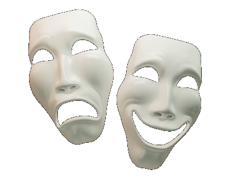
```


# Apêndice: `friendlydemo.R`

Cerca de 10% dos homens e e menos que 1% das mulheres são daltônicos. Portanto, encorajamos o uso de gráficos em preto, cinza e branco ou gradações de uma mesma cor. Caso queira usar cores, sugerimos a função <code>eiras::friendlycolor()</code>, a qual aplica uma paleta de cores distinguível para quase todas as pessoas.

Para demonstrar seu funcionamento, este código exibe todas as cores da função <code>eiras::friendlycolor()</code>:
```{r echo=TRUE}
# exibe as 46 cores disponíveis em friendlycolor.R
index <- 1
plot(NA, xlim=c(0,10), ylim=c(0,7), 
     xlab="", ylab="", axes=FALSE)
for (x in 1:8)
{
  for (y in 1:6)
  {
    if (index > 46) {next}

    points(x, 7-y, pch=21, cex=5, col="black", bg=friendlycolor(index))
    cortext <- "black"
    if (index >= 25 & index <= 36)
    {
      cortext <- "white"
    }
    text(x, 7-y, index, col=cortext)
    index <- index+1
  }
}
```
Para uma aproximação, apliquei esta imagem em Coblis (https://www.color-blindness.com/coblis-color-blindness-simulator/), simulando as cores tal como vistas por pessoas daltônicas:

   |  | 
---  | ---  | ---              
Referência \tiny<small> \newline<br> Visão normal \normalsize</small> | [Monocromacia de cones azuis](https://en.wikipedia.org/wiki/Blue_cone_monochromacy) \newline<br>    \tiny<small> Cones verdes e vermelhos disfuncionais, \newline<br>    1/100.000 indivíduos. \normalsize</small> | [Acromatopsia](https://en.wikipedia.org/wiki/Achromatopsia) \newline<br>    \tiny<small> Visão monocromática, \newline<br>    1/30.000 indivíduos. \normalsize</small>  
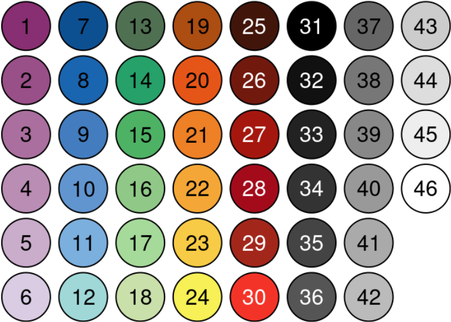 | 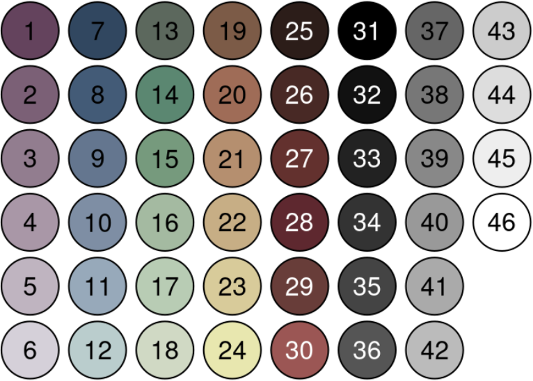 | 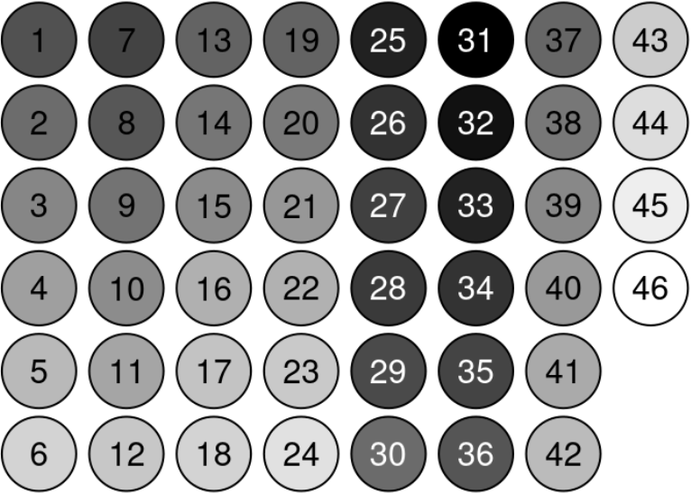 
 | | 
[Protanomalia](https://en.wikipedia.org/wiki/Color_blindness#Protanomaly) \newline<br>    \tiny<small> Deficiência em cones vermelhos,\newline<br>    1% dos homens, 0.1% das mulheres. \normalsize</small> |  [Deuteranomalia](https://en.wikipedia.org/wiki/Color_blindness#Deuteranomaly) \newline<br>    \tiny<small> Deficiência em cones verdes, \newline<br>    6% dos homens, 0.4% das mulheres. \normalsize</small> | [Tritanomalia](https://en.wikipedia.org/wiki/Color_blindness#Tritanomaly)\newline<br>    \tiny<small> Deficiência em cones azuis, \newline<br>    0.1% dos homens e mulheres. \normalsize</small> 
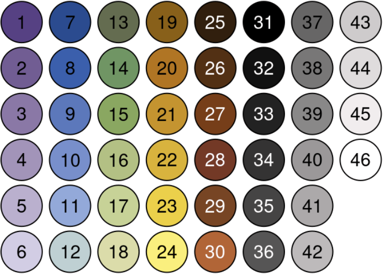 | 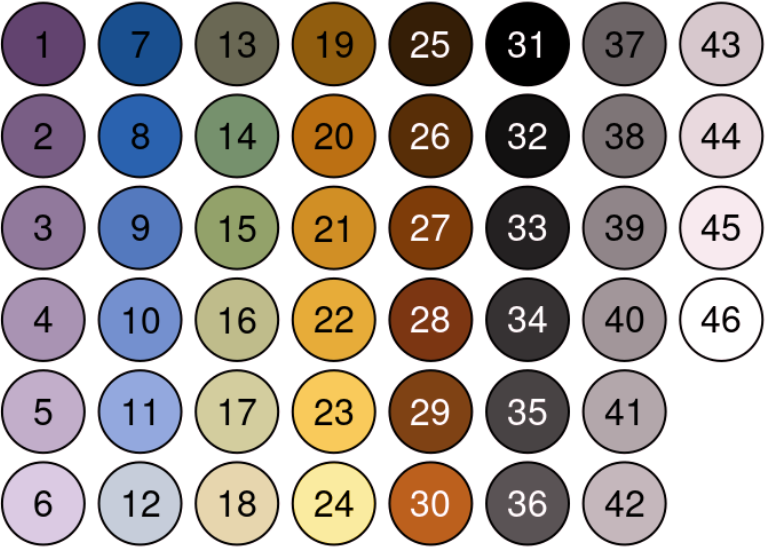 | 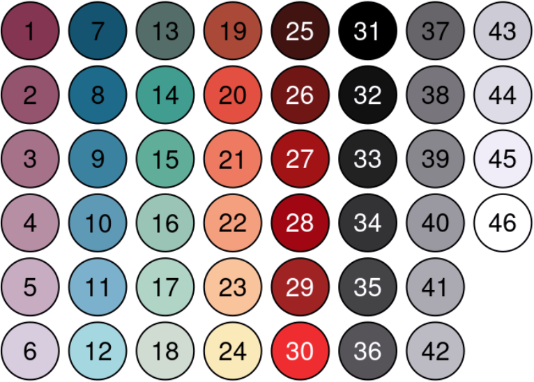 
 | | 
[Protanopia](https://en.wikipedia.org/wiki/Color_blindness#Protanopia) \newline<br>    \tiny<small> Falta de cones vermelhos, \newline<br>    1% dos homens. \normalsize</small>  | [Deuteranopia](https://en.wikipedia.org/wiki/Color_blindness#Deuteranopia) \newline<br>    \tiny<small> Falta de cones verdes, \newline<br>    1% dos homens. \normalsize</small>  | [Tritanopia](https://en.wikipedia.org/wiki/Color_blindness#Tritanopia) \newline<br>    \tiny<small> Falta de cones azuis, \newline<br>    menos que 0.1% dos homens e mulheres. \normalsize</small> 
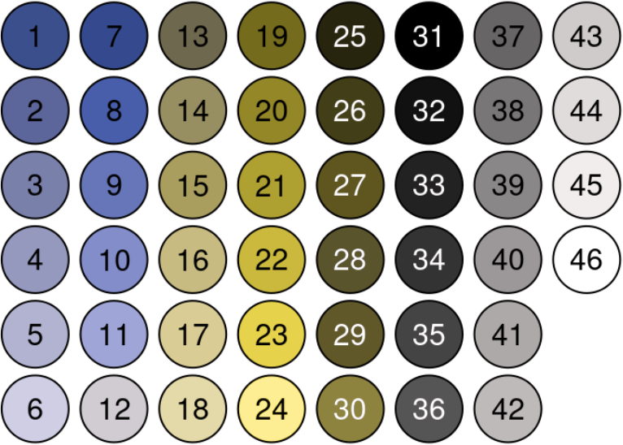 | 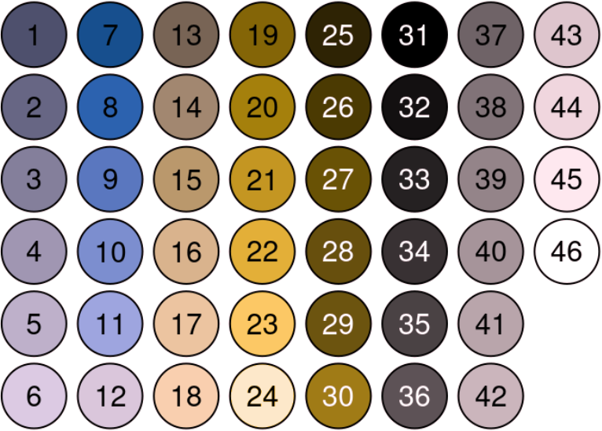 | 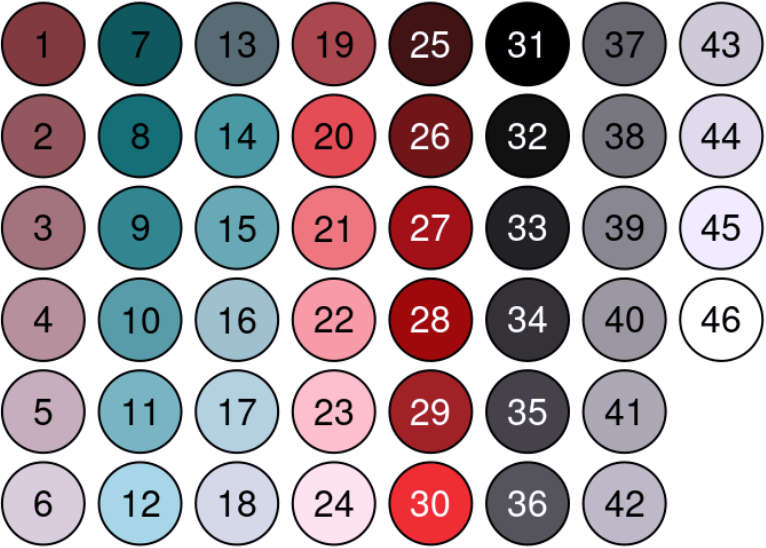 

