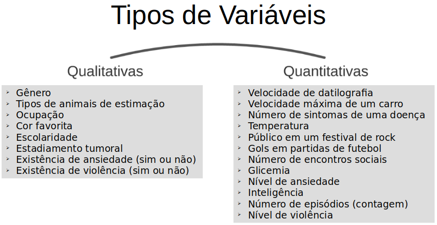
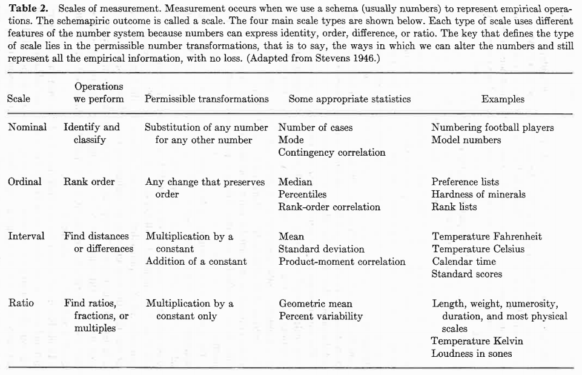
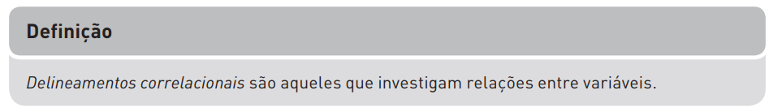
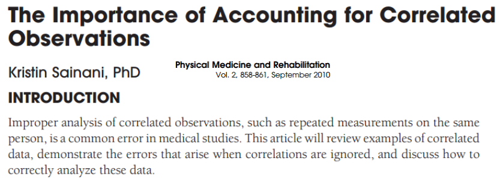
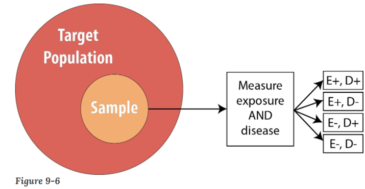
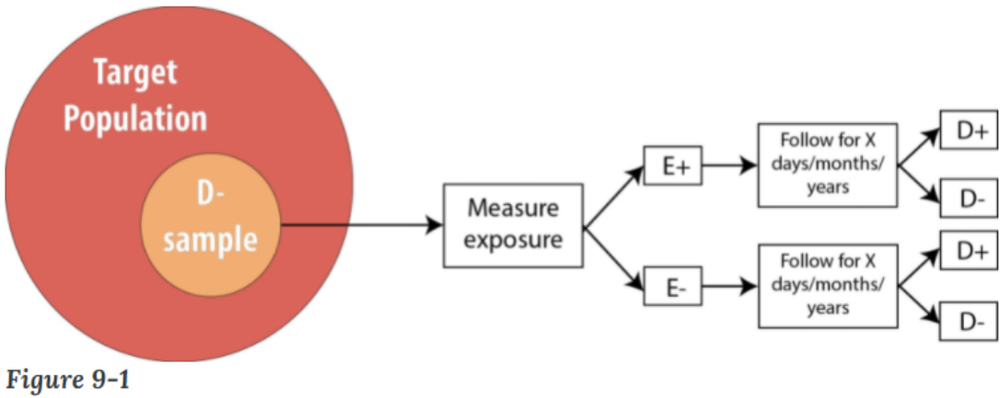

```{r set-options, echo=FALSE, cache=FALSE}
options(width=80)
```

```{css, echo=FALSE}
.code {
  font-size: 18px;
  background-color: white;
  border: 2px solid darkgray;
  font-weight: bold;
  max-width: none !important;
}
.output {
  font-size: 18px;
  background-color: white;
  border: 2px solid black;
  font-weight: bold;
  max-width: none !important;
}
.main-container {
  max-width: none !important;
}
pre {
  max-height: 500px !important;
  overflow-y: auto !important;
  overflow-x: scroll !important;
}
.bgobs {
  background-color: #a0d8d8;
}
.bgcodigo {
  background-color: #eeeeee;
}
.bgsaida {
  background-color: #ecf7db;
}
```

```{r setup, include=FALSE}
knitr::opts_chunk$set(eval=TRUE,
                      echo=TRUE, 
                      fig.width=7, 
                      fig.height=6,
                      fig.align="center",
                      comment=NA,
                      class.source="code",
                      class.output="output")
```

```{r}
invisible(Sys.setlocale("LC_CTYPE", "pt_BR.UTF-8"))
invisible(Sys.setlocale("LC_ALL", "pt_BR.UTF-8"))
```

# Carregar pacotes

```{r}
options(warn=-1)
suppressMessages(library(knitr, warn.conflicts=FALSE))
suppressMessages(library(readxl, warn.conflicts=FALSE))
suppressMessages(library(sampling, warn.conflicts=FALSE))
```

```{r fig.align="center", out.width='70%', echo=FALSE}

```

# Material

* HTML de R Markdown em [`RPubs`](http://rpubs.com/josiqueira/){target="_blank"}
* Arquivos em [`GitHub`](https://github.com/josiqueira/VariavelDelineamento){target="_blank"}


# Livro adotado

DANCEY, CP & REIDY, J (2019) _Estatística sem Matemática para Psicologia_, 7ª ed. Porto Alegre: Penso.

```{r fig.align="center", out.width='30%', echo=FALSE}

```

> "Estatística sem Matemática para Psicologia apresenta, de forma clara e  direta, todos os procedimentos estatísticos dos quais você necessita, sem usar fórmulas matemáticas intimidantes, bem como oferece um guia de utilização do SPSS. Com muitos exemplos e atividades ao longo do texto, este livro permitirá que você se entenda com a estatística e não se sinta como um peixe fora d’água."

***

Os exemplos do livro são resolvidos em IBM SPSS Statistics. Utilizamos a linguagem R.

# Aulas

1. Introdução à linguagem R
1. Variável e delineamento da pesquisa
1. Fundamentos da inferência estatística
1. Testagem de hipótese nula e significância estatística
1. Análise de correlação: teste de correlação de Pearson
1. Análise de diferenças entre duas condições: teste _t_
1. Questões de significância
1. Medidas de associação: teste qui-quadrado
1. Análise de diferenças entre três ou mais condições: ANOVA unifatorial
1. Análise de variância com mais de uma variável independente: ANOVA bifatorial
1. Análise de regressão simples
1. Análise de três ou mais grupos controlando o efeito de uma covariável: ANCOVA
1. Introdução à análise fatorial exploratória
1. Introdução à análise multivariada de variância: MANOVA
1. Estatística não-paramétrica

As quatro primeiras aulas apresentam os conceitos básicos de estatística e de planejamento de experimentos.

As onze aulas seguintes apresentam os testes estatísticos:

* Correlação
* Qui-quadrado
* _t_
* ANOVA
* Regressão simples
* ANCOVA
* MANOVA
* Não-paramétrico

# Objetivos

Com base nos objetivos do livro, ao final desta disciplina o estudante deve ser capaz de:

* Conceituar Estatística Aplicada;
* Discorrer sobre a existência de desorientação provocada pelos cálculos e fórmulas matemáticas;
* Defender a utilizade da análise estatística de dados;
* Apresentar a Estatística para pesquisadores não-quantitativos;
* Definir valor _p_, intervalo de confiança, tamanho de efeito e poder do teste;
* Relatar os resultados da análise estatística dos dados
<div align=right><span style="font-size:90%;">
Regras essenciais de estilo da APA (2012)
</span></div>
<div align=right><span style="font-size:90%;">
Cap.4: Números, metrificação e informações estatísticas.
</span></div>
<div align=right><span style="font-size:90%;">
Cap.5: Apresentação de resultados.
</span></div>
* Exibir pensamento científico autônomo e crítico;
* Usar a linguagem de programação R para a análise de dados em Ciências da Saúde de forma amigável;
* Incorporar e analisar dados com técnicas paulatinamente mais avançadas até atingir o Modelo Linear Geral (GLM) e de efeitos aleatórios (GLMM).

# Variável

A Estatística fornece essencialmente informações sobre variáveis:

* Observáveis ou manifestas (e.g., ANOVA) e 
* Não-observáveis ou latentes (e.g., Análise Fatorial Exploratória) 

Variável é algo que pode variar, i.e., pode assumir valores ou categorias diferentes com determinadas distribuições de probabilidade.

Estamos interessados em variáveis porque queremos entender o motivo de sua variação e como elas se relacionam.

São exemplos de variáveis:

* Gênero
* Velocidade de datilografia
* Velocidade máxima de um carro
* Número de sintomas de uma doença
* Temperatura
* Público em um festival de rock
* Ansiedade
* Gols em partidas de futebol
* Inteligência
* Número de encontros sociais
* Tipos de animais de estimação
* Violência na TV
* Ocupação
* Cor favorita
* Escolaridade
* Estadiamento tumoral
* Glicemia

# Tipo de variável

## Classificação simples

```{r fig.align="center", out.width='70%', echo=FALSE}

```

```{r fig.align="center", out.width='90%', echo=FALSE}

```

## Classificação por nível de mensuração

```{r fig.align="center", out.width='100%', echo=FALSE}

```

## Crítica

Uma classificação das variáveis que aparece em vários textos é a seguinte:

**Variável contínua**: pode assumir qualquer valor quantitativo em um dado intervalo 

**Variável discreta**: pode assumir somente valores quantitativos discretos dentro de um dado intervalo ou contagem de eventos 

**Variável categórica**: os seus valores são categorias qualitativas

Esta classificação é incompleta, não discriminando bem os tipos das variáveis.

## integrando as classificações

```{r fig.align="center", out.width='50%', echo=FALSE}

```

```{r fig.align="center", out.width='100%', echo=FALSE}

```
<div align="right"><small>
STEVENS (1975)
</small></div>

## Conversão de tipo de variável em R

```{r}
x <- as.integer(c(5,3,3,4,1,2,5,1,1,3)) # intervalar discreta
x
class(x)
xc <- as.numeric(x) # intervalar discreta -> intervalar continua
xc
class(xc)
xi <- as.integer(x) # intervalar continua -> intervalar discreta
xi
class(xi)
xn <- factor(x) # intervalar discreta -> nominal 
xn
class(xn)
xo <- ordered(x) # nominal -> ordinal
xo
class(xo)
xf <- factor(x,ordered=FALSE) # ordinal -> nominal
xf
class(xf)
xoi <- factor(xf,
              levels=c("5","4","3","2","1"),
              ordered=TRUE) # nominal -> ordinal
xoi
class(xoi)
```

# Variável quantitativa contínua

Abaixo apresentamos dez estaturas, em metro, de homens adultos brasileiros:

```{r}
# para sortear os mesmos numeros do exemplo
set.seed(123)
estatura <- round(rnorm(n=10, mean=1.70, sd=0.10),2)
print(estatura)
```


```{r fig.align="left", out.width='8%', echo=FALSE}
knitr::include_graphics("./image/coruja.png")
```

<table style="border:1; background-color:#CAE0AB"><tr><td>

Esta é uma variável quantitiva contínua, razão (porque tem zero como limite inferior).

Portanto, é correto dizer que alguém com 2 metros tem o dobro da estatura de alguém que tem 1 metro.

</td></tr></table>


# Variável quantitativa discreta

## Registro em número inteiro

Variáveis contínuas podem ser arredondadas para números inteiros (e.g., anotando-se as estaturas em centímetros, números inteiros). A variável subjacente (em seu maior nível de mensuração, continua sendo quantitativa contínua, mas recebendo o tratamento de uma quantitativa discreta); por exemplo:

```{r}
estatura <- round(estatura*100,0)
print(estatura)
```

```{r fig.align="left", out.width='8%', echo=FALSE}
knitr::include_graphics("./image/coruja.png")
```

<table style="border:1; background-color:#CAE0AB"><tr><td>
<span style="font-size:110%;">Variável observada vs. variável subjacente</span>

"Um problema que surge quando lidamos com variáveis discretas e contínuas é o perigo de confundir a variável subjacente com a forma como ela é mensurada. Em teoria, uma variável pode ser contínua, mas a forma de medi-la é sempre discreta, não importa o nosso grau de precisão. Poderíamos medir a ansiedade (uma variável teoricamente contínua) utilizando um questionário (p. ex., o Inventário de Ansiedade Traço-Estado de Spielberger, Spielberger et al., 1983), cujo escore total fornece uma indicação do nível de ansiedade de uma pessoa. O escore total nesse questionário pode aumentar somente em unidades inteiras, digamos de 38 para 39 ou de 61 para 62. Assim, a forma de mensuração da ansiedade é discreta, enquanto a variável subjacente é de fato contínua." (Dancey & Reidy, 2019, p. 4)
</td></tr></table>

# Variável discreta por natureza

São, legitimamente, as variáveis oriundas de contagens (e.g., número de mortes de motociclistas).

Por exemplo, em 2019, na Cidade de São Paulo, SP: 

```{r echo=FALSE, out.width='90%'}
knitr::include_graphics("./image/MortesMotos.png")
```

<div align=right><span style="font-size:70%;">

[Claro, aqui está o texto limpo:

[Mortes de motociclistas ultrapassam as de pedestres no trânsito de SP pela primeira vez, diz  relatório](https://g1.globo.com/sp/sao-paulo/noticia/2019/05/23/mortes-de-motociclistas-ultrapassam-as-de-pedestres-no-transito-de-sp-pela-primeira-vez-diz-relatorio.ghtml){target="_blank"}</span></div>

Quantos motociclistas mortos esperamos ver em 12 meses simulados?

```{r}
morte.mes <- 366/12
mortes <- rpois(n=12,lambda=morte.mes)
cat("Em doze meses, com taxa de ",morte.mes," morte/mês, podemos observar:\n",sep="")
print(mortes)
plot(mortes, type="p")
lines(mortes, type="l", lty=2)
```

# Variável qualitativa ordinal

A estatura pode ser classificada em três grupos: baixa, intermediária, alta.

```{r}
estatura.cat <- cut(estatura, 
                    breaks=c(0,160,180,+Inf), 
                    labels=c("baixa","intermediária","alta"))
print(str(estatura.cat))
```

Para que <code>categoria</code> seja rigorosamente tratada como ordinal, adicione:

```{r}
estatura.cat <- ordered(estatura.cat)
print(str(estatura.cat))
```

E, então, classificamos as 10 estaturas do exemplo:

```{r}
somatometria <- data.frame(estatura,estatura.cat)
print(somatometria)
```

# Variável qualitativa nominal

Há cinco estados civis oficiais no Brasil [fonte: https://luisaportela.jusbrasil.com.br](https://luisaportela.jusbrasil.com.br/artigos/649531798/voce-sabe-quais-sao-os-estados-civis-reconhecidos-pela-legislacao-brasileira#:~:text=Estado%20civil%20nada%20mais%20%C3%A9,reconhece%20apenas%20cinco%20estados%20civis.&text=Solteiro%20(a)%3A%20quem%20nunca,ou%20teve%20um%20casamento%20anulado.): solteiro, casado, divorciado, viúvo, separado judicialmente.

No exemplo, vamos adicionar uma coluna ao _dataframe_:

```{r}
somatometria$estcivil <- c("casado","solteiro","solteiro",
                           "solteiro","divorciado","solteiro",
                           "casado","casado","viúvo","solteiro")
print(somatometria)
```

# Categorização de variável

Existem casos em que os pesquisadores convertem variáveis quantitativas em variáveis categóricas, como o índice de massa corpórea (IMC), dado por:

$$\text{IMC} = {{\text{massa (kg)}} \over {\text{estatura (m)} ^2}}$$
Usada pela Associação Brasileira para Estudo da Obesidade (ABESO) e pela Organização Mundial da Saúde para classificar:

```{r echo=FALSE, out.width='90%'}

```

<div align=right><span style="font-size:80%;">
https://abeso.org.br/obesidade-e-sindrome-metabolica/calculadora-imc/
</span></div>

```{r echo=FALSE, out.width='50%'}

```

<div align=right><span style="font-size:80%;">
https://www.euro.who.int/en/health-topics/disease-prevention/nutrition/a-healthy-lifestyle/body-mass-index-bmi
</span></div>

Podemos reproduzir estas classificações em R, retomando o _dataframe_ <code>somatometria</code>. Criaremos, primeiro, as colunas de massa corporal total (<code>mct</code>, em kg) e calcularemos o índice de massa corpórea (<code>imc</code>):

```{r}
# para sortear os mesmos números do exemplo
set.seed(570) 
somatometria$mct <- round(rnorm(n=10, mean=75, sd=20),0)
# massa em kg, estatura em metro
somatometria$imc <- round(somatometria$mct/((somatometria$estatura/100)^2),1)
print(somatometria)
```

A classificação da ABESO / WHO é feita assim:

```{r}
classe <- c("Subpeso",
            "Normal",
            "Sobrepeso", "Obesidade I", "Obesidade II", "Obesidade III")
pc <- c(0, 18.5, 25, 30, 35, 40, +Inf)
somatometria$imc_classe <- cut(somatometria$imc, pc, classe)
print(somatometria)
```

Outra possibilidade é dicotomizar uma variável (i.e., criar duas categorias). Neste exemplo, há pelo menos três maneiras de dicotomizar:

* normal e não normal que inclui magreza e obesidade,
* normal e não normal que inclui apenas magreza,
* normal e não normal que inclui apenas obesidade.

Por exemplo, dicotomiza-se em normal e não normal que inclui magreza e obesidade:

```{r}
classe <- c("Anormal",
            "Normal",
            "Anormal")
pc <- c(0, 18.5, 25, +Inf)
somatometria$imc_dicot <- cut(somatometria$imc, pc, classe)
print(somatometria)
```

# Por que dicotomizar variável?

"Streiner (2002) ressalta o fato de que muitas
decisões em psicologia, psiquiatria e medicina são binárias. Nesse tipo de decisão têm-se apenas duas escolhas, como se a pessoa apresenta ou não problema mental, se tem ou não uma determinada doença, se precisa ou não ser hospitalizada ou se deve ou não receber alta do hospital. O argumento utilizado é que, se esses profissionais precisam tomar decisões binárias, então é legítimo investigar variáveis dessa forma. Tal raciocínio é utilizado para dar suporte à prática disseminada de dicotomizar variáveis contínuas.

Streiner argumenta que não precisamos ver as decisões que os médicos tomam como binárias. Ele sugere que seria melhor pensar em uma doença mental, por exemplo, como um contínuo: quanto mais sintomas uma pessoa apresenta, mais afetada estará. Deveríamos, então, medir tais construtos de forma contínua e não dicotomizá-los. Assim, em vez de utilizar questionários para categorizar pessoas, poderíamos usá-los para obter uma medida de onde elas estão em um contínuo. Tal informação pode ser utilizada na nossa decisão para tratar pessoas, entre outras situações. É interessante notar que a última versão do Manual diagnóstico e estatístico de transtornos mentais (DSM-5) vê as doenças mentais como um continuum em vez de categorias. 

[...]

Streiner ainda ressalta pesquisas que mostram que análises utilizando variáveis dicotômicas apresentam aproximadamente 67% da eficiência das que utilizam medidas contínuas ou
discretas originais. Trata-se uma grande perda de sensibilidade do estudo. Isso significa que você tem apenas dois terços da probabilidade de detectar relacionamentos entre variáveis se
estiver utilizando variáveis contínuas ou discretas dicotomizadas. Essa é uma séria desvantagem na realização de uma pesquisa. Além disso, a perda de poder não é o único problema
que surge quando variáveis são dicotomizadas. Maxwell e Delaney (1993) mostraram que essa prática pode levar a achados espúrios na análise estatística."

> Dancey & Reidy, 2019, p.5-6

"Consequentemente, aconselhamos não dicotomizar [<i>sic</i>] variáveis contínuas [<i>sic: intervalares</i>]".

> Dancey & Reidy, 2019, p.6

Temos duas discordâncias: 

* Dicotomizar não pode ser proibido; 
* Variáveis intervalar, ordinal e nominal politômicas podem ser
dicotomizadas (não é exclusivo para intervalar).

A perda de eficiência estatistica de 33% devido à dicotomização é erroneamente atribuída a Streiner (2002), pois ele cita outro artigo com este resultado.

A dicotomização é justificável para efeito de comparação entre estudos. 
```{r echo=FALSE, out.width='90%', echo=FALSE}

```

> https://www.bmj.com/content/332/7549/1080.1

"Na ausência de um ponto de corte pré-determinado, a abordagem mais comum é usar a mediana da amostra. Contudo, o uso da mediana da amostra implicará distintos pontos de corte, um para cada estudo, de forma que seus resultados não serão comparáveis e prejudicarão severamente a metanálise (https://en.wikipedia.org/wiki/Meta-analysis). [...] Em vez de categorizar variáveis quantitativas, nós preferimos mantê-las quantitativas [...] Como um exemplo, em uma análise de regressão para desenvolver um modelo de prognóstico para pacientes com cirrose biliar primária, um modelo que tomou  bilirrubina\* como uma variável quantitativa explicou 31% a mais da variabilidade dos dados do que quando seu ponto de corte adotado foi sua mediana." 

\* bilirubina é um produto da degradação da hemoglobina, processada no fígado que a torna hidrossolúvel para a eliminação pelos rins. 

As perdas de 31% devido à dicotomização pela mediana, ou valor próximo aos 33% (atribuído erroneamente a Steiner, 2002), vieram de  determinados estudos específicos, mas têm sido tomadas como regra geral na literatura.

```{r echo=FALSE, out.width='90%'}
knitr::include_graphics("./image/Rousson2014.png")
```

> https://journals.sagepub.com/doi/abs/10.3102/1076998614524597

"Neste artigo, nosso propósito não é defender nem condenar dicotomização, mas simplesmente estudar sua repercussão no valor de um tamanho de efeito. [...] Observamos que a dicotomização pela mediana de uma distribuição normal faz a correlação decrescer por um fator de $\sqrt{\pi / 2 } \approx 1.25$ e aumentar o logaritmo do _odds ratio_ por um fator de $\sqrt{ 2 } \approx 1.41$."

Não é proibido dicotomizar pela mediana ou por qualquer outro critério, desde que devidamente justificado. 

Estudos que adotaram a dicotomização não devem ser sumariamente condenados.

# Variável (in)dependente

* Variável independente (VI)
  * Variável observável que pode ser controlada pelo pesquisador e supostamente tem efeito sobre a VD.
* Variável dependente ou de desfecho (VD)
  * Variável observável que supostamente é afetada pela VI.

<br>
  
E.g.: um pesquisador da área da saúde está interessado em medir o número de comportamentos agressivos em adolescentes com depressão maior tendo, como controle, grupo de adolescentes não depressivos.

  * VI: adolescente com e sem depressão maior
  * VD: número de comportamentos agressivos

# Variável de confusão

Considere o seguinte estudo (Dancey & Reidy, 2019):

Pesquisadores interessados em saber se os cães facilitam ou não as interações sociais entre os adultos realizaram quatro estudos diferentes em que pesquisadores do sexo masculino e feminino caminharam com e sem cachorros. 

Em dois estudos, o pesquisador abordou pessoas e pediu algum dinheiro, em outro estudo o pesquisador deixou cair algumas moedas para ver se as pessoas ajudariam a pegá-las e, em um estudo final, um pesquisador do sexo masculino abordou mulheres na rua e pediu-lhes números de telefone. 
Em cada estudo, o pesquisador realizou as tarefas com e sem cães. 

Em todos os quatro estudos descobriram que os comportamentos de ajuda eram mais frequentes quando o pesquisador tinha um cachorro.

Dancey & Reidy definem:

"Uma variável de confusão é um tipo específico de variável estranha que está relacionado a ambas as variáveis principais em que estamos interessados."

```{r fig.align="center", out.width='80%', echo=FALSE}

```

# Causalidade

“A explicação científica é uma explicação por meio de leis e não necessariamente por meio de causas.”

> Rosenberg, 1976, p.27-8

Uma forma de estudar causas é iniciar pela correlação entre variáveis.

A correlação é condição necessária, mas não suficiente para estabelecer causalidade.

## Exemplo:

Existe correlação entre ansiedade estatística e procrastinação acadêmica?
 
```{r fig.align="left", out.width='8%', echo=FALSE}
knitr::include_graphics("./image/coruja.png")
```

<table style="border:1; background-color:#CAE0AB"><tr><td>
**Procrastinação**:

Atraso voluntário de um curso de ação pretendido (com ou sem prazo) com expectativa de punição (estresse, perda de produtividade, culpa, vergonha etc.) 

```{r fig.align="center", out.width='40%', echo=FALSE}

```

</td></tr></table>

# Ansiedade estatística

**Ansiedade estatística** é um construto multidimensional definido por seis componentes:

* Desvalorição da estatística;
* Dificuldade de raciocínio matemático e computacional;
* Medo da aula e prova de estatística: vergonha, sensação de humilhação intelectual;
* Medo de interpretar e tomar decisão estatística;
* Medo de solicitar ajuda estatística aos colegas e professores;
* Medo do professor de estatística.

> Onwuegbuzie (2004), Steel (2007)

```{r fig.align="center", out.width='60%', echo=FALSE}

```

> https://br.pinterest.com/pin/459648705690128997/

# Relação entre duas variáveis

Quando existe correlação entre variáveis, o que a explica?

Segundo Rosenberg (1976), a relação entre duas variáveis observáveis ou manifestas pode ser classificada como simétrica, assimétrica ou recíproca alternada. 

```{r echo=FALSE, out.width='50%'}

```

## Relação assimétrica 

Apenas uma das variáveis causa a outra. A análise de relações assimétricas constitui o cerne da análise epidemiológica e etiológica. As características sociodemográficas de uma pessoa podem causar comportamentos e doenças, tais como tabagismo, depressão, câncer etc. Se a relação é assimétrica, tende-se a introduzir uma terceira variável (variável de teste) na relação com o objetivo de entendê-la melhor.

```{r fig.align="left", out.width='8%', echo=FALSE}
knitr::include_graphics("./image/coruja.png")
```

<table style="border:1; background-color:#CAE0AB"><tr><td>

Neuroticismo ou Instabilidade emocional é um dos cinco fatores da escala de personalidade Big Five (https://en.wikipedia.org/wiki/Big_Five_personality_traits). 

</td></tr></table>

## Relação recíproca alternada 

Ambas as variáveis se causam em decorrência de um processo dinâmico de causação mútua. Nesse tipo de relação as duas variáveis são ao mesmo tempo causa e efeito uma da outra. 

## Relação simétrica

As duas variáveis podem estar associadas, mas uma variável não causa a outra. Pode haver associação entre transpiração palmar e batimento cardíaco, mas uma não é a causa da outra. A causa comum de ambas as variáveis pode ser a ansiedade. Nesse tipo de relação, em geral, as duas variáveis são consequências de uma variável comum.

# Hipótese de pesquisa

```{r echo=FALSE, out.width='90%'}

```

Exemplos de hipótese de pesquisa:

$H_a:$ há associação entre ansiedade estatística e procrastinação acadêmica entre estudantes de graduação de psicologia da USP.

$H_b:$ há efeito da exposição ao cigarro no desenvolvimento do câncer de pulmão em homens adultos brasileiros.

$H_c:$ há agravamento da colite induzida por DNBS (ácido dinitrobenzenossulfônico) em ratos expostos ao cigarro.

$H_d:$ o uso de bloqueador ganglionar (hexametônio) impede o agravamento da colite induzida por DNBS (ácido dinitrobenzenossulfônico) em ratos expostos ao cigarro.

> Galeazzi et al. (1999): DOI:https://doi.org/10.1016/S0016-5085(99)70346-X

# Delineamento e causalidade

O delineamento experimental é o delineamento de referência para estudar causalidade. Cabe ressaltar que os experimentos são oriundos das Ciências Básicas, do ambiente laboratorial, onde o pesquisador procura ter o máximo de controle sobre os fatores que interagem na determinação da causalidade. 

Por questões éticas, a maior parte dos estudos em seres humanos não podem ser do tipo de delineamento experimental. Por isso, desenvolveram-se delineamentos aproximativos ao experimental: delineamentos quase-experimentais e os observacionais.

Estudos experimentais e observacionais diferem também em relação ao tempo decorrido entre supostos agentes causais e suas consequências. Por exemplo, quando o cigarro começou a se popularizar no início do século XX, a abordagem experimental não ajudou muito, pois experimentos estabelecem relações mais imediatas entre um agente causal e seu desfecho. A observação em populações do tempo decorrido entre a adoção do cigarro e o aumento da incidência de doenças desencadeou o desenvolvimento da epidemiologia moderna, correlacionando possíveis fatores de exposição ou de proteção e desfechos que podem acontecer vários anos depois. Uma das coortes mais famosas, um estudo eminentemente observacional, é a de [Framinghan](https://en.wikipedia.org/wiki/Framingham_Heart_Study).

# Delineamento correlacional 

Conforme Hulley et al. (2015, cap.9), a maioria dos estudos observacionais (correlacionais) têm como objetivo mostrar que uma variável de exposição (VE) é _causa_ do desfecho (VD). 

<div align=center><big><b>vs.</b></big></div>

```{r echo=FALSE, out.width='90%'}

```

> Dancey & Reidy, 2019, p.12

No delineamento correlacional não há intervenção planejada do pesquisador sobre os participantes do estudo.

# Exemplo de delineamento correlacional

$H_1:$ há associação entre ansiedade estatística e procrastinação acadêmica entre estudantes de graduação de psicologia da USP.

Seis estudantes de psicologia foram avaliados por itens Likert com cinco categorias agrupados em dois questionários, para ansiedade estatística e procrastinação acadêmica. O objetivo é verificar se há correlação entre estas duas variáveis.

```{r echo=FALSE}
dt <- readxl::read_excel("tabela_correlacional.xlsx")
print.data.frame(dt)
```

# Delineamento experimental

```{r echo=FALSE, out.width='90%'}

```

<br>

No delineamento experimental há intervenção planejada e _randomizada_ do pesquisador sobre os participantes do estudo.

# Exemplo de delineamento experimental

"O tabagismo tem um efeito complexo na inflamação intestinal, sendo protetor na colite ulcerativa, ao passo que agrava a doença de Crohn. O efeito benéfico do tabagismo tem sido atribuído à nicotina, mas os mecanismos subjacentes ao efeito adverso ainda estão sob investigação. O objetivo deste estudo foi examinar o efeito do tabagismo de cigarro na colite experimental em ratos e investigar o mecanismo subjacente."

> Galeazzi et al. (1999):  DOI:https://doi.org/10.1016/S0016-5085(99)70346-X

$H_1:$ há agravamento da colite induzida por DNBS (ácido dinitrobenzenossulfônico) em ratos expostos ao cigarro.

Ratos foram alocados aleatoriamente em dois grupos (fumo e controle). Os ratos do grupo "fumo" foram expostos à fumaça de cigarro em câmeras especiais por 17 dias e os do grupo "controle" apenas colocados nas câmeras sem a inalação do fumo. No 15<sup>o</sup> dia todos os ratos tiveram indução de colite pela administração de DNBS e sacrificados após 3 dias para avaliação da inflamação. O escore microscópico considerou perda da arquitetura da mucosa, infiltrado celular, espessura da parede muscular, presença/ausência de criptas e de células Goblet (pontuação discreta de 0 para ausência de dano a 11 para o dano máximo). 

Estes dados foram fabricados; não são os do artigo.

```{r echo=FALSE}
dt <- readxl::read_excel("galeazzi.xlsx")
print.data.frame(dt)
```

# Randomização e ensaio clínico

```{r fig.align="left", out.width='8%', echo=FALSE}
knitr::include_graphics("./image/coruja.png")
```

<table style="border:1; background-color:#CAE0AB"><tr><td>

Esquema aleatório de atribuição das condições experimentais às unidades experimentais do estudo (condições independentes) ou da ordem de aplicação das condições às mesmas unidades experimentais (condições dependentes).

É um dos controles que contribui para a validade interna do estudo. 

Vídeo: https://www.youtube.com/watch?v=sbOBlHcdYg0

```{r echo=FALSE, out.width='40%'}

```

Uma maneira de garantir alocação aleatória balanceada dos participantes grupos do mesmo tamanho é usar a função <code>randomizr::complete_ra</code>. Por exemplo, duas drogas em estudo com 10 participantes:

```{r echo=FALSE}
rm(.Random.seed, envir=globalenv())
```

```{r}
Grupos <- c("A", "B")
Participantes <- 10
randomizacao <- randomizr::complete_ra(N=Participantes, 
                                       prob_each=c(0.5,0.5), 
                                       conditions=Grupos)
print(table(randomizacao))
df <- data.frame(1:Participantes,randomizacao)
names(df) <- c("Participante", "Droga")
print(df)
```

Este pacote tem várias outras funções, como <code>randomizr::simple_ra</code> que não obriga o balanceamento.

É comum existirem resumos de vários pacotes do R, conhecidas como _cheat sheets_, para ajudar a lembrar das sintaxes das funções. Para o pacote <code>randomizr</code> achamos https://ugoproto.github.io/ugo_r_doc/pdf/randomizr.pdf:

```{r fig.align="center", out.width='90%', echo=FALSE}

```

Além dos estudos que são feitos em laboratório com animais, também os ensaios clínicos randomizados com humanos são delineamentos experimentais. 

Para estes estudos, existe outro pacote do R, <code>randomizeR</code>, descrito em Ushner (2018).

```{r fig.align="center", out.width='70%', echo=FALSE}

```

> Dempster & Hanna (2016)

Nesta figura, oito participantes são alocados aleatoriamente de maneira balanceada a duas condições independentes (e.g., grupos controle e tratamento). Em seguida, os participantes são submetidos à avaliação da variável de desfecho antes a após uma intervenção planejada pelo pesquisador. A randomização controla o efeito das variáveis de confusão conhecidas e desconhecidas pelo pesquisador. O delineamento pré-pós controla os efeitos idiossincráticos dos participantes criando uma linha de base para teste do efeito da intervenção na variável de desfecho nos grupos controle e tratamento.

</td></tr></table>

# Delineamento quase-experimental

```{r echo=FALSE, out.width='90%', echo=FALSE}

```

<br>

No delineamento quase-experimental há intervenção planejada do pesquisador sobre os participantes do estudo, mas não há _randomização_. Isto ocorre porque o participante é auto-alocado em um grupo devido às suas características (e.g., gênero, idade, profissão, naturalidade etc.)

# Exemplo de delineamento quase-experimental

Retomando o exemplo da somatometria de homens adultos, um pesquisador pretende estudar a influência de dois tratamentos sobre a glicemia de jejum em pacientes internados em dois hospitais de São Paulo. O primeiro hospital continuará com o tratamento tradicional (grupo controle), e um novo tratamento será oferecido no segundo hospital.

$H_1:$ o novo tratamento é mais eficiente em reduzir glicemia do que o tratamento tradicional.

Portanto, sem ser possível buscar participantes na população geral, os que estão disponíveis para o estudo serão autoalocados em dois grupos, provenientes de cada um dos hospitais, impedindo a randomização. 

Os dois grupos (condições independentes) serão formados:

```{r echo=FALSE}
somatometria$hospital <- c(rep("A",5),rep("B",5))
knitr::kable(somatometria, format="html", caption="Somatometria")
```

# Validade interna do estudo

Devemos atribuir com segurança os resultados da VD do experimento aos efeitos das VI:

* As VI são as únicas causas dos resultados da VD.
* Fala-se em variáveis de confusão quando os efeitos de duas VI estão entrelaçados e não se consegue determinar qual delas é responsável pelo efeito observado na VD.

Há dois tipos de controle que contribuem para a validade interna por meio da equalização dos grupos controle e experimental (Cozby, 2003 e Townsend, 1953).

# Controle experimental direto

* _Método da remoção_: as variáveis de confusão devem ser removidas do experimento.

<div align=left><span style="font-size:90%;">
Exemplo: sabe-se que luz e ruído influenciam a VD sob investigação, então o experimentador deve remover essas condições por meio do uso de um recinto à prova de som e de luz.
</span></div>

* _Método da constância das condições_: os efeitos de certas variáveis de confusão não podem ser completamente ou ainda parcialmente eliminadas. 

<div align=left><span style="font-size:90%;">
Exemplo: a idade é uma variável de confusão que afeta o comportamento da maioria das VD. Evidentemente todos os participantes têm uma idade e, por isso, a eliminação dessa variável é impossível. Controlar a variável idade significa mantê-la constante para todos os participantes do experimento. Dessa maneira, se todos os participantes têm a mesma idade, o efeito da idade é o mesmo nos grupos controle e experimental.
</span></div>

# Controle experimental indireto

* _Amostragem aleatória simples_ (método da constância das condições): seleção aleatória das unidades experimentais da população para formar os grupos controle e experimental.
* _Método do pareamento de grupos_ (_matched-group_): as médias (ou outras medidas de tendência central ou variabilidade) das variáveis de confusão (e.g., QI) entre os grupos controle e experimental são iguais.
* _Randomização_: designação das unidades experimentais/observacionais às condições: se o experimentador conclui que não é possível usar o método do pareamento de grupos, ou porque não são conhecidas as variáveis de confusão mais importantes para equalizá-los ou porque não se pode medi-los, então sugere-se que se faça uso  do processo de randomização para equalizá-los. Esse método, no entanto, também demanda uma grande quantidade de participantes, pois o experimentador deve atribuir aleatoriamente os participantes aos grupos controle e experimental, sendo que quanto maior o número de participantes, mais equalizados são os grupos.

# Causalidade em delineamento correlacional

```{r fig.align="center", out.width='100%', echo=FALSE}

```

> Hulley et al. (2006, p. 128)

<br>

E.g., um estudo observacional mostra que tomar café (TC) está associado ao infarto do miocárdio (IM), com razão de riscos (RR) igual a 2, i.e., a probabilidade de ter IM dobra devido a TC relativamente a não-TC.
Além da relação de causa-efeito (e.g., relação existente na população tal que TC causa IM), há outras quatro possíveis explicações alternativas para a relação assimétrica entre duas variáveis (VI causa VD). 

[1] **Acaso** (erro aleatório) e [2] **viés** (erro sistemático) 

Produzem efeito de TC em IM na amostra, sendo que ele não existe na população.

[3] **Efeito-causa** 

Produz o efeito entre TC e IM na amostra que também existe na população, mas não é causal na direção de interesse (IM causa TC).

[4] **Confusão**

A terceira variável Tabagismo é a causa real do IM, sendo que TC é uma variável espectadora dessa causação.
Para estabelecer que a relação causa-efeito é a explicação mais provável é necessário descartar as outras quatro explicações.

# Relação espúria ou interpretação espúria?

Conforme Rosenberg (1976), estritamente falando, não existem relações espúrias; existem interpretações espúrias.

É, contudo, habitual usar a expressão “relação espúria” para aludir ao caso em que não há ligação significativa ou inerente entre as duas variáveis.

A relação se deve, apenas, ao fato de cada uma das variáveis estar acidentalmente associada à alguma outra variável.

Trata-se de uma relação que, à primeira vista, parece assimétrica, mas que, uma análise mais profunda, revela-se simétrica (e.g., dois indicadores do mesmo conceito, duas consequências da mesma causa, dois elementos de uma unidade funcional, duas manifestações de um complexo ou dois fatores fortuitamente associados).

**Exemplos**

a. Na Suécia existe a relação entre o número de cegonhas numa área e o número de crianças nascidas na mesma área. A maioria das cegonhas encontram-se em área rurais da Suécia e o índice de nascimento, nessas áreas, é superior ao das áreas urbanas.

b. Se existe uma relação positiva entre o número de bombeiros que atendem a um incêndio e a extensão do dano produzido, não se pode concluir que os bombeiros causem o dano. O motivo da relação entre o número de bombeiros e a extensão dos danos é a extensão do incêndio: grandes incêndios exigem maior número de bombeiros e também causa maiores danos.

# Validade externa

```{r fig.align="center", out.width='90%', echo=FALSE}

```

> Dempster & Hanna (2016)

Validade externa é uma maneira de garantir a generalização das relações encontradas em amostra para a população. Para tanto, a amostra precisa ser representativa da população de onde foi obtida.

Vídeo: https://www.youtube.com/watch?v=pTuj57uXWlk

# Amostragem

Em R, há algumas alternativas para obter amostras aleatórias de _dataframe_. 

Alguns exemplos:

## Amostragem com <code>sample</code>

Existem _dataframes_ com dados de experimentos prontos para uso no R. Aqui usaremos <code>iris</code> que em dados sobre medidas em flores. Digite <code>? iris</code> na Console se quiser saber mais.

O conteúdo deste _dataframe_ começa com 

```{r}
head(iris)
```

O número total de linhas do _dataframe_ iris é

```{r}
print(nrow(iris))
```

Para obter uma amostra de 5 linhas aleatoriamente escolhidas, sem reposição, experimente:

```{r}
index <- sample(1:nrow(iris), 5)
print(iris[index,])
```

Neste exemplo, as linhas `r index[1]`, `r index[2]`, `r index[3]`, `r index[4]` e `r index[5]` foram selecionadas para a amostra.

## Amostragem com <code>sampling</code>

Este é outro pacote do R, dedicado às técnicas de amostragem. 

Por exemplo, a amostragem aleatória simples sem reposição com este pacote é obtida com:

```{r}
index <- sampling::srswor(n=5, N=nrow(iris))
print(iris[which(index!=0),])
```

sendo que os dois parâmetros recebidos são $n$ para o tamanho da amostra e $N$ para o tamanho do arquivo de onde a amostra será extraída.

# Delineamento entre participantes e intraparticipantes

```{r fig.align="center", out.width='90%', echo=FALSE}

```

> Dempster & Hanna (2016)

```{r fig.align="center", out.width='100%', echo=FALSE}

```

> Dancey & Reidy, 2019, cap. 1

```{r fig.align="center", out.width='70%', echo=FALSE}

```

> Dempster & Hanna (2016)

```{r fig.align="center", out.width='100%', echo=FALSE}

```

> Dancey & Reidy, 2019, cap. 1

```{r fig.align="center", out.width='70%', echo=FALSE}

```

> Dempster & Hanna (2016)

```{r fig.align="center", out.width='80%', echo=FALSE}

```

Consulte [Alferes (1997)](http://gaius.fpce.uc.pt/niips/docs/val/icp_outputs/ab_outputs.htm) e o pacote <code>agricolae</code> para estudar e aplicar contrabalanceamento.

```{r fig.align="center", out.width='90%', echo=FALSE}

```

```{r fig.align="center", out.width='90%', echo=FALSE}

```

```{r fig.align="center", out.width='100%', echo=FALSE}

```

# Exposição e desfecho

```{r fig.align="center", out.width='100%', echo=FALSE}

```

```{r fig.align="center", out.width='70%', echo=FALSE}

```

> Pharoah (2016)

   |                                                             |
------------|---------------------------------------------------------|
 \newline<br> Porta (2014) |**Exposição** \newline<br> A variável cujo efeito causal deve ser estimado. Exemplos de exposições avaliadas por estudos epidemiológicos são fatores ambientais e de estilo de vida, condições socioeconômicas e de trabalho, tratamentos médicos e características genéticas. As exposições podem ser prejudiciais ou benéficas - ou mesmo ambas (por exemplo, se uma doença imunizável estiver circulando, a exposição a agentes imunizantes ajuda a maioria dos receptores, mas pode prejudicar aqueles com reações adversas à vacina). \newline<br> Proximidade e/ou contato com uma fonte de um agente de doença de tal maneira que a transmissão efetiva do agente ou efeitos prejudiciais do agente possam ocorrer. \newline<br> A quantidade de um fator a que um grupo ou indivíduo foi exposto; às vezes contrastada com a dose, a quantidade que entra ou interage com o organismo. \newline<br> O processo pelo qual um agente entra em contato com uma pessoa ou animal de tal forma que a pessoa ou animal pode desenvolver o resultado relevante, como uma doença. \newline<br>  \newline<br> **Desfecho** \newline<br> Todos os resultados possíveis que podem decorrer da exposição a um fator causal ou de intervenções preventivas ou terapêuticas. \newline<br> Todas as mudanças identificadas no estado de saúde decorrentes do manejo de um problema de saúde. |

   |                                                             |
------------|---------------------------------------------------------|
 \newline<br> Ward (2012) |Um aspecto importante da epidemiologia é identificar, descrever e quantificar os fatores que aumentam ou diminuem o risco de doença ou morte. Se descobrirmos que um determinado fator ou exposição, por exemplo, fumar ou tomar um medicamento está associado ao risco de um determinado resultado de saúde, podemos então avaliar se a associação é provável ou não causal e postular mecanismos causais. Mesmo na ausência de mecanismos causais estabelecidos, a evidência de associação pode orientar as políticas e ações de saúde pública, e a prática clínica, para reduzir o risco de doença ou morte e proteger, restaurar e promover a saúde. \newline<br> \newline<br> **Exposição** \newline<br> Descreve algo que pode afetar um resultado. Na análise estatística, as exposições são variáveis explicativas ou independentes. Pode referir-se a um perigo ambiental ou agente infeccioso, mas também é usado em epidemiologia para descrever outros fatores, tais como um fator genético, e. tipo de antígeno leucocitário humano (HLA) ou característica demográfica, como etnia. A exposição de interesse primário é aquela que está incluída na hipótese sob investigação, e se a hipótese é que a aflatoxina causa câncer de fígado, então a aflatoxina é a exposição primária de interesse. Em contraste, se a hipótese é que a capacidade do indivíduo de metabolizar aflatoxina determina seu risco de câncer de fígado, então o fenótipo ou genótipo da enzima metabólica é a exposição.  \newline<br> \newline<br> **Desfecho** \newline<br> É usado em sentido amplo; pode ser doença, morte ou recuperação. Alguns estudos, principalmente coortes, podem observar vários resultados em relação a uma ou mais exposições. Na análise estatística, os resultados são respostas ou variáveis dependentes. |

# Fator de risco e proteção

**Fator de proteção [estudo etiológico de eficácia]**

Um comportamento claramente definido ou constitucional (por exemplo, genético), psicológico, ambiental ou outra característica que está associado a uma probabilidade reduzida de que uma doença ou distúrbio específico se desenvolva em um indivíduo, que reduz a gravidade de um patológico existente doença ou que atenua os efeitos do estresse em geral. Por exemplo, praticar exercícios regularmente pode servir como um fator de proteção ao diminuir a probabilidade ou gravidade de doenças coronárias, hipertensão e depressão. Da mesma forma, redes sociais de apoio e habilidades positivas de enfrentamento são exemplos de fatores de proteção que reduzem os efeitos de eventos de vida estressantes e melhoram a saúde mental.

**Fator de risco [estudo etiológico de maleficência]**

Um comportamento claramente definido ou característica constitucional (por exemplo, genética), psicológica, ambiental ou outra que está associada a uma maior possibilidade ou probabilidade de que uma doença ou distúrbio se desenvolva subsequentemente em um indivíduo.

> Dicionário da APA: https://dictionary.apa.org/protective-factor

# Exemplos de fator de risco fixo e alterável

```{r fig.align="center", out.width='40%', echo=FALSE}

```

```{r fig.align="center", out.width='40%', echo=FALSE}

```

```{r fig.align="center", out.width='40%', echo=FALSE}

```

```{r fig.align="center", out.width='40%', echo=FALSE}

```

```{r fig.align="center", out.width='40%', echo=FALSE}
knitr::include_graphics("./image/Ox05.png")
```

```{r fig.align="center", out.width='40%', echo=FALSE}
knitr::include_graphics("./image/Ox06.png")
```

```{r fig.align="center", out.width='40%', echo=FALSE}
knitr::include_graphics("./image/Ox07.png")
```

```{r fig.align="center", out.width='40%', echo=FALSE}

```

> Ward (2012)

# Delineamento e força da evidência (MBE)

```{r fig.align="center", out.width='80%', echo=FALSE}

```

A força da evidência no quadro anterior não está relacionado com o nível de qualidade do estudo, pois, por exemplo, o estudo de desfecho câncer de pulmão em humanos necessita de período de observação longo (décadas). Desfecho com latência curta pode ser estudo por meio de delineamento experimental, mas se a latência é longa, é necessário o delineamento observacional (e.g., coorte). 

# Quatro critérios para classificar delineamento

> Adaptado de http://www.misodor.com/EPIDEMIO.html 

1. **Unidade observacional**: individuada ou agregada (espacial e/ou temporal);

2. **Temporalidade do estudo**: transversal/cross-sectional (delineamento entre participantes) ou longitudinal (com ou sem medidas repetidas da variável de desfecho);

3. **Participação do pesquisador**: não-intervencional ou intervencional, sendo que a intervenção deve ser planejada pelo pesquisador;

4. **Seleção**: em estudo observacional, a seleção das unidades observacionais é realizada por por exposição ou desfecho; em estudo experimental, há o critério de atribuição de condição experimental à unidade observacional (e.g., randomização).

```{r fig.align="center", out.width='100%', echo=FALSE}

```

<!-- \begin{table}[H] -->
<!-- \centering -->
<!-- \caption{Alguns tipos de delineamentos de pesquisa} -->
<!-- \vspace{0.1in} -->
<!-- \label{tab -->
<!-- } -->
<!-- \resizebox{\textwidth}{!}{% -->
<!-- \begin{tabular}{l|lll} -->
<!-- \toprule -->
<!-- \textbf{Delineamento} & \textbf{Características} & \textbf{Estudo} & \textbf{\begin{tabular}[c]{@{}l@{}}Força de\ Evidência\end{tabular}} \ -->
<!-- \midrule -->
<!-- \textbf{Experimental} & \begin{tabular}[c]{@{}l@{}}Com intervenção\ e randomização\end{tabular} & \begin{tabular}[c]{@{}l@{}}Experimento\ laboratorial\ Ensaio clínico\ Ensaio clínico\ comunitário\end{tabular} & Forte \ -->
<!-- \midrule -->
<!-- \textbf{\begin{tabular}[c]{@{}l@{}}Quase-\ experimental\end{tabular}} & \begin{tabular}[c]{@{}l@{}}Com intervenção\ e sem\ randomização\end{tabular} & \begin{tabular}[c]{@{}l@{}}Ensaio controlado\ não-randomizado\ Ensaio\ comunitário\ não-randomizado\end{tabular} & Intermediária \ -->
<!-- \midrule -->
<!-- \textbf{\begin{tabular}[c]{@{}l@{}}Correlacional/\ Observacional\end{tabular}} & \begin{tabular}[c]{@{}l@{}}Sem intervenção e\ sem randomização\end{tabular} & \begin{tabular}[c]{@{}l@{}}Ecológico\ Inquérito\ Caso-controle\ Coorte\end{tabular} & Fraca \ -->
<!-- \bottomrule -->
<!-- \end{tabular}% -->
<!-- } -->
<!-- \end{table} -->

<!-- \begin{table}[H] -->
<!-- \caption{Características de delineamentos de pesquisa} -->
<!-- \label{tab -->
<!-- } -->
<!-- \resizebox{\textwidth}{!}{ -->
<!-- \begin{tabular}{|l|l|l|l|l|l|} -->
<!-- \hline -->
<!-- \textbf{\begin{tabular}[c]{@{}l@{}}Unidade\ observacional\end{tabular}} & \textbf{\begin{tabular}[c]{@{}l@{}}Participação do \ pesquisador\end{tabular}} & \textbf{Temporalidade} & \textbf{Seleção} & \textbf{Delineamento do estudo} & \textbf{\begin{tabular}[c]{@{}l@{}}Medida de \ risco\end{tabular}} \ \hline -->
<!-- \multirow{3}{}{Agregada} & Não-intervencional & Transversal & Exposição e desfecho & Ecológico espacial & Prevalência \ \cline{2-6} -->
<!-- & \multirow{2}{}{Intervencional} & \multirow{2}{}{Longitudinal} & Randomização & \begin{tabular}[c]{@{}l@{}}Ensaio clínico comunitário \ (RCT)\end{tabular} & - \ \cline{4-6} -->
<!-- & & & Sem randomização & \begin{tabular}[c]{@{}l@{}}Ensaio controlado sem \ randomização comunitário\end{tabular} & - \ \hline -->
<!-- \multirow{5}{}{Individuada} & \multirow{2}{}{Intervencional} & \multirow{2}{}{Longitudinal} & Randomização & \begin{tabular}[c]{@{}l@{}}Ensaio clínico \ (\textit{Randomized Controlled Trial} \ RCT ou \ \textit{Clinical Trial})\end{tabular} & - \ \cline{4-6} -->
<!-- & & & Sem randomização & \begin{tabular}[c]{@{}l@{}}Ensaio controlado \ não randomizado\end{tabular} & - \ \cline{2-6} -->
<!-- & \multirow{3}{}{Não-intervencional} & \multirow{2}{}{Transversal} & Exposição e desfecho & Inquérito (\textit{Survey}) & Prevalência \ \cline{4-6} -->
<!-- & & & Desfecho & Caso-controle & OR \ \cline{3-6} -->
<!-- & & Longitudinal & Exposição & Coorte & \begin{tabular}[c]{@{}l@{}}Incidência\ Sobrevida\ OR e RR\end{tabular} \ \hline -->
<!-- \end{tabular} -->
<!-- } -->
<!-- \end{table} -->

# Estudo ecológico (e falácia ecológica)

O estudo ecológico espacial consiste em analisar diferentes localidades na mesma época – consumo de bebida alcoólica per capita e taxa de mortalidade por câncer hepático em 2015 nos estados de São Paulo e Paraná.

O estudo com delineamento ecológico tem a capacidade de gerar hipótese temporal ou espacial. 

O estudo ecológico temporal consiste em analisar o tabagismo numa localidade em épocas distintas, e.g., consumo de cigarro per capita e taxa de mortalidade por câncer de pulmão nos anos 1970 e nos anos 2000 no estado de São Paulo. Se for verificado, por exemplo, que em 2000 morre mais gente que consumiu mais, pode-se levantar a hipótese de que o câncer está associado ao tabagismo. É uma hipótese, porque o estudo não foi realizado no nível individual. 

A falácia ecológica consiste em afirmar que a associação entre uma exposição e um desfecho em nível populacional acarreta sua presença no nível individual. 

Estudos com delineamentos ecológicos ajudam a identificar fatores de exposição que merecem pesquisa mais detalhada por meio de estudos individuados. 

E.g., a verificação de uma relação entre venda de cigarros per capita e mortalidade de doença cardiovascular (DCV) em estudos ecológicos pode motivar o planejamento de estudos caso-controle e coorte que possam mostrar de forma bem mais convincente que o tabagismo é um dos fatores determinantes de DCV, particularmente doença coronariana e acidente vascular cerebral.

Os delineamentos de séries temporais, em que uma mesma área ou população (unidade observacional agregada), é estudada em momentos distintos e periódicos de tempo (e.g., anualmente), são classificados como um subtipo de estudo ecológico (ecológico temporal), sendo que cada unidade de tempo consiste numa unidade ecológica completa.

# Exemplos de estudo ecológico

**Uso de cinto de segurança**

```{r fig.align="center", out.width='90%', echo=FALSE}

```

> https://open.oregonstate.education/epidemiology/chapter/study-designs-revisited/

**Mortes por doença coronária x cigarro**

```{r fig.align="center", out.width='90%', echo=FALSE}

```

> Friedman (1967)

**Suicídio e proporção de protestantes**

```{r fig.align="center", out.width='100%', echo=FALSE}

```

> Morgenstern (1995)

# Estudo intervencional x observacional

Devido aos custos temporais, financeiros e éticos é mais difícil realizar estudos intervencionais em seres humanos, apesar da força da evidência ser maior relativamente aos delineamentos observacionais. 

Num estudo intervencional, a regra áurea é o da não maleficência. 

Os delineamentos de estudos epidemiológicos podem ser subdivididos em experimentos laboratoriais, ensaios clínicos randomizados e intervenção comunitária randomizada.

O experimento laboratorial em humanos é um delineamento com objetivo terapêutico/ preventivo no qual os participantes são expostos a uma intervenção por um período de tempo relativamente curto.

# Temporalidade

## Estudo transversal (_cross-sectional_)

Um estudo transversal mede a prevalência de desfechos de saúde ou determinantes de saúde, ou ambos, em uma população em um determinado momento ou durante um curto período. 

Essas informações podem ser usadas para explorar a etiologia.

E.g.: A relação entre a catarata e o status das vitaminas foi examinada em surveys transversais.

> Coggon et al. [Chapter 8. Case-control and cross-sectional studies](https://www.bmj.com/about-bmj/resources-readers/publications/epidemiology-uninitiated/8-case-control-and-cross-sectional)

> https://open.oregonstate.education/epidemiology/chapter/study-designs-revisited/

## Estudo longitudinal

Em um estudo longitudinal, os indivíduos são acompanhados ao longo do tempo com monitoramento contínuo ou repetido de fatores de risco ou resultados de saúde, ou ambos. Essas investigações variam enormemente em tamanho e complexidade. 

Em um extremo, uma grande população pode ser estudada ao longo de décadas. 

Por exemplo, o estudo longitudinal do _Office of Population Censuses and Surveys_ segue prospectivamente uma amostra de 1% da população britânica que foi inicialmente identificada no censo de 1971. 

Desfechos como mortalidade e incidência de câncer foram relacionados à situação de emprego, moradia e outras variáveis medidas em censos sucessivos. 

No outro extremo, alguns estudos longitudinais acompanham grupos relativamente pequenos por alguns dias ou semanas. 

Assim, os bombeiros expostos de forma aguda a vapores nocivos podem ser monitorados para identificar quaisquer efeitos imediatos.

Nem todos os estudos longitudinais envolvem medidas repetidas da variável de desfecho. Um estudo longitudinal envolve o acompanhamento de um grupo de indivíduos ao longo do tempo para observar mudanças, desenvolvimentos ou eventos que ocorrem ao longo de suas vidas. Isso pode incluir medidas repetidas da variável de desfecho, mas nem sempre é o caso.

Um estudo de coorte é uma forma específica de estudo longitudinal em que os participantes são selecionados com base em sua exposição a um determinado fator e são acompanhados ao longo do tempo para observar o desenvolvimento de desfechos de interesse. Isso geralmente envolve medidas repetidas da variável de desfecho para avaliar como a exposição afeta o desfecho ao longo do tempo.

Portanto, embora muitos estudos longitudinais incluam medidas repetidas da variável de desfecho, nem todos são necessariamente delineados dessa maneira. Alguns estudos longitudinais podem se concentrar apenas na observação e acompanhamento ao longo do tempo, sem necessariamente envolver medidas repetidas da variável de desfecho.

Estudo de coorte é um tipo de estudo longitudinal. Os estudos longitudinais são projetados para acompanhar um grupo de indivíduos ao longo do tempo para observar mudanças, desenvolvimentos ou eventos que ocorrem ao longo de suas vidas. 

No contexto de um estudo de coorte, os participantes são selecionados com base em sua exposição a um determinado fator e, em seguida, são acompanhados ao longo do tempo para observar o desenvolvimento de desfechos de interesse. Isso permite aos pesquisadores analisar a relação entre a exposição e os desfechos ao longo do tempo, o que é particularmente útil para identificar relações causais.

Em resumo, um estudo de coorte é uma forma específica de estudo longitudinal, onde os participantes são agrupados com base em sua exposição e acompanhados para avaliar os efeitos dessa exposição ao longo do tempo.

> Coggon et al. [Chapter 7. Longitudinal studies](https://www.bmj.com/about-bmj/resources-readers/publications/epidemiology-uninitiated/7-longitudinal-studies)

## Série temporal

**Unidade observacional**: individuada ou agregada

**Participação do pesquisador**: não intervencional ou intervencional

**Temporalidade**: longitudinal com medidas periódicas

“A essência do delineamento de série temporal é a presença de um processo periódico de medida em algum grupo ou indivíduo e a introdução de uma mudança experimental nessa série temporal de medidas, cujos resultados são indicados por uma descontinuidade nas medidas registradas na série temporal.” 

> Campbell & Stanley (1969), p. 67

Os delineamentos de séries temporais, em que uma mesma área ou população (unidade observacional agregada), é estudada em momentos distintos e periódicos de tempo (e.g., anualmente), são classificados como um subtipo de estudo ecológico (ecológico temporal), sendo que cada unidade de tempo consiste numa unidade ecológica completa.

O estudo com delineamento ecológico tem a capacidade de gerar hipótese temporal. 

O estudo ecológico temporal consiste em analisar o tabagismo numa localidade em épocas distintas, e.g., consumo de cigarro per capita e taxa de mortalidade por câncer de pulmão nos anos 1970 e nos anos 2000 no estado de São Paulo. Se for verificado, por exemplo, que em 2000 morre mais gente que consumiu mais, pode-se levantar a hipótese de que o câncer está associado ao tabagismo. É uma hipótese, porque o estudo não foi realizado no nível individual. 

# Ensaio clínico ou Ensaio controlado randomizado (RCT)

O ensaio clínico ou ensaio controlado randomizado (RCT) é um delineamento experimental em condições controladas no qual os participantes individuais são alocados aleatoriamente aos tratamentos controle e de interesse do pesquisador e uma intervenção é realizada nos dois tratamentos com avaliação da variável de desfecho pré e pós-intervenção. 

O objetivo desse delineamento é gerar dois grupos equivalentes com o intuito de testar o efeito específico do tratamento de interesse relativamente ao controle.

O ensaio clínico comunitário é ensaio randomizado no qual a unidade observacional é um agregado de participantes individuais.

```{r fig.align="center", out.width='80%', echo=FALSE}

```

> https://open.oregonstate.education/epidemiology/chapter/study-designs-revisited/

# Ensaio clínico comunitário

A maioria dos estudos experimentais aloca e compara tratamentos entre sujeitos individuais, mas também é possível realizar intervenções experimentais no nível das populações. Já citamos um projeto de prevenção de doenças coronárias em que as unidades de estudo eram a força de trabalho de diferentes fábricas.

Como em estudos de indivíduos, as intervenções em populações podem ser alocadas aleatoriamente. 

No entanto, se o número de populações em comparação for pequeno, a randomização pode não ter muito valor. 

Em vez disso, pode ser melhor atribuir intervenções de uma forma deliberadamente planejada para garantir a máxima comparabilidade entre os diferentes grupos de intervenção. 

O controle da confusão residual pode ser fortalecido pela comparação das populações de estudo e controle antes e depois da introdução da intervenção.

> Coggon et al. [Chapter 9. Experimental studies](https://www.bmj.com/about-bmj/resources-readers/publications/epidemiology-uninitiated/9-experimental-studies)

# Inquérito (_survey_)

```{r fig.align="center", out.width='80%', echo=FALSE}

```

O inquérito/ levantamento (survey) é o delineamento no qual cada indivíduo é avaliado simultaneamente para o fator de exposição e o desfecho (doença) em determinado momento. O inquérito pode ser comparado ou de determinação de prevalência.

No levantamento comparado, pelo menos dois estratos da mesma população têm o mesmo desfecho avaliado, e.g., mil indivíduos entre 18 e 35 anos foram selecionados aleatoriamente da população do município de São Paulo em 2017 e, em suas residências, responderam a um questionário sobre hábitos alimentares e tiveram a pressão arterial medida; 850 participaram efetivamente da pesquisa e foram classificados como consumidores de excesso de sal ou não e em hipertensos e não. 

No inquérito de determinação de prevalência, o objetivo é estimar a porcentagem de casos novos e antigos da doença numa população numa época, e.g., identificar a prevalência de soropositividade para as hepatite B e C em gestantes atendidas em uma maternidade pública do município de Catalão-GO no período de 2005 a 2009, sendo que a prevalência de VHB foi de 5,64% e a de VHC, 0,098%, predominantemente em gestantes jovens, com idade entre 20 e 30 anos, solteiras e primigestas (Fernandes et al., 2014). 

O fato de exposição e doença serem avaliados simultaneamente apresenta as seguintes dificuldades: 

1. impossibilidade de determinar ordem de causação entre exposição e doença, 
2. dificuldade de separar casos novos de casos já presentes e 
3. desconhecimento da ação dos fatores de exposição antes do período de análise. 

Os fatores de exposição podem variar ou não no tempo para o indivíduo. Alguns fatores de exposição fixos são o tipo sanguíneo, gênero, sistema antígeno leucocitário humano (HLA) etc. Outros fatores de exposição podem ser mutáveis, tais como etilismo, tabagismo, hábito alimentar, atividade física, estado civil etc. 

O inquérito consiste numa boa fonte de hipóteses com maior força de evidência que o ecológico, mas persiste a dificuldade de determinação do liame causal entre a exposição e a doença. 

Os inquéritos oferecem informações úteis ao chamar atenção para características ligadas com a frequência de uma determinada doença na comunidade ou em determinado serviço assistencial. 
Estes estudos, portanto, podem influenciar o raciocínio clínico e a tomada de decisões na prática médica. 

Ao escolher o delineamento do estudo epidemiológico, deve ser considerado que os inquéritos, habitualmente, exigem menos recursos financeiros e podem ser realizados mais rapidamente do que os estudos de caso-controle ou coorte. 

# Coorte

A coorte consiste numa população sadia definida por características geográficas e/ou temporais comuns na qual são observados, nas subpopulações de expostos e não-expostos aos fatores de risco, o surgimento de doenças de interesse mediante exames repetidos por um determinado período de tempo do passado (retrospectivo) ou futuro (prospectivo). 

O delineamento de coorte pode ser comparado ou de análise de sobrevivência.

_Coorte comparada_: dois mil residentes de um bairro do município de São Paulo foram previamente classificados como diabéticos e não-diabéticos, e as taxas de mortalidade dos dois grupos foram acompanhadas por cinco anos. 

_Coorte de análise de sobrevivência_: duzentos casos de febre amarela identificados em Jundiaí foram seguidos ao longo de cinquenta anos para análise de sobrevivência. 

Os estudos de coorte podem ser usados para estimar a incidência, i.e., a quantidade de casos novos de uma doença registrados num período de tempo. 

O delineamento de estudo de coorte é um método de pesquisa utilizado na epidemiologia e em outras áreas da ciência para investigar relações de causa e efeito entre fatores de exposição e desfechos de interesse em uma população ao longo do tempo. 

Nesse tipo de estudo, os participantes são selecionados com base na sua exposição a um determinado fator, como um tratamento médico, um comportamento de risco ou uma condição de saúde específica. Existem dois principais tipos de coortes:

1. **Coorte Prospectiva:** Nesse tipo de coorte, os participantes são identificados no início do estudo e são acompanhados ao longo do tempo para observar o desenvolvimento dos desfechos de interesse. A exposição dos participantes é medida antes do surgimento do desfecho. Esse tipo de estudo é útil para investigar a relação temporal entre a exposição e o desfecho.

2. **Coorte Retrospectiva (ou Histórica):** Nesse caso, os pesquisadores selecionam uma população com base na exposição ao fator de interesse e então analisam dados passados para identificar a ocorrência de desfechos. A exposição já ocorreu antes do início do estudo e os desfechos já podem ter ocorrido no momento em que a pesquisa começa.

O principal objetivo de um estudo de coorte é avaliar se a exposição a um fator está associada ao desenvolvimento de um desfecho específico. Isso permite aos pesquisadores avaliar a relação entre a exposição e o desfecho ao longo do tempo, controlando possíveis fatores de confusão (outros fatores que poderiam influenciar o desfecho) e calcular medidas de associação, como risco relativo ou taxa de incidência.

O delineamento de estudo de coorte é uma ferramenta poderosa para a investigação de relações causais em situações em que experimentos controlados não são éticos ou viáveis. No entanto, também apresenta desafios, como o acompanhamento adequado dos participantes ao longo do tempo e o controle de fatores de confusão que podem afetar os resultados.

```{r fig.align="center", out.width='80%', echo=FALSE}

```

> https://open.oregonstate.education/epidemiology/chapter/study-designs-revisited/

```{r fig.align="center", out.width='60%', echo=FALSE}

```

> Giolo (2012)

```{r fig.align="center", out.width='60%', echo=FALSE}

```

```{r fig.align="center", out.width='60%', echo=FALSE}

```

```{r fig.align="center", out.width='80%', echo=FALSE}

```

> Rivas-Ruiz et al. (2012)

# Caso-controle

O delineamento de caso-controle é um delineamento comparado no qual os indivíduos são previamente classificados nos grupos comparáveis de doentes (casos) e sadios (controles), sendo que em cada grupo são investigadas as durações e intensidades da exposição, e.g., selecionar 50 casos de câncer de pulmão (casos) e 50 casos sem câncer de pulmão (controles) e questionar sobre a duração (anos) e intensidade (cigarros/dia) do tabagismo (exposição). 

Esse tipo de delineamento facilita o estudo de doenças raras.

O estudo de caso-controle não é equivalente ao estudo de coorte retrospectiva e, portanto, não pode ser usado para determinar a incidência da doença.

```{r fig.align="center", out.width='60%', echo=FALSE}

```

> https://open.oregonstate.education/epidemiology/chapter/study-designs-revisited/

# Delineamento e método estatístico 

Existe uma conexão natural entre o delineamento do estudo e os métodos estatísticos mais adequados para testar as hipóteses de pesquisa. O delineamento restringe os testes que podem ser utilizados. Reversamente, escolher um método estatístico pode definir quais os tipos de variáveis e como serão medidas, o que impõe o delineamento. 

Quanto mais experimental for o delineamento, portanto com controles experimentais, mais simples pode ser o método estatístico. Em delineamentos mais observacionais, os controles terão que ser estatísticos, exigindo métodos mais elaborados, necessitando de mais variáveis (correspondem àquelas de confusão conhecidas).

```{r echo=FALSE, out.width='110%'}

```

> Dancey & Reidy, 2019, p. 17

Os testes elencados nesta tabela (testes paramétricos z, t, de variância, ANOVA unifatorial, ANCOVA pré-pós, de correlação de Pearson e testes não-paramétricos de correlação de Spearman, U de Mann-Whitney, W de Wilcoxon, H de Kruskal-Wallis, ANOVA de Friedman) verificam a relação direta entre VI e VD, sem controles estatísticos. Discordamos, portanto, da tabela deste livro. Embora não seja proibido usar os testes simples em delineamentos mais complexos, o pesquisador corre o risco de detectar efeitos devidos às variáveis de confusão não controladas e interpretar os resultados obtidos como se o efeito viesse do que supõe ser a VI ligada à sua hipótese de pesquisa.

Não recomendamos os testes não-paramétricos mesmo para delineamento experimental.

O modelo linear general (GLM: https://en.wikipedia.org/wiki/General_linear_model) é mais adequado para analisar o efeito da VI sobre a VD com o uso de variáveis de confusão diretamente, sendo, portanto, mais eficiente para delineamento correlacional ou quase-experimental.

# Vídeos 

* Epidemiological Studies - made easy!<br>
https://www.youtube.com/watch?v=Jd3gFT0-C4s 

* Introduction to Experiments: causation vs association<br>
https://www.youtube.com/watch?v=kKHx9T6XUI0 

* Types of Experimental Designs<br>
https://www.youtube.com/watch?v=10ikXret7Lk 

* Randomization<br>
https://www.youtube.com/watch?v=sbOBlHcdYg0

* Simple Randomization<br>
https://www.youtube.com/watch?v=gqL6FX0pwDU 

* Blocked and stratified randomization<br>
https://www.youtube.com/watch?v=8GHp8soUpmw&t=28s 

* A different form of randomization: minimization<br>
https://www.youtube.com/watch?v=0tk3w2jlKj0 

* Randomization in cluster trials<br>
https://www.youtube.com/watch?v=PD4_DFiwg3E 

* Randomization, Allocation Concealment, and Blinding<br>
https://www.youtube.com/watch?v=znBuDyMjhTM 

* Randomized Control Trials and Confounding<br>
https://www.youtube.com/watch?v=7ybuE39BpQ8&t=126s 

* Placebo Effect, Control Groups, and the Double Blind Experiment<br>
https://www.youtube.com/watch?v=GMqrOdCx4Yg 

* What is a randomised trial?<br>
https://www.youtube.com/watch?v=fkOCYov1p-o 

* Understanding Clinical Trials<br>
https://www.youtube.com/watch?v=bctaWQTYHJc 

* Randomized Controlled Trials (RCTs)<br>
https://www.youtube.com/watch?v=Wy7qpJeozec&t=1s<br>
https://www.youtube.com/watch?v=Cn2iuaQa_44 

* Cohort and Case Control Studies<br>
https://www.youtube.com/watch?v=J3GHTYa-gZg 

# Referências

* BREAKWELL, G et al. (2010) _Métodos de Pesquisa em Psicologia_. 3ª ed. Porto Alegre: Penso. Capítulo 4: O método experimental em Psicologia.
* CAMPBELL DT, STANLEY JC (1969) _Delineamentos experimentais e quase-experimentais de pesquisa_. São Paulo: EPU/EDUSP.
* COGGON D, ROSE G, BARKER DJP _[Epidemiology for the uninitiated](https://www.bmj.com/about-bmj/resources-readers/publications/epidemiology-uninitiated)_ 4th ed. BMJ.
* COZBY, P (2003, p.172) _Métodos de pesquisa em ciências do comportamento_. SP: Atlas.
* DANCEY, CP & REIDY, J (2019) _Estatística sem Matemática para Psicologia_ 7ª ed. Porto Alegre: Penso.
* DEMPSTER, M & HANNA, D (2016) _Research Methods in Psychology for Dummies_. NJ: Wiley. 
* FRIEDMAN GD (1967) Cigarette smoking and geographic variation in coronary heart disease mortality in the United States. _J Chronic Dis_ 20(10):769-79. https://doi.org/10.1016/0021-9681(67)90089-6. 
* GIOLO (2012) _Introdução à análise de dados categóricos_. RBRAS.
* HENEKENS, CH & BURING, JE (1987) _Epidemiology in Medicine_. Boston: Little, Brown and Company.
* HOCHMAN, B (2005) Desenhos de pesquisa. _Acta Cirúrgica Brasileira_, 2: 2-9. 
* HULLEY, SB et al. (2015) _Delineando a Pesquisa Clínica_. 5ª ed. Porto Alegre: Artmed. Capítulo 9: Fortalecendo a inferência causal em estudos observacionais.
* KIRKWOOD, BR & STERNE, AC (2003) _Essential medical statistics_. 2nd ed. Oxford: Blackwell.
* MORGENSTERN H (1995) Ecologic studies in epidemiology: concepts, principles, and methods. _Annu Rev Public Health_ 16:61-81. doi:10.1146/annurev.pu.16.050195.000425
* ONWUEGBUZIE, AJ (2004). Academic procrastination and statistics anxiety. _Assessment & Evaluation in Higher Education_, 29(1), 3–19. https://doi.org/10.1080/0260293042000160384
* PHAROAH P (2016) _Epidemiological study design_. e-Disciplinas USP https://edisciplinas.usp.br/pluginfile.php/2066043/mod_resource/content/1/2016-09-21-StudyDesign.pdf
* PORTA M, editor. _A dictionary of epidemiology_. 6th Ed. New York: Oxford University Press; 2014.
* RIVAS-RUIZ, F et al (2012) Research designs in clinical epidemiology, _Allergologia et Immunopathologia_, 40(2):117-124.
* RIVAS-RUIZ, F et al. (2012) Research designs in clinical epidemiology. Allergologia et Immunopathologia 40(2):117-24.
* ROSENBERG, M (1976) _A Lógica da Análise do Levantamento de Dados_. Cultrix/EDUSP.
* SELWYN, M. (1996) _Principles of experimental design for the life sciences_. NY: CRC.
* SIQUEIRA, AL & TIBÚRCIO, JD (2011) _Estatística na área da saúde_. Belo Horizonte: Coopemed.
* STEEL, P (2007) The Nature of Procrastination: A Meta-Analytic and Theoretical Review of Quintessential Self-Regulatory Failure. _Psychological Bulletin_ 133(1):65–94.
* STEVENS SS (1975) _Psycho-Physics: Introduction to its perceptual, neural and social prospects_. USA: Transactions Publishers.
* SURESH, KP (2011) An overview of randomization techniques: An unbiesed assessment of outcome in clinical research. _Journal of Human Reprodutive Sciences_ 4(1).
* TOWNSEND, J (1953, cap.7) _Introduction to Experimental Method for Psychology and Social Sciences_. NY: McGraw-Hill. 
* TU, Y-K & GILTHORPE, MS (2012) _Statistical thinking in Epidemiology_. NY: CRC. 
* USHNER, D et al. (2018) randomizeR: an R package for the assessment and implementation of randomization in clinical trial. _Journal of Statistical Software_ 85(8) doi:10.18637/jss.v085.i08.
* van BELLE, G (2008) _Statistical rules of thumb_. 2nd ed. NJ: Wiley.
* WARD H et al. (2012) _Oxford handbook of epidemiology for Clinicians_. UK: Oxford.
